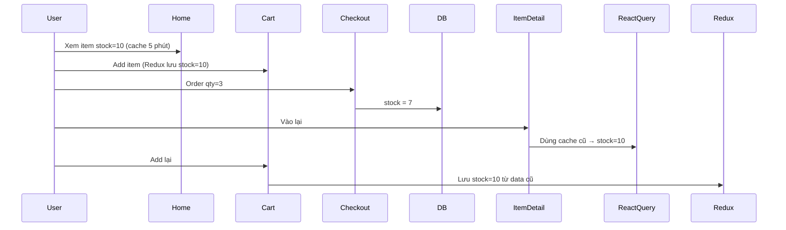

<!-- Generated by SpecStory, Markdown v2.1.0 -->

# 2026-07-08 06:41:31Z

<!-- Cursor IDE Session 5dcedca2-7ed2-4d0b-981f-2d1f4f0d9762 (2026-07-08 06:41:31Z) -->

_**User**_

@Delivery/app/components/AdminOrdersCart.tsx:411-423 check giúp tôi feature này đang bị lỗi gì , mà delivery accept đơn không được báo lỗi api 400 ? 

---

_**Agent (composer-2.5)**_

<think><details><summary>Thought Process</summary>
Đang kiểm tra lỗi API 400 ở AdminOrdersCart.tsx dòng 411-423. Delivery accept đơn không báo lỗi API.

GET request `/api/delivery/assignment/.../accept-assignment` trả về 400 Bad Request. Cần đọc file API route và component AdminOrdersCart.tsx để xác định nguyên nhân.
</details></think>

_**Agent (composer-2.5)**_

Đang kiểm tra luồng gán đơn và API accept-assignment để tìm nguyên nhân lỗi 400.


_**Agent (composer-2.5)**_

<tool-use data-tool-type="read" data-tool-name="read_file_v2"><details>
<summary>Tool use: **read_file_v2** • Read file: d:\React\DeliveryFolder\Delivery\app\components\AdminOrdersCart.tsx</summary>

</details></tool-use>

_**Agent (composer-2.5)**_

<tool-use data-tool-type="read" data-tool-name="read_file_v2"><details>
<summary>Tool use: **read_file_v2** • Read file: d:\React\DeliveryFolder\Delivery\app\api\delivery\assignment\[id]\accept-assignment\route.ts</summary>

</details></tool-use>

_**Agent (composer-2.5)**_

<tool-use data-tool-type="unknown" data-tool-name="ripgrep_raw_search"><details>
<summary>Tool use: **ripgrep_raw_search**</summary>

Parameters:

```json
{
  "caseInsensitive": false,
  "path": "d:\\React\\DeliveryFolder\\Delivery",
  "pattern": "accept-assignment|handleAssign|assign-delivery"
}
```
Additional data:

```json
{
  "isPruned": true,
  "outputMode": "content",
  "path": "d:\\React\\DeliveryFolder\\Delivery",
  "pattern": "accept-assignment|handleAssign|assign-delivery",
  "topFiles": [
    {
      "matchCount": 3,
      "uri": "Delivery/app/components/AdminOrdersCart.tsx"
    },
    {
      "matchCount": 7,
      "uri": "Delivery/app/components/DeliveryBoyDashboard.tsx"
    }
  ],
  "totalFiles": 2,
  "totalMatches": 10
}
```
Status: **completed**

</details></tool-use>

_**Agent (composer-2.5)**_

<think><details><summary>Thought Process</summary>
Đang kiểm tra lỗi 400 từ API accept-assignment trong AdminOrdersCart.tsx.

API trả về 400 khi delivery boy đã có assignment khác hoặc assignment không còn sẵn sàng. Cần kiểm tra status assignment sau khi assign-delivery-boy, model delivery assignment, và assignment ID truyền vào accept.

Nghi ngờ assignment đã có status 'assigned' do admin gán thủ công, khiến API reject vì chỉ chấp nhận 'brodcasted' hoặc 'pending'. Cũng cần kiểm tra ID truyền vào có phải order ID thay vì assignment ID. Sẽ đọc thêm route assign-delivery-boy và model delivery assignment.
</details></think>

_**Agent (composer-2.5)**_

<tool-use data-tool-type="read" data-tool-name="read_file_v2"><details>
<summary>Tool use: **read_file_v2** • Read file: d:\React\DeliveryFolder\Delivery\app\api\auth\admin\assign-delivery-boy\[orderId]\route.ts</summary>

</details></tool-use>

_**Agent (composer-2.5)**_

<tool-use data-tool-type="read" data-tool-name="read_file_v2"><details>
<summary>Tool use: **read_file_v2** • Read file: d:\React\DeliveryFolder\Delivery\app\models\deliveryAssignment.model.ts</summary>

</details></tool-use>

_**Agent (composer-2.5)**_

<tool-use data-tool-type="read" data-tool-name="read_file_v2"><details>
<summary>Tool use: **read_file_v2** • Read file: d:\React\DeliveryFolder\Delivery\app\components\DeliveryBoyDashboard.tsx</summary>

</details></tool-use>

_**Agent (composer-2.5)**_

<think><details><summary>Thought Process</summary>
Đang truy vết luồng xử lý để xác định nguyên nhân lỗi API 400 khi delivery accept đơn hàng.

Phát hiện logic kiểm tra trong `accept-assignment`: trạng thái `assigned` được loại trừ khỏi danh sách assignment đang tồn tại. Điều này khiến API trả về 400 khi delivery boy nhận đơn.

API `accept-assignment` chỉ tìm assignment có trạng thái `pending` hoặc `brodcasted`. Nếu admin đã gán thủ công với trạng thái `assigned`, hệ thống sẽ trả về "Assignment is no longer available!" thay vì lỗi 400.

Đang kiểm tra API `get-assignments` và assignment ID truyền vào dashboard của delivery boy. Logic kiểm tra "already assigned" trong `accept-assignment` chỉ phát hiện assignment có trạng thái `pending`.

Nếu delivery boy có assignment đang pending, API trả 400 "You are already assigned to another assignment". Nếu assignment đã là assigned từ admin, API trả 400 "Assignment is no longer available !". Đang so sánh luồng broadcast với gán thủ công.
</details></think>

_**Agent (composer-2.5)**_

<tool-use data-tool-type="read" data-tool-name="read_file_v2"><details>
<summary>Tool use: **read_file_v2** • Read file: d:\React\DeliveryFolder\Delivery\app\hooks\useDeliveryDashboard.ts</summary>

</details></tool-use>

_**Agent (composer-2.5)**_

<tool-use data-tool-type="unknown" data-tool-name="ripgrep_raw_search"><details>
<summary>Tool use: **ripgrep_raw_search**</summary>

Parameters:

```json
{
  "caseInsensitive": false,
  "path": "d:\\React\\DeliveryFolder\\Delivery\\app",
  "pattern": "get-assignments|brodcasted|new-assignment"
}
```
Additional data:

```json
{
  "isPruned": true,
  "outputMode": "content",
  "path": "d:\\React\\DeliveryFolder\\Delivery\\app",
  "pattern": "get-assignments|brodcasted|new-assignment",
  "topFiles": [
    {
      "matchCount": 5,
      "uri": "Delivery/app/api/delivery/assignment/[id]/reject-assignment/route.ts"
    },
    {
      "matchCount": 6,
      "uri": "Delivery/app/models/deliveryAssignment.model.ts"
    },
    {
      "matchCount": 6,
      "uri": "Delivery/app/api/auth/admin/update-order-status/[orderId]/route.ts"
    },
    {
      "matchCount": 4,
      "uri": "Delivery/app/components/DeliveryBoyDashboard.tsx"
    },
    {
      "matchCount": 1,
      "uri": "Delivery/app/api/delivery/get-assignments/route.ts"
    },
    {
      "matchCount": 3,
      "uri": "Delivery/app/api/auth/admin/delivery-boys/route.ts"
    },
    {
      "matchCount": 6,
      "uri": "Delivery/app/api/delivery/assignment/[id]/accept-assignment/route.ts"
    },
    {
      "matchCount": 2,
      "uri": "Delivery/app/api/auth/admin/assign-delivery-boy/[orderId]/route.ts"
    }
  ],
  "totalFiles": 8,
  "totalMatches": 33
}
```
Status: **completed**

</details></tool-use>

_**Agent (composer-2.5)**_

<think><details><summary>Thought Process</summary>
Đang kiểm tra route get-assignments và cách DeliveryBoyDashboard xử lý new-assignment cùng nút accept để tìm nguyên nhân lỗi API 400.
</details></think>

_**Agent (composer-2.5)**_

<tool-use data-tool-type="read" data-tool-name="read_file_v2"><details>
<summary>Tool use: **read_file_v2** • Read file: d:\React\DeliveryFolder\Delivery\app\api\delivery\get-assignments\route.ts</summary>

</details></tool-use>

_**Agent (composer-2.5)**_

<tool-use data-tool-type="read" data-tool-name="read_file_v2"><details>
<summary>Tool use: **read_file_v2** • Read file: d:\React\DeliveryFolder\Delivery\app\components\DeliveryBoyDashboard.tsx</summary>

</details></tool-use>

_**Agent (composer-2.5)**_

<tool-use data-tool-type="read" data-tool-name="read_file_v2"><details>
<summary>Tool use: **read_file_v2** • Read file: d:\React\DeliveryFolder\Delivery\app\api\auth\admin\update-order-status\[orderId]\route.ts</summary>

</details></tool-use>

_**Agent (composer-2.5)**_

<think><details><summary>Thought Process</summary>
Đang kiểm tra cách `handleAccept` được gọi trong `DeliveryBoyDashboard` để xem ID nào được truyền vào.
</details></think>

_**Agent (composer-2.5)**_

<tool-use data-tool-type="read" data-tool-name="read_file_v2"><details>
<summary>Tool use: **read_file_v2** • Read file: d:\React\DeliveryFolder\Delivery\app\api\delivery\current-order\route.ts</summary>

</details></tool-use>

_**Agent (composer-2.5)**_

<tool-use data-tool-type="unknown" data-tool-name="ripgrep_raw_search"><details>
<summary>Tool use: **ripgrep_raw_search**</summary>

Parameters:

```json
{
  "caseInsensitive": false,
  "contextAfter": 3,
  "path": "d:\\React\\DeliveryFolder\\Delivery\\app\\components\\DeliveryBoyDashboard.tsx",
  "pattern": "handleAccept"
}
```
Additional data:

```json
{
  "isPruned": true,
  "outputMode": "content",
  "path": "d:\\React\\DeliveryFolder\\Delivery\\app\\components\\DeliveryBoyDashboard.tsx",
  "pattern": "handleAccept",
  "topFiles": [
    {
      "matchCount": 8,
      "uri": "Delivery\\app\\components\\DeliveryBoyDashboard.tsx"
    }
  ],
  "totalFiles": 1,
  "totalMatches": 2
}
```
Status: **completed**

</details></tool-use>

_**Agent (composer-2.5)**_

<think><details><summary>Thought Process</summary>
Đang kiểm tra DeliveryBoyDashboard từ dòng 520-570 để xem assignmentId được lấy từ đâu.
</details></think>

_**Agent (composer-2.5)**_

<tool-use data-tool-type="read" data-tool-name="read_file_v2"><details>
<summary>Tool use: **read_file_v2** • Read file: d:\React\DeliveryFolder\Delivery\app\components\DeliveryBoyDashboard.tsx</summary>

</details></tool-use>

_**Agent (composer-2.5)**_

<think><details><summary>Thought Process</summary>
Phát hiện vấn đề nghiêm trọng trong socket handler `new-assignment`.

Đang phân tích luồng emit socket `new-assignment` từ backend sang frontend để xác định lỗi API 400.

Đã phát hiện nguyên nhân chính: hàm `handleNewAssignment` lưu object gốc từ socket vào state thay vì object đã normalize. Object nhận được có dạng `{ assignment: id, order: {...} }` nhưng thiếu trường `_id`, khiến dữ liệu state bị sai cấu trúc.

Đang kiểm tra cách lấy `assignmentId` từ object socket. Trường `orders.assignment` có thể cung cấp đúng ObjectId. Dữ liệu từ API `get-assignments` vẫn đầy đủ `_id`. URL trong ảnh chụp cũng là ObjectId chuẩn 24 ký tự hex.

Đã xác định luồng lỗi chính. Khi admin click Assign, backend tạo assignment với status `assigned` và emit socket `new-assignment`. Delivery boy nhận được qua socket. Khi họ click Accept, API `accept-assignment` chỉ chấp nhận status `brodcasted` hoặc `pending`. Assignment hiện tại có status `assigned` nên API trả về 400. Đây chính là lỗi khiến delivery boy không thể accept đơn.

Luồng assign của admin đã tự động cập nhật trạng thái đơn thành 'Out of delivery'. Delivery boy không cần phải accept. Socket vẫn gửi `new-assignment` nên hiển thị nút Accept/Reject nhưng click sẽ thất bại.

Luồng broadcast tạo assignment với status `brodcasted`. Nếu assignment này vẫn giữ nguyên status thì accept sẽ thành công.

Đang liệt kê thêm các trường hợp khác gây lỗi 400.

Đang xem xét lỗi "You are already assigned to another assignment". Truy vấn `$nin` loại trừ status `brodcasted`, `completed`, `rejected`, `assigned`. Chỉ status `pending` mới khớp nếu `assignedTo` đã được gán. Tuy nhiên assignment ở status `pending` thường không có `assignedTo` nên lỗi này hiếm khi xảy ra trừ khi dữ liệu bị sai lệch.

Đã xác định lỗi "Assignment is no longer available !" xuất hiện khi assignment đã bị reject, cancelled, hoặc một delivery boy khác đã accept. Trạng thái "assigned" nằm trong danh sách loại trừ nên điều kiện `alreadyAssigned` không bao giờ kích hoạt.

Giao diện AdminOrdersCart cũng chưa cập nhật danh sách đơn hàng sau khi admin assign. Chỉ cập nhật trạng thái cục bộ nên người dùng không thấy đơn đã được gán cho delivery boy.

Đã xác minh chuỗi fallback của `assignmentId` trong nút Reject. Dù object socket thiếu `_id`, vẫn lấy được đúng ObjectId từ `orders.assignment`.

Đang kiểm tra xem luồng assign thủ công của admin có bị lọc ra khỏi danh sách assignment của delivery boy hay không.

API `get-assignments` chỉ trả về assignment có status `brodcasted` hoặc `pending`. Assignment do admin gán thủ công với status `assigned` sẽ không xuất hiện trong danh sách từ API. Chúng chỉ đến từ sự kiện socket `new-assignment`.

`handleNewAssignment` chỉ thêm object vào state assignments. Nó không gọi `setCurrentOrder`. Vì vậy sau khi admin assign, giao diện không tự cập nhật đơn hàng đang xử lý.

Feature assign ở AdminOrdersCart (dòng 411-423) gọi đúng API. Lỗi 400 xuất phát từ phía delivery boy khi click Accept, không phải lúc admin assign. Backend tạo assignment với status `assigned` nhưng API accept chỉ chấp nhận status `brodcasted` hoặc `pending`.

Ngoài ra cần bổ sung `fetchCurrentOrder` khi nhận socket `new-assignment` để delivery boy tự động load đơn đang xử lý ngay sau khi admin assign thủ công.

Payload socket `new-assignment` chứa `{ assignment: assignment._id, order: assignment.order }`. Cần xác minh ID trong URL có phải order ID thay vì assignment ID.

Đã xác minh chuỗi fallback lấy `assignmentId` từ object socket. Trường `orders.assignment` luôn cung cấp đúng ObjectId assignment.

Nếu truyền vào order ID thay vì assignment ID, backend sẽ không tìm thấy bản ghi nào khớp. Điều này cũng gây ra lỗi 400 "Assignment is no longer available!".

Đã xác minh thêm: nếu delivery boy đã có assignment với status `assigned` do admin assign, họ vẫn có thể accept assignment B nếu assignment B vẫn còn status `brodcasted`. Truy vấn `alreadyAssigned` bỏ qua status `assigned` nên không chặn. Nếu assignment B thực sự còn `brodcasted`, API accept sẽ thành công.

Phát hiện logic kiểm tra `alreadyAssigned` có lỗi thiết kế. Truy vấn `$nin` loại trừ cả trạng thái `assigned`
</details></think>

_**Agent (composer-2.5)**_

<tool-use data-tool-type="read" data-tool-name="read_file_v2"><details>
<summary>Tool use: **read_file_v2** • Read file: d:\React\DeliveryFolder\Delivery\app\components\DeliveryBoyDashboard.tsx</summary>

</details></tool-use>

_**Agent (composer-2.5)**_

<think><details><summary>Thought Process</summary>
Đã nắm rõ vấn đề lỗi API 400 khi delivery accept đơn tại AdminOrdersCart.tsx.

Nguyên nhân là trạng thái đơn chưa đúng. Admin assign tạo assignment với status 'assigned'. Delivery boy chỉ nhận đơn khi status là 'brodcasted' hoặc 'pending'. Đây là mismatch chính khiến API trả về 400.
</details></think>

_**Agent (composer-2.5)**_

Đã rà soát luồng gán đơn (admin) và accept (delivery boy). **Nút Assign trong `AdminOrdersCart` (411–423) không phải chỗ gây lỗi 400** — lỗi xảy ra ở bước delivery boy bấm Accept.

## Kết luận nhanh

Lỗi **400** từ `GET /api/delivery/assignment/{id}/accept-assignment` do **mâu thuẫn trạng thái assignment**:

| Bước | API / hành động | `status` assignment |
|------|------------------|---------------------|
| Admin bấm **Assign** | `assign-delivery-boy` | `'assigned'` (đã gán sẵn) |
| Delivery bấm **Accept** | `accept-assignment` | chỉ chấp nhận `'brodcasted'` hoặc `'pending'` |

Admin gán xong thì assignment **đã là `assigned`**, nhưng delivery boy vẫn thấy nút Accept và gọi API → **400: "Assignment is no longer available !"**

---

## Chi tiết luồng lỗi

### 1. Admin Assign — tạo assignment với `status: 'assigned'`

```54:61:d:\React\DeliveryFolder\Delivery\app\api\auth\admin\assign-delivery-boy\[orderId]\route.ts
        const assignment = await DeliveryAssignment.create({
            order: orderId,
            brodcastedTo: [deliveryBoyId],
            assignedTo: deliveryBoyId,
            status: 'assigned',
            accpectedAt: new Date(),
        });
```

Đơn đã được gán shipper và chuyển `Out of delivery` — **không cần Accept thêm**.

### 2. Accept API — chỉ update khi còn `brodcasted` / `pending`

```29:38:d:\React\DeliveryFolder\Delivery\app\api\delivery\assignment\[id]\accept-assignment\route.ts
        const assignment = await DeliveryAssignment.findOneAndUpdate(
            { _id: id, status: { $in: ['brodcasted', 'pending'] } },
            { assignedTo: deliveryBoyId, status: 'assigned', accpectedAt: new Date() },
            { new: true }
        )

        if (!assignment) {
            return NextResponse.json({ success: false, message: "Assignment is no longer available !" }, { status: 400 })
        }
```

Đây là **400** trong screenshot của bạn.

### 3. Vẫn gửi socket `new-assignment` sau khi admin gán

```72:78:d:\React\DeliveryFolder\Delivery\app\api\auth\admin\assign-delivery-boy\[orderId]\route.ts
        if (deliveryBoy.socketId) {
            await emitEventHandler(
                'new-assignment',
                { assignment: assignment._id, order: assignment.order },
                deliveryBoy.socketId
            );
        }
```

Delivery boy vẫn thấy card đơn với nút **Accept / Reject** dù đơn đã được admin gán.

### 4. `get-assignments` không trả assignment `assigned`

```21:27:d:\React\DeliveryFolder\Delivery\app\api\delivery\get-assignments\route.ts
        const assignments = await DeliveryAssignment.find({
            $or: [
                { brodcastedTo: session?.user?.id, status: 'brodcasted' },
                { status: 'pending' }
            ]
        })
```

Đơn admin gán **chỉ vào UI qua socket**, không qua fetch — và vẫn hiện nút Accept.

---

## `AdminOrdersCart` (411–423) có vấn đề gì?

Nút Assign gọi đúng API:

```90:97:d:\React\DeliveryFolder\Delivery\app\components\AdminOrdersCart.tsx
    const handleAssign = async (deliveryBoyId: string) => {
        setAssigning(deliveryBoyId)
        try {
            await axios.post(`/api/auth/admin/assign-delivery-boy/${orders._id}`, { deliveryBoyId })
            setStatus('Out of delivery')
            setShowAssignModal(false)
            handleStatusChange?.(orders._id, 'Out of delivery')
```

Phần này **ổn về API**. Vấn đề nằm ở **thiết kế luồng sau khi assign**:

- Backend coi đơn đã accept (`assigned`)
- Frontend delivery boy vẫn yêu cầu accept thêm

**Lưu ý UX:** `handleAssign` chỉ cập nhật `status` local, không cập nhật `assignedDeliveryBoy` trên card admin — card có thể không hiện shipper đã gán cho đến khi reload.

---

## Các nguyên nhân 400 khác (ít gặp hơn)

API còn trả 400 khi:

```23:27:d:\React\DeliveryFolder\Delivery\app\api\delivery\assignment\[id]\accept-assignment\route.ts
        const alreadyAssigned = await DeliveryAssignment.findOne({ assignedTo: deliveryBoyId, status: { $nin: ['brodcasted', 'completed', 'rejected', 'assigned'] } })

        if (alreadyAssigned) {
            return NextResponse.json({ success: false, message: "You are already assigned to another assignment" }, { status: 400 })
        }
```

- Shipper khác đã accept trước (broadcast) → status không còn `brodcasted`
- Logic `$nin` này có vẻ sai (loại trừ `'assigned'` nên hầu như không chặn shipper đang có đơn `assigned`)

---

## Hướng sửa (gợi ý)

Chọn **một** hướng cho luồng admin assign:

**Cách A — Admin gán = đã accept (khuyến nghị)**  
- Sau admin assign: **không** emit `new-assignment` với UI Accept  
- Emit event khác (vd. `order-assigned-directly`)  
- Delivery boy gọi `fetchCurrentOrder()` để vào màn giao hàng luôn  

**Cách B — Admin chỉ “đề xuất”, shipper vẫn phải Accept**  
- `assign-delivery-boy` tạo assignment `status: 'brodcasted'` (không set `assignedTo` / `accpectedAt`)  
- Chỉ khi shipper Accept mới chuyển `assigned`  

**Cách C — Accept API chấp nhận `assigned` nếu đúng shipper**  
- Nếu `status === 'assigned'` và `assignedTo === deliveryBoyId` → trả 200 (idempotent), không 400  

---

## Cách kiểm tra nhanh

1. Mở **Response body** của request 400 trong Network tab  
2. Nếu message là `"Assignment is no longer available !"` → đúng case admin assign + delivery accept  
3. Kiểm tra DB: assignment đó có `status: 'assigned'` và `assignedTo` đã set chưa  

Bạn muốn tôi implement hướng A, B hay C thì chuyển sang **Agent mode** để tôi sửa trực tiếp.

---

_**User**_

15:19:41.141 
Failed to compile.
15:19:41.141 
15:19:41.141 
./app/api/auth/user/apply-coupon/route.ts:39:44
15:19:41.141 
Type error: 'session.user' is possibly 'undefined'.
15:19:41.142 
15:19:41.142 
  37 |         // Check already used by this user
15:19:41.142 
  38 |         const alreadyUsed = coupon.usedBy.some(
15:19:41.142 
> 39 |             (id: any) => id.toString() === session.user.id
15:19:41.142 
     |                                            ^
15:19:41.142 
  40 |         );
15:19:41.142 
  41 |         if (alreadyUsed) {
15:19:41.142 
  42 |             return NextResponse.json({ success: false, message: 'You have already used this coupon' }, { status: 400 });
15:19:41.198 
Next.js build worker exited with code: 1 and signal: null
15:19:41.259 
Error: Command "npm run build" exited with 1 @Delivery/app/api/auth/user/apply-coupon/route.ts:38-40 
- lỗi này nguyên nhân gì

---

_**Agent (composer-2.5)**_

<think><details><summary>Thought Process</summary>
Đang phân tích lỗi biên dịch TypeScript tại `apply-coupon` route. Biến `session.user` có thể là `undefined`.

Lỗi xuất hiện khi truy cập `session.user.id` bên trong callback `coupon.usedBy.some()`. Có thể TypeScript đã mất kiểu sau khi kiểm tra session ở ngoài callback.
</details></think>

_**Agent (composer-2.5)**_

<tool-use data-tool-type="read" data-tool-name="read_file_v2"><details>
<summary>Tool use: **read_file_v2** • Read file: d:\React\DeliveryFolder\Delivery\app\api\auth\user\apply-coupon\route.ts</summary>

</details></tool-use>

_**Agent (composer-2.5)**_

<think><details><summary>Thought Process</summary>
Đang phân tích nguyên nhân lỗi biên dịch TypeScript tại dòng 39.

Nguyên nhân là TypeScript không hoàn toàn thu hẹp kiểu `session.user` dù đã kiểm tra `session?.user?.id`. Trong một số phiên bản TypeScript hoặc định nghĩa kiểu NextAuth, `session.user` vẫn được coi là có thể undefined. Cần thêm kiểm tra rõ ràng hơn trước khi truy cập `session.user.id`.

Callback `.some()` khiến TypeScript không truyền tiếp thu hẹp kiểu từ ngoài vào. Biến `session.user` bên trong callback vẫn có thể undefined. Cách sửa là gán `session.user.id` vào hằng số trước khi gọi `.some()`.

So sánh trực tiếp với `undefined` cũng có thể gây lỗi strict mode. Dùng optional chaining hoặc non-null assertion đều không lý tưởng. Cách tốt nhất là gán `session.user.id` vào hằng số trước khi gọi callback. Đang kiểm tra cách xử lý tương tự trong các route khác của dự án.
</details></think>

_**Agent (composer-2.5)**_

## Nguyên nhân

Đây là lỗi **TypeScript strict**, không phải lỗi runtime.

Bạn đã check auth ở trên:

```11:13:d:\React\DeliveryFolder\Delivery\app\api\auth\user\apply-coupon\route.ts
        if (!session?.user?.id) {
            return NextResponse.json({ success: false, message: 'Unauthorized' }, { status: 401 });
        }
```

Nhưng ở dòng 39, bạn dùng `session.user.id` **bên trong callback** của `.some()`:

```38:40:d:\React\DeliveryFolder\Delivery\app\api\auth\user\apply-coupon\route.ts
        const alreadyUsed = coupon.usedBy.some(
            (id: any) => id.toString() === session.user.id
        );
```

TypeScript **không giữ narrowing** từ `if (!session?.user?.id)` khi vào closure/callback. Trong callback, `session.user` vẫn có type là **có thể `undefined`** (theo type của NextAuth `session`).

Khi `npm run build`, TypeScript bật strict hơn dev → báo lỗi và build fail.

---

## Cách sửa

Lưu `userId` ra biến **trước** callback, sau khi đã check auth:

```typescript
const userId = session.user.id;

const alreadyUsed = coupon.usedBy.some(
    (id: any) => id.toString() === userId
);
```

Hoặc dùng optional chaining (ít rõ ràng hơn):

```typescript
(id: any) => id.toString() === session.user?.id
```

Cách 1 là chuẩn nhất vì đã đảm bảo `userId` luôn có giá trị sau guard.

---

**Tóm lại:** Logic code đúng, nhưng TypeScript không tin `session.user` còn tồn tại trong arrow function của `.some()`. Gán `userId` ra ngoài là hết lỗi build.

Bạn muốn tôi sửa trực tiếp thì chuyển sang **Agent mode**.

---

_**User**_

User sau khi order item xong , user quay lại thêm giỏ hàng lại item đó hoặc click vô detail item thì stock không thay đổi vẫn giữ nguyên 2 màn hình : 
- /user/item-detail/694e4ae7b0f3bbffd55e159d
- user/cart


---

_**Agent (composer-2.5)**_

<think><details><summary>Thought Process</summary>
Đang xác định lỗi stock không cập nhật sau khi đặt hàng. Giá trị stock vẫn giữ nguyên trên hai màn hình: trang chi tiết sản phẩm và trang giỏ hàng.

Đang kiểm tra luồng xử lý stock trong codebase. Cần xác định stock có bị trừ khi đặt hàng hay chỉ lấy từ cache khi hiển thị trang chi tiết và giỏ hàng.
</details></think>

_**Agent (composer-2.5)**_

Đang kiểm tra luồng cập nhật stock sau khi đặt hàng và cách hai màn hình item-detail/cart lấy dữ liệu.


_**Agent (composer-2.5)**_

<tool-use data-tool-type="search" data-tool-name="glob_file_search"><details>
<summary>Tool use: **glob_file_search** • Searched codebase "" • **1** result in **1** directory</summary>

Directory: **`d:\React\DeliveryFolder\Delivery`** (1 file)

| File |
|------|
| `../Delivery/app/user/cart/page.tsx` |
</details></tool-use>

_**Agent (composer-2.5)**_

<tool-use data-tool-type="search" data-tool-name="glob_file_search"><details>
<summary>Tool use: **glob_file_search** • Searched codebase "" • **1** result in **1** directory</summary>

Directory: **`d:\React\DeliveryFolder\Delivery`** (1 file)

| File |
|------|
| `../Delivery/app/user/item-detail/[id]/page.tsx` |
</details></tool-use>

_**Agent (composer-2.5)**_

<tool-use data-tool-type="unknown" data-tool-name="ripgrep_raw_search"><details>
<summary>Tool use: **ripgrep_raw_search**</summary>

Parameters:

```json
{
  "caseInsensitive": false,
  "glob": "*.{ts,tsx}",
  "path": "d:\\React\\DeliveryFolder\\Delivery",
  "pattern": "stock"
}
```
Additional data:

```json
{
  "isPruned": true,
  "outputMode": "content",
  "path": "d:\\React\\DeliveryFolder\\Delivery",
  "pattern": "stock",
  "topFiles": [
    {
      "matchCount": 5,
      "uri": "Delivery/app/components/FormEditGrocery.tsx"
    },
    {
      "matchCount": 2,
      "uri": "Delivery/app/models/grocery.model.ts"
    },
    {
      "matchCount": 2,
      "uri": "Delivery/app/components/HeroSection.tsx"
    },
    {
      "matchCount": 1,
      "uri": "Delivery/app/api/auth/user/cancel-order/route.ts"
    },
    {
      "matchCount": 1,
      "uri": "Delivery/next.config.ts"
    },
    {
      "matchCount": 6,
      "uri": "Delivery/app/api/auth/user/order/route.ts"
    },
    {
      "matchCount": 13,
      "uri": "Delivery/app/user/item-detail/[id]/page.tsx"
    },
    {
      "matchCount": 2,
      "uri": "Delivery/app/api/auth/admin/update-grocery/route.ts"
    },
    {
      "matchCount": 14,
      "uri": "Delivery/app/admin/view-grocery/page.tsx"
    },
    {
      "matchCount": 6,
      "uri": "Delivery/app/user/cart/page.tsx"
    },
    {
      "matchCount": 6,
      "uri": "Delivery/app/api/auth/admin/update-stock/[id]/route.ts"
    },
    {
      "matchCount": 5,
      "uri": "Delivery/app/admin/add-grocery/page.tsx"
    },
    {
      "matchCount": 3,
      "uri": "Delivery/app/api/auth/user/reorder/route.ts"
    },
    {
      "matchCount": 2,
      "uri": "Delivery/app/api/auth/admin/add-grocery/route.ts"
    }
  ],
  "totalFiles": 14,
  "totalMatches": 68
}
```
Status: **completed**

</details></tool-use>

_**Agent (composer-2.5)**_

<think><details><summary>Thought Process</summary>
Đang kiểm tra cách lấy dữ liệu trên trang item-detail và cart. Xem cartSlice có lưu stock trong Redux không. Kiểm tra route order để xem cập nhật stock và socket event ra sao.

Đang kiểm tra GrocerySection và các component liên quan đến việc lấy dữ liệu grocery.
</details></think>

_**Agent (composer-2.5)**_

<tool-use data-tool-type="read" data-tool-name="read_file_v2"><details>
<summary>Tool use: **read_file_v2** • Read file: d:\React\DeliveryFolder\Delivery\app\redux\cartSlice.tsx</summary>

</details></tool-use>

_**Agent (composer-2.5)**_

<tool-use data-tool-type="read" data-tool-name="read_file_v2"><details>
<summary>Tool use: **read_file_v2** • Read file: d:\React\DeliveryFolder\Delivery\app\api\auth\user\order\route.ts</summary>

</details></tool-use>

_**Agent (composer-2.5)**_

<tool-use data-tool-type="read" data-tool-name="read_file_v2"><details>
<summary>Tool use: **read_file_v2** • Read file: d:\React\DeliveryFolder\Delivery\app\user\item-detail\[id]\page.tsx</summary>

</details></tool-use>

_**Agent (composer-2.5)**_

<tool-use data-tool-type="read" data-tool-name="read_file_v2"><details>
<summary>Tool use: **read_file_v2** • Read file: d:\React\DeliveryFolder\Delivery\app\user\cart\page.tsx</summary>

</details></tool-use>

_**Agent (composer-2.5)**_

<think><details><summary>Thought Process</summary>
Đang kiểm tra ba vấn đề liên quan đến lỗi số lượng tồn kho không cập nhật sau khi đặt hàng:

- Hook `useGetGroceryById` có đang cache dữ liệu qua react-query không.
- Sự kiện `grocery-updated` từ socket có được lắng nghe ở đâu đó trong ứng dụng không.
- Trang checkout có xóa giỏ hàng sau khi hoàn tất đơn hàng hay không.

Kiểm tra cách hiển thị số lượng tồn kho trong component GrocerySection trên trang chủ.
</details></think>

_**Agent (composer-2.5)**_

<tool-use data-tool-type="read" data-tool-name="read_file_v2"><details>
<summary>Tool use: **read_file_v2**</summary>
File not found
</details></tool-use>

_**Agent (composer-2.5)**_

<tool-use data-tool-type="read" data-tool-name="read_file_v2"><details>
<summary>Tool use: **read_file_v2** • Read file: d:\React\DeliveryFolder\Delivery\app\user\checkout\page.tsx</summary>

</details></tool-use>

_**Agent (composer-2.5)**_

<tool-use data-tool-type="unknown" data-tool-name="ripgrep_raw_search"><details>
<summary>Tool use: **ripgrep_raw_search**</summary>

Parameters:

```json
{
  "caseInsensitive": false,
  "path": "d:\\React\\DeliveryFolder\\Delivery",
  "pattern": "grocery-updated|useGetGrocery|get-grocery"
}
```
Additional data:

```json
{
  "isPruned": true,
  "outputMode": "content",
  "path": "d:\\React\\DeliveryFolder\\Delivery",
  "pattern": "grocery-updated|useGetGrocery|get-grocery",
  "topFiles": [
    {
      "matchCount": 1,
      "uri": "Delivery/app/api/auth/admin/update-grocery/route.ts"
    },
    {
      "matchCount": 1,
      "uri": "Delivery/app/hooks/useGroceryPaginated.tsx"
    },
    {
      "matchCount": 2,
      "uri": "Delivery/app/user/item-detail/[id]/page.tsx"
    },
    {
      "matchCount": 2,
      "uri": "Delivery/app/hooks/useGroceryId.tsx"
    },
    {
      "matchCount": 2,
      "uri": "Delivery/app/components/GrocerySection.tsx"
    },
    {
      "matchCount": 1,
      "uri": "Delivery/app/api/auth/user/order/route.ts"
    }
  ],
  "totalFiles": 6,
  "totalMatches": 9
}
```
Status: **completed**

</details></tool-use>

_**Agent (composer-2.5)**_

<think><details><summary>Thought Process</summary>
Đang kiểm tra useGroceryId.tsx, GrocerySection.tsx, luồng checkout và API get-grocery để tìm hiểu tại sao số lượng stock không cập nhật sau khi đặt hàng.
</details></think>

_**Agent (composer-2.5)**_

<tool-use data-tool-type="read" data-tool-name="read_file_v2"><details>
<summary>Tool use: **read_file_v2** • Read file: d:\React\DeliveryFolder\Delivery\app\hooks\useGroceryId.tsx</summary>

</details></tool-use>

_**Agent (composer-2.5)**_

<tool-use data-tool-type="read" data-tool-name="read_file_v2"><details>
<summary>Tool use: **read_file_v2** • Read file: d:\React\DeliveryFolder\Delivery\app\components\GrocerySection.tsx</summary>

</details></tool-use>

_**Agent (composer-2.5)**_

<tool-use data-tool-type="unknown" data-tool-name="ripgrep_raw_search"><details>
<summary>Tool use: **ripgrep_raw_search**</summary>

Parameters:

```json
{
  "caseInsensitive": false,
  "path": "d:\\React\\DeliveryFolder\\Delivery\\app\\user\\checkout\\page.tsx",
  "pattern": "clearCart|queryClient|grocery"
}
```
Additional data:

```json
{
  "isPruned": true,
  "outputMode": "content",
  "path": "d:\\React\\DeliveryFolder\\Delivery\\app\\user\\checkout\\page.tsx",
  "pattern": "clearCart|queryClient|grocery",
  "topFiles": [
    {
      "matchCount": 4,
      "uri": "Delivery\\app\\user\\checkout\\page.tsx"
    }
  ],
  "totalFiles": 1,
  "totalMatches": 4
}
```
Status: **completed**

</details></tool-use>

_**Agent (composer-2.5)**_

<think><details><summary>Thought Process</summary>
Đang kiểm tra trang checkout sau khi đặt hàng có xóa giỏ hàng và invalidate query về grocery hay không.
</details></think>

_**Agent (composer-2.5)**_

<tool-use data-tool-type="read" data-tool-name="read_file_v2"><details>
<summary>Tool use: **read_file_v2** • Read file: d:\React\DeliveryFolder\Delivery\app\user\checkout\page.tsx</summary>

</details></tool-use>

_**Agent (composer-2.5)**_

<tool-use data-tool-type="read" data-tool-name="read_file_v2"><details>
<summary>Tool use: **read_file_v2** • Read file: d:\React\DeliveryFolder\Delivery\app\hooks\useGroceryPaginated.tsx</summary>

</details></tool-use>

_**Agent (composer-2.5)**_

<tool-use data-tool-type="search" data-tool-name="glob_file_search"><details>
<summary>Tool use: **glob_file_search** • Searched codebase "" • **2** results in **1** directory</summary>

Directory: **`d:\React\DeliveryFolder\Delivery`** (2 files)

| File |
|------|
| `../Delivery/app/api/auth/admin/get-grocery/route.ts` |
| `../Delivery/app/api/auth/user/get-grocery/[id]/route.ts` |
</details></tool-use>

_**Agent (composer-2.5)**_

<think><details><summary>Thought Process</summary>
Đang kiểm tra trang order-success có gọi clearCart không. Xem useGetGroceryById có staleTime hay không. Cũng cần xem trang item-detail có lắng nghe socket event không.

Trang item-detail dùng `useGetGroceryById` với `initialData` từ cache phân trang. Stock cũ có thể được trả về nếu React Query coi dữ liệu này là mới.

Trang cart lấy stock trực tiếp từ Redux `cartData`. Không gọi API nên giá trị luôn bị cũ.

Sau khi đặt hàng, checkout chỉ invalidate query `['orders']`, không invalidate `['grocery']`. API emit socket `grocery-updated`, nhưng chỉ `GrocerySection` lắng nghe và invalidate query. Trang item-detail và cart không nhận socket, nên giữ stock cũ.

Nếu người dùng vào trực tiếp trang item-detail mà chưa qua trang chủ, `initialData` từ cache phân trang vẫn có thể trả về stock cũ. Cần kiểm tra Redux persist, `clearCart` ở order-success, `staleTime` của React Query provider con, và xem `useGetGroceryById` có refetch khi mount không.
</details></think>

_**Agent (composer-2.5)**_

<tool-use data-tool-type="search" data-tool-name="glob_file_search"><details>
<summary>Tool use: **glob_file_search** • Searched codebase "" • **1** result in **1** directory</summary>

Directory: **`d:\React\DeliveryFolder\Delivery`** (1 file)

| File |
|------|
| `../Delivery/app/user/order-success/page.tsx` |
</details></tool-use>

_**Agent (composer-2.5)**_

<tool-use data-tool-type="unknown" data-tool-name="ripgrep_raw_search"><details>
<summary>Tool use: **ripgrep_raw_search**</summary>

Parameters:

```json
{
  "caseInsensitive": false,
  "path": "d:\\React\\DeliveryFolder\\Delivery",
  "pattern": "QueryClient|staleTime"
}
```
Additional data:

```json
{
  "isPruned": true,
  "outputMode": "content",
  "path": "d:\\React\\DeliveryFolder\\Delivery",
  "pattern": "QueryClient|staleTime",
  "topFiles": [
    {
      "matchCount": 2,
      "uri": "Delivery/app/user/checkout/page.tsx"
    },
    {
      "matchCount": 2,
      "uri": "Delivery/app/components/GrocerySection.tsx"
    },
    {
      "matchCount": 2,
      "uri": "Delivery/app/admin/view-grocery/page.tsx"
    },
    {
      "matchCount": 2,
      "uri": "Delivery/app/admin/manage-users/page.tsx"
    },
    {
      "matchCount": 2,
      "uri": "Delivery/app/user/my-orders/page.tsx"
    },
    {
      "matchCount": 2,
      "uri": "Delivery/app/admin/view-categories/page.tsx"
    },
    {
      "matchCount": 2,
      "uri": "Delivery/app/admin/manage-orders/page.tsx"
    },
    {
      "matchCount": 3,
      "uri": "Delivery/app/components/AdminDashboardClient.tsx"
    },
    {
      "matchCount": 2,
      "uri": "Delivery/app/admin/manage-coupons/page.tsx"
    },
    {
      "matchCount": 1,
      "uri": "Delivery/app/components/AdminOrdersCart.tsx"
    },
    {
      "matchCount": 5,
      "uri": "Delivery/app/provider.tsx"
    },
    {
      "matchCount": 2,
      "uri": "Delivery/app/hooks/useGroceryId.tsx"
    }
  ],
  "totalFiles": 12,
  "totalMatches": 27
}
```
Status: **completed**

</details></tool-use>

_**Agent (composer-2.5)**_

<tool-use data-tool-type="unknown" data-tool-name="ripgrep_raw_search"><details>
<summary>Tool use: **ripgrep_raw_search**</summary>

Parameters:

```json
{
  "caseInsensitive": false,
  "path": "d:\\React\\DeliveryFolder\\Delivery",
  "pattern": "clearCart|persist|localStorage"
}
```
Additional data:

```json
{
  "isPruned": true,
  "outputMode": "content",
  "path": "d:\\React\\DeliveryFolder\\Delivery",
  "pattern": "clearCart|persist|localStorage",
  "topFiles": [
    {
      "matchCount": 3,
      "uri": "Delivery/package-lock.json"
    },
    {
      "matchCount": 13,
      "uri": "Delivery/app/redux/store.ts"
    },
    {
      "matchCount": 2,
      "uri": "Delivery/app/user/order-success/page.tsx"
    },
    {
      "matchCount": 3,
      "uri": "Delivery/app/components/UserOrdersCart.tsx"
    },
    {
      "matchCount": 3,
      "uri": "Delivery/app/redux/StoreProvider.tsx"
    },
    {
      "matchCount": 1,
      "uri": "Delivery/package.json"
    },
    {
      "matchCount": 2,
      "uri": "Delivery/app/redux/cartSlice.tsx"
    }
  ],
  "totalFiles": 7,
  "totalMatches": 27
}
```
Status: **completed**

</details></tool-use>

_**Agent (composer-2.5)**_

<think><details><summary>Thought Process</summary>
QueryClient có `staleTime` toàn cục 5 phút. Sau khi đặt hàng, stock giảm trong DB nhưng cache vẫn giữ nguyên. Đây là nguyên nhân khiến màn hình detail và cart hiển thị số lượng cũ.

useGetGroceryById không refetch khi dữ liệu chưa stale. Redux cartData cũng lưu stock cũ từ lúc thêm vào cart. Khi người dùng quay lại detail hoặc thêm giỏ, giá trị cũ được copy sang Redux. Page cart hiển thị stock từ cartData nên vẫn giữ nguyên.

clearCart trên order-success không ngăn được lỗi. Nếu người dùng thêm lại item từ cache detail cũ, cart vẫn nhận stock cũ. increaseQuantity cũng không kiểm tra stock thực tế từ API. Đang đọc provider.tsx, order-success và GroceryIrd để xác định luồng addToCart.
</details></think>

_**Agent (composer-2.5)**_

<tool-use data-tool-type="read" data-tool-name="read_file_v2"><details>
<summary>Tool use: **read_file_v2** • Read file: d:\React\DeliveryFolder\Delivery\app\provider.tsx</summary>

</details></tool-use>

_**Agent (composer-2.5)**_

<tool-use data-tool-type="read" data-tool-name="read_file_v2"><details>
<summary>Tool use: **read_file_v2** • Read file: d:\React\DeliveryFolder\Delivery\app\user\order-success\page.tsx</summary>

</details></tool-use>

_**Agent (composer-2.5)**_

<tool-use data-tool-type="unknown" data-tool-name="ripgrep_raw_search"><details>
<summary>Tool use: **ripgrep_raw_search**</summary>

Parameters:

```json
{
  "caseInsensitive": false,
  "path": "d:\\React\\DeliveryFolder\\Delivery\\app\\components\\GroceryItemCard.tsx",
  "pattern": "addToCart|stock"
}
```
Additional data:

```json
{
  "isPruned": true,
  "outputMode": "content",
  "path": "d:\\React\\DeliveryFolder\\Delivery\\app\\components\\GroceryItemCard.tsx",
  "pattern": "addToCart|stock",
  "topFiles": [
    {
      "matchCount": 2,
      "uri": "Delivery\\app\\components\\GroceryItemCard.tsx"
    }
  ],
  "totalFiles": 1,
  "totalMatches": 2
}
```
Status: **completed**

</details></tool-use>

_**Agent (composer-2.5)**_

<think><details><summary>Thought Process</summary>
Đã xác định nguyên nhân. `initialData` trong React Query v5 đánh dấu dữ liệu đã fetch. Với `staleTime` 5 phút, hệ thống không refetch ngay nên stock không cập nhật.

`initialData` trong React Query v5 được đánh dấu stale theo `staleTime`. Dữ liệu từ cache phân trang cũng có `staleTime` 5 phút. Hệ thống không refetch khi mount. Stock cũ vẫn hiển thị trên màn hình chi tiết và giỏ hàng.

Socket `grocery-updated` chỉ invalidate trang chủ. Màn hình chi tiết lấy stock từ cache cũ. Giỏ hàng giữ snapshot cũ từ Redux. `increaseQuantity` không kiểm tra stock hay cập nhật trường này.

Đang kiểm tra route thanh toán có giảm stock và phát socket `grocery-updated` không.
</details></think>

_**Agent (composer-2.5)**_

<tool-use data-tool-type="read" data-tool-name="read_file_v2"><details>
<summary>Tool use: **read_file_v2** • Read file: d:\React\DeliveryFolder\Delivery\app\api\auth\user\get-grocery\[id]\route.ts</summary>

</details></tool-use>

_**Agent (composer-2.5)**_

<tool-use data-tool-type="unknown" data-tool-name="ripgrep_raw_search"><details>
<summary>Tool use: **ripgrep_raw_search**</summary>

Parameters:

```json
{
  "caseInsensitive": false,
  "path": "d:\\React\\DeliveryFolder\\Delivery\\app\\api\\auth\\user\\payment",
  "pattern": "stock|grocery-updated"
}
```
Additional data:

```json
{
  "isPruned": true,
  "outputMode": "content",
  "path": "d:\\React\\DeliveryFolder\\Delivery\\app\\api\\auth\\user\\payment",
  "pattern": "stock|grocery-updated",
  "topFiles": [],
  "totalFiles": 0,
  "totalMatches": 0
}
```
Status: **completed**

</details></tool-use>

_**Agent (composer-2.5)**_

<think><details><summary>Thought Process</summary>
Đang kiểm tra luồng thanh toán. Có thể thanh toán trực tuyến tạo đơn hàng khác biệt.
</details></think>

_**Agent (composer-2.5)**_

<tool-use data-tool-type="search" data-tool-name="glob_file_search"><details>
<summary>Tool use: **glob_file_search** • Searched codebase "" • **1** result in **1** directory</summary>

Directory: **`d:\React\DeliveryFolder\Delivery\app\api`** (1 file)

| File |
|------|
| `../Delivery/app/api/auth/user/payment/route.ts` |
</details></tool-use>

_**Agent (composer-2.5)**_

<think><details><summary>Thought Process</summary>
Đang kiểm tra route thanh toán để xác định nguyên nhân stock không cập nhật.
</details></think>

_**Agent (composer-2.5)**_

<tool-use data-tool-type="read" data-tool-name="read_file_v2"><details>
<summary>Tool use: **read_file_v2** • Read file: d:\React\DeliveryFolder\Delivery\app\api\auth\user\payment\route.ts</summary>

</details></tool-use>

_**Agent (composer-2.5)**_

<think><details><summary>Thought Process</summary>
Đang phân tích vấn đề stock không cập nhật sau khi đặt hàng ở màn hình chi tiết sản phẩm và giỏ hàng. Cần kiểm tra logic trừ stock ngay sau khi order hoàn tất.

Stock trong DB đã được cập nhật đúng khi COD. Vấn đề thực sự là frontend đang hiển thị dữ liệu cũ từ nhiều tầng cache.

React Query cache 5 phút. Checkout chỉ invalidate key orders nên data cũ vẫn còn.

Redux cart lưu snapshot stock khi thêm vào. Trang cart đọc trực tiếp từ Redux. Không gọi API để lấy stock mới.

Socket grocery-updated chỉ được lắng nghe ở GrocerySection. Các trang khác không nhận được cập nhật.

useGetGroceryById lấy stock từ pagination cache cũ. Người dùng có thể rời khỏi trang chủ khi đơn hàng hoàn tất.

Giải pháp đề xuất:
- Invalidate key grocery sau khi order thành công
- Đặt staleTime về 0 hoặc refetchOnMount cho useGetGroceryById
- Trang cart nên fetch stock mới từ API thay vì dùng Redux snapshot
- Thêm action updateStock trong cartSlice khi nhận socket grocery-updated
- Lắng nghe socket trên item-detail và cart
- Không lưu stock trong cart, chỉ fetch khi render

Hàm increaseQuantity không giới hạn số lượng theo stock còn lại.
</details></think>

_**Agent (composer-2.5)**_

## Nguyên nhân

Backend **đã trừ stock đúng** khi tạo order (COD):

```54:68:d:\React\DeliveryFolder\Delivery\app\api\auth\user\order\route.ts
        // Xử lý stock
        const decremented: { id: string, qty: number }[] = []
        for (const item of items) {
            const updated = await Grocery.findOneAndUpdate(
              { _id: item.grocery, stock: { $gte: item.quantity } },
              { $inc: { stock: -item.quantity } }
            )
```

Vấn đề nằm ở **frontend vẫn hiển thị stock cũ** do nhiều lớp cache, không đồng bộ sau order.

---

## 1. React Query cache 5 phút → `item-detail` hiển thị stock cũ

Global config:

```19:24:d:\React\DeliveryFolder\Delivery\app\provider.tsx
    const [queryClient] = useState(() => new QueryClient({
        defaultOptions: {
            queries: {
                staleTime: 5 * 60 * 1000, // cache 5 phút
                gcTime: 10 * 60 * 1000,   // giữ cache 10 phút
```

`item-detail` dùng `useGetGroceryById` — trong 5 phút **không refetch**, vẫn dùng data cũ.

Hook còn lấy `initialData` từ cache pagination (stock cũ hơn nữa):

```16:23:d:\React\DeliveryFolder\Delivery\app\hooks\useGroceryId.tsx
        initialData: () => {
            const allCaches = queryClient.getQueriesData<any>({ queryKey: ['grocery', 'pagination'] })
            for (const [, data] of allCaches) {
                const found = data?.groceries?.find((g: any) => g._id === id)
                if (found) return { success: true, grocery: found }
            }
        },
```

Sau order, checkout **chỉ invalidate orders**, không invalidate grocery:

```135:137:d:\React\DeliveryFolder\Delivery\app\user\checkout\page.tsx
            if (res?.data?.success) {
                queryClient.invalidateQueries({ queryKey: ['orders'] })
                router.push('/user/order-success')
```

---

## 2. Cart đọc stock từ Redux snapshot → không bao giờ tự cập nhật

Cart hiển thị `item.stock` từ Redux:

```107:109:d:\React\DeliveryFolder\Delivery\app\user\cart\page.tsx
                                const stock = item?.stock ?? 0
                                const isOut = stock === 0
                                const isLow = stock > 0 && stock <= 10
```

Khi add to cart, **copy nguyên object item** (kèm stock lúc đó):

```33:35:d:\React\DeliveryFolder\Delivery\app\redux\cartSlice.tsx
        addToCart: (state, action: PayloadAction<IGrocery>) => {
            state.cartData.push(action.payload)
            cartSlice.caseReducers.calcTotals(state)
```

Redux còn **persist vào localStorage** (`whitelist: ['cart']`) — stock cũ có thể sống lâu hơn nữa.

`clearCart()` chỉ chạy ở `order-success`, nhưng user add lại item từ data cũ → cart lại có stock sai.

---

## 3. Socket `grocery-updated` không tới 2 màn hình đó

Order có emit event:

```127:128:d:\React\DeliveryFolder\Delivery\app\api\auth\user\order\route.ts
        await emitEventHandler("grocery-updated", { groceryIds: items.map(i => i.grocery) })
```

Nhưng **chỉ `GrocerySection`** (trang home) lắng nghe và invalidate:

```51:54:d:\React\DeliveryFolder\Delivery\app\components\GrocerySection.tsx
        const handleGroceryUpdated = (data: any) => {
            queryClient.invalidateQueries({ queryKey: ['grocery'] })
        }
```

`item-detail` và `cart` **không listen** socket → stock không refresh.

---

## Luồng lỗi thực tế



---

## Hướng sửa (gợi ý)

| Ưu tiên | Việc cần làm |
|--------|--------------|
| 1 | Sau order thành công: `queryClient.invalidateQueries({ queryKey: ['grocery'] })` trong checkout |
| 2 | `useGetGroceryById`: `staleTime: 0` hoặc `refetchOnMount: 'always'` |
| 3 | Cart page: fetch stock mới từ API khi mount, hoặc không lưu `stock` trong Redux |
| 4 | Listen `grocery-updated` ở layout/provider chung, không chỉ `GrocerySection` |
| 5 | `increaseQuantity`: giới hạn theo stock thực tế |

---

**Tóm lại:** DB đã cập nhật stock, nhưng `item-detail` dùng React Query cache 5 phút, `cart` dùng snapshot stock trong Redux — cả hai đều không được refresh sau order.

Muốn tôi sửa trực tiếp thì chuyển sang **Agent mode**.

---

_**User**_

3
Cart page: fetch stock mới từ API khi mount, hoặc không lưu stock trong Redux
4
Listen grocery-updated ở layout/provider chung, không chỉ GrocerySection
5
increaseQuantity: giới hạn theo stock thực tế
- hướng dẫn cụ thể 3 step by step này để implement chính xác và đúng logic nhất

---

_**Agent (composer-2.5)**_

<think><details><summary>Thought Process</summary>
Đang phân tích yêu cầu 3 bản sửa lỗi cụ thể. Hướng dẫn sẽ được trình bày từng bước chi tiết. Cần xử lý lấy stock mới từ API khi cart mount. Cần xử lý cách lưu stock trong Redux. Cần xử lý logic tăng số lượng theo stock thực tế.

Sẽ đọc các file liên quan để đưa ra hướng dẫn chính xác phù hợp với quy ước codebase.
</details></think>

_**Agent (composer-2.5)**_

Đang đọc các file liên quan để hướng dẫn 3 bước khớp với cấu trúc hiện tại của dự án.


_**Agent (composer-2.5)**_

<tool-use data-tool-type="unknown" data-tool-name="ripgrep_raw_search"><details>
<summary>Tool use: **ripgrep_raw_search**</summary>

Parameters:

```json
{
  "caseInsensitive": false,
  "path": "d:\\React\\DeliveryFolder\\Delivery\\app\\api",
  "pattern": "get-all-grocery|get-grocery"
}
```
Additional data:

```json
{
  "isPruned": true,
  "outputMode": "content",
  "path": "d:\\React\\DeliveryFolder\\Delivery\\app\\api",
  "pattern": "get-all-grocery|get-grocery",
  "topFiles": [],
  "totalFiles": 0,
  "totalMatches": 0
}
```
Status: **completed**

</details></tool-use>

_**Agent (composer-2.5)**_

<tool-use data-tool-type="read" data-tool-name="read_file_v2"><details>
<summary>Tool use: **read_file_v2** • Read file: d:\React\DeliveryFolder\Delivery\app\layout.tsx</summary>

</details></tool-use>

_**Agent (composer-2.5)**_

<tool-use data-tool-type="read" data-tool-name="read_file_v2"><details>
<summary>Tool use: **read_file_v2** • Read file: d:\React\DeliveryFolder\Delivery\app\redux\cartSlice.tsx</summary>

</details></tool-use>

_**Agent (composer-2.5)**_

<tool-use data-tool-type="read" data-tool-name="read_file_v2"><details>
<summary>Tool use: **read_file_v2** • Read file: d:\React\DeliveryFolder\Delivery\app\provider.tsx</summary>

</details></tool-use>

_**Agent (composer-2.5)**_

<think><details><summary>Thought Process</summary>
Đang kiểm tra socket handler của GrocerySection, cách dùng increaseQuantity trong item-detail, component GroceryItemCard, và định nghĩa trường quantity trong model IGrocery.
</details></think>

_**Agent (composer-2.5)**_

<tool-use data-tool-type="read" data-tool-name="read_file_v2"><details>
<summary>Tool use: **read_file_v2** • Read file: d:\React\DeliveryFolder\Delivery\app\models\grocery.model.ts</summary>

</details></tool-use>

_**Agent (composer-2.5)**_

<tool-use data-tool-type="read" data-tool-name="read_file_v2"><details>
<summary>Tool use: **read_file_v2** • Read file: d:\React\DeliveryFolder\Delivery\app\components\GroceryItemCard.tsx</summary>

</details></tool-use>

_**Agent (composer-2.5)**_

<tool-use data-tool-type="search" data-tool-name="glob_file_search"><details>
<summary>Tool use: **glob_file_search** • Searched codebase "" • **1** result in **1** directory</summary>

Directory: **`d:\React\DeliveryFolder\Delivery`** (1 file)

| File |
|------|
| `../Delivery/app/api/auth/user/get-all-grocery/route.ts` |
</details></tool-use>

_**Agent (composer-2.5)**_

<think><details><summary>Thought Process</summary>
Đang cân nhắc kiến trúc tối ưu. Không lưu stock trong Redux. Chỉ fetch từ API khi mount trang cart để hiển thị.

Tạo component `GrocerySyncListener` ở provider/layout để lắng nghe socket và invalidate cache React Query. Giữ stock trong Redux nhưng đồng bộ từ API bằng reducer `syncCartStock`. Trang cart sẽ fetch stock cho toàn bộ item ID khi mount.

Tạo hook `useCartStockSync` để lấy stock từng item từ Redux, gọi API song song qua `Promise.all`, rồi dispatch action `updateCartStock`.

Nếu không có batch API sẵn, đề xuất tạo endpoint `/api/auth/user/get-grocery-stock?ids=id1,id2` mới. Hoặc dùng `useQueries` của React Query trong trang cart.

Logic tăng số lượng sẽ kiểm tra `item.quantity < item.stock` trước khi cập nhật.

Đang cân nhắc cách triển khai cụ thể cho trang cart. Có thể dùng `useQueries` với `staleTime: 0` để fetch stock mới nhất từ API cho từng item ID. Hoặc đơn giản hơn: chỉ dùng React Query để hiển thị stock trong UI, còn Redux chỉ giữ quantity. Nếu cần tăng số lượng trong Redux, stock phải được truyền vào payload action.

Reducer `updateCartStock` nhận mảng `{ id, stock }` để cập nhật stock từng item trong Redux. Trang cart sẽ gọi reducer này khi mount.

`GrocerySyncListener` sẽ đặt trong `provider.tsx` bên trong `QueryClientProvider`. Nó lắng nghe socket `grocery-updated`, `grocery-created`, `grocery-deleted` và invalidate cache React Query. Cần xóa bỏ component trùng lặp trong `GrocerySection`.

Logic `increaseQuantity` trong Redux slice sẽ tìm item theo ID, kiểm tra `quantity < stock` trước khi tăng. Cần bổ sung kiểm tra stock trong `addToCart` luôn. UI cần disabled nút cộng khi số lượng đã đạt giới hạn stock ở trang cart, trang item detail và `GroceryItemCard`.
</details></think>

_**Agent (composer-2.5)**_

Dưới đây là hướng dẫn **step-by-step** cho 3 bước, thiết kế theo đúng codebase hiện tại của bạn. Thứ tự implement nên là **4 → 3 → 5** (sync cache trước, rồi cart, cuối cùng giới hạn quantity).

---

## Tổng quan kiến trúc đúng

```text
DB stock (source of truth)
    ↓
API get-grocery/[id]
    ↓
React Query cache ['grocery', 'id', id]   ← invalidate bởi socket global
    ↓
Cart page sync stock → Redux (chỉ để giới hạn +/-)
    ↓
UI hiển thị stock từ data đã sync
```

**Nguyên tắc:** Redux cart lưu `quantity`, `price`, `name`... — `stock` chỉ là **bản copy tạm** để UI giới hạn `+`, không phải source of truth.

---

## Step 4 — Listen `grocery-updated` ở provider chung

### Mục tiêu
Mọi trang (`item-detail`, `cart`, home...) đều refresh grocery cache khi có order/admin update stock.

### Bước 4.1 — Tạo component listener

Tạo file `Delivery/app/components/GrocerySyncListener.tsx`:

```tsx
'use client'

import { useEffect } from 'react'
import { useQueryClient } from '@tanstack/react-query'
import { getSocket } from '@/app/lib/socket'

const GrocerySyncListener = () => {
  const queryClient = useQueryClient()

  useEffect(() => {
    const socket = getSocket()

    const invalidateGrocery = () => {
      queryClient.invalidateQueries({ queryKey: ['grocery'] })
    }

    socket?.on('grocery-created', invalidateGrocery)
    socket?.on('grocery-updated', invalidateGrocery)
    socket?.on('grocery-deleted', invalidateGrocery)

    return () => {
      socket?.off('grocery-created', invalidateGrocery)
      socket?.off('grocery-updated', invalidateGrocery)
      socket?.off('grocery-deleted', invalidateGrocery)
    }
  }, [queryClient])

  return null
}

export default GrocerySyncListener
```

### Bước 4.2 — Mount trong `provider.tsx`

```tsx
// provider.tsx
import GrocerySyncListener from '@/app/components/GrocerySyncListener'

return (
  <QueryClientProvider client={queryClient}>
    <SessionProvider>
      <GrocerySyncListener />   {/* ← thêm dòng này */}
      {children}
    </SessionProvider>
    ...
  </QueryClientProvider>
)
```

**Lưu ý:** Phải đặt **bên trong** `QueryClientProvider` vì dùng `useQueryClient()`.

### Bước 4.3 — Xóa listener trùng trong `GrocerySection.tsx`

Xóa toàn bộ `useEffect` socket (dòng 44–69) trong `GrocerySection.tsx` — tránh invalidate 2 lần.

### Bước 4.4 — (Khuyến nghị thêm) Invalidate sau order

Trong `checkout/page.tsx`, sau order thành công thêm:

```tsx
queryClient.invalidateQueries({ queryKey: ['grocery'] })
```

Socket có thể delay/miss — invalidate trực tiếp an toàn hơn.

---

## Step 3 — Cart page fetch stock mới khi mount

### Mục tiêu
Cart **không tin** `item.stock` cũ trong Redux/localStorage — luôn sync từ API khi vào trang.

### Bước 3.1 — Thêm reducer sync stock trong `cartSlice.tsx`

```tsx
// Thêm action mới
syncCartStock: (
  state,
  action: PayloadAction<{ id: string; stock: number }[]>
) => {
  action.payload.forEach(({ id, stock }) => {
    const item = state.cartData.find(i => String(i._id) === id)
    if (item) item.stock = stock
  })
},
```

Export thêm `syncCartStock`.

**Không xóa** field `stock` khỏi Redux — vẫn cần cho step 5. Chỉ **không tin** giá trị cũ khi render.

### Bước 3.2 — Tạo hook `useCartStockSync`

Tạo `Delivery/app/hooks/useCartStockSync.ts`:

```tsx
import { useEffect } from 'react'
import { useQueries } from '@tanstack/react-query'
import { useDispatch, useSelector } from 'react-redux'
import axios from 'axios'
import { RootState } from '@/app/redux/store'
import { syncCartStock } from '@/app/redux/cartSlice'

const fetchGroceryStock = async (id: string) => {
  const { data } = await axios.get(`/api/auth/user/get-grocery/${id}`)
  return data?.grocery
}

export const useCartStockSync = () => {
  const dispatch = useDispatch()
  const cartData = useSelector((state: RootState) => state.cart.cartData)
  const ids = cartData.map(item => String(item._id))

  const queries = useQueries({
    queries: ids.map(id => ({
      queryKey: ['grocery', 'id', id],
      queryFn: () => fetchGroceryStock(id),
      enabled: !!id,
      staleTime: 0,           // cart luôn cần stock mới
      refetchOnMount: 'always',
    })),
  })

  useEffect(() => {
    const updates = queries
      .map((q, i) => {
        const stock = q.data?.stock
        if (stock == null) return null
        return { id: ids[i], stock }
      })
      .filter(Boolean) as { id: string; stock: number }[]

    if (updates.length > 0) {
      dispatch(syncCartStock(updates))
    }
  }, [queries.map(q => q.dataUpdatedAt).join(','), dispatch]) // hoặc deps rõ ràng hơn

  const isSyncing = queries.some(q => q.isLoading || q.isFetching)

  // Map id → stock để UI render (ưu tiên query data)
  const stockMap = Object.fromEntries(
    ids.map((id, i) => [id, queries[i]?.data?.stock ?? cartData[i]?.stock ?? 0])
  )

  return { isSyncing, stockMap }
}
```

### Bước 3.3 — Dùng hook trong `cart/page.tsx`

```tsx
import { useCartStockSync } from '@/app/hooks/useCartStockSync'

const Cart = () => {
  const { cartData, ... } = useSelector(...)
  const { isSyncing, stockMap } = useCartStockSync()

  // Trong map item:
  const stock = stockMap[item._id.toString()] ?? 0
  const isOut = stock === 0
  const isLow = stock > 0 && stock <= 10
  const exceedsStock = item.quantity > stock
```

**Thay** mọi chỗ `item?.stock` bằng `stock` từ `stockMap`.

### Bước 3.4 — Cập nhật logic checkout button

```tsx
{cartData?.length > 0 &&
 cartData.every(item => {
   const stock = stockMap[item._id.toString()] ?? 0
   return stock > 0 && item.quantity <= stock
 }) ? (
  <Link href='/user/checkout'>Proceed to Checkout</Link>
) : (
  <div>Proceed to Checkout</div> // disabled
)}
```

### Bước 3.5 — (Tuỳ chọn) Hiện cảnh báo quantity vượt stock

```tsx
{exceedsStock && (
  <p className='text-[11px] text-red-500'>
    Chỉ còn {stock} sản phẩm. Vui lòng giảm số lượng.
  </p>
)}
```

### Bước 3.6 — Sửa `useGetGroceryById` cho item-detail

Trong `useGroceryId.tsx`:

```tsx
return useQuery({
  queryKey: ['grocery', 'id', id],
  queryFn: () => fetchGroceryId(id),
  enabled: !!id,
  staleTime: 0,
  refetchOnMount: 'always',
  // Bỏ initialData từ pagination cache — tránh stock cũ
})
```

Nhờ step 4, khi có `grocery-updated`, item-detail tự refetch.

---

## Step 5 — `increaseQuantity` giới hạn theo stock thực tế

### Mục tiêu
Không cho `quantity > stock` ở mọi nơi bấm `+`.

### Bước 5.1 — Sửa reducer `increaseQuantity`

```tsx
increaseQuantity: (state, action: PayloadAction<string>) => {
  const item = state.cartData.find(i => String(i._id) === action.payload)
  if (!item) return

  const maxStock = item.stock ?? 0
  if (item.quantity >= maxStock) return   // chặn tăng

  item.quantity += 1
  cartSlice.caseReducers.calcTotals(state)
},
```

### Bước 5.2 — Sửa `addToCart` (quan trọng, dễ bỏ sót)

```tsx
addToCart: (state, action: PayloadAction<IGrocery>) => {
  const existing = state.cartData.find(i => String(i._id) === String(action.payload._id))

  if (existing) {
    const maxStock = existing.stock ?? action.payload.stock ?? 0
    if (existing.quantity < maxStock) existing.quantity += 1
  } else {
    const maxStock = action.payload.stock ?? 0
    if (maxStock > 0) {
      state.cartData.push({ ...action.payload, quantity: 1 })
    }
  }
  cartSlice.caseReducers.calcTotals(state)
},
```

Tránh push trùng item khi bấm "Add to cart" nhiều lần.

### Bước 5.3 — Disable nút `+` ở UI (3 nơi)

**Cart page:**
```tsx
<motion.button
  disabled={item.quantity >= stock}
  onClick={() => dispatch(increaseQuantity(item._id.toString()))}
  className={item.quantity >= stock ? 'opacity-40 cursor-not-allowed' : '...'}
>
```

**Item detail** (`item-detail/[id]/page.tsx`):
```tsx
<CirclePlus
  onClick={() => {
    if ((cartItem?.quantity ?? 0) < stock) {
      dispatch(increaseQuantity(item._id.toString()))
    }
  }}
  className={`... ${(cartItem?.quantity ?? 0) >= stock ? 'opacity-40 cursor-not-allowed' : 'cursor-pointer'}`}
/>
```

**GroceryItemCard.tsx** — tương tự, dùng `groceries.stock` (đã được invalidate bởi step 4).

### Bước 5.4 — Sync stock trước khi bấm `+` ở home/card (tuỳ chọn nâng cao)

Trên `GroceryItemCard`, nếu muốn chặt hơn trước khi dispatch:

```tsx
onClick={() => {
  const maxStock = groceries.stock ?? 0
  if ((cartItem?.quantity ?? 0) < maxStock) {
    dispatch(increaseQuantity(groceries._id.toString()))
  }
}}
```

---

## Thứ tự test sau khi implement

| # | Hành động | Kỳ vọng |
|---|-----------|---------|
| 1 | Item stock=5, add 2 vào cart | Cart hiện stock=5 |
| 2 | Order 2 cái (stock DB=3) | Checkout OK |
| 3 | Vào `/user/cart`, add lại item | Stock hiện 3, không phải 5 |
| 4 | Vào `/user/item-detail/[id]` | Stock hiện 3 |
| 5 | Bấm `+` đến quantity=3 rồi bấm tiếp | Không tăng, nút `+` disabled |
| 6 | Admin đổi stock | Cả home + cart + detail cập nhật (socket step 4) |

---

## Lỗi thường gặp khi implement

1. **`GrocerySyncListener` ngoài `QueryClientProvider`** → crash hook.
2. **Vẫn dùng `initialData` pagination** trong `useGetGroceryById` → item-detail vẫn stock cũ.
3. **Chỉ sửa cart page, quên `GroceryItemCard` / `item-detail`** → vẫn tăng quantity vượt stock ở trang khác.
4. **`addToCart` push duplicate** thay vì tăng quantity → cùng item xuất hiện 2 lần trong cart.
5. **Redux persist giữ stock cũ** — step 3 sync on mount sẽ ghi đè; không cần xóa persist.

---

## Tóm tắt file cần sửa

| File | Việc làm |
|------|----------|
| `components/GrocerySyncListener.tsx` | Tạo mới (step 4) |
| `provider.tsx` | Mount listener |
| `GrocerySection.tsx` | Xóa socket trùng |
| `checkout/page.tsx` | Invalidate `['grocery']` sau order |
| `redux/cartSlice.tsx` | `syncCartStock`, sửa `addToCart`, `increaseQuantity` |
| `hooks/useCartStockSync.ts` | Tạo mới (step 3) |
| `user/cart/page.tsx` | Dùng `stockMap`, disable `+` |
| `hooks/useGroceryId.tsx` | `staleTime: 0`, bỏ `initialData` |
| `item-detail/[id]/page.tsx` | Disable `+` theo stock |
| `GroceryItemCard.tsx` | Disable `+` theo stock |

Muốn tôi implement trực tiếp thì chuyển sang **Agent mode**.

---

_**User**_

@Delivery/app/components/GroceryItemCard.tsx:33-36 
- Cần thêm logic thông báo khi user click Add to cart nhưng stock hiện tại = 0 không thêm vào giỏ hàng được 
- Check lại logic khi stock = 0 , admin + 1 stock đúng item đó , nhưng bên user lại không update liền , làm cho user không thêm giỏ hàng được ? 

---

_**Agent (composer-2.5)**_

<think><details><summary>Thought Process</summary>
Đang phân tích hai vấn đề liên quan đến GroceryItemCard. Cần thêm thông báo toast khi người dùng click Add to cart nhưng stock bằng 0. Đồng thời cần kiểm tra logic cập nhật stock để tránh lỗi không thêm được giỏ hàng.

Đang kiểm tra các file liên quan như useCartStockSync, GrocerySyncLiener và cartSlice để xác định nguyên nhân stock không cập nhật ngay khi admin chỉnh sửa.
</details></think>

_**Agent (composer-2.5)**_

Đang kiểm tra logic Add to cart và luồng cập nhật stock trên GroceryItemCard.


_**Agent (composer-2.5)**_

<tool-use data-tool-type="read" data-tool-name="read_file_v2"><details>
<summary>Tool use: **read_file_v2** • Read file: d:\React\DeliveryFolder\Delivery\app\components\GroceryItemCard.tsx</summary>

</details></tool-use>

_**Agent (composer-2.5)**_

<tool-use data-tool-type="read" data-tool-name="read_file_v2"><details>
<summary>Tool use: **read_file_v2** • Read file: d:\React\DeliveryFolder\Delivery\app\hooks\useCartStockSync.ts</summary>

</details></tool-use>

_**Agent (composer-2.5)**_

<tool-use data-tool-type="search" data-tool-name="glob_file_search"><details>
<summary>Tool use: **glob_file_search** • Searched codebase "" • **1** result in **1** directory</summary>

Directory: **`d:\React\DeliveryFolder\Delivery`** (1 file)

| File |
|------|
| `../Delivery/app/components/GrocerySyncListener.tsx` |
</details></tool-use>

_**Agent (composer-2.5)**_

<tool-use data-tool-type="read" data-tool-name="read_file_v2"><details>
<summary>Tool use: **read_file_v2** • Read file: d:\React\DeliveryFolder\Delivery\app\redux\cartSlice.tsx</summary>

</details></tool-use>

_**Agent (composer-2.5)**_

<think><details><summary>Thought Process</summary>
Đã xác định nguyên nhân. Hook `useCartStockSync` chỉ đồng bộ số lượng cho các sản phẩm đã có trong giỏ hàng. Nếu giỏ trống thì `stockMap` rỗng. Các sản phẩm trên trang chủ chưa thêm vào giỏ sẽ 
</details></think>
