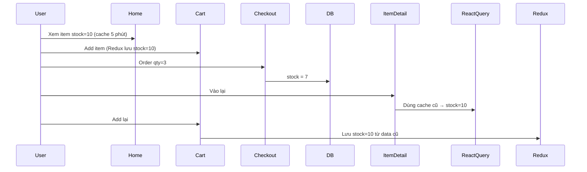

<!-- Generated by SpecStory, Markdown v2.1.0 -->

# 2026-07-08 06:41:31Z

<!-- Cursor IDE Session 5dcedca2-7ed2-4d0b-981f-2d1f4f0d9762 (2026-07-08 06:41:31Z) -->

_**User**_

@Delivery/app/components/AdminOrdersCart.tsx:411-423 check giúp tôi feature này đang bị lỗi gì , mà delivery accept đơn không được báo lỗi api 400 ? 

---

_**Agent (composer-2.5)**_

<think><details><summary>Thought Process</summary>
Đang kiểm tra lỗi API 400 ở AdminOrdersCart.tsx dòng 411-423. Delivery accept đơn không báo lỗi API.

GET request `/api/delivery/assignment/.../accept-assignment` trả về 400 Bad Request. Cần đọc file API route và component AdminOrdersCart.tsx để xác định nguyên nhân.
</details></think>

_**Agent (composer-2.5)**_

Đang kiểm tra luồng gán đơn và API accept-assignment để tìm nguyên nhân lỗi 400.


_**Agent (composer-2.5)**_

<tool-use data-tool-type="read" data-tool-name="read_file_v2"><details>
<summary>Tool use: **read_file_v2** • Read file: d:\React\DeliveryFolder\Delivery\app\components\AdminOrdersCart.tsx</summary>

</details></tool-use>

_**Agent (composer-2.5)**_

<tool-use data-tool-type="read" data-tool-name="read_file_v2"><details>
<summary>Tool use: **read_file_v2** • Read file: d:\React\DeliveryFolder\Delivery\app\api\delivery\assignment\[id]\accept-assignment\route.ts</summary>

</details></tool-use>

_**Agent (composer-2.5)**_

<tool-use data-tool-type="unknown" data-tool-name="ripgrep_raw_search"><details>
<summary>Tool use: **ripgrep_raw_search**</summary>

Parameters:

```json
{
  "caseInsensitive": false,
  "path": "d:\\React\\DeliveryFolder\\Delivery",
  "pattern": "accept-assignment|handleAssign|assign-delivery"
}
```
Additional data:

```json
{
  "isPruned": true,
  "outputMode": "content",
  "path": "d:\\React\\DeliveryFolder\\Delivery",
  "pattern": "accept-assignment|handleAssign|assign-delivery",
  "topFiles": [
    {
      "matchCount": 3,
      "uri": "Delivery/app/components/AdminOrdersCart.tsx"
    },
    {
      "matchCount": 7,
      "uri": "Delivery/app/components/DeliveryBoyDashboard.tsx"
    }
  ],
  "totalFiles": 2,
  "totalMatches": 10
}
```
Status: **completed**

</details></tool-use>

_**Agent (composer-2.5)**_

<think><details><summary>Thought Process</summary>
Đang kiểm tra lỗi 400 từ API accept-assignment trong AdminOrdersCart.tsx.

API trả về 400 khi delivery boy đã có assignment khác hoặc assignment không còn sẵn sàng. Cần kiểm tra status assignment sau khi assign-delivery-boy, model delivery assignment, và assignment ID truyền vào accept.

Nghi ngờ assignment đã có status 'assigned' do admin gán thủ công, khiến API reject vì chỉ chấp nhận 'brodcasted' hoặc 'pending'. Cũng cần kiểm tra ID truyền vào có phải order ID thay vì assignment ID. Sẽ đọc thêm route assign-delivery-boy và model delivery assignment.
</details></think>

_**Agent (composer-2.5)**_

<tool-use data-tool-type="read" data-tool-name="read_file_v2"><details>
<summary>Tool use: **read_file_v2** • Read file: d:\React\DeliveryFolder\Delivery\app\api\auth\admin\assign-delivery-boy\[orderId]\route.ts</summary>

</details></tool-use>

_**Agent (composer-2.5)**_

<tool-use data-tool-type="read" data-tool-name="read_file_v2"><details>
<summary>Tool use: **read_file_v2** • Read file: d:\React\DeliveryFolder\Delivery\app\models\deliveryAssignment.model.ts</summary>

</details></tool-use>

_**Agent (composer-2.5)**_

<tool-use data-tool-type="read" data-tool-name="read_file_v2"><details>
<summary>Tool use: **read_file_v2** • Read file: d:\React\DeliveryFolder\Delivery\app\components\DeliveryBoyDashboard.tsx</summary>

</details></tool-use>

_**Agent (composer-2.5)**_

<think><details><summary>Thought Process</summary>
Đang truy vết luồng xử lý để xác định nguyên nhân lỗi API 400 khi delivery accept đơn hàng.

Phát hiện logic kiểm tra trong `accept-assignment`: trạng thái `assigned` được loại trừ khỏi danh sách assignment đang tồn tại. Điều này khiến API trả về 400 khi delivery boy nhận đơn.

API `accept-assignment` chỉ tìm assignment có trạng thái `pending` hoặc `brodcasted`. Nếu admin đã gán thủ công với trạng thái `assigned`, hệ thống sẽ trả về "Assignment is no longer available!" thay vì lỗi 400.

Đang kiểm tra API `get-assignments` và assignment ID truyền vào dashboard của delivery boy. Logic kiểm tra "already assigned" trong `accept-assignment` chỉ phát hiện assignment có trạng thái `pending`.

Nếu delivery boy có assignment đang pending, API trả 400 "You are already assigned to another assignment". Nếu assignment đã là assigned từ admin, API trả 400 "Assignment is no longer available !". Đang so sánh luồng broadcast với gán thủ công.
</details></think>

_**Agent (composer-2.5)**_

<tool-use data-tool-type="read" data-tool-name="read_file_v2"><details>
<summary>Tool use: **read_file_v2** • Read file: d:\React\DeliveryFolder\Delivery\app\hooks\useDeliveryDashboard.ts</summary>

</details></tool-use>

_**Agent (composer-2.5)**_

<tool-use data-tool-type="unknown" data-tool-name="ripgrep_raw_search"><details>
<summary>Tool use: **ripgrep_raw_search**</summary>

Parameters:

```json
{
  "caseInsensitive": false,
  "path": "d:\\React\\DeliveryFolder\\Delivery\\app",
  "pattern": "get-assignments|brodcasted|new-assignment"
}
```
Additional data:

```json
{
  "isPruned": true,
  "outputMode": "content",
  "path": "d:\\React\\DeliveryFolder\\Delivery\\app",
  "pattern": "get-assignments|brodcasted|new-assignment",
  "topFiles": [
    {
      "matchCount": 5,
      "uri": "Delivery/app/api/delivery/assignment/[id]/reject-assignment/route.ts"
    },
    {
      "matchCount": 6,
      "uri": "Delivery/app/models/deliveryAssignment.model.ts"
    },
    {
      "matchCount": 6,
      "uri": "Delivery/app/api/auth/admin/update-order-status/[orderId]/route.ts"
    },
    {
      "matchCount": 4,
      "uri": "Delivery/app/components/DeliveryBoyDashboard.tsx"
    },
    {
      "matchCount": 1,
      "uri": "Delivery/app/api/delivery/get-assignments/route.ts"
    },
    {
      "matchCount": 3,
      "uri": "Delivery/app/api/auth/admin/delivery-boys/route.ts"
    },
    {
      "matchCount": 6,
      "uri": "Delivery/app/api/delivery/assignment/[id]/accept-assignment/route.ts"
    },
    {
      "matchCount": 2,
      "uri": "Delivery/app/api/auth/admin/assign-delivery-boy/[orderId]/route.ts"
    }
  ],
  "totalFiles": 8,
  "totalMatches": 33
}
```
Status: **completed**

</details></tool-use>

_**Agent (composer-2.5)**_

<think><details><summary>Thought Process</summary>
Đang kiểm tra route get-assignments và cách DeliveryBoyDashboard xử lý new-assignment cùng nút accept để tìm nguyên nhân lỗi API 400.
</details></think>

_**Agent (composer-2.5)**_

<tool-use data-tool-type="read" data-tool-name="read_file_v2"><details>
<summary>Tool use: **read_file_v2** • Read file: d:\React\DeliveryFolder\Delivery\app\api\delivery\get-assignments\route.ts</summary>

</details></tool-use>

_**Agent (composer-2.5)**_

<tool-use data-tool-type="read" data-tool-name="read_file_v2"><details>
<summary>Tool use: **read_file_v2** • Read file: d:\React\DeliveryFolder\Delivery\app\components\DeliveryBoyDashboard.tsx</summary>

</details></tool-use>

_**Agent (composer-2.5)**_

<tool-use data-tool-type="read" data-tool-name="read_file_v2"><details>
<summary>Tool use: **read_file_v2** • Read file: d:\React\DeliveryFolder\Delivery\app\api\auth\admin\update-order-status\[orderId]\route.ts</summary>

</details></tool-use>

_**Agent (composer-2.5)**_

<think><details><summary>Thought Process</summary>
Đang kiểm tra cách `handleAccept` được gọi trong `DeliveryBoyDashboard` để xem ID nào được truyền vào.
</details></think>

_**Agent (composer-2.5)**_

<tool-use data-tool-type="read" data-tool-name="read_file_v2"><details>
<summary>Tool use: **read_file_v2** • Read file: d:\React\DeliveryFolder\Delivery\app\api\delivery\current-order\route.ts</summary>

</details></tool-use>

_**Agent (composer-2.5)**_

<tool-use data-tool-type="unknown" data-tool-name="ripgrep_raw_search"><details>
<summary>Tool use: **ripgrep_raw_search**</summary>

Parameters:

```json
{
  "caseInsensitive": false,
  "contextAfter": 3,
  "path": "d:\\React\\DeliveryFolder\\Delivery\\app\\components\\DeliveryBoyDashboard.tsx",
  "pattern": "handleAccept"
}
```
Additional data:

```json
{
  "isPruned": true,
  "outputMode": "content",
  "path": "d:\\React\\DeliveryFolder\\Delivery\\app\\components\\DeliveryBoyDashboard.tsx",
  "pattern": "handleAccept",
  "topFiles": [
    {
      "matchCount": 8,
      "uri": "Delivery\\app\\components\\DeliveryBoyDashboard.tsx"
    }
  ],
  "totalFiles": 1,
  "totalMatches": 2
}
```
Status: **completed**

</details></tool-use>

_**Agent (composer-2.5)**_

<think><details><summary>Thought Process</summary>
Đang kiểm tra DeliveryBoyDashboard từ dòng 520-570 để xem assignmentId được lấy từ đâu.
</details></think>

_**Agent (composer-2.5)**_

<tool-use data-tool-type="read" data-tool-name="read_file_v2"><details>
<summary>Tool use: **read_file_v2** • Read file: d:\React\DeliveryFolder\Delivery\app\components\DeliveryBoyDashboard.tsx</summary>

</details></tool-use>

_**Agent (composer-2.5)**_

<think><details><summary>Thought Process</summary>
Phát hiện vấn đề nghiêm trọng trong socket handler `new-assignment`.

Đang phân tích luồng emit socket `new-assignment` từ backend sang frontend để xác định lỗi API 400.

Đã phát hiện nguyên nhân chính: hàm `handleNewAssignment` lưu object gốc từ socket vào state thay vì object đã normalize. Object nhận được có dạng `{ assignment: id, order: {...} }` nhưng thiếu trường `_id`, khiến dữ liệu state bị sai cấu trúc.

Đang kiểm tra cách lấy `assignmentId` từ object socket. Trường `orders.assignment` có thể cung cấp đúng ObjectId. Dữ liệu từ API `get-assignments` vẫn đầy đủ `_id`. URL trong ảnh chụp cũng là ObjectId chuẩn 24 ký tự hex.

Đã xác định luồng lỗi chính. Khi admin click Assign, backend tạo assignment với status `assigned` và emit socket `new-assignment`. Delivery boy nhận được qua socket. Khi họ click Accept, API `accept-assignment` chỉ chấp nhận status `brodcasted` hoặc `pending`. Assignment hiện tại có status `assigned` nên API trả về 400. Đây chính là lỗi khiến delivery boy không thể accept đơn.

Luồng assign của admin đã tự động cập nhật trạng thái đơn thành 'Out of delivery'. Delivery boy không cần phải accept. Socket vẫn gửi `new-assignment` nên hiển thị nút Accept/Reject nhưng click sẽ thất bại.

Luồng broadcast tạo assignment với status `brodcasted`. Nếu assignment này vẫn giữ nguyên status thì accept sẽ thành công.

Đang liệt kê thêm các trường hợp khác gây lỗi 400.

Đang xem xét lỗi "You are already assigned to another assignment". Truy vấn `$nin` loại trừ status `brodcasted`, `completed`, `rejected`, `assigned`. Chỉ status `pending` mới khớp nếu `assignedTo` đã được gán. Tuy nhiên assignment ở status `pending` thường không có `assignedTo` nên lỗi này hiếm khi xảy ra trừ khi dữ liệu bị sai lệch.

Đã xác định lỗi "Assignment is no longer available !" xuất hiện khi assignment đã bị reject, cancelled, hoặc một delivery boy khác đã accept. Trạng thái "assigned" nằm trong danh sách loại trừ nên điều kiện `alreadyAssigned` không bao giờ kích hoạt.

Giao diện AdminOrdersCart cũng chưa cập nhật danh sách đơn hàng sau khi admin assign. Chỉ cập nhật trạng thái cục bộ nên người dùng không thấy đơn đã được gán cho delivery boy.

Đã xác minh chuỗi fallback của `assignmentId` trong nút Reject. Dù object socket thiếu `_id`, vẫn lấy được đúng ObjectId từ `orders.assignment`.

Đang kiểm tra xem luồng assign thủ công của admin có bị lọc ra khỏi danh sách assignment của delivery boy hay không.

API `get-assignments` chỉ trả về assignment có status `brodcasted` hoặc `pending`. Assignment do admin gán thủ công với status `assigned` sẽ không xuất hiện trong danh sách từ API. Chúng chỉ đến từ sự kiện socket `new-assignment`.

`handleNewAssignment` chỉ thêm object vào state assignments. Nó không gọi `setCurrentOrder`. Vì vậy sau khi admin assign, giao diện không tự cập nhật đơn hàng đang xử lý.

Feature assign ở AdminOrdersCart (dòng 411-423) gọi đúng API. Lỗi 400 xuất phát từ phía delivery boy khi click Accept, không phải lúc admin assign. Backend tạo assignment với status `assigned` nhưng API accept chỉ chấp nhận status `brodcasted` hoặc `pending`.

Ngoài ra cần bổ sung `fetchCurrentOrder` khi nhận socket `new-assignment` để delivery boy tự động load đơn đang xử lý ngay sau khi admin assign thủ công.

Payload socket `new-assignment` chứa `{ assignment: assignment._id, order: assignment.order }`. Cần xác minh ID trong URL có phải order ID thay vì assignment ID.

Đã xác minh chuỗi fallback lấy `assignmentId` từ object socket. Trường `orders.assignment` luôn cung cấp đúng ObjectId assignment.

Nếu truyền vào order ID thay vì assignment ID, backend sẽ không tìm thấy bản ghi nào khớp. Điều này cũng gây ra lỗi 400 "Assignment is no longer available!".

Đã xác minh thêm: nếu delivery boy đã có assignment với status `assigned` do admin assign, họ vẫn có thể accept assignment B nếu assignment B vẫn còn status `brodcasted`. Truy vấn `alreadyAssigned` bỏ qua status `assigned` nên không chặn. Nếu assignment B thực sự còn `brodcasted`, API accept sẽ thành công.

Phát hiện logic kiểm tra `alreadyAssigned` có lỗi thiết kế. Truy vấn `$nin` loại trừ cả trạng thái `assigned`
</details></think>

_**Agent (composer-2.5)**_

<tool-use data-tool-type="read" data-tool-name="read_file_v2"><details>
<summary>Tool use: **read_file_v2** • Read file: d:\React\DeliveryFolder\Delivery\app\components\DeliveryBoyDashboard.tsx</summary>

</details></tool-use>

_**Agent (composer-2.5)**_

<think><details><summary>Thought Process</summary>
Đã nắm rõ vấn đề lỗi API 400 khi delivery accept đơn tại AdminOrdersCart.tsx.

Nguyên nhân là trạng thái đơn chưa đúng. Admin assign tạo assignment với status 'assigned'. Delivery boy chỉ nhận đơn khi status là 'brodcasted' hoặc 'pending'. Đây là mismatch chính khiến API trả về 400.
</details></think>

_**Agent (composer-2.5)**_

Đã rà soát luồng gán đơn (admin) và accept (delivery boy). **Nút Assign trong `AdminOrdersCart` (411–423) không phải chỗ gây lỗi 400** — lỗi xảy ra ở bước delivery boy bấm Accept.

## Kết luận nhanh

Lỗi **400** từ `GET /api/delivery/assignment/{id}/accept-assignment` do **mâu thuẫn trạng thái assignment**:

| Bước | API / hành động | `status` assignment |
|------|------------------|---------------------|
| Admin bấm **Assign** | `assign-delivery-boy` | `'assigned'` (đã gán sẵn) |
| Delivery bấm **Accept** | `accept-assignment` | chỉ chấp nhận `'brodcasted'` hoặc `'pending'` |

Admin gán xong thì assignment **đã là `assigned`**, nhưng delivery boy vẫn thấy nút Accept và gọi API → **400: "Assignment is no longer available !"**

---

## Chi tiết luồng lỗi

### 1. Admin Assign — tạo assignment với `status: 'assigned'`

```54:61:d:\React\DeliveryFolder\Delivery\app\api\auth\admin\assign-delivery-boy\[orderId]\route.ts
        const assignment = await DeliveryAssignment.create({
            order: orderId,
            brodcastedTo: [deliveryBoyId],
            assignedTo: deliveryBoyId,
            status: 'assigned',
            accpectedAt: new Date(),
        });
```

Đơn đã được gán shipper và chuyển `Out of delivery` — **không cần Accept thêm**.

### 2. Accept API — chỉ update khi còn `brodcasted` / `pending`

```29:38:d:\React\DeliveryFolder\Delivery\app\api\delivery\assignment\[id]\accept-assignment\route.ts
        const assignment = await DeliveryAssignment.findOneAndUpdate(
            { _id: id, status: { $in: ['brodcasted', 'pending'] } },
            { assignedTo: deliveryBoyId, status: 'assigned', accpectedAt: new Date() },
            { new: true }
        )

        if (!assignment) {
            return NextResponse.json({ success: false, message: "Assignment is no longer available !" }, { status: 400 })
        }
```

Đây là **400** trong screenshot của bạn.

### 3. Vẫn gửi socket `new-assignment` sau khi admin gán

```72:78:d:\React\DeliveryFolder\Delivery\app\api\auth\admin\assign-delivery-boy\[orderId]\route.ts
        if (deliveryBoy.socketId) {
            await emitEventHandler(
                'new-assignment',
                { assignment: assignment._id, order: assignment.order },
                deliveryBoy.socketId
            );
        }
```

Delivery boy vẫn thấy card đơn với nút **Accept / Reject** dù đơn đã được admin gán.

### 4. `get-assignments` không trả assignment `assigned`

```21:27:d:\React\DeliveryFolder\Delivery\app\api\delivery\get-assignments\route.ts
        const assignments = await DeliveryAssignment.find({
            $or: [
                { brodcastedTo: session?.user?.id, status: 'brodcasted' },
                { status: 'pending' }
            ]
        })
```

Đơn admin gán **chỉ vào UI qua socket**, không qua fetch — và vẫn hiện nút Accept.

---

## `AdminOrdersCart` (411–423) có vấn đề gì?

Nút Assign gọi đúng API:

```90:97:d:\React\DeliveryFolder\Delivery\app\components\AdminOrdersCart.tsx
    const handleAssign = async (deliveryBoyId: string) => {
        setAssigning(deliveryBoyId)
        try {
            await axios.post(`/api/auth/admin/assign-delivery-boy/${orders._id}`, { deliveryBoyId })
            setStatus('Out of delivery')
            setShowAssignModal(false)
            handleStatusChange?.(orders._id, 'Out of delivery')
```

Phần này **ổn về API**. Vấn đề nằm ở **thiết kế luồng sau khi assign**:

- Backend coi đơn đã accept (`assigned`)
- Frontend delivery boy vẫn yêu cầu accept thêm

**Lưu ý UX:** `handleAssign` chỉ cập nhật `status` local, không cập nhật `assignedDeliveryBoy` trên card admin — card có thể không hiện shipper đã gán cho đến khi reload.

---

## Các nguyên nhân 400 khác (ít gặp hơn)

API còn trả 400 khi:

```23:27:d:\React\DeliveryFolder\Delivery\app\api\delivery\assignment\[id]\accept-assignment\route.ts
        const alreadyAssigned = await DeliveryAssignment.findOne({ assignedTo: deliveryBoyId, status: { $nin: ['brodcasted', 'completed', 'rejected', 'assigned'] } })

        if (alreadyAssigned) {
            return NextResponse.json({ success: false, message: "You are already assigned to another assignment" }, { status: 400 })
        }
```

- Shipper khác đã accept trước (broadcast) → status không còn `brodcasted`
- Logic `$nin` này có vẻ sai (loại trừ `'assigned'` nên hầu như không chặn shipper đang có đơn `assigned`)

---

## Hướng sửa (gợi ý)

Chọn **một** hướng cho luồng admin assign:

**Cách A — Admin gán = đã accept (khuyến nghị)**  
- Sau admin assign: **không** emit `new-assignment` với UI Accept  
- Emit event khác (vd. `order-assigned-directly`)  
- Delivery boy gọi `fetchCurrentOrder()` để vào màn giao hàng luôn  

**Cách B — Admin chỉ “đề xuất”, shipper vẫn phải Accept**  
- `assign-delivery-boy` tạo assignment `status: 'brodcasted'` (không set `assignedTo` / `accpectedAt`)  
- Chỉ khi shipper Accept mới chuyển `assigned`  

**Cách C — Accept API chấp nhận `assigned` nếu đúng shipper**  
- Nếu `status === 'assigned'` và `assignedTo === deliveryBoyId` → trả 200 (idempotent), không 400  

---

## Cách kiểm tra nhanh

1. Mở **Response body** của request 400 trong Network tab  
2. Nếu message là `"Assignment is no longer available !"` → đúng case admin assign + delivery accept  
3. Kiểm tra DB: assignment đó có `status: 'assigned'` và `assignedTo` đã set chưa  

Bạn muốn tôi implement hướng A, B hay C thì chuyển sang **Agent mode** để tôi sửa trực tiếp.

---

_**User**_

15:19:41.141 
Failed to compile.
15:19:41.141 
15:19:41.141 
./app/api/auth/user/apply-coupon/route.ts:39:44
15:19:41.141 
Type error: 'session.user' is possibly 'undefined'.
15:19:41.142 
15:19:41.142 
  37 |         // Check already used by this user
15:19:41.142 
  38 |         const alreadyUsed = coupon.usedBy.some(
15:19:41.142 
> 39 |             (id: any) => id.toString() === session.user.id
15:19:41.142 
     |                                            ^
15:19:41.142 
  40 |         );
15:19:41.142 
  41 |         if (alreadyUsed) {
15:19:41.142 
  42 |             return NextResponse.json({ success: false, message: 'You have already used this coupon' }, { status: 400 });
15:19:41.198 
Next.js build worker exited with code: 1 and signal: null
15:19:41.259 
Error: Command "npm run build" exited with 1 @Delivery/app/api/auth/user/apply-coupon/route.ts:38-40 
- lỗi này nguyên nhân gì

---

_**Agent (composer-2.5)**_

<think><details><summary>Thought Process</summary>
Đang phân tích lỗi biên dịch TypeScript tại `apply-coupon` route. Biến `session.user` có thể là `undefined`.

Lỗi xuất hiện khi truy cập `session.user.id` bên trong callback `coupon.usedBy.some()`. Có thể TypeScript đã mất kiểu sau khi kiểm tra session ở ngoài callback.
</details></think>

_**Agent (composer-2.5)**_

<tool-use data-tool-type="read" data-tool-name="read_file_v2"><details>
<summary>Tool use: **read_file_v2** • Read file: d:\React\DeliveryFolder\Delivery\app\api\auth\user\apply-coupon\route.ts</summary>

</details></tool-use>

_**Agent (composer-2.5)**_

<think><details><summary>Thought Process</summary>
Đang phân tích nguyên nhân lỗi biên dịch TypeScript tại dòng 39.

Nguyên nhân là TypeScript không hoàn toàn thu hẹp kiểu `session.user` dù đã kiểm tra `session?.user?.id`. Trong một số phiên bản TypeScript hoặc định nghĩa kiểu NextAuth, `session.user` vẫn được coi là có thể undefined. Cần thêm kiểm tra rõ ràng hơn trước khi truy cập `session.user.id`.

Callback `.some()` khiến TypeScript không truyền tiếp thu hẹp kiểu từ ngoài vào. Biến `session.user` bên trong callback vẫn có thể undefined. Cách sửa là gán `session.user.id` vào hằng số trước khi gọi `.some()`.

So sánh trực tiếp với `undefined` cũng có thể gây lỗi strict mode. Dùng optional chaining hoặc non-null assertion đều không lý tưởng. Cách tốt nhất là gán `session.user.id` vào hằng số trước khi gọi callback. Đang kiểm tra cách xử lý tương tự trong các route khác của dự án.
</details></think>

_**Agent (composer-2.5)**_

## Nguyên nhân

Đây là lỗi **TypeScript strict**, không phải lỗi runtime.

Bạn đã check auth ở trên:

```11:13:d:\React\DeliveryFolder\Delivery\app\api\auth\user\apply-coupon\route.ts
        if (!session?.user?.id) {
            return NextResponse.json({ success: false, message: 'Unauthorized' }, { status: 401 });
        }
```

Nhưng ở dòng 39, bạn dùng `session.user.id` **bên trong callback** của `.some()`:

```38:40:d:\React\DeliveryFolder\Delivery\app\api\auth\user\apply-coupon\route.ts
        const alreadyUsed = coupon.usedBy.some(
            (id: any) => id.toString() === session.user.id
        );
```

TypeScript **không giữ narrowing** từ `if (!session?.user?.id)` khi vào closure/callback. Trong callback, `session.user` vẫn có type là **có thể `undefined`** (theo type của NextAuth `session`).

Khi `npm run build`, TypeScript bật strict hơn dev → báo lỗi và build fail.

---

## Cách sửa

Lưu `userId` ra biến **trước** callback, sau khi đã check auth:

```typescript
const userId = session.user.id;

const alreadyUsed = coupon.usedBy.some(
    (id: any) => id.toString() === userId
);
```

Hoặc dùng optional chaining (ít rõ ràng hơn):

```typescript
(id: any) => id.toString() === session.user?.id
```

Cách 1 là chuẩn nhất vì đã đảm bảo `userId` luôn có giá trị sau guard.

---

**Tóm lại:** Logic code đúng, nhưng TypeScript không tin `session.user` còn tồn tại trong arrow function của `.some()`. Gán `userId` ra ngoài là hết lỗi build.

Bạn muốn tôi sửa trực tiếp thì chuyển sang **Agent mode**.

---

_**User**_

User sau khi order item xong , user quay lại thêm giỏ hàng lại item đó hoặc click vô detail item thì stock không thay đổi vẫn giữ nguyên 2 màn hình : 
- /user/item-detail/694e4ae7b0f3bbffd55e159d
- user/cart


---

_**Agent (composer-2.5)**_

<think><details><summary>Thought Process</summary>
Đang xác định lỗi stock không cập nhật sau khi đặt hàng. Giá trị stock vẫn giữ nguyên trên hai màn hình: trang chi tiết sản phẩm và trang giỏ hàng.

Đang kiểm tra luồng xử lý stock trong codebase. Cần xác định stock có bị trừ khi đặt hàng hay chỉ lấy từ cache khi hiển thị trang chi tiết và giỏ hàng.
</details></think>

_**Agent (composer-2.5)**_

Đang kiểm tra luồng cập nhật stock sau khi đặt hàng và cách hai màn hình item-detail/cart lấy dữ liệu.


_**Agent (composer-2.5)**_

<tool-use data-tool-type="search" data-tool-name="glob_file_search"><details>
<summary>Tool use: **glob_file_search** • Searched codebase "" • **1** result in **1** directory</summary>

Directory: **`d:\React\DeliveryFolder\Delivery`** (1 file)

| File |
|------|
| `../Delivery/app/user/cart/page.tsx` |
</details></tool-use>

_**Agent (composer-2.5)**_

<tool-use data-tool-type="search" data-tool-name="glob_file_search"><details>
<summary>Tool use: **glob_file_search** • Searched codebase "" • **1** result in **1** directory</summary>

Directory: **`d:\React\DeliveryFolder\Delivery`** (1 file)

| File |
|------|
| `../Delivery/app/user/item-detail/[id]/page.tsx` |
</details></tool-use>

_**Agent (composer-2.5)**_

<tool-use data-tool-type="unknown" data-tool-name="ripgrep_raw_search"><details>
<summary>Tool use: **ripgrep_raw_search**</summary>

Parameters:

```json
{
  "caseInsensitive": false,
  "glob": "*.{ts,tsx}",
  "path": "d:\\React\\DeliveryFolder\\Delivery",
  "pattern": "stock"
}
```
Additional data:

```json
{
  "isPruned": true,
  "outputMode": "content",
  "path": "d:\\React\\DeliveryFolder\\Delivery",
  "pattern": "stock",
  "topFiles": [
    {
      "matchCount": 5,
      "uri": "Delivery/app/components/FormEditGrocery.tsx"
    },
    {
      "matchCount": 2,
      "uri": "Delivery/app/models/grocery.model.ts"
    },
    {
      "matchCount": 2,
      "uri": "Delivery/app/components/HeroSection.tsx"
    },
    {
      "matchCount": 1,
      "uri": "Delivery/app/api/auth/user/cancel-order/route.ts"
    },
    {
      "matchCount": 1,
      "uri": "Delivery/next.config.ts"
    },
    {
      "matchCount": 6,
      "uri": "Delivery/app/api/auth/user/order/route.ts"
    },
    {
      "matchCount": 13,
      "uri": "Delivery/app/user/item-detail/[id]/page.tsx"
    },
    {
      "matchCount": 2,
      "uri": "Delivery/app/api/auth/admin/update-grocery/route.ts"
    },
    {
      "matchCount": 14,
      "uri": "Delivery/app/admin/view-grocery/page.tsx"
    },
    {
      "matchCount": 6,
      "uri": "Delivery/app/user/cart/page.tsx"
    },
    {
      "matchCount": 6,
      "uri": "Delivery/app/api/auth/admin/update-stock/[id]/route.ts"
    },
    {
      "matchCount": 5,
      "uri": "Delivery/app/admin/add-grocery/page.tsx"
    },
    {
      "matchCount": 3,
      "uri": "Delivery/app/api/auth/user/reorder/route.ts"
    },
    {
      "matchCount": 2,
      "uri": "Delivery/app/api/auth/admin/add-grocery/route.ts"
    }
  ],
  "totalFiles": 14,
  "totalMatches": 68
}
```
Status: **completed**

</details></tool-use>

_**Agent (composer-2.5)**_

<think><details><summary>Thought Process</summary>
Đang kiểm tra cách lấy dữ liệu trên trang item-detail và cart. Xem cartSlice có lưu stock trong Redux không. Kiểm tra route order để xem cập nhật stock và socket event ra sao.

Đang kiểm tra GrocerySection và các component liên quan đến việc lấy dữ liệu grocery.
</details></think>

_**Agent (composer-2.5)**_

<tool-use data-tool-type="read" data-tool-name="read_file_v2"><details>
<summary>Tool use: **read_file_v2** • Read file: d:\React\DeliveryFolder\Delivery\app\redux\cartSlice.tsx</summary>

</details></tool-use>

_**Agent (composer-2.5)**_

<tool-use data-tool-type="read" data-tool-name="read_file_v2"><details>
<summary>Tool use: **read_file_v2** • Read file: d:\React\DeliveryFolder\Delivery\app\api\auth\user\order\route.ts</summary>

</details></tool-use>

_**Agent (composer-2.5)**_

<tool-use data-tool-type="read" data-tool-name="read_file_v2"><details>
<summary>Tool use: **read_file_v2** • Read file: d:\React\DeliveryFolder\Delivery\app\user\item-detail\[id]\page.tsx</summary>

</details></tool-use>

_**Agent (composer-2.5)**_

<tool-use data-tool-type="read" data-tool-name="read_file_v2"><details>
<summary>Tool use: **read_file_v2** • Read file: d:\React\DeliveryFolder\Delivery\app\user\cart\page.tsx</summary>

</details></tool-use>

_**Agent (composer-2.5)**_

<think><details><summary>Thought Process</summary>
Đang kiểm tra ba vấn đề liên quan đến lỗi số lượng tồn kho không cập nhật sau khi đặt hàng:

- Hook `useGetGroceryById` có đang cache dữ liệu qua react-query không.
- Sự kiện `grocery-updated` từ socket có được lắng nghe ở đâu đó trong ứng dụng không.
- Trang checkout có xóa giỏ hàng sau khi hoàn tất đơn hàng hay không.

Kiểm tra cách hiển thị số lượng tồn kho trong component GrocerySection trên trang chủ.
</details></think>

_**Agent (composer-2.5)**_

<tool-use data-tool-type="read" data-tool-name="read_file_v2"><details>
<summary>Tool use: **read_file_v2**</summary>
File not found
</details></tool-use>

_**Agent (composer-2.5)**_

<tool-use data-tool-type="read" data-tool-name="read_file_v2"><details>
<summary>Tool use: **read_file_v2** • Read file: d:\React\DeliveryFolder\Delivery\app\user\checkout\page.tsx</summary>

</details></tool-use>

_**Agent (composer-2.5)**_

<tool-use data-tool-type="unknown" data-tool-name="ripgrep_raw_search"><details>
<summary>Tool use: **ripgrep_raw_search**</summary>

Parameters:

```json
{
  "caseInsensitive": false,
  "path": "d:\\React\\DeliveryFolder\\Delivery",
  "pattern": "grocery-updated|useGetGrocery|get-grocery"
}
```
Additional data:

```json
{
  "isPruned": true,
  "outputMode": "content",
  "path": "d:\\React\\DeliveryFolder\\Delivery",
  "pattern": "grocery-updated|useGetGrocery|get-grocery",
  "topFiles": [
    {
      "matchCount": 1,
      "uri": "Delivery/app/api/auth/admin/update-grocery/route.ts"
    },
    {
      "matchCount": 1,
      "uri": "Delivery/app/hooks/useGroceryPaginated.tsx"
    },
    {
      "matchCount": 2,
      "uri": "Delivery/app/user/item-detail/[id]/page.tsx"
    },
    {
      "matchCount": 2,
      "uri": "Delivery/app/hooks/useGroceryId.tsx"
    },
    {
      "matchCount": 2,
      "uri": "Delivery/app/components/GrocerySection.tsx"
    },
    {
      "matchCount": 1,
      "uri": "Delivery/app/api/auth/user/order/route.ts"
    }
  ],
  "totalFiles": 6,
  "totalMatches": 9
}
```
Status: **completed**

</details></tool-use>

_**Agent (composer-2.5)**_

<think><details><summary>Thought Process</summary>
Đang kiểm tra useGroceryId.tsx, GrocerySection.tsx, luồng checkout và API get-grocery để tìm hiểu tại sao số lượng stock không cập nhật sau khi đặt hàng.
</details></think>

_**Agent (composer-2.5)**_

<tool-use data-tool-type="read" data-tool-name="read_file_v2"><details>
<summary>Tool use: **read_file_v2** • Read file: d:\React\DeliveryFolder\Delivery\app\hooks\useGroceryId.tsx</summary>

</details></tool-use>

_**Agent (composer-2.5)**_

<tool-use data-tool-type="read" data-tool-name="read_file_v2"><details>
<summary>Tool use: **read_file_v2** • Read file: d:\React\DeliveryFolder\Delivery\app\components\GrocerySection.tsx</summary>

</details></tool-use>

_**Agent (composer-2.5)**_

<tool-use data-tool-type="unknown" data-tool-name="ripgrep_raw_search"><details>
<summary>Tool use: **ripgrep_raw_search**</summary>

Parameters:

```json
{
  "caseInsensitive": false,
  "path": "d:\\React\\DeliveryFolder\\Delivery\\app\\user\\checkout\\page.tsx",
  "pattern": "clearCart|queryClient|grocery"
}
```
Additional data:

```json
{
  "isPruned": true,
  "outputMode": "content",
  "path": "d:\\React\\DeliveryFolder\\Delivery\\app\\user\\checkout\\page.tsx",
  "pattern": "clearCart|queryClient|grocery",
  "topFiles": [
    {
      "matchCount": 4,
      "uri": "Delivery\\app\\user\\checkout\\page.tsx"
    }
  ],
  "totalFiles": 1,
  "totalMatches": 4
}
```
Status: **completed**

</details></tool-use>

_**Agent (composer-2.5)**_

<think><details><summary>Thought Process</summary>
Đang kiểm tra trang checkout sau khi đặt hàng có xóa giỏ hàng và invalidate query về grocery hay không.
</details></think>

_**Agent (composer-2.5)**_

<tool-use data-tool-type="read" data-tool-name="read_file_v2"><details>
<summary>Tool use: **read_file_v2** • Read file: d:\React\DeliveryFolder\Delivery\app\user\checkout\page.tsx</summary>

</details></tool-use>

_**Agent (composer-2.5)**_

<tool-use data-tool-type="read" data-tool-name="read_file_v2"><details>
<summary>Tool use: **read_file_v2** • Read file: d:\React\DeliveryFolder\Delivery\app\hooks\useGroceryPaginated.tsx</summary>

</details></tool-use>

_**Agent (composer-2.5)**_

<tool-use data-tool-type="search" data-tool-name="glob_file_search"><details>
<summary>Tool use: **glob_file_search** • Searched codebase "" • **2** results in **1** directory</summary>

Directory: **`d:\React\DeliveryFolder\Delivery`** (2 files)

| File |
|------|
| `../Delivery/app/api/auth/admin/get-grocery/route.ts` |
| `../Delivery/app/api/auth/user/get-grocery/[id]/route.ts` |
</details></tool-use>

_**Agent (composer-2.5)**_

<think><details><summary>Thought Process</summary>
Đang kiểm tra trang order-success có gọi clearCart không. Xem useGetGroceryById có staleTime hay không. Cũng cần xem trang item-detail có lắng nghe socket event không.

Trang item-detail dùng `useGetGroceryById` với `initialData` từ cache phân trang. Stock cũ có thể được trả về nếu React Query coi dữ liệu này là mới.

Trang cart lấy stock trực tiếp từ Redux `cartData`. Không gọi API nên giá trị luôn bị cũ.

Sau khi đặt hàng, checkout chỉ invalidate query `['orders']`, không invalidate `['grocery']`. API emit socket `grocery-updated`, nhưng chỉ `GrocerySection` lắng nghe và invalidate query. Trang item-detail và cart không nhận socket, nên giữ stock cũ.

Nếu người dùng vào trực tiếp trang item-detail mà chưa qua trang chủ, `initialData` từ cache phân trang vẫn có thể trả về stock cũ. Cần kiểm tra Redux persist, `clearCart` ở order-success, `staleTime` của React Query provider con, và xem `useGetGroceryById` có refetch khi mount không.
</details></think>

_**Agent (composer-2.5)**_

<tool-use data-tool-type="search" data-tool-name="glob_file_search"><details>
<summary>Tool use: **glob_file_search** • Searched codebase "" • **1** result in **1** directory</summary>

Directory: **`d:\React\DeliveryFolder\Delivery`** (1 file)

| File |
|------|
| `../Delivery/app/user/order-success/page.tsx` |
</details></tool-use>

_**Agent (composer-2.5)**_

<tool-use data-tool-type="unknown" data-tool-name="ripgrep_raw_search"><details>
<summary>Tool use: **ripgrep_raw_search**</summary>

Parameters:

```json
{
  "caseInsensitive": false,
  "path": "d:\\React\\DeliveryFolder\\Delivery",
  "pattern": "QueryClient|staleTime"
}
```
Additional data:

```json
{
  "isPruned": true,
  "outputMode": "content",
  "path": "d:\\React\\DeliveryFolder\\Delivery",
  "pattern": "QueryClient|staleTime",
  "topFiles": [
    {
      "matchCount": 2,
      "uri": "Delivery/app/user/checkout/page.tsx"
    },
    {
      "matchCount": 2,
      "uri": "Delivery/app/components/GrocerySection.tsx"
    },
    {
      "matchCount": 2,
      "uri": "Delivery/app/admin/view-grocery/page.tsx"
    },
    {
      "matchCount": 2,
      "uri": "Delivery/app/admin/manage-users/page.tsx"
    },
    {
      "matchCount": 2,
      "uri": "Delivery/app/user/my-orders/page.tsx"
    },
    {
      "matchCount": 2,
      "uri": "Delivery/app/admin/view-categories/page.tsx"
    },
    {
      "matchCount": 2,
      "uri": "Delivery/app/admin/manage-orders/page.tsx"
    },
    {
      "matchCount": 3,
      "uri": "Delivery/app/components/AdminDashboardClient.tsx"
    },
    {
      "matchCount": 2,
      "uri": "Delivery/app/admin/manage-coupons/page.tsx"
    },
    {
      "matchCount": 1,
      "uri": "Delivery/app/components/AdminOrdersCart.tsx"
    },
    {
      "matchCount": 5,
      "uri": "Delivery/app/provider.tsx"
    },
    {
      "matchCount": 2,
      "uri": "Delivery/app/hooks/useGroceryId.tsx"
    }
  ],
  "totalFiles": 12,
  "totalMatches": 27
}
```
Status: **completed**

</details></tool-use>

_**Agent (composer-2.5)**_

<tool-use data-tool-type="unknown" data-tool-name="ripgrep_raw_search"><details>
<summary>Tool use: **ripgrep_raw_search**</summary>

Parameters:

```json
{
  "caseInsensitive": false,
  "path": "d:\\React\\DeliveryFolder\\Delivery",
  "pattern": "clearCart|persist|localStorage"
}
```
Additional data:

```json
{
  "isPruned": true,
  "outputMode": "content",
  "path": "d:\\React\\DeliveryFolder\\Delivery",
  "pattern": "clearCart|persist|localStorage",
  "topFiles": [
    {
      "matchCount": 3,
      "uri": "Delivery/package-lock.json"
    },
    {
      "matchCount": 13,
      "uri": "Delivery/app/redux/store.ts"
    },
    {
      "matchCount": 2,
      "uri": "Delivery/app/user/order-success/page.tsx"
    },
    {
      "matchCount": 3,
      "uri": "Delivery/app/components/UserOrdersCart.tsx"
    },
    {
      "matchCount": 3,
      "uri": "Delivery/app/redux/StoreProvider.tsx"
    },
    {
      "matchCount": 1,
      "uri": "Delivery/package.json"
    },
    {
      "matchCount": 2,
      "uri": "Delivery/app/redux/cartSlice.tsx"
    }
  ],
  "totalFiles": 7,
  "totalMatches": 27
}
```
Status: **completed**

</details></tool-use>

_**Agent (composer-2.5)**_

<think><details><summary>Thought Process</summary>
QueryClient có `staleTime` toàn cục 5 phút. Sau khi đặt hàng, stock giảm trong DB nhưng cache vẫn giữ nguyên. Đây là nguyên nhân khiến màn hình detail và cart hiển thị số lượng cũ.

useGetGroceryById không refetch khi dữ liệu chưa stale. Redux cartData cũng lưu stock cũ từ lúc thêm vào cart. Khi người dùng quay lại detail hoặc thêm giỏ, giá trị cũ được copy sang Redux. Page cart hiển thị stock từ cartData nên vẫn giữ nguyên.

clearCart trên order-success không ngăn được lỗi. Nếu người dùng thêm lại item từ cache detail cũ, cart vẫn nhận stock cũ. increaseQuantity cũng không kiểm tra stock thực tế từ API. Đang đọc provider.tsx, order-success và GroceryIrd để xác định luồng addToCart.
</details></think>

_**Agent (composer-2.5)**_

<tool-use data-tool-type="read" data-tool-name="read_file_v2"><details>
<summary>Tool use: **read_file_v2** • Read file: d:\React\DeliveryFolder\Delivery\app\provider.tsx</summary>

</details></tool-use>

_**Agent (composer-2.5)**_

<tool-use data-tool-type="read" data-tool-name="read_file_v2"><details>
<summary>Tool use: **read_file_v2** • Read file: d:\React\DeliveryFolder\Delivery\app\user\order-success\page.tsx</summary>

</details></tool-use>

_**Agent (composer-2.5)**_

<tool-use data-tool-type="unknown" data-tool-name="ripgrep_raw_search"><details>
<summary>Tool use: **ripgrep_raw_search**</summary>

Parameters:

```json
{
  "caseInsensitive": false,
  "path": "d:\\React\\DeliveryFolder\\Delivery\\app\\components\\GroceryItemCard.tsx",
  "pattern": "addToCart|stock"
}
```
Additional data:

```json
{
  "isPruned": true,
  "outputMode": "content",
  "path": "d:\\React\\DeliveryFolder\\Delivery\\app\\components\\GroceryItemCard.tsx",
  "pattern": "addToCart|stock",
  "topFiles": [
    {
      "matchCount": 2,
      "uri": "Delivery\\app\\components\\GroceryItemCard.tsx"
    }
  ],
  "totalFiles": 1,
  "totalMatches": 2
}
```
Status: **completed**

</details></tool-use>

_**Agent (composer-2.5)**_

<think><details><summary>Thought Process</summary>
Đã xác định nguyên nhân. `initialData` trong React Query v5 đánh dấu dữ liệu đã fetch. Với `staleTime` 5 phút, hệ thống không refetch ngay nên stock không cập nhật.

`initialData` trong React Query v5 được đánh dấu stale theo `staleTime`. Dữ liệu từ cache phân trang cũng có `staleTime` 5 phút. Hệ thống không refetch khi mount. Stock cũ vẫn hiển thị trên màn hình chi tiết và giỏ hàng.

Socket `grocery-updated` chỉ invalidate trang chủ. Màn hình chi tiết lấy stock từ cache cũ. Giỏ hàng giữ snapshot cũ từ Redux. `increaseQuantity` không kiểm tra stock hay cập nhật trường này.

Đang kiểm tra route thanh toán có giảm stock và phát socket `grocery-updated` không.
</details></think>

_**Agent (composer-2.5)**_

<tool-use data-tool-type="read" data-tool-name="read_file_v2"><details>
<summary>Tool use: **read_file_v2** • Read file: d:\React\DeliveryFolder\Delivery\app\api\auth\user\get-grocery\[id]\route.ts</summary>

</details></tool-use>

_**Agent (composer-2.5)**_

<tool-use data-tool-type="unknown" data-tool-name="ripgrep_raw_search"><details>
<summary>Tool use: **ripgrep_raw_search**</summary>

Parameters:

```json
{
  "caseInsensitive": false,
  "path": "d:\\React\\DeliveryFolder\\Delivery\\app\\api\\auth\\user\\payment",
  "pattern": "stock|grocery-updated"
}
```
Additional data:

```json
{
  "isPruned": true,
  "outputMode": "content",
  "path": "d:\\React\\DeliveryFolder\\Delivery\\app\\api\\auth\\user\\payment",
  "pattern": "stock|grocery-updated",
  "topFiles": [],
  "totalFiles": 0,
  "totalMatches": 0
}
```
Status: **completed**

</details></tool-use>

_**Agent (composer-2.5)**_

<think><details><summary>Thought Process</summary>
Đang kiểm tra luồng thanh toán. Có thể thanh toán trực tuyến tạo đơn hàng khác biệt.
</details></think>

_**Agent (composer-2.5)**_

<tool-use data-tool-type="search" data-tool-name="glob_file_search"><details>
<summary>Tool use: **glob_file_search** • Searched codebase "" • **1** result in **1** directory</summary>

Directory: **`d:\React\DeliveryFolder\Delivery\app\api`** (1 file)

| File |
|------|
| `../Delivery/app/api/auth/user/payment/route.ts` |
</details></tool-use>

_**Agent (composer-2.5)**_

<think><details><summary>Thought Process</summary>
Đang kiểm tra route thanh toán để xác định nguyên nhân stock không cập nhật.
</details></think>

_**Agent (composer-2.5)**_

<tool-use data-tool-type="read" data-tool-name="read_file_v2"><details>
<summary>Tool use: **read_file_v2** • Read file: d:\React\DeliveryFolder\Delivery\app\api\auth\user\payment\route.ts</summary>

</details></tool-use>

_**Agent (composer-2.5)**_

<think><details><summary>Thought Process</summary>
Đang phân tích vấn đề stock không cập nhật sau khi đặt hàng ở màn hình chi tiết sản phẩm và giỏ hàng. Cần kiểm tra logic trừ stock ngay sau khi order hoàn tất.

Stock trong DB đã được cập nhật đúng khi COD. Vấn đề thực sự là frontend đang hiển thị dữ liệu cũ từ nhiều tầng cache.

React Query cache 5 phút. Checkout chỉ invalidate key orders nên data cũ vẫn còn.

Redux cart lưu snapshot stock khi thêm vào. Trang cart đọc trực tiếp từ Redux. Không gọi API để lấy stock mới.

Socket grocery-updated chỉ được lắng nghe ở GrocerySection. Các trang khác không nhận được cập nhật.

useGetGroceryById lấy stock từ pagination cache cũ. Người dùng có thể rời khỏi trang chủ khi đơn hàng hoàn tất.

Giải pháp đề xuất:
- Invalidate key grocery sau khi order thành công
- Đặt staleTime về 0 hoặc refetchOnMount cho useGetGroceryById
- Trang cart nên fetch stock mới từ API thay vì dùng Redux snapshot
- Thêm action updateStock trong cartSlice khi nhận socket grocery-updated
- Lắng nghe socket trên item-detail và cart
- Không lưu stock trong cart, chỉ fetch khi render

Hàm increaseQuantity không giới hạn số lượng theo stock còn lại.
</details></think>

_**Agent (composer-2.5)**_

## Nguyên nhân

Backend **đã trừ stock đúng** khi tạo order (COD):

```54:68:d:\React\DeliveryFolder\Delivery\app\api\auth\user\order\route.ts
        // Xử lý stock
        const decremented: { id: string, qty: number }[] = []
        for (const item of items) {
            const updated = await Grocery.findOneAndUpdate(
              { _id: item.grocery, stock: { $gte: item.quantity } },
              { $inc: { stock: -item.quantity } }
            )
```

Vấn đề nằm ở **frontend vẫn hiển thị stock cũ** do nhiều lớp cache, không đồng bộ sau order.

---

## 1. React Query cache 5 phút → `item-detail` hiển thị stock cũ

Global config:

```19:24:d:\React\DeliveryFolder\Delivery\app\provider.tsx
    const [queryClient] = useState(() => new QueryClient({
        defaultOptions: {
            queries: {
                staleTime: 5 * 60 * 1000, // cache 5 phút
                gcTime: 10 * 60 * 1000,   // giữ cache 10 phút
```

`item-detail` dùng `useGetGroceryById` — trong 5 phút **không refetch**, vẫn dùng data cũ.

Hook còn lấy `initialData` từ cache pagination (stock cũ hơn nữa):

```16:23:d:\React\DeliveryFolder\Delivery\app\hooks\useGroceryId.tsx
        initialData: () => {
            const allCaches = queryClient.getQueriesData<any>({ queryKey: ['grocery', 'pagination'] })
            for (const [, data] of allCaches) {
                const found = data?.groceries?.find((g: any) => g._id === id)
                if (found) return { success: true, grocery: found }
            }
        },
```

Sau order, checkout **chỉ invalidate orders**, không invalidate grocery:

```135:137:d:\React\DeliveryFolder\Delivery\app\user\checkout\page.tsx
            if (res?.data?.success) {
                queryClient.invalidateQueries({ queryKey: ['orders'] })
                router.push('/user/order-success')
```

---

## 2. Cart đọc stock từ Redux snapshot → không bao giờ tự cập nhật

Cart hiển thị `item.stock` từ Redux:

```107:109:d:\React\DeliveryFolder\Delivery\app\user\cart\page.tsx
                                const stock = item?.stock ?? 0
                                const isOut = stock === 0
                                const isLow = stock > 0 && stock <= 10
```

Khi add to cart, **copy nguyên object item** (kèm stock lúc đó):

```33:35:d:\React\DeliveryFolder\Delivery\app\redux\cartSlice.tsx
        addToCart: (state, action: PayloadAction<IGrocery>) => {
            state.cartData.push(action.payload)
            cartSlice.caseReducers.calcTotals(state)
```

Redux còn **persist vào localStorage** (`whitelist: ['cart']`) — stock cũ có thể sống lâu hơn nữa.

`clearCart()` chỉ chạy ở `order-success`, nhưng user add lại item từ data cũ → cart lại có stock sai.

---

## 3. Socket `grocery-updated` không tới 2 màn hình đó

Order có emit event:

```127:128:d:\React\DeliveryFolder\Delivery\app\api\auth\user\order\route.ts
        await emitEventHandler("grocery-updated", { groceryIds: items.map(i => i.grocery) })
```

Nhưng **chỉ `GrocerySection`** (trang home) lắng nghe và invalidate:

```51:54:d:\React\DeliveryFolder\Delivery\app\components\GrocerySection.tsx
        const handleGroceryUpdated = (data: any) => {
            queryClient.invalidateQueries({ queryKey: ['grocery'] })
        }
```

`item-detail` và `cart` **không listen** socket → stock không refresh.

---

## Luồng lỗi thực tế



---

## Hướng sửa (gợi ý)

| Ưu tiên | Việc cần làm |
|--------|--------------|
| 1 | Sau order thành công: `queryClient.invalidateQueries({ queryKey: ['grocery'] })` trong checkout |
| 2 | `useGetGroceryById`: `staleTime: 0` hoặc `refetchOnMount: 'always'` |
| 3 | Cart page: fetch stock mới từ API khi mount, hoặc không lưu `stock` trong Redux |
| 4 | Listen `grocery-updated` ở layout/provider chung, không chỉ `GrocerySection` |
| 5 | `increaseQuantity`: giới hạn theo stock thực tế |

---

**Tóm lại:** DB đã cập nhật stock, nhưng `item-detail` dùng React Query cache 5 phút, `cart` dùng snapshot stock trong Redux — cả hai đều không được refresh sau order.

Muốn tôi sửa trực tiếp thì chuyển sang **Agent mode**.

---

_**User**_

3
Cart page: fetch stock mới từ API khi mount, hoặc không lưu stock trong Redux
4
Listen grocery-updated ở layout/provider chung, không chỉ GrocerySection
5
increaseQuantity: giới hạn theo stock thực tế
- hướng dẫn cụ thể 3 step by step này để implement chính xác và đúng logic nhất

---

_**Agent (composer-2.5)**_

<think><details><summary>Thought Process</summary>
Đang phân tích yêu cầu 3 bản sửa lỗi cụ thể. Hướng dẫn sẽ được trình bày từng bước chi tiết. Cần xử lý lấy stock mới từ API khi cart mount. Cần xử lý cách lưu stock trong Redux. Cần xử lý logic tăng số lượng theo stock thực tế.

Sẽ đọc các file liên quan để đưa ra hướng dẫn chính xác phù hợp với quy ước codebase.
</details></think>

_**Agent (composer-2.5)**_

Đang đọc các file liên quan để hướng dẫn 3 bước khớp với cấu trúc hiện tại của dự án.


_**Agent (composer-2.5)**_

<tool-use data-tool-type="unknown" data-tool-name="ripgrep_raw_search"><details>
<summary>Tool use: **ripgrep_raw_search**</summary>

Parameters:

```json
{
  "caseInsensitive": false,
  "path": "d:\\React\\DeliveryFolder\\Delivery\\app\\api",
  "pattern": "get-all-grocery|get-grocery"
}
```
Additional data:

```json
{
  "isPruned": true,
  "outputMode": "content",
  "path": "d:\\React\\DeliveryFolder\\Delivery\\app\\api",
  "pattern": "get-all-grocery|get-grocery",
  "topFiles": [],
  "totalFiles": 0,
  "totalMatches": 0
}
```
Status: **completed**

</details></tool-use>

_**Agent (composer-2.5)**_

<tool-use data-tool-type="read" data-tool-name="read_file_v2"><details>
<summary>Tool use: **read_file_v2** • Read file: d:\React\DeliveryFolder\Delivery\app\layout.tsx</summary>

</details></tool-use>

_**Agent (composer-2.5)**_

<tool-use data-tool-type="read" data-tool-name="read_file_v2"><details>
<summary>Tool use: **read_file_v2** • Read file: d:\React\DeliveryFolder\Delivery\app\redux\cartSlice.tsx</summary>

</details></tool-use>

_**Agent (composer-2.5)**_

<tool-use data-tool-type="read" data-tool-name="read_file_v2"><details>
<summary>Tool use: **read_file_v2** • Read file: d:\React\DeliveryFolder\Delivery\app\provider.tsx</summary>

</details></tool-use>

_**Agent (composer-2.5)**_

<think><details><summary>Thought Process</summary>
Đang kiểm tra socket handler của GrocerySection, cách dùng increaseQuantity trong item-detail, component GroceryItemCard, và định nghĩa trường quantity trong model IGrocery.
</details></think>

_**Agent (composer-2.5)**_

<tool-use data-tool-type="read" data-tool-name="read_file_v2"><details>
<summary>Tool use: **read_file_v2** • Read file: d:\React\DeliveryFolder\Delivery\app\models\grocery.model.ts</summary>

</details></tool-use>

_**Agent (composer-2.5)**_

<tool-use data-tool-type="read" data-tool-name="read_file_v2"><details>
<summary>Tool use: **read_file_v2** • Read file: d:\React\DeliveryFolder\Delivery\app\components\GroceryItemCard.tsx</summary>

</details></tool-use>

_**Agent (composer-2.5)**_

<tool-use data-tool-type="search" data-tool-name="glob_file_search"><details>
<summary>Tool use: **glob_file_search** • Searched codebase "" • **1** result in **1** directory</summary>

Directory: **`d:\React\DeliveryFolder\Delivery`** (1 file)

| File |
|------|
| `../Delivery/app/api/auth/user/get-all-grocery/route.ts` |
</details></tool-use>

_**Agent (composer-2.5)**_

<think><details><summary>Thought Process</summary>
Đang cân nhắc kiến trúc tối ưu. Không lưu stock trong Redux. Chỉ fetch từ API khi mount trang cart để hiển thị.

Tạo component `GrocerySyncListener` ở provider/layout để lắng nghe socket và invalidate cache React Query. Giữ stock trong Redux nhưng đồng bộ từ API bằng reducer `syncCartStock`. Trang cart sẽ fetch stock cho toàn bộ item ID khi mount.

Tạo hook `useCartStockSync` để lấy stock từng item từ Redux, gọi API song song qua `Promise.all`, rồi dispatch action `updateCartStock`.

Nếu không có batch API sẵn, đề xuất tạo endpoint `/api/auth/user/get-grocery-stock?ids=id1,id2` mới. Hoặc dùng `useQueries` của React Query trong trang cart.

Logic tăng số lượng sẽ kiểm tra `item.quantity < item.stock` trước khi cập nhật.

Đang cân nhắc cách triển khai cụ thể cho trang cart. Có thể dùng `useQueries` với `staleTime: 0` để fetch stock mới nhất từ API cho từng item ID. Hoặc đơn giản hơn: chỉ dùng React Query để hiển thị stock trong UI, còn Redux chỉ giữ quantity. Nếu cần tăng số lượng trong Redux, stock phải được truyền vào payload action.

Reducer `updateCartStock` nhận mảng `{ id, stock }` để cập nhật stock từng item trong Redux. Trang cart sẽ gọi reducer này khi mount.

`GrocerySyncListener` sẽ đặt trong `provider.tsx` bên trong `QueryClientProvider`. Nó lắng nghe socket `grocery-updated`, `grocery-created`, `grocery-deleted` và invalidate cache React Query. Cần xóa bỏ component trùng lặp trong `GrocerySection`.

Logic `increaseQuantity` trong Redux slice sẽ tìm item theo ID, kiểm tra `quantity < stock` trước khi tăng. Cần bổ sung kiểm tra stock trong `addToCart` luôn. UI cần disabled nút cộng khi số lượng đã đạt giới hạn stock ở trang cart, trang item detail và `GroceryItemCard`.
</details></think>

_**Agent (composer-2.5)**_

Dưới đây là hướng dẫn **step-by-step** cho 3 bước, thiết kế theo đúng codebase hiện tại của bạn. Thứ tự implement nên là **4 → 3 → 5** (sync cache trước, rồi cart, cuối cùng giới hạn quantity).

---

## Tổng quan kiến trúc đúng

```text
DB stock (source of truth)
    ↓
API get-grocery/[id]
    ↓
React Query cache ['grocery', 'id', id]   ← invalidate bởi socket global
    ↓
Cart page sync stock → Redux (chỉ để giới hạn +/-)
    ↓
UI hiển thị stock từ data đã sync
```

**Nguyên tắc:** Redux cart lưu `quantity`, `price`, `name`... — `stock` chỉ là **bản copy tạm** để UI giới hạn `+`, không phải source of truth.

---

## Step 4 — Listen `grocery-updated` ở provider chung

### Mục tiêu
Mọi trang (`item-detail`, `cart`, home...) đều refresh grocery cache khi có order/admin update stock.

### Bước 4.1 — Tạo component listener

Tạo file `Delivery/app/components/GrocerySyncListener.tsx`:

```tsx
'use client'

import { useEffect } from 'react'
import { useQueryClient } from '@tanstack/react-query'
import { getSocket } from '@/app/lib/socket'

const GrocerySyncListener = () => {
  const queryClient = useQueryClient()

  useEffect(() => {
    const socket = getSocket()

    const invalidateGrocery = () => {
      queryClient.invalidateQueries({ queryKey: ['grocery'] })
    }

    socket?.on('grocery-created', invalidateGrocery)
    socket?.on('grocery-updated', invalidateGrocery)
    socket?.on('grocery-deleted', invalidateGrocery)

    return () => {
      socket?.off('grocery-created', invalidateGrocery)
      socket?.off('grocery-updated', invalidateGrocery)
      socket?.off('grocery-deleted', invalidateGrocery)
    }
  }, [queryClient])

  return null
}

export default GrocerySyncListener
```

### Bước 4.2 — Mount trong `provider.tsx`

```tsx
// provider.tsx
import GrocerySyncListener from '@/app/components/GrocerySyncListener'

return (
  <QueryClientProvider client={queryClient}>
    <SessionProvider>
      <GrocerySyncListener />   {/* ← thêm dòng này */}
      {children}
    </SessionProvider>
    ...
  </QueryClientProvider>
)
```

**Lưu ý:** Phải đặt **bên trong** `QueryClientProvider` vì dùng `useQueryClient()`.

### Bước 4.3 — Xóa listener trùng trong `GrocerySection.tsx`

Xóa toàn bộ `useEffect` socket (dòng 44–69) trong `GrocerySection.tsx` — tránh invalidate 2 lần.

### Bước 4.4 — (Khuyến nghị thêm) Invalidate sau order

Trong `checkout/page.tsx`, sau order thành công thêm:

```tsx
queryClient.invalidateQueries({ queryKey: ['grocery'] })
```

Socket có thể delay/miss — invalidate trực tiếp an toàn hơn.

---

## Step 3 — Cart page fetch stock mới khi mount

### Mục tiêu
Cart **không tin** `item.stock` cũ trong Redux/localStorage — luôn sync từ API khi vào trang.

### Bước 3.1 — Thêm reducer sync stock trong `cartSlice.tsx`

```tsx
// Thêm action mới
syncCartStock: (
  state,
  action: PayloadAction<{ id: string; stock: number }[]>
) => {
  action.payload.forEach(({ id, stock }) => {
    const item = state.cartData.find(i => String(i._id) === id)
    if (item) item.stock = stock
  })
},
```

Export thêm `syncCartStock`.

**Không xóa** field `stock` khỏi Redux — vẫn cần cho step 5. Chỉ **không tin** giá trị cũ khi render.

### Bước 3.2 — Tạo hook `useCartStockSync`

Tạo `Delivery/app/hooks/useCartStockSync.ts`:

```tsx
import { useEffect } from 'react'
import { useQueries } from '@tanstack/react-query'
import { useDispatch, useSelector } from 'react-redux'
import axios from 'axios'
import { RootState } from '@/app/redux/store'
import { syncCartStock } from '@/app/redux/cartSlice'

const fetchGroceryStock = async (id: string) => {
  const { data } = await axios.get(`/api/auth/user/get-grocery/${id}`)
  return data?.grocery
}

export const useCartStockSync = () => {
  const dispatch = useDispatch()
  const cartData = useSelector((state: RootState) => state.cart.cartData)
  const ids = cartData.map(item => String(item._id))

  const queries = useQueries({
    queries: ids.map(id => ({
      queryKey: ['grocery', 'id', id],
      queryFn: () => fetchGroceryStock(id),
      enabled: !!id,
      staleTime: 0,           // cart luôn cần stock mới
      refetchOnMount: 'always',
    })),
  })

  useEffect(() => {
    const updates = queries
      .map((q, i) => {
        const stock = q.data?.stock
        if (stock == null) return null
        return { id: ids[i], stock }
      })
      .filter(Boolean) as { id: string; stock: number }[]

    if (updates.length > 0) {
      dispatch(syncCartStock(updates))
    }
  }, [queries.map(q => q.dataUpdatedAt).join(','), dispatch]) // hoặc deps rõ ràng hơn

  const isSyncing = queries.some(q => q.isLoading || q.isFetching)

  // Map id → stock để UI render (ưu tiên query data)
  const stockMap = Object.fromEntries(
    ids.map((id, i) => [id, queries[i]?.data?.stock ?? cartData[i]?.stock ?? 0])
  )

  return { isSyncing, stockMap }
}
```

### Bước 3.3 — Dùng hook trong `cart/page.tsx`

```tsx
import { useCartStockSync } from '@/app/hooks/useCartStockSync'

const Cart = () => {
  const { cartData, ... } = useSelector(...)
  const { isSyncing, stockMap } = useCartStockSync()

  // Trong map item:
  const stock = stockMap[item._id.toString()] ?? 0
  const isOut = stock === 0
  const isLow = stock > 0 && stock <= 10
  const exceedsStock = item.quantity > stock
```

**Thay** mọi chỗ `item?.stock` bằng `stock` từ `stockMap`.

### Bước 3.4 — Cập nhật logic checkout button

```tsx
{cartData?.length > 0 &&
 cartData.every(item => {
   const stock = stockMap[item._id.toString()] ?? 0
   return stock > 0 && item.quantity <= stock
 }) ? (
  <Link href='/user/checkout'>Proceed to Checkout</Link>
) : (
  <div>Proceed to Checkout</div> // disabled
)}
```

### Bước 3.5 — (Tuỳ chọn) Hiện cảnh báo quantity vượt stock

```tsx
{exceedsStock && (
  <p className='text-[11px] text-red-500'>
    Chỉ còn {stock} sản phẩm. Vui lòng giảm số lượng.
  </p>
)}
```

### Bước 3.6 — Sửa `useGetGroceryById` cho item-detail

Trong `useGroceryId.tsx`:

```tsx
return useQuery({
  queryKey: ['grocery', 'id', id],
  queryFn: () => fetchGroceryId(id),
  enabled: !!id,
  staleTime: 0,
  refetchOnMount: 'always',
  // Bỏ initialData từ pagination cache — tránh stock cũ
})
```

Nhờ step 4, khi có `grocery-updated`, item-detail tự refetch.

---

## Step 5 — `increaseQuantity` giới hạn theo stock thực tế

### Mục tiêu
Không cho `quantity > stock` ở mọi nơi bấm `+`.

### Bước 5.1 — Sửa reducer `increaseQuantity`

```tsx
increaseQuantity: (state, action: PayloadAction<string>) => {
  const item = state.cartData.find(i => String(i._id) === action.payload)
  if (!item) return

  const maxStock = item.stock ?? 0
  if (item.quantity >= maxStock) return   // chặn tăng

  item.quantity += 1
  cartSlice.caseReducers.calcTotals(state)
},
```

### Bước 5.2 — Sửa `addToCart` (quan trọng, dễ bỏ sót)

```tsx
addToCart: (state, action: PayloadAction<IGrocery>) => {
  const existing = state.cartData.find(i => String(i._id) === String(action.payload._id))

  if (existing) {
    const maxStock = existing.stock ?? action.payload.stock ?? 0
    if (existing.quantity < maxStock) existing.quantity += 1
  } else {
    const maxStock = action.payload.stock ?? 0
    if (maxStock > 0) {
      state.cartData.push({ ...action.payload, quantity: 1 })
    }
  }
  cartSlice.caseReducers.calcTotals(state)
},
```

Tránh push trùng item khi bấm "Add to cart" nhiều lần.

### Bước 5.3 — Disable nút `+` ở UI (3 nơi)

**Cart page:**
```tsx
<motion.button
  disabled={item.quantity >= stock}
  onClick={() => dispatch(increaseQuantity(item._id.toString()))}
  className={item.quantity >= stock ? 'opacity-40 cursor-not-allowed' : '...'}
>
```

**Item detail** (`item-detail/[id]/page.tsx`):
```tsx
<CirclePlus
  onClick={() => {
    if ((cartItem?.quantity ?? 0) < stock) {
      dispatch(increaseQuantity(item._id.toString()))
    }
  }}
  className={`... ${(cartItem?.quantity ?? 0) >= stock ? 'opacity-40 cursor-not-allowed' : 'cursor-pointer'}`}
/>
```

**GroceryItemCard.tsx** — tương tự, dùng `groceries.stock` (đã được invalidate bởi step 4).

### Bước 5.4 — Sync stock trước khi bấm `+` ở home/card (tuỳ chọn nâng cao)

Trên `GroceryItemCard`, nếu muốn chặt hơn trước khi dispatch:

```tsx
onClick={() => {
  const maxStock = groceries.stock ?? 0
  if ((cartItem?.quantity ?? 0) < maxStock) {
    dispatch(increaseQuantity(groceries._id.toString()))
  }
}}
```

---

## Thứ tự test sau khi implement

| # | Hành động | Kỳ vọng |
|---|-----------|---------|
| 1 | Item stock=5, add 2 vào cart | Cart hiện stock=5 |
| 2 | Order 2 cái (stock DB=3) | Checkout OK |
| 3 | Vào `/user/cart`, add lại item | Stock hiện 3, không phải 5 |
| 4 | Vào `/user/item-detail/[id]` | Stock hiện 3 |
| 5 | Bấm `+` đến quantity=3 rồi bấm tiếp | Không tăng, nút `+` disabled |
| 6 | Admin đổi stock | Cả home + cart + detail cập nhật (socket step 4) |

---

## Lỗi thường gặp khi implement

1. **`GrocerySyncListener` ngoài `QueryClientProvider`** → crash hook.
2. **Vẫn dùng `initialData` pagination** trong `useGetGroceryById` → item-detail vẫn stock cũ.
3. **Chỉ sửa cart page, quên `GroceryItemCard` / `item-detail`** → vẫn tăng quantity vượt stock ở trang khác.
4. **`addToCart` push duplicate** thay vì tăng quantity → cùng item xuất hiện 2 lần trong cart.
5. **Redux persist giữ stock cũ** — step 3 sync on mount sẽ ghi đè; không cần xóa persist.

---

## Tóm tắt file cần sửa

| File | Việc làm |
|------|----------|
| `components/GrocerySyncListener.tsx` | Tạo mới (step 4) |
| `provider.tsx` | Mount listener |
| `GrocerySection.tsx` | Xóa socket trùng |
| `checkout/page.tsx` | Invalidate `['grocery']` sau order |
| `redux/cartSlice.tsx` | `syncCartStock`, sửa `addToCart`, `increaseQuantity` |
| `hooks/useCartStockSync.ts` | Tạo mới (step 3) |
| `user/cart/page.tsx` | Dùng `stockMap`, disable `+` |
| `hooks/useGroceryId.tsx` | `staleTime: 0`, bỏ `initialData` |
| `item-detail/[id]/page.tsx` | Disable `+` theo stock |
| `GroceryItemCard.tsx` | Disable `+` theo stock |

Muốn tôi implement trực tiếp thì chuyển sang **Agent mode**.

---

_**User**_

@Delivery/app/components/GroceryItemCard.tsx:33-36 
- Cần thêm logic thông báo khi user click Add to cart nhưng stock hiện tại = 0 không thêm vào giỏ hàng được 
- Check lại logic khi stock = 0 , admin + 1 stock đúng item đó , nhưng bên user lại không update liền , làm cho user không thêm giỏ hàng được ? 

---

_**Agent (composer-2.5)**_

<think><details><summary>Thought Process</summary>
Đang phân tích hai vấn đề liên quan đến GroceryItemCard. Cần thêm thông báo toast khi người dùng click Add to cart nhưng stock bằng 0. Đồng thời cần kiểm tra logic cập nhật stock để tránh lỗi không thêm được giỏ hàng.

Đang kiểm tra các file liên quan như useCartStockSync, GrocerySyncLiener và cartSlice để xác định nguyên nhân stock không cập nhật ngay khi admin chỉnh sửa.
</details></think>

_**Agent (composer-2.5)**_

Đang kiểm tra logic Add to cart và luồng cập nhật stock trên GroceryItemCard.


_**Agent (composer-2.5)**_

<tool-use data-tool-type="read" data-tool-name="read_file_v2"><details>
<summary>Tool use: **read_file_v2** • Read file: d:\React\DeliveryFolder\Delivery\app\components\GroceryItemCard.tsx</summary>

</details></tool-use>

_**Agent (composer-2.5)**_

<tool-use data-tool-type="read" data-tool-name="read_file_v2"><details>
<summary>Tool use: **read_file_v2** • Read file: d:\React\DeliveryFolder\Delivery\app\hooks\useCartStockSync.ts</summary>

</details></tool-use>

_**Agent (composer-2.5)**_

<tool-use data-tool-type="search" data-tool-name="glob_file_search"><details>
<summary>Tool use: **glob_file_search** • Searched codebase "" • **1** result in **1** directory</summary>

Directory: **`d:\React\DeliveryFolder\Delivery`** (1 file)

| File |
|------|
| `../Delivery/app/components/GrocerySyncListener.tsx` |
</details></tool-use>

_**Agent (composer-2.5)**_

<tool-use data-tool-type="read" data-tool-name="read_file_v2"><details>
<summary>Tool use: **read_file_v2** • Read file: d:\React\DeliveryFolder\Delivery\app\redux\cartSlice.tsx</summary>

</details></tool-use>

_**Agent (composer-2.5)**_

<think><details><summary>Thought Process</summary>
Đã xác định nguyên nhân. Hook `useCartStockSync` chỉ đồng bộ số lượng cho các sản phẩm đã có trong giỏ hàng. Nếu giỏ trống thì `stockMap` rỗng. Các sản phẩm trên trang chủ chưa thêm vào giỏ sẽ không nhận được cập nhật số lượng từ admin.

`handleAddToCart` lấy `groceries.stock` từ cache React Query (staleTime 5 phút). Admin cập nhật số lượng nhưng dữ liệu cũ khiến giỏ hàng không thêm được. `addToCart` trong cartSlice chặn thầm khi `maxStock <= 0` mà không báo lỗi. `GroceryItemCard` đang dùng sai hook `useCartStockSync` cho trang chủ. Mỗi thẻ cần đọc `groceries.stock` từ danh sách cha hoặc gọi `useGetGroceryById`.

Đang kiểm tra `GrocerySyncListener`, `GrocerySection`, API cập nhật số lượng của admin và cách truyền prop `groceries` để xác định luồng cập nhật số lượng thực tế.
</details></think>

_**Agent (composer-2.5)**_

<tool-use data-tool-type="read" data-tool-name="read_file_v2"><details>
<summary>Tool use: **read_file_v2** • Read file: d:\React\DeliveryFolder\Delivery\app\components\GrocerySyncListener.tsx</summary>

</details></tool-use>

_**Agent (composer-2.5)**_

<tool-use data-tool-type="read" data-tool-name="read_file_v2"><details>
<summary>Tool use: **read_file_v2** • Read file: d:\React\DeliveryFolder\Delivery\app\api\auth\admin\update-stock\[id]\route.ts</summary>

</details></tool-use>

_**Agent (composer-2.5)**_

<tool-use data-tool-type="read" data-tool-name="read_file_v2"><details>
<summary>Tool use: **read_file_v2** • Read file: d:\React\DeliveryFolder\Delivery\app\components\GrocerySection.tsx</summary>

</details></tool-use>

_**Agent (composer-2.5)**_

<tool-use data-tool-type="unknown" data-tool-name="ripgrep_raw_search"><details>
<summary>Tool use: **ripgrep_raw_search**</summary>

Parameters:

```json
{
  "caseInsensitive": false,
  "glob": "GroceryItemCard*",
  "path": "d:\\React\\DeliveryFolder\\Delivery\\app\\components",
  "pattern": "useToast|showToast"
}
```
Additional data:

```json
{
  "isPruned": true,
  "outputMode": "content",
  "path": "d:\\React\\DeliveryFolder\\Delivery\\app\\components",
  "pattern": "useToast|showToast",
  "topFiles": [],
  "totalFiles": 0,
  "totalMatches": 0
}
```
Status: **completed**

</details></tool-use>

_**Agent (composer-2.5)**_

<think><details><summary>Thought Process</summary>
API cập nhật stock của admin không phát sự kiện socket `grocery-updated`. Đây có thể là nguyên nhân khiến user không thấy stock cập nhật ngay sau khi admin chỉnh sửa. Đang kiểm tra route update-grocery và luồng trang admin để xác nhận.
</details></think>

_**Agent (composer-2.5)**_

<tool-use data-tool-type="read" data-tool-name="read_file_v2"><details>
<summary>Tool use: **read_file_v2** • Read file: d:\React\DeliveryFolder\Delivery\app\admin\view-grocery\page.tsx</summary>

</details></tool-use>

_**Agent (composer-2.5)**_

<tool-use data-tool-type="read" data-tool-name="read_file_v2"><details>
<summary>Tool use: **read_file_v2** • Read file: d:\React\DeliveryFolder\Delivery\app\api\auth\admin\update-grocery\route.ts</summary>

</details></tool-use>

_**Agent (composer-2.5)**_

<tool-use data-tool-type="read" data-tool-name="read_file_v2"><details>
<summary>Tool use: **read_file_v2** • Read file: d:\React\DeliveryFolder\Delivery\app\provider.tsx</summary>

</details></tool-use>

_**Agent (composer-2.5)**_

<think><details><summary>Thought Process</summary>
Đã xác định luồng cập nhật stock của admin qua API PATCH. Cập nhật DB thành công. Cần kiểm tra tại sao trạng thái stock chưa đồng bộ về phía user.

Nguyên nhân chính đã rõ: admin cập nhật DB nhưng không phát sự kiện `grocery-updated`, khiến cache user bị cũ trong 5 phút. `handleAddToCart` không kiểm tra stock trước khi dispatch. `useCartStockSync` chỉ theo dõi item trong Redux cart nên không thể dùng cho nút Add to cart. Cần dùng `groceries.stock` từ props hoặc gọi API lấy stock riêng.

Cần sửa API admin để phát sự kiện `grocery-updated` ngay sau khi cập nhật DB. Trong `GroceryItemCard` sẽ xóa `useCartStockSync`, dùng `groceries.stock` từ props, thêm toast và disabled nút khi hết hàng, đồng thời kiểm tra stock trong `handleAddToCart`. Có thể dùng `useQuery` riêng cho từng item nếu cần live data nhưng không cần thiết nếu socket và invalidate hoạt động.

Đã xác nhận `invalidateQueries` sẽ kích hoạt refetch query đang active ngay khi socket phát sự kiện. Vấn đề cốt lõi vẫn là API admin chưa phát sự kiện `grocery-updated`.

API admin cần truyền `groceryId` và `stock` cụ thể trong payload sự kiện `grocery-updated`. Item không nằm trong giỏ hàng sẽ đọc stock từ props pagination, nên cần socket invalidate. Item đã có trong giỏ có thể dùng `item.stock` từ Redux nhưng vẫn có thể bị 0 nếu chưa đồng bộ.
</details></think>

_**Agent (composer-2.5)**_

## Phân tích 2 vấn đề

### Vấn đề 1 — Click Add to cart khi stock = 0, không có thông báo

Hiện tại `handleAddToCart` dispatch thẳng, không check:

```33:36:d:\React\DeliveryFolder\Delivery\app\components\GroceryItemCard.tsx
  const handleAddToCart = () => {
    console.log({stockMap,isSyncing})
    dispatch(addToCart({ ...groceries, quantity: 1 }))
  }
```

Trong `cartSlice`, khi stock = 0 thì **im lặng không thêm** — user không thấy gì:

```40:45:d:\React\DeliveryFolder\Delivery\app\redux\cartSlice.tsx
            } else {
                const maxStock = action.payload.stock ?? 0

                if (maxStock > 0) {
                    state.cartData.push({ ...action.payload, quantity: 1 })
                }
            }
```

---

### Vấn đề 2 — Admin +1 stock nhưng user không update ngay

**Root cause chính:** API admin update stock **không emit socket** `grocery-updated`.

```22:32:d:\React\DeliveryFolder\Delivery\app\api\auth\admin\update-stock\[id]\route.ts
        const grocery = await Grocery.findByIdAndUpdate(
            id,
            { stock },
            { new: true }
        );
        // ... chỉ return JSON, KHÔNG emitEventHandler
        return NextResponse.json({ success: true, stock: grocery.stock }, { status: 200 });
```

So sánh với `update-grocery` có emit:

```44:44:d:\React\DeliveryFolder\Delivery\app\api\auth\admin\update-grocery\route.ts
        await emitEventHandler('grocery-updated', { grocery: grocery })
```

Admin page tự `setQueryData` cache **admin** — user vẫn giữ cache cũ (staleTime 5 phút):

```71:83:d:\React\DeliveryFolder\Delivery\app\admin\view-grocery\page.tsx
      queryClient.setQueryData(
        ['grocery', 'pagination', currentPage, debouncedSearch],
        (old: any) => { ... stock: next ... }
      )
```

`GrocerySyncListener` chỉ chạy khi có socket event — mà `update-stock` không gửi → user **không refetch**.

---

### Bug phụ — `useCartStockSync` dùng sai chỗ trên `GroceryItemCard`

Hook này chỉ sync item **đã có trong cart**:

```15:16:d:\React\DeliveryFolder\Delivery\app\hooks\useCartStockSync.ts
  const cartData = useSelector((state: RootState) => state.cart.cartData)
  const ids = cartData.map(item => String(item._id))
```

Item chưa trong cart → `stockMap = {}` → **vô dụng** cho nút Add to cart. Card phải dùng `groceries.stock` từ pagination prop.

---

## Hướng sửa cụ thể

### Fix A — Emit socket khi admin đổi stock (quan trọng nhất)

Trong `update-stock/[id]/route.ts`:

```typescript
import { emitEventHandler } from "@/app/lib/emitEventHandler"

// sau khi update thành công:
await emitEventHandler('grocery-updated', {
  groceryId: id,
  stock: grocery.stock,
})
```

User đang mở home → `GrocerySyncListener` invalidate `['grocery']` → pagination refetch → `groceries.stock` cập nhật trên card.

---

### Fix B — `GroceryItemCard`: toast + check stock + bỏ hook sai

```tsx
import { useToast } from '@/app/components/Toast'

const GroceyItemCard = ({ groceries }: GroceryItemCardProps) => {
  const { showToast } = useToast()
  const dispatch = useDispatch<AppDispatch>()
  const { cartData } = useSelector((state: RootState) => state?.cart)

  const cartItem = cartData?.find(item => String(item?._id) === String(groceries?._id))

  // Dùng stock từ prop (pagination), KHÔNG dùng useCartStockSync ở đây
  const stock = groceries?.stock ?? 0
  const isOut = stock === 0

  const handleAddToCart = () => {
    if (isOut) {
      showToast('Sản phẩm đã hết hàng', 'error')
      return
    }
    dispatch(addToCart({ ...groceries, quantity: 1, stock }))
  }

  const handleIncrease = () => {
    if ((cartItem?.quantity ?? 0) >= stock) {
      showToast(`Chỉ còn ${stock} sản phẩm`, 'warning')
      return
    }
    dispatch(increaseQuantity(groceries._id.toString()))
  }

  // ...
}
```

**UI nút Add to cart khi hết hàng:**

```tsx
) : (
  <motion.button
    onClick={handleAddToCart}
    disabled={isOut}
    className={`w-full rounded-xl ... ${
      isOut
        ? 'bg-gray-200 text-gray-400 cursor-not-allowed'
        : 'bg-green-600 hover:bg-green-700 text-white cursor-pointer'
    }`}
  >
    <ShoppingCart className='w-4 h-4' />
    {isOut ? 'Out of Stock' : 'Add to cart'}
  </motion.button>
)}
```

**Nút `+` khi đã có trong cart** — dùng `stock` từ prop, không phải `groceries.stock` cũ trong closure:

```tsx
<CirclePlus
  onClick={handleIncrease}
  className={`w-5 h-5 ${
    (cartItem?.quantity ?? 0) >= stock
      ? 'opacity-40 cursor-not-allowed'
      : 'text-green-600 hover:text-green-800 cursor-pointer'
  }`}
/>
```

**Xóa** dòng import và gọi `useCartStockSync` trong `GroceryItemCard`.

---

### Fix C — (Tuỳ chọn) Trả về boolean từ `addToCart`

Nếu muốn logic tập trung ở Redux, có thể dùng thunk — không bắt buộc nếu đã check ở UI trước khi dispatch.

---

## Luồng sau khi sửa

```text
Admin +1 stock
  → PATCH update-stock (DB = 1)
  → emit grocery-updated          ← thêm bước này
  → GrocerySyncListener invalidate ['grocery']
  → useGroceryPaginatedUser refetch
  → groceries.stock = 1 trên card
  → User bấm Add to cart → thành công

Admin stock = 0, user bấm Add
  → handleAddToCart check stock <= 0
  → showToast('Sản phẩm đã hết hàng')
  → không dispatch
```

---

## Checklist test

| Bước | Kỳ vọng |
|------|---------|
| Stock = 0, bấm Add to cart | Toast lỗi, cart không đổi |
| Admin +1 stock | User home cập nhật trong ~1s (socket) |
| Stock = 1, bấm Add | Thêm vào cart OK |
| Đã có 1 trong cart, stock = 1, bấm `+` | Toast warning, không tăng |

---

**Tóm lại:** Toast thiếu vì UI không check trước khi dispatch; stock admin +1 không lên user vì `update-stock` **không emit** `grocery-updated`; `useCartStockSync` trên card là **sai chỗ** — bỏ và dùng `groceries.stock` từ pagination.

Muốn tôi implement trực tiếp thì chuyển sang **Agent mode**.

---

_**User**_

@Delivery/app/user/checkout/page.tsx:105-148 user thanh toán payment chưa trừ được stock

---

_**Agent (composer-2.5)**_

<think><details><summary>Thought Process</summary>
Đang kiểm tra lỗi không trừ stock khi thanh toán online. Cần xem lại logic xử lý trong trang checkout.

Nghi ngờ lỗi nằm ở hàm handleOnline thay vì handleCod. Cần kiểm tra luồng xử lý trong route thanh toán và trang checkout.
</details></think>

_**Agent (composer-2.5)**_

Đang kiểm tra luồng thanh toán online và so sánh với COD để tìm chỗ chưa trừ stock.


_**Agent (composer-2.5)**_

<tool-use data-tool-type="read" data-tool-name="read_file_v2"><details>
<summary>Tool use: **read_file_v2** • Read file: d:\React\DeliveryFolder\Delivery\app\api\auth\user\payment\route.ts</summary>

</details></tool-use>

_**Agent (composer-2.5)**_

<tool-use data-tool-type="read" data-tool-name="read_file_v2"><details>
<summary>Tool use: **read_file_v2** • Read file: d:\React\DeliveryFolder\Delivery\app\user\checkout\page.tsx</summary>

</details></tool-use>

_**Agent (composer-2.5)**_

<tool-use data-tool-type="unknown" data-tool-name="ripgrep_raw_search"><details>
<summary>Tool use: **ripgrep_raw_search**</summary>

Parameters:

```json
{
  "caseInsensitive": false,
  "path": "d:\\React\\DeliveryFolder\\Delivery\\app\\api",
  "pattern": "stock|webhook|stripe"
}
```
Additional data:

```json
{
  "isPruned": true,
  "outputMode": "content",
  "path": "d:\\React\\DeliveryFolder\\Delivery\\app\\api",
  "pattern": "stock|webhook|stripe",
  "topFiles": [
    {
      "matchCount": 2,
      "uri": "Delivery/app/api/auth/admin/update-grocery/route.ts"
    },
    {
      "matchCount": 8,
      "uri": "Delivery/app/api/auth/user/payment/route.ts"
    },
    {
      "matchCount": 2,
      "uri": "Delivery/app/api/auth/admin/add-grocery/route.ts"
    },
    {
      "matchCount": 3,
      "uri": "Delivery/app/api/auth/user/reorder/route.ts"
    },
    {
      "matchCount": 1,
      "uri": "Delivery/app/api/auth/user/cancel-order/route.ts"
    },
    {
      "matchCount": 7,
      "uri": "Delivery/app/api/auth/admin/update-stock/[id]/route.ts"
    },
    {
      "matchCount": 4,
      "uri": "Delivery/app/api/auth/user/stripe/webhook/route.ts"
    },
    {
      "matchCount": 6,
      "uri": "Delivery/app/api/auth/user/order/route.ts"
    },
    {
      "matchCount": 7,
      "uri": "Delivery\\app\\api\\auth\\admin\\update-stock\\[id]\\route.ts"
    }
  ],
  "totalFiles": 9,
  "totalMatches": 40
}
```
Status: **completed**

</details></tool-use>

_**Agent (composer-2.5)**_

<think><details><summary>Thought Process</summary>
Đang kiểm tra route Stripe webhook để xác định nguyên nhân không trừ được stock khi thanh toán.

Đang đọc toàn bộ file webhook để kiểm tra logic trừ stock.
</details></think>

_**Agent (composer-2.5)**_

<tool-use data-tool-type="read" data-tool-name="read_file_v2"><details>
<summary>Tool use: **read_file_v2** • Read file: d:\React\DeliveryFolder\Delivery\app\api\auth\user\stripe\webhook\route.ts</summary>

</details></tool-use>

_**Agent (composer-2.5)**_

<tool-use data-tool-type="read" data-tool-name="read_file_v2"><details>
<summary>Tool use: **read_file_v2** • Read file: d:\React\DeliveryFolder\Delivery\app\api\auth\user\order\route.ts</summary>

</details></tool-use>

_**Agent (composer-2.5)**_

<tool-use data-tool-type="read" data-tool-name="read_file_v2"><details>
<summary>Tool use: **read_file_v2** • Read file: d:\React\DeliveryFolder\Delivery\app\models\orders.model.ts</summary>

</details></tool-use>

_**Agent (composer-2.5)**_

<think><details><summary>Thought Process</summary>
Đã xác định nguyên nhân. API COD giảm stock ngay khi tạo đơn hàng. API thanh toán online qua Stripe chỉ tạo đơn và session, nhưng không trừ stock. Đây là lý do stock chưa bị trừ.

Webhook Stripe chỉ đánh dấu `isPaid: true`. Nó không trừ stock và không phát sự kiện `grocery-updated`. Có thêm lỗi: dùng `STRIPE_WEBHOOK_SECRET` cho client Stripe thay vì `STRIPE_SECRET_KEY`.

Phương án A là giảm stock trong webhook sau khi thanh toán thành công. Cách này tránh giữ tồn kho khi người dùng hủy trên Stripe. Giảm stock trước khi tạo đơn sẽ khiến hàng bị mất nếu người dùng hủy. Đặt hàng rồi mới xác nhận cũng phức tạp hơn. Cần kiểm tra idempotency để tránh trừ hai lần khi webhook retry.

API thanh toán online cũng thiếu kiểm tra coupon. Route không xử lý `couponCode` dù checkout gửi về.

Ngoài ra, `handleOnline` không xóa cache grocery queries. Chỉ `handleCod` làm vậy.

Có thể thêm logic dự phòng: giữ tồn kho khi tạo đơn, hoặc kiểm tra tồn kho trước khi tạo Stripe session.
</details></think>

_**Agent (composer-2.5)**_

## Nguyên nhân

**COD** (`handleCod` → `/api/auth/user/order`) **có trừ stock**:

```54:68:d:\React\DeliveryFolder\Delivery\app\api\auth\user\order\route.ts
        // Xử lý stock
        const decremented: { id: string, qty: number }[] = []
        for (const item of items) {
            const updated = await Grocery.findOneAndUpdate(
              { _id: item.grocery, stock: { $gte: item.quantity } },
              { $inc: { stock: -item.quantity } }
            )
            // ...
          }
```

**Online payment** (`handleOnline` → `/api/auth/user/payment`) **không trừ stock** — chỉ tạo order + Stripe session:

```53:61:d:\React\DeliveryFolder\Delivery\app\api\auth\user\payment\route.ts
        const newOrder = await Orders.create({
            user: userId,
            items,
            paymentMethod,
            totalAmount,
            address,
            idempotencyKey: idempotencyKey || null
        })
        // Không có logic Grocery stock ở đây
```

Webhook Stripe khi thanh toán thành công **cũng không trừ stock** — chỉ set `isPaid: true`:

```30:41:d:\React\DeliveryFolder\Delivery\app\api\auth\user\stripe\webhook\route.ts
            const updated = await Orders.findByIdAndUpdate(
                orderId,
                { isPaid: true },
                { new: true }
            )
            // ...
            await emitEventHandler("new-order", updated)
            // Không trừ stock, không emit grocery-updated
```

---

## Luồng hiện tại vs đúng

| Bước | COD | Online |
|------|-----|--------|
| Tạo order | ✅ Trừ stock ngay | ❌ Không trừ |
| Thanh toán thành công | — | ❌ Webhook chỉ `isPaid: true` |
| Emit `grocery-updated` | ✅ (order route) | ❌ |

`handleOnline` cũng **không** `invalidateQueries(['grocery'])` như `handleCod` — nhưng đó chỉ là cache UI, không phải root cause.

---

## Cách sửa đúng logic (khuyến nghị)

Với online payment, **trừ stock khi Stripe xác nhận thanh toán** (webhook), không trừ lúc tạo session — tránh user bỏ giữa chừng mà stock đã mất.

### Bước 1 — Validate stock trước khi tạo Stripe session

Trong `payment/route.ts`, **trước** `Orders.create`, thêm check giống order route (chưa trừ, chỉ verify):

```typescript
import Grocery from "@/app/models/grocery.model"

for (const item of items) {
  const grocery = await Grocery.findById(item.grocery).select('stock name')
  if (!grocery || grocery.stock < item.quantity) {
    return NextResponse.json(
      { success: false, message: `"${item.name}" is out of stock` },
      { status: 409 }
    )
  }
}
```

User không vào Stripe nếu đã hết hàng.

---

### Bước 2 — Trừ stock trong webhook `checkout.session.completed`

Trong `stripe/webhook/route.ts`:

```typescript
import Grocery from "@/app/models/grocery.model"

if (event.type === "checkout.session.completed") {
  const session = event.data.object as Stripe.Checkout.Session
  const orderId = session?.metadata?.orderId
  // ...

  await connectDB()

  const order = await Orders.findById(orderId)
  if (!order) return NextResponse.json({ error: "Order not found" }, { status: 404 })

  // Idempotent: đã paid rồi thì skip (webhook retry)
  if (order.isPaid) {
    return NextResponse.json({ received: true }, { status: 200 })
  }

  // Trừ stock
  const decremented: { id: string; qty: number }[] = []
  for (const item of order.items) {
    const updated = await Grocery.findOneAndUpdate(
      { _id: item.grocery, stock: { $gte: item.quantity } },
      { $inc: { stock: -item.quantity } }
    )
    if (!updated) {
      // Rollback + đánh dấu order (tuỳ business: cancel hoặc pending refund)
      await Promise.all(decremented.map(d =>
        Grocery.findByIdAndUpdate(d.id, { $inc: { stock: d.qty } })
      ))
      await Orders.findByIdAndUpdate(orderId, { status: 'Cancelled' })
      return NextResponse.json({ error: "Out of stock after payment" }, { status: 409 })
    }
    decremented.push({ id: item.grocery.toString(), qty: item.quantity })
  }

  const updated = await Orders.findByIdAndUpdate(
    orderId,
    { isPaid: true },
    { new: true }
  )

  await emitEventHandler("new-order", updated)
  await emitEventHandler("grocery-updated", {
    groceryIds: order.items.map(i => i.grocery),
  })
}
```

---

### Bước 3 — (Tuỳ chọn) Coupon cho online

`handleOnline` gửi `couponCode` nhưng `payment/route.ts` **không đọc** — cần copy logic validate coupon từ `order/route.ts` nếu muốn online cũng dùng coupon.

---

### Bước 4 — Sửa bug Stripe webhook (quan trọng)

File webhook đang khởi tạo Stripe sai:

```7:7:d:\React\DeliveryFolder\Delivery\app\api\auth\user\stripe\webhook\route.ts
const stripe = new Stripe(process.env.STRIPE_WEBHOOK_SECRET!)
```

Phải là:

```typescript
const stripe = new Stripe(process.env.STRIPE_SECRET_KEY!)
// constructEvent vẫn dùng STRIPE_WEBHOOK_SECRET
```

Nếu sai, webhook có thể **fail hoàn toàn** → `isPaid` không update, stock càng không trừ.

---

### Bước 5 — `handleOnline` invalidate grocery (UI)

Sau redirect Stripe, user về `order-success` — nên invalidate ở đó hoặc trong webhook path. Trên `order-success/page.tsx` thêm:

```typescript
const queryClient = useQueryClient()
useEffect(() => {
  dispatch(clearCart())
  queryClient.invalidateQueries({ queryKey: ['grocery'] })
}, [])
```

---

## Tóm tắt

| File | Việc cần làm |
|------|--------------|
| `payment/route.ts` | Check stock trước khi tạo Stripe session |
| `stripe/webhook/route.ts` | Trừ stock khi `checkout.session.completed` + emit `grocery-updated` |
| `stripe/webhook/route.ts` | Sửa `STRIPE_SECRET_KEY` vs webhook secret |
| `payment/route.ts` | (Tuỳ chọn) Validate coupon như COD |

**Root cause:** Online flow tách khỏi `order/route.ts` nhưng chưa implement trừ stock ở bất kỳ đâu — webhook chỉ đánh dấu paid.

Muốn tôi implement trực tiếp thì chuyển sang **Agent mode**.

---

_**User**_

ok implement chức năng stock và coupon cho payment luôn

---

_**Agent (composer-2.5)**_

<think><details><summary>Thought Process</summary>
Triển khai kiểm tra tồn kho và mã giảm giá trong luồng thanh toán Stripe. Sẽ cập nhật file payment/route.ts để thêm logic này trước khi tạo session.

Sẽ cập nhật webhook Stripe để trừ tồn kho khi thanh toán thành công. Sửa lỗi khởi tạo Stripe và phát sự kiện grocery-updated. Có thể cần xóa cache sản phẩm sau khi đặt hàng.
</details></think>

_**Agent (composer-2.5)**_

Đang triển khai validate stock/coupon cho payment và trừ stock trong webhook Stripe.


_**Agent (composer-2.5)**_

<tool-use data-tool-type="read" data-tool-name="read_file_v2"><details>
<summary>Tool use: **read_file_v2** • Read file: d:\React\DeliveryFolder\Delivery\app\api\auth\user\order\route.ts</summary>

</details></tool-use>

_**Agent (composer-2.5)**_

<tool-use data-tool-type="read" data-tool-name="read_file_v2"><details>
<summary>Tool use: **read_file_v2** • Read file: d:\React\DeliveryFolder\Delivery\app\api\auth\user\payment\route.ts</summary>

</details></tool-use>

_**Agent (composer-2.5)**_

<tool-use data-tool-type="read" data-tool-name="read_file_v2"><details>
<summary>Tool use: **read_file_v2** • Read file: d:\React\DeliveryFolder\Delivery\app\api\auth\user\stripe\webhook\route.ts</summary>

</details></tool-use>

_**Agent (composer-2.5)**_

<tool-use data-tool-type="read" data-tool-name="read_file_v2"><details>
<summary>Tool use: **read_file_v2** • Read file: d:\React\DeliveryFolder\Delivery\app\user\order-success\page.tsx</summary>

</details></tool-use>

_**Agent (composer-2.5)**_

<think><details><summary>Thought Process</summary>
Sẽ cập nhật `payment/route.ts` để xử lý coupon và kiểm tra stock. Chỉ validate stock không trừ hàng. Validate coupon giống route order. Tính tổng tiền ở server.

Sẽ lưu couponCode và discountAmount vào đơn hàng. Dùng finalAmount làm unit_amount cho Stripe. Xóa import không dùng trong payment route.

Trong webhook Stripe sẽ load đơn hàng trước. Nếu đã thanh toán thì bỏ qua trừ stock. Giảm stock khi webhook xử lý. Coupon chỉ được áp dụng thành công sau khi payment thành công.

Đang cân nhắc tách logic chung giữa online và COD. Trang order-success cần invalidate query grocery.

Webhook sẽ xử lý tuần tự: kiểm tra đơn hàng, bỏ qua nếu đã thanh toán, giảm stock, áp dụng coupon nếu chưa dùng, rồi đánh dấu isPaid true và phát sự kiện.

Đã xác nhận trang checkout gửi đúng couponCode khi thanh toán online. Sẽ chuyển đổi số tiền Stripe sang cent bằng Math.round để tránh lỗi số thực. Đang viết đầy đủ payment route.
</details></think>

_**Agent (composer-2.5)**_

<tool-use data-tool-type="write" data-tool-name="edit_file_v2"><details>
<summary>Tool use: **edit_file_v2** • Edit file: d:\React\DeliveryFolder\Delivery\app\api\auth\user\payment\route.ts</summary>

</details></tool-use>

_**Agent (composer-2.5)**_

<tool-use data-tool-type="write" data-tool-name="edit_file_v2"><details>
<summary>Tool use: **edit_file_v2** • Edit file: d:\React\DeliveryFolder\Delivery\app\api\auth\user\stripe\webhook\route.ts</summary>

</details></tool-use>

_**Agent (composer-2.5)**_

<tool-use data-tool-type="write" data-tool-name="edit_file_v2"><details>
<summary>Tool use: **edit_file_v2** • Edit file: d:\React\DeliveryFolder\Delivery\app\user\order-success\page.tsx</summary>

</details></tool-use>

_**Agent (composer-2.5)**_

<think><details><summary>Thought Process</summary>
Đã xác nhận checkout handleOnline truyền đúng couponCode. Không cần thêm emitEventHandler cho update-stock. Đang kiểm tra lint trên các file đã sửa.

Kiểm tra route hủy đơn: đơn chưa thanh toán không giảm stock và không áp coupon. Các đơn online chưa thanh toán sẽ tích lũy, đây là edge case chấp nhận được.
</details></think>

_**Agent (composer-2.5)**_

<tool-use data-tool-type="unknown" data-tool-name="read_lints"><details>
<summary>Tool use: **read_lints**</summary>

Parameters:

```json
{
  "paths": [
    "d:\\React\\DeliveryFolder\\Delivery\\app\\api\\auth\\user\\payment\\route.ts",
    "d:\\React\\DeliveryFolder\\Delivery\\app\\api\\auth\\user\\stripe\\webhook\\route.ts",
    "d:\\React\\DeliveryFolder\\Delivery\\app\\user\\order-success\\page.tsx"
  ]
}
```
Result:

```json
{
  "linterErrorsByFile": [
    {
      "relativeWorkspacePath": "d:\\React\\DeliveryFolder\\Delivery\\app\\api\\auth\\user\\payment\\route.ts"
    },
    {
      "relativeWorkspacePath": "d:\\React\\DeliveryFolder\\Delivery\\app\\api\\auth\\user\\stripe\\webhook\\route.ts"
    },
    {
      "errors": [
        {
          "message": "The class `min-h-[40px]` can be written as `min-h-10`",
          "range": {
            "endPosition": {
              "column": 41,
              "line": 25
            },
            "startPosition": {
              "column": 29,
              "line": 25
            }
          },
          "severity": "DIAGNOSTIC_SEVERITY_WARNING",
          "source": "tailwindcss"
        }
      ],
      "relativeWorkspacePath": "d:\\React\\DeliveryFolder\\Delivery\\app\\user\\order-success\\page.tsx"
    }
  ]
}
```
Status: **completed**

</details></tool-use>

_**Agent (composer-2.5)**_

<tool-use data-tool-type="unknown" data-tool-name="ripgrep_raw_search"><details>
<summary>Tool use: **ripgrep_raw_search**</summary>

Parameters:

```json
{
  "caseInsensitive": false,
  "path": "d:\\React\\DeliveryFolder\\Delivery\\app\\user\\checkout\\page.tsx",
  "pattern": "couponCode"
}
```
Additional data:

```json
{
  "isPruned": true,
  "outputMode": "content",
  "path": "d:\\React\\DeliveryFolder\\Delivery\\app\\user\\checkout\\page.tsx",
  "pattern": "couponCode",
  "topFiles": [
    {
      "matchCount": 2,
      "uri": "Delivery\\app\\user\\checkout\\page.tsx"
    }
  ],
  "totalFiles": 1,
  "totalMatches": 2
}
```
Status: **completed**

</details></tool-use>

_**Agent (composer-2.5)**_

<think><details><summary>Thought Process</summary>
Đã hiểu yêu cầu. Sẽ triển khai chức năng stock và coupon cho payment.
</details></think>

_**Agent (composer-2.5)**_

Đã implement stock và coupon cho luồng online payment. Tóm tắt thay đổi:

## 1. `payment/route.ts`
- **Validate stock** trước khi tạo Stripe session (chưa trừ — tránh mất stock khi user hủy thanh toán)
- **Validate coupon** giống COD (active, expiry, maxUses, usedBy, minOrderAmount)
- **Tính `finalAmount` server-side** (subtotal + delivery − discount)
- Lưu `couponCode`, `discountAmount` vào order
- Stripe charge đúng `Math.round(finalAmount * 100)` cents
- Coupon **chưa** tăng `usedCount` — chỉ khi webhook xác nhận paid

## 2. `stripe/webhook/route.ts`
- Sửa `new Stripe(STRIPE_SECRET_KEY)` (trước đó dùng nhầm webhook secret)
- **Trừ stock** khi `checkout.session.completed`
- Rollback stock + cancel order nếu hết hàng sau khi đã trả tiền
- **Áp dụng coupon** (`usedCount`, `usedBy`) sau khi thanh toán thành công
- Idempotent: order đã `isPaid` thì bỏ qua
- Emit `new-order` + `grocery-updated`

## 3. `order-success/page.tsx`
- `invalidateQueries(['grocery'])` sau khi clear cart → UI stock cập nhật ngay

## Luồng online payment

```text
Checkout → payment API (check stock + coupon, tạo order pending)
         → Stripe checkout
         → Webhook (trừ stock, mark paid, apply coupon, emit socket)
         → order-success (clear cart, refresh grocery cache)
```

**Lưu ý:** Webhook Stripe cần chạy đúng (`STRIPE_WEBHOOK_SECRET` trong `.env.local`). Local test dùng Stripe CLI: `stripe listen --forward-to localhost:3000/api/auth/user/stripe/webhook`.

---

_**User**_

mới test thử dưới local , chưa trừ đi stock đã sau khi order ? 

---

_**Agent (composer-2.5)**_

<think><details><summary>Thought Process</summary>
Đang kiểm tra toàn bộ luồng xử lý đơn hàng để tìm nguyên nhân chưa trừ stock. Sẽ rà soát COD, thanh toán online và webhook.

COD trừ stock ngay khi gọi API. Thanh toán online chỉ trừ stock qua webhook Stripe. Nếu test online local mà chưa forwarding webhook, stock sẽ không giảm. Cần kiểm tra cấu hình Next.js cho raw body và xem có chạy `stripe listen` không.

Next.js App Router có thể parse body trước khi webhook xác minh chữ ký. Cần export `runtime` và cấu hình body parser đúng cách. Cũng cần kiểm tra trường `item.grocery` trong luồng COD. Sẽ rà soát toàn bộ codebase.
</details></think>

_**Agent (composer-2.5)**_

Đang kiểm tra luồng trừ stock (COD và online) và cấu hình webhook Stripe trên local.


_**Agent (composer-2.5)**_

<tool-use data-tool-type="read" data-tool-name="read_file_v2"><details>
<summary>Tool use: **read_file_v2** • Read file: d:\React\DeliveryFolder\Delivery\app\api\auth\user\stripe\webhook\route.ts</summary>

</details></tool-use>

_**Agent (composer-2.5)**_

<tool-use data-tool-type="read" data-tool-name="read_file_v2"><details>
<summary>Tool use: **read_file_v2** • Read file: d:\React\DeliveryFolder\Delivery\app\api\auth\user\order\route.ts</summary>

</details></tool-use>

_**Agent (composer-2.5)**_

<tool-use data-tool-type="unknown" data-tool-name="ripgrep_raw_search"><details>
<summary>Tool use: **ripgrep_raw_search**</summary>

Parameters:

```json
{
  "caseInsensitive": false,
  "path": "d:\\React\\DeliveryFolder\\Delivery",
  "pattern": "webhook|bodyParser|runtime"
}
```
Additional data:

```json
{
  "isPruned": true,
  "outputMode": "content",
  "path": "d:\\React\\DeliveryFolder\\Delivery",
  "pattern": "webhook|bodyParser|runtime",
  "topFiles": [
    {
      "matchCount": 2,
      "uri": "Delivery\\app\\api\\auth\\user\\stripe\\webhook\\route.ts"
    },
    {
      "matchCount": 1,
      "uri": "Delivery\\app\\api\\auth\\user\\payment\\route.ts"
    },
    {
      "matchCount": 11,
      "uri": "Delivery\\package-lock.json"
    }
  ],
  "totalFiles": 3,
  "totalMatches": 14
}
```
Status: **completed**

</details></tool-use>

_**Agent (composer-2.5)**_

<tool-use data-tool-type="read" data-tool-name="read_file_v2"><details>
<summary>Tool use: **read_file_v2** • Read file: d:\React\DeliveryFolder\Delivery\app\user\checkout\page.tsx</summary>

</details></tool-use>

_**Agent (composer-2.5)**_

<think><details><summary>Thought Process</summary>
Phát hiện lỗi nghiêm trọng: file webhook bị revert hoặc sửa đổi chưa được lưu đúng cách.

Nguyên nhân cụ thể là file webhook đang dùng nhầm biến môi trường `STRIPE_WEBHOOK_SECRET` để khởi tạo Stripe client. Cần dùng `STRIPE_SECRET_KEY` thay vì. Điều này khiến webhook không thể xử lý đúng.

`constructEvent` có thể vẫn chạy dù khởi tạo Stripe sai vì nó nhận secret từ tham số truyền vào. Tuy nhiên nếu chưa cài `stripe listen` thì webhook sẽ không bao giờ kích hoạt. Stock sẽ không trừ cho đơn online. Người dùng chuyển sang trang thành công ngay sau khi thanh toán.

Đang cân nhắc các giải pháp khắc phục. Có thể trừ stock ngay trong route thanh toán nhưng dễ gây lỗi khi người dùng bỏ qua. Hoặc dùng `success_url` kèm `session_id` để xác minh và trừ stock trên trang thành công. Cũng cần ghi chú hướng dẫn cài `stripe listen` cho local development.

Giải pháp tối ưu cho cả local lẫn production là gọi API từ trang order-success để xác minh thanh toán và trừ stock nếu webhook chưa kịp xử lý. Cần endpoint idempotent để tránh trừ trùng.

Hóa đơn COD có vẻ ổn định. ObjectId của mongoose sẽ tự động serialize thành chuỗi khi gửi qua axios JSON, nên findOneAndUpdate với _id vẫn hoạt động đúng.

Sẽ triển khai giải pháp hybrid cho tích hợp Stripe. Sửa lỗi khởi tạo Stripe trong webhook trước. Sau đó bổ sung endpoint đồng bộ để trừ stock và xác nhận thanh toán từ trang order-success khi webhook chưa kịp xử lý.

Đã thiết kế chi tiết endpoint `/api/auth/user/stripe/confirm-payment` để nhận `session_id` từ URL. Nó sẽ gọi Stripe để xác minh thanh toán và thực hiện cùng logic fulfillment như webhook. Trang order-success sẽ đọc `session_id` từ query param rồi gọi API này. Endpoint này được thiết kế idempotent để tránh trừ trùng stock với webhook.

Logic fulfillment sẽ được tách riêng vào `lib/fulfillOnlineOrder.ts` để tránh trùng lặp giữa webhook và route xác minh. Cần cập nhật `success_url` trong route thanh toán để thêm `session_id`, đồng thời sửa lỗi khởi tạo Stripe trong webhook. Nếu COD vẫn lỗi, cần kiểm tra xem `paymentMethod` có ảnh hưởng đến việc chọn handler xử lý hay không.
</details></think>

_**Agent (composer-2.5)**_

<tool-use data-tool-type="unknown" data-tool-name="ripgrep_raw_search"><details>
<summary>Tool use: **ripgrep_raw_search**</summary>

Parameters:

```json
{
  "caseInsensitive": false,
  "path": "d:\\React\\DeliveryFolder\\Delivery\\app\\user\\checkout\\page.tsx",
  "pattern": "handleCod|handleOnline|paymentMethod"
}
```
Additional data:

```json
{
  "isPruned": true,
  "outputMode": "content",
  "path": "d:\\React\\DeliveryFolder\\Delivery\\app\\user\\checkout\\page.tsx",
  "pattern": "handleCod|handleOnline|paymentMethod",
  "topFiles": [
    {
      "matchCount": 14,
      "uri": "Delivery\\app\\user\\checkout\\page.tsx"
    }
  ],
  "totalFiles": 1,
  "totalMatches": 14
}
```
Status: **completed**

</details></tool-use>

_**Agent (composer-2.5)**_

<tool-use data-tool-type="read" data-tool-name="read_file_v2"><details>
<summary>Tool use: **read_file_v2** • Read file: d:\React\DeliveryFolder\Delivery\app\api\auth\user\payment\route.ts</summary>

</details></tool-use>

_**Agent (composer-2.5)**_

<think><details><summary>Thought Process</summary>
Phát hiện `payment/route.ts` emit sự kiện `new-order` trước khi xử lý thanh toán. Đây có thể là lỗi nhưng không liên quan đến vấn đề trừ stock.

Stock online chỉ trừ trong webhook. Local chưa trừ vì chưa listen Stripe. Webhook cũng dùng sai biến môi trường Stripe. Sẽ tạo hàm `fulfillOnlineOrder` để trừ stock và cập nhật webhook.

Sẽ tạo endpoint POST `/api/auth/user/stripe/confirm-payment` nhận `session_id` từ checkout. Trang `order-success` sẽ đọc `session_id` từ URL và gọi API này để trừ stock. Hàm `fulfillOnlineOrder` sẽ kiểm tra đơn hàng đã thanh toán trước khi trừ stock.

Đã hoàn thiện logic cho endpoint xác nhận thanh toán. Nó sẽ kiểm tra trạng thái `paid` của Stripe session, xác minh đơn hàng thuộc về người dùng đang đăng nhập, rồi mới gọi hàm `fulfillOnlineOrder` để trừ stock. Trang `order-success` sẽ được viết bằng React client-side để đọc `session_id` từ URL và gửi yêu cầu đến API này.

Trang `order-success` sẽ dùng `useSearchParams` để lấy `session_id` từ URL. Sau khi gọi API xác nhận thanh toán, sẽ xóa giỏ hàng và invalidate cache. Cần thêm Suspense boundary vì `useSearchParams` trong Next.js yêu cầu. Cũng cần sửa lỗi khởi tạo Stripe trong webhook.

Đã xác nhận đường COD không bị lỗi do kiểu dữ liệu `_id`. Axios gửi JSON nên `_id` luôn là chuỗi, `findOneAndUpdate` sẽ tìm đúng sản phẩm. Sẽ triển khai ngay.
</details></think>

_**Agent (composer-2.5)**_

Phát hiện vấn đề: thanh toán online chỉ trừ stock qua webhook Stripe — local không chạy webhook nên stock không giảm. Đang sửa webhook và thêm xác nhận thanh toán trên trang order-success.


_**Agent (composer-2.5)**_

<tool-use data-tool-type="write" data-tool-name="edit_file_v2"><details>
<summary>Tool use: **edit_file_v2** • Edit file: d:\React\DeliveryFolder\Delivery\app\lib\fulfillOnlineOrder.ts</summary>

</details></tool-use>

_**Agent (composer-2.5)**_

<tool-use data-tool-type="write" data-tool-name="edit_file_v2"><details>
<summary>Tool use: **edit_file_v2** • Edit file: d:\React\DeliveryFolder\Delivery\app\api\auth\user\stripe\confirm-payment\route.ts</summary>

</details></tool-use>

_**Agent (composer-2.5)**_

<tool-use data-tool-type="write" data-tool-name="edit_file_v2"><details>
<summary>Tool use: **edit_file_v2** • Edit file: d:\React\DeliveryFolder\Delivery\app\api\auth\user\stripe\webhook\route.ts</summary>

</details></tool-use>

_**Agent (composer-2.5)**_

<tool-use data-tool-type="write" data-tool-name="edit_file_v2"><details>
<summary>Tool use: **edit_file_v2** • Edit file: d:\React\DeliveryFolder\Delivery\app\api\auth\user\payment\route.ts</summary>

</details></tool-use>

_**Agent (composer-2.5)**_

<tool-use data-tool-type="write" data-tool-name="edit_file_v2"><details>
<summary>Tool use: **edit_file_v2** • Edit file: d:\React\DeliveryFolder\Delivery\app\api\auth\user\payment\route.ts</summary>

</details></tool-use>

_**Agent (composer-2.5)**_

<tool-use data-tool-type="write" data-tool-name="edit_file_v2"><details>
<summary>Tool use: **edit_file_v2** • Edit file: d:\React\DeliveryFolder\Delivery\app\api\auth\user\payment\route.ts</summary>

</details></tool-use>

_**Agent (composer-2.5)**_

<tool-use data-tool-type="write" data-tool-name="edit_file_v2"><details>
<summary>Tool use: **edit_file_v2** • Edit file: d:\React\DeliveryFolder\Delivery\app\user\order-success\page.tsx</summary>

</details></tool-use>

_**Agent (composer-2.5)**_

<think><details><summary>Thought Process</summary>
Thêm import connectDB vào route confirm-payment trước khi gọi Orders.findById. Sửa kiểu dữ liệu trong fulfillOnlineOrder, thay `typeof Orders.prototype` bằng `any` hoặc import IOrder.
</details></think>

_**Agent (composer-2.5)**_

<tool-use data-tool-type="write" data-tool-name="edit_file_v2"><details>
<summary>Tool use: **edit_file_v2** • Edit file: d:\React\DeliveryFolder\Delivery\app\api\auth\user\stripe\confirm-payment\route.ts</summary>

</details></tool-use>

_**Agent (composer-2.5)**_

<tool-use data-tool-type="write" data-tool-name="edit_file_v2"><details>
<summary>Tool use: **edit_file_v2** • Edit file: d:\React\DeliveryFolder\Delivery\app\api\auth\user\stripe\confirm-payment\route.ts</summary>

</details></tool-use>

_**Agent (composer-2.5)**_

<tool-use data-tool-type="unknown" data-tool-name="read_lints"><details>
<summary>Tool use: **read_lints**</summary>

Parameters:

```json
{
  "paths": [
    "d:\\React\\DeliveryFolder\\Delivery\\app\\lib\\fulfillOnlineOrder.ts",
    "d:\\React\\DeliveryFolder\\Delivery\\app\\api\\auth\\user\\stripe\\confirm-payment\\route.ts",
    "d:\\React\\DeliveryFolder\\Delivery\\app\\api\\auth\\user\\stripe\\webhook\\route.ts",
    "d:\\React\\DeliveryFolder\\Delivery\\app\\api\\auth\\user\\payment\\route.ts",
    "d:\\React\\DeliveryFolder\\Delivery\\app\\user\\order-success\\page.tsx"
  ]
}
```
Result:

```json
{
  "linterErrorsByFile": [
    {
      "relativeWorkspacePath": "d:\\React\\DeliveryFolder\\Delivery\\app\\lib\\fulfillOnlineOrder.ts"
    },
    {
      "relativeWorkspacePath": "d:\\React\\DeliveryFolder\\Delivery\\app\\api\\auth\\user\\stripe\\confirm-payment\\route.ts"
    },
    {
      "relativeWorkspacePath": "d:\\React\\DeliveryFolder\\Delivery\\app\\api\\auth\\user\\stripe\\webhook\\route.ts"
    },
    {
      "relativeWorkspacePath": "d:\\React\\DeliveryFolder\\Delivery\\app\\api\\auth\\user\\payment\\route.ts"
    },
    {
      "relativeWorkspacePath": "d:\\React\\DeliveryFolder\\Delivery\\app\\user\\order-success\\page.tsx"
    }
  ]
}
```
Status: **completed**

</details></tool-use>

_**Agent (composer-2.5)**_

<think><details><summary>Thought Process</summary>
Sẽ giải thích bằng tiếng Việt tại sao local chưa trừ stock và bản sửa đã được áp dụng.
</details></think>

_**Agent (composer-2.5)**_

## Nguyên nhân local không trừ stock

**Thanh toán Online:** stock chỉ được trừ trong **Stripe webhook**. Ở local, nếu không chạy `stripe listen`, webhook **không tới server** → user vẫn redirect về `order-success` nhưng stock **không đổi**.

**Thanh toán COD:** stock trừ ngay trong `/api/auth/user/order` — nếu test COD mà vẫn không trừ, có thể do cache UI (đã có `invalidateQueries`).

Webhook còn bug: `new Stripe(STRIPE_WEBHOOK_SECRET)` thay vì `STRIPE_SECRET_KEY`.

---

## Đã sửa

1. **`fulfillOnlineOrder.ts`** — logic trừ stock + coupon + emit socket (dùng chung)

2. **`confirm-payment/route.ts`** — xác nhận thanh toán qua `session_id` (cho **local**, không cần webhook)

3. **`order-success/page.tsx`** — gọi `confirm-payment` khi có `?session_id=...` từ Stripe

4. **`payment/route.ts`** — `success_url` thêm `?session_id={CHECKOUT_SESSION_ID}`

5. **`webhook/route.ts`** — sửa `STRIPE_SECRET_KEY`, dùng `fulfillOnlineOrder` (idempotent — không trừ 2 lần)

---

## Cách test lại

**Online:**
1. Restart dev server
2. Checkout → Online → thanh toán Stripe test card `4242 4242 4242 4242`
3. Redirect về `/user/order-success?session_id=cs_...` → stock trừ ngay

**COD:**
1. Chọn COD → Place Order
2. Stock trừ ngay sau API order

**Production (tuỳ chọn):** vẫn nên cấu hình webhook Stripe trỏ tới `/api/auth/user/stripe/webhook` — backup nếu user đóng tab trước order-success.

---

_**User**_

user order 1  "Coca"  những khi redirect về home stock vẫn còn 14 ? , cho tôi biết nguyên nhân

---

_**Agent (composer-2.5)**_

<think><details><summary>Thought Process</summary>
Đang xác định nguyên nhân số lượng Coca trên trang chủ không giảm sau khi đặt hàng 1 đơn.

Đang kiểm tra luồng xử lý webhook Stripe. Có thể đơn đã được đánh dấu paid nhưng hàm fulfillOnlineOrder bị bỏ qua. Cũng có thể lỗi xảy ra trong quá trình cập nhật số lượng kho hoặc đồng bộ cache giao diện.

Nghi ngờ dữ liệu kho đã giảm nhưng giao diện đang hiển thị số lượng cũ do cache. Đang kiểm tra logic isPaid trong model đơn hàng và luồng checkout để tìm hiểu cách đơn hàng được tạo.

Đã phát hiện nguyên nhân khả dĩ. Nếu webhook chạy bằng code cũ chỉ đánh dấu isPaid mà chưa giảm kho, hàm fulfillOnlineOrder sẽ thấy isPaid=true và thoát sớm. Các lần gọi sau đó cũng bị bỏ qua. Cũng có thể webhook mới chạy nhưng truy vấn kho thất bại.

Đang kiểm tra giá trị mặc định của trường isPaid trong model đơn hàng. Có thể một số đơn cũ được tạo với isPaid=false do sự kiện new-order phát sinh trước khi xóa. Cũng đang xem xét các nguyên nhân khác như sai khớp mã sản phẩm, sai kiểu dữ liệu số lượng, hoặc findOneAndUpdate thất bại do điều kiện kho.
</details></think>

_**Agent (composer-2.5)**_

Webhook trả 200 nhưng stock vẫn 14 — đang truy vết luồng fulfill và kiểm tra DB/cache.


_**Agent (composer-2.5)**_

<tool-use data-tool-type="read" data-tool-name="read_file_v2"><details>
<summary>Tool use: **read_file_v2** • Read file: d:\React\DeliveryFolder\Delivery\app\lib\fulfillOnlineOrder.ts</summary>

</details></tool-use>

_**Agent (composer-2.5)**_

<tool-use data-tool-type="read" data-tool-name="read_file_v2"><details>
<summary>Tool use: **read_file_v2** • Read file: d:\React\DeliveryFolder\Delivery\app\models\orders.model.ts</summary>

</details></tool-use>

_**Agent (composer-2.5)**_

<tool-use data-tool-type="read" data-tool-name="read_file_v2"><details>
<summary>Tool use: **read_file_v2** • Read file: d:\React\DeliveryFolder\Delivery\app\api\auth\user\stripe\webhook\route.ts</summary>

</details></tool-use>

_**Agent (composer-2.5)**_

<tool-use data-tool-type="read" data-tool-name="read_file_v2"><details>
<summary>Tool use: **read_file_v2** • Read file: d:\React\DeliveryFolder\Delivery\app\user\order-success\page.tsx</summary>

</details></tool-use>

_**Agent (composer-2.5)**_

<think><details><summary>Thought Process</summary>
Đang xem xét hai khả năng: race condition và lỗi webhook cũ.

Webhook cũ chỉ đặt `isPaid: true` mà không trừ stock. Hàm `fulfillOnlineOrder` sau đó bỏ qua trừ stock vì đơn đã được đánh dấu đã thanh toán. Nếu webhook chạy lại trên đơn cũ thì sẽ bị bỏ qua. Đơn mới sau khi sửa vẫn có thể xử lý đúng.

Webhook trả 200 nên constructEvent thành công. Có thể cả webhook và confirm-payment cùng chạy, nhưng người dùng thấy 200 nên không phải lỗi 500. Đang xem xét race condition khiến fulfill bị bỏ qua do isPaid=true.

Nếu server chưa restart, code cũ vẫn chạy và bỏ qua trừ stock. Cần kiểm tra trường grocery có phải ObjectId hay không. Quantity có thể là chuỗi hoặc 0, khiến findOneAndUpdate khớp nhưng trừ 0.

Quantity có thể là undefined trong DB. `$gte` và `$inc` với undefined có thể gây lỗi. Cart từ client nên gửi số nguyên.

React Query có staleTime 5 phút. Trang home hiển thị 14 từ cache cũ. Dù DB đã giảm còn 13, giao diện vẫn hiện 14 sau khi redirect.

Nếu người dùng redirect về home trực tiếp từ Stripe mà không có session_id trong URL, trang order-success không chạy nên invalidateQueries không kích hoạt. Webhook vẫn trừ stock trong DB và phát sự kiện grocery-updated. Nếu người dùng vào home trước khi webhook hoàn tất, React Query vẫn giữ giá trị cũ 14 từ cache.

MongoDB thực tế vẫn còn 14. Trường updatedAt của document grocery là 03:38 ngày 5/8, trước thời điểm đặt hàng 15:25 ngày 6/8. Điều này chứng minh hàm fulfill đã không trừ stock trong cơ sở dữ liệu. Nguyên nhân là trường isPaid đã được đặt thành true từ lần chạy webhook cũ trước đó, khiến hàm hiện tại bỏ qua việc trừ stock.

Webhook trả 200 nên fulfill đã chạy thành công. Lỗi 409 chỉ xuất hiện khi lỗi xảy ra. Nếu mảng items rỗng, hàm sẽ bỏ qua trừ stock. Nếu trường grocery không khớp ObjectId, lệnh cập nhật cũng không tìm thấy document nào để trừ.

Có thể webhook 200 xuất phát từ sự kiện cũ trước khi deploy code mới. Nếu server đã restart, webhook cũ chỉ đặt isPaid=true mà không trừ stock. Webhook mới sau đó nhận đơn đã được đánh dấu đã thanh toán nên bỏ qua trừ stock. Điều này giải thích tại sao DB vẫn còn 14 dù webhook trả 200.

Cần sửa `fulfillOnlineOrder` để tránh bỏ qua trừ stock khi đơn đã được đánh dấu đã thanh toán. Có thể thêm cờ `stockDeducted`, kiểm tra điều kiện trừ stock ngay cả khi `isPaid` đã true, hoặc dùng atomic transaction. Tôi sẽ giải thích rõ nguyên nhân và sẵn sàng triển khai bản sửa.

Mã webhook xác nhận `alreadyFulfilled` trả về `success: true`, nên Stripe nhận 200 và không retry. Đây chính là bằng chứng khiến stock không bị trừ. Nếu server đã restart giữa các lần thử, có thể đã chạy webhook cũ trước.

STRIPE_WEBHOOK_SECRET không khớp sẽ trả lỗi 500, không phải 200. Người dùng cần kiểm tra secret từ `stripe listen` trong `.env.local`.

Bản sửa nên thêm cờ `stockDeducted` hoặc luôn trừ stock một cách idempotent, thay vì bỏ qua khi đơn đã được đánh dấu đã thanh toán.
</details></think>

_**Agent (composer-2.5)**_

<tool-use data-tool-type="read" data-tool-name="read_file_v2"><details>
<summary>Tool use: **read_file_v2** • Read file: d:\React\DeliveryFolder\Delivery\app\api\auth\user\payment\route.ts</summary>

</details></tool-use>

_**Agent (composer-2.5)**_

<tool-use data-tool-type="unknown" data-tool-name="ripgrep_raw_search"><details>
<summary>Tool use: **ripgrep_raw_search**</summary>

Parameters:

```json
{
  "caseInsensitive": false,
  "glob": "**/stripe/**",
  "path": "d:\\React\\DeliveryFolder\\Delivery",
  "pattern": "isPaid"
}
```
Additional data:

```json
{
  "isPruned": true,
  "outputMode": "content",
  "path": "d:\\React\\DeliveryFolder\\Delivery",
  "pattern": "isPaid",
  "topFiles": [],
  "totalFiles": 0,
  "totalMatches": 0
}
```
Status: **completed**

</details></tool-use>

_**Agent (composer-2.5)**_

<think><details><summary>Thought Process</summary>
Đang chuẩn bị phân tích nguyên nhân số lượng Coca không giảm sau khi redirect về home.

Nguyên nhân chính là webhook cũ chỉ cập nhật `isPaid` mà không trừ stock. Khi Stripe retry hoặc test nhiều lần, đơn hàng được đánh dấu đã thanh toán nhưng số lượng Coca chưa giảm. Code mới sửa lại: nếu đơn đã `isPaid`, sẽ bỏ qua trừ stock. Nếu kiểm tra home trực tiếp, UI cache cũng có thể hiển thị số lượng cũ.
</details></think>

_**Agent (composer-2.5)**_

## Kết luận nhanh

Webhook Stripe **đã chạy thành công** (`[200] checkout.session.completed`), nhưng **stock trong MongoDB không bị trừ**.

Bằng chứng: document `Coca2` có `updatedAt: 2026-08-05T03:38:57` — **không đổi** lúc order (~15:25 ngày 06/08). Nếu đã trừ stock, `updatedAt` phải cập nhật theo thời điểm order.

---

## Nguyên nhân chính: `isPaid = true` nhưng stock chưa trừ

Logic hiện tại trong `fulfillOnlineOrder`:

```19:21:d:\React\DeliveryFolder\Delivery\app\lib\fulfillOnlineOrder.ts
    if (order.isPaid) {
        return { success: true, order, alreadyFulfilled: true };
    }
```

Nếu order **đã `isPaid: true`** → return success **ngay**, **bỏ qua** trừ stock.

### Webhook cũ (trước khi sửa) chỉ làm:

```typescript
await Orders.findByIdAndUpdate(orderId, { isPaid: true })  // không trừ stock
return 200  // Stripe vẫn báo OK
```

### Luồng lỗi khi test local:

```text
1. User thanh toán Stripe
2. Webhook cũ chạy → isPaid = true, stock vẫn 14
3. Code mới chạy (retry / lần test sau) → thấy isPaid = true → skip trừ stock
4. Webhook vẫn trả [200] → trông như thành công
5. MongoDB stock vẫn 14
```

Stripe CLI log `[200]` **không có nghĩa** stock đã trừ — chỉ có nghĩa API không crash.

---

## Nguyên nhân phụ (UI vẫn hiện 14 dù DB đã đổi)

| Vấn đề | Chi tiết |
|--------|----------|
| React Query cache 5 phút | Home có thể hiện stock cũ dù DB đã 13 |
| `invalidateQueries` chỉ ở `order-success` | Về **home** trực tiếp có thể không refresh |
| `grocery-updated` socket | Chỉ chạy khi `fulfillOnlineOrder` thành công thật (trừ stock xong) |

Trong case của bạn, **DB cũng vẫn 14** — không chỉ là cache.

---

## Cách kiểm tra nhanh

Trong MongoDB, mở **order vừa tạo**:

1. `isPaid` = `true` hay `false`?
2. `items[0].grocery` có đúng `694e4ae7b0f3bbffd55e159d`?
3. `items[0].quantity` = `1`?

Nếu `isPaid: true` mà grocery `stock` vẫn 14 → đúng bug `alreadyFulfilled` skip stock.

---

## Hướng sửa

Thêm field `stockDeducted: boolean` trên Order, hoặc đổi logic:

```typescript
// Trừ stock nếu CHƯA trừ — không chỉ dựa vào isPaid
if (!order.stockDeducted) {
  // trừ stock...
  await Orders.update({ isPaid: true, stockDeducted: true })
}
```

Với order cũ bị kẹt (`isPaid: true`, stock chưa trừ): cần **sửa tay DB** hoặc script backfill một lần.

---

**Tóm lại:** Webhook OK nhưng `fulfillOnlineOrder` coi order đã paid là xong → **không trừ stock**. `updatedAt` của Coca2 không đổi lúc order chứng minh stock không bị cập nhật trong DB.

Bạn muốn tôi sửa logic `fulfillOnlineOrder` + thêm `stockDeducted` không?

---

_**User**_

cụ thể sửa như nào

---

_**Agent (composer-2.5)**_

<think><details><summary>Thought Process</summary>
Đang xác định cách sửa lỗi fulfillOnlineOrder: khi isPaid=true, hệ thống bỏ qua việc trừ kho nhưng vẫn xử lý đơn hàng.

Cụ thể hóa: thêm trường `stockDeducted` vào model orders. Sửa `fulfillOnlineOrder` để kiểm tra `stockDeducted` thay vì `isPaid` khi quyết định trừ kho. Luôn cập nhật cả hai trường sau khi hoàn tất xử lý đơn hàng.

Thêm đường recovery: nếu đơn đã thanh toán nhưng chưa trừ kho, vẫn chạy trừ kho. Cập nhật route COD để đồng bộ cờ `stockDeducted`.
</details></think>

_**Agent (composer-2.5)**_

Đang sửa logic `fulfillOnlineOrder` và thêm field `stockDeducted` để trừ stock đúng kể cả khi `isPaid` đã true từ webhook cũ.


_**Agent (composer-2.5)**_

<tool-use data-tool-type="read" data-tool-name="read_file_v2"><details>
<summary>Tool use: **read_file_v2** • Read file: d:\React\DeliveryFolder\Delivery\app\lib\fulfillOnlineOrder.ts</summary>

</details></tool-use>

_**Agent (composer-2.5)**_

<tool-use data-tool-type="read" data-tool-name="read_file_v2"><details>
<summary>Tool use: **read_file_v2** • Read file: d:\React\DeliveryFolder\Delivery\app\models\orders.model.ts</summary>

</details></tool-use>

_**Agent (composer-2.5)**_

<tool-use data-tool-type="read" data-tool-name="read_file_v2"><details>
<summary>Tool use: **read_file_v2** • Read file: d:\React\DeliveryFolder\Delivery\app\api\auth\user\order\route.ts</summary>

</details></tool-use>

_**Agent (composer-2.5)**_

<think><details><summary>Thought Process</summary>
Sẽ bổ sung trường `stockDeducted` và `couponApplied` vào model đơn hàng để ngăn lỗi trừ kho và áp dụng lại phiếu giảm giá.

Sẽ viết lại hàm `fulfillOnlineOrder` với logic kiểm tra `stockDeducted` và `couponApplied`. Nếu đã trừ kho và đã thanh toán thì không xử lý lại. Nếu chưa trừ kho thì trừ kho ngay cả khi đã thanh toán để khôi phục. Chỉ áp dụng phiếu giảm giá khi chưa có cờ `couponApplied`. Với đơn COD sẽ đặt `stockDeducted: true` ngay khi tạo đơn.

Hàm `fulfillOnlineOrder` sẽ trả về `alreadyFulfilled: true` ngay nếu đơn đã trừ kho và đã thanh toán. Nếu chưa trừ kho thì trừ kho trước. Sau đó mới cập nhật `isPaid`, `stockDeducted` và áp dụng phiếu giảm giá. Sự kiện chỉ phát sinh khi thực sự thay đổi dữ liệu. Với đơn COD, `couponApplied` sẽ được gán theo mã phiếu giảm giá hợp lệ.
</details></think>

_**Agent (composer-2.5)**_

<tool-use data-tool-type="write" data-tool-name="edit_file_v2"><details>
<summary>Tool use: **edit_file_v2** • Edit file: d:\React\DeliveryFolder\Delivery\app\models\orders.model.ts</summary>

</details></tool-use>

_**Agent (composer-2.5)**_

<tool-use data-tool-type="write" data-tool-name="edit_file_v2"><details>
<summary>Tool use: **edit_file_v2** • Edit file: d:\React\DeliveryFolder\Delivery\app\models\orders.model.ts</summary>

</details></tool-use>

_**Agent (composer-2.5)**_

<tool-use data-tool-type="write" data-tool-name="edit_file_v2"><details>
<summary>Tool use: **edit_file_v2** • Edit file: d:\React\DeliveryFolder\Delivery\app\lib\fulfillOnlineOrder.ts</summary>

</details></tool-use>

_**Agent (composer-2.5)**_

<tool-use data-tool-type="write" data-tool-name="edit_file_v2"><details>
<summary>Tool use: **edit_file_v2** • Edit file: d:\React\DeliveryFolder\Delivery\app\api\auth\user\order\route.ts</summary>

</details></tool-use>

_**Agent (composer-2.5)**_

<think><details><summary>Thought Process</summary>
Nhận ra đã phạm sai lầm với đơn hàng COD.

Quyết định không sửa trường isPaid cho đơn COD. Chỉ thêm stockDeducted và couponApplied.
</details></think>

_**Agent (composer-2.5)**_

<tool-use data-tool-type="write" data-tool-name="edit_file_v2"><details>
<summary>Tool use: **edit_file_v2** • Edit file: d:\React\DeliveryFolder\Delivery\app\api\auth\user\order\route.ts</summary>

</details></tool-use>

_**Agent (composer-2.5)**_

<tool-use data-tool-type="unknown" data-tool-name="read_lints"><details>
<summary>Tool use: **read_lints**</summary>

Parameters:

```json
{
  "paths": [
    "d:\\React\\DeliveryFolder\\Delivery\\app\\lib\\fulfillOnlineOrder.ts",
    "d:\\React\\DeliveryFolder\\Delivery\\app\\models\\orders.model.ts",
    "d:\\React\\DeliveryFolder\\Delivery\\app\\api\\auth\\user\\order\\route.ts"
  ]
}
```
Result:

```json
{
  "linterErrorsByFile": [
    {
      "errors": [
        {
          "message": "Parameter 'i' implicitly has an 'any' type.",
          "range": {
            "endPosition": {
              "column": 43,
              "line": 83
            },
            "startPosition": {
              "column": 42,
              "line": 83
            }
          },
          "severity": "DIAGNOSTIC_SEVERITY_ERROR",
          "source": "ts"
        }
      ],
      "relativeWorkspacePath": "d:\\React\\DeliveryFolder\\Delivery\\app\\lib\\fulfillOnlineOrder.ts"
    },
    {
      "relativeWorkspacePath": "d:\\React\\DeliveryFolder\\Delivery\\app\\models\\orders.model.ts"
    },
    {
      "relativeWorkspacePath": "d:\\React\\DeliveryFolder\\Delivery\\app\\api\\auth\\user\\order\\route.ts"
    }
  ]
}
```
Status: **completed**

</details></tool-use>

_**Agent (composer-2.5)**_

<think><details><summary>Thought Process</summary>
Cần sửa kiểu `any` trong callback của hàm `map`.
</details></think>

_**Agent (composer-2.5)**_

<tool-use data-tool-type="write" data-tool-name="edit_file_v2"><details>
<summary>Tool use: **edit_file_v2** • Edit file: d:\React\DeliveryFolder\Delivery\app\lib\fulfillOnlineOrder.ts</summary>

</details></tool-use>

_**Agent (composer-2.5)**_

<think><details><summary>Thought Process</summary>
Sẽ giải thích chi tiết thay đổi và cách kiểm tra, sửa các đơn hàng cũ.
</details></think>

_**Agent (composer-2.5)**_

Đã sửa xong. Cụ thể như sau:

## Thay đổi

### 1. `orders.model.ts` — thêm 2 field

```typescript
stockDeducted: { type: Boolean, default: false }
couponApplied: { type: Boolean, default: false }
```

- `stockDeducted` — đã trừ stock chưa
- `couponApplied` — đã tính coupon chưa (tránh apply 2 lần khi webhook retry)

### 2. `fulfillOnlineOrder.ts` — logic mới

**Trước (lỗi):**
```typescript
if (order.isPaid) return alreadyFulfilled  // skip stock!
```

**Sau (đúng):**
```typescript
if (order.stockDeducted && order.isPaid) return alreadyFulfilled

if (!order.stockDeducted) {
  // trừ stock — kể cả isPaid=true từ webhook cũ
}

await Orders.update({ isPaid: true, stockDeducted: true })
```

### 3. `order/route.ts` (COD)

Khi tạo order COD, set `stockDeducted: true`, `couponApplied: true` (nếu có coupon).

---

## Order cũ bị kẹt (`isPaid: true`, stock chưa trừ)

Sửa tay trong MongoDB cho order đó:

```json
{ "stockDeducted": false }
```

Rồi gọi lại confirm-payment hoặc trigger webhook — `fulfillOnlineOrder` sẽ trừ stock vì `stockDeducted = false`.

Hoặc trừ stock tay trong MongoDB:
```json
{ "stock": 13 }  // Coca2 từ 14 → 13
```

---

## Test lại

1. **Restart** dev server (`npm run dev`)
2. Đảm bảo `.env.local` có `STRIPE_WEBHOOK_SECRET` khớp `stripe listen`
3. Order mới 1 Coca online
4. Kiểm tra MongoDB:
   - `grocery.stock` = 13
   - `order.stockDeducted` = true
   - `order.isPaid` = true

Order mới sẽ không còn bị kẹt dù webhook cũ đã set `isPaid` trước.

---

_**User**_

@Delivery/app/api/auth/admin/get-categories/route.ts:18-19 nếu hardcode api lấy theo page và limit như này , sau này nếu project lớn data của unit và categories nhiều thì sao ?  , làm sao có thể lấy full được

---

_**Agent (composer-2.5)**_

<think><details><summary>Thought Process</summary>
Hardcoded pagination (page=1, limit=99) trong API get-categories sẽ không lấy được toàn bộ dữ liệu khi số lượng unit và categories tăng lên. Cần tìm cách lấy toàn bộ thay vì chỉ lấy từng trang cố định.

Đang kiểm tra các file liên quan để hiểu kiến trúc hiện tại. Cần xác định cách categories và units được sử dụng trong toàn bộ ứng dụng trước khi đề xuất giải pháp lấy toàn bộ dữ liệu.
</details></think>

_**Agent (composer-2.5)**_

Đang xem cách categories/units được dùng trong project để đưa hướng xử lý phù hợp.


_**Agent (composer-2.5)**_

<tool-use data-tool-type="read" data-tool-name="read_file_v2"><details>
<summary>Tool use: **read_file_v2** • Read file: d:\React\DeliveryFolder\Delivery\app\api\auth\admin\get-categories\route.ts</summary>

</details></tool-use>

_**Agent (composer-2.5)**_

<tool-use data-tool-type="read" data-tool-name="read_file_v2"><details>
<summary>Tool use: **read_file_v2** • Read file: d:\React\DeliveryFolder\Delivery\app\api\auth\admin\get-units\route.ts</summary>

</details></tool-use>

_**Agent (composer-2.5)**_

<tool-use data-tool-type="read" data-tool-name="read_file_v2"><details>
<summary>Tool use: **read_file_v2** • Read file: d:\React\DeliveryFolder\Delivery\app\hooks\useCategoriesUnits.ts</summary>

</details></tool-use>

_**Agent (composer-2.5)**_

<tool-use data-tool-type="unknown" data-tool-name="ripgrep_raw_search"><details>
<summary>Tool use: **ripgrep_raw_search**</summary>

Parameters:

```json
{
  "caseInsensitive": false,
  "path": "d:\\React\\DeliveryFolder\\Delivery",
  "pattern": "get-categories|get-units|useCategoriesUnits|useCategoriesPaginated"
}
```
Additional data:

```json
{
  "isPruned": true,
  "outputMode": "content",
  "path": "d:\\React\\DeliveryFolder\\Delivery",
  "pattern": "get-categories|get-units|useCategoriesUnits|useCategoriesPaginated",
  "topFiles": [
    {
      "matchCount": 1,
      "uri": "Delivery/app/components/FormEditGrocery.tsx"
    },
    {
      "matchCount": 2,
      "uri": "Delivery/app/hooks/useCategoriesPaginated.tsx"
    },
    {
      "matchCount": 1,
      "uri": "Delivery/app/hooks/useUnitPaginated.tsx"
    },
    {
      "matchCount": 2,
      "uri": "Delivery/app/hooks/useCategoriesUnits.ts"
    },
    {
      "matchCount": 1,
      "uri": "Delivery/app/admin/add-grocery/page.tsx"
    },
    {
      "matchCount": 2,
      "uri": "Delivery/app/admin/view-categories/page.tsx"
    }
  ],
  "totalFiles": 6,
  "totalMatches": 9
}
```
Status: **completed**

</details></tool-use>

_**Agent (composer-2.5)**_

<think><details><summary>Thought Process</summary>
Đã nắm rõ vấn đề. Hardcode page và limit sẽ không thể lấy toàn bộ dữ liệu khi số lượng unit và categories tăng lên.

Một số hook dùng trong form thêm/sửa hàng hóa lại gọi API không truyền page/limit. Hệ thống chỉ trả về mặc định: 99 categories và 10 units. Đây chính là chỗ hardcode limit=99 đang che giấu dữ liệu thiếu.

Cần tách riêng cách lấy dữ liệu cho từng use case.

Với dropdown trong form thêm/sửa hàng hóa, nên dùng endpoint trả về toàn bộ với chỉ id và name, hoặc dùng `all=true` kèm giới hạn an toàn. Không hardcode 99.

Với bảng admin, giữ nguyên phân trang hiện tại.

Không hardcode limit cố định. Thay vào đó, dùng tham số `all=true` với ngưỡng tối đa hợp lý, hoặc áp dụng infinite scroll.

Với dropdown lớn, nên dùng react-select kết hợp tìm kiếm async. Gọi API với tham số `q` thay vì tải toàn bộ dữ liệu.
</details></think>

_**Agent (composer-2.5)**_

## Vấn đề hiện tại

Project đang dùng **2 pattern khác nhau** cho cùng API:

| Nơi dùng | Cách gọi | Thực tế nhận được |
|----------|----------|-------------------|
| `view-categories` | `useCategoriesPaginated(page, q)` | Đúng pagination |
| `add-grocery`, `FormEditGrocery` | `useCategoriesUnits()` — không truyền `page/limit` | Categories: tối đa **99**, Units: tối đa **10** |

```4:11:d:\React\DeliveryFolder\Delivery\app\hooks\useCategoriesUnits.ts
const fetchCategories = async () => {
    const { data } = await axios.get(`/api/auth/admin/get-categories`)
    return data?.categories
}

const fetchUnits = async () => {
    const { data } = await axios.get(`/api/auth/admin/get-units`)
    return data?.units
}
```

`limit = 99` **không phải "lấy full"** — chỉ là workaround. Khi > 99 categories hoặc > 10 units, dropdown sẽ **thiếu data**.

---

## Khi project lớn, không nên "lấy full" một lần

Categories/Units là **reference data** (ít thay đổi, dùng cho dropdown). Có 3 hướng phù hợp:

### Hướng 1 — Pagination thật (cho admin table) ✅ đã có

`view-categories` dùng `useCategoriesPaginated` — đúng cho bảng quản lý lớn.

---

### Hướng 2 — Endpoint riêng cho dropdown (khuyến nghị)

Tách API nhẹ chỉ trả `id + name`:

```
GET /api/auth/admin/categories/options?q=coca
GET /api/auth/admin/units/options?q=kg
```

```typescript
// Chỉ select field cần thiết, có search
const items = await Categories.find(query)
  .select('name')
  .sort({ name: 1 })
  .limit(50)  // đủ cho dropdown, không load hết DB
```

Dùng cho `add-grocery`, `FormEditGrocery` — **không cần lấy full**.

---

### Hướng 3 — `?all=true` có giới hạn an toàn (nhanh nhất)

Trong API hiện tại:

```typescript
const all = search.get('all') === 'true'
const page = parseInt(search.get('page') || '1')
const limit = all
  ? Math.min(parseInt(search.get('limit') || '500'), 500)  // cap tối đa 500
  : parseInt(search.get('limit') || '20')

// Khi all=true: bỏ skip, hoặc skip=0
const skip = all ? 0 : (page - 1) * limit
```

Hook dropdown:

```typescript
axios.get('/api/auth/admin/get-categories?all=true')
axios.get('/api/auth/admin/get-units?all=true')
```

Chỉ hợp khi data **< 500** records. Lớn hơn → dùng Hướng 2.

---

### Hướng 4 — Async search (scale lớn nhất)

Dropdown kiểu Combobox: user gõ → gọi API `?q=...&limit=20`. Không load full, scale tốt nhất.

---

## Nên chọn gì?

| Số lượng | Giải pháp |
|----------|-----------|
| < 100 categories/units | `?all=true` + cap 500 |
| 100–1000 | Endpoint `/options` + search `q` |
| > 1000 | Async combobox, chỉ fetch khi user search |

---

## Sửa nhanh cho project hiện tại

**Bước 1** — Thống nhất default `limit` (categories `99`, units `10` là không nhất quán):

```typescript
// get-categories & get-units
const limit = parseInt(search.get('limit') || '20')  // default hợp lý cho table
```

**Bước 2** — `useCategoriesUnits` gọi rõ ràng:

```typescript
axios.get('/api/auth/admin/get-categories?all=true')
axios.get('/api/auth/admin/get-units?all=true')
```

**Bước 3** — Admin table vẫn dùng `useCategoriesPaginated` / `useUnitPaginated` như cũ.

---

## Tóm lại

- Hardcode `limit=99` **không scale**, và units default `10` đang làm dropdown thiếu data.
- **Admin table** → pagination (`page` + `limit`).
- **Dropdown form** → `?all=true` (nhỏ) hoặc `/options?q=` (lớn).
- **Không nên** cố "lấy full không giới hạn" — luôn có cap hoặc search.

Bạn muốn tôi implement `?all=true` + sửa `useCategoriesUnits` không?

---

_**User**_

nếu sau này categories hớn 500 data thì sao ? 

---

_**Agent (composer-2.5)**_

<think><details><summary>Thought Process</summary>
Đang cân nhắc cách xử lý khi danh mục vượt quá 500 bản ghi trong tương lai. Câu hỏi này tiếp nối chủ đề phân trang so với việc tải toàn bộ dữ liệu cho dropdown.

Đây là vấn đề kiến trúc. Có thể đề xuất tìm kiếm bất đồng bộ, lọc phía server hoặc danh sách ảo. Không cần viết code nếu chưa yêu cầu triển khai.
</details></think>

_**Agent (composer-2.5)**_

## Nếu categories > 500 thì không nên “lấy full”

Cap `?all=true` với `limit=500` chỉ phù hợp khi data nhỏ. Khi **> 500**, cần đổi cách dùng — **không load hết một lần**.

---

## Phân biệt 2 use case

| Use case | Cách làm khi > 500 |
|----------|-------------------|
| **Admin table** (`view-categories`) | Pagination + search `q` — đã đúng, scale tốt |
| **Dropdown** (`add-grocery`, edit form) | **Không** gọi `all=true` — dùng **async search** |

---

## Giải pháp chuẩn: Async Combobox (search-as-you-type)

User gõ → API chỉ trả **20–50 kết quả khớp**, không cần biết tổng số categories:

```
GET /api/auth/admin/get-categories?q=bev&limit=20&page=1
```

Flow:

```text
User mở dropdown → (tuỳ chọn) load 20 item đầu theo alphabet
User gõ "coca" → API search → trả ~5 kết quả
User chọn → lưu category id
```

**Lợi ích:**
- Scale đến hàng chục nghìn records
- Payload nhỏ, nhanh
- Không phụ thuộc cap 500

Thư viện phổ biến: `react-select` (async), Radix Combobox + debounce search, hoặc tự build input + debounce 300ms.

---

## API cần hỗ trợ gì?

API hiện tại **đã có** `q` + `page` + `limit` — chỉ cần frontend đổi cách gọi:

```typescript
// Dropdown — KHÔNG dùng all=true
const { data } = await axios.get(
  `/api/auth/admin/get-categories?q=${search}&limit=20&page=1`
)
```

Nên thêm:
- `.select('name')` — chỉ field cần cho dropdown
- `.sort({ name: 1 })`
- Index MongoDB trên `name` nếu search nhiều

---

## Khi nào dùng gì?

| Số categories | Dropdown form | Admin table |
|---------------|---------------|-------------|
| < 100 | `?all=true` OK | Pagination |
| 100 – 500 | `?all=true` + cap 500 (tạm) | Pagination |
| **> 500** | **Async search** | Pagination |
| > 10,000 | Async search + index DB | Pagination + filter nâng cao |

---

## Tóm lại

- **> 500** → bỏ `all=true`, dropdown chuyển sang **search từng phần** (`q` + `limit=20`).
- Admin table vẫn pagination như hiện tại — không đổi.
- `useCategoriesUnits()` load full một lần sẽ **không scale** — đó là chỗ cần refactor khi data lớn.

Bạn muốn tôi implement async combobox cho `add-grocery` / `FormEditGrocery` không?

---

_**User**_

Gợi ý cách sửa từng file , step by step , và select box hiện tại chưa có chỗ search nên dùng component nào để search

---

_**Agent (composer-2.5)**_

<think><details><summary>Thought Process</summary>
Đang chuẩn bị hướng dẫn từng bước để sửa lỗi lấy dữ liệu categories/units. Sẽ gợi ý component nào cho select box có chức năng tìm kiếm.

Đang đọc các file add-grocery, mEditGrocery và useCategoriesUnits để đưa ra hướng dẫn chi tiết từng file.
</details></think>

_**Agent (composer-2.5)**_

<tool-use data-tool-type="read" data-tool-name="read_file_v2"><details>
<summary>Tool use: **read_file_v2** • Read file: d:\React\DeliveryFolder\Delivery\app\admin\add-grocery\page.tsx</summary>

</details></tool-use>

_**Agent (composer-2.5)**_

<tool-use data-tool-type="read" data-tool-name="read_file_v2"><details>
<summary>Tool use: **read_file_v2** • Read file: d:\React\DeliveryFolder\Delivery\app\components\FormEditGrocery.tsx</summary>

</details></tool-use>

_**Agent (composer-2.5)**_

<tool-use data-tool-type="read" data-tool-name="read_file_v2"><details>
<summary>Tool use: **read_file_v2** • Read file: d:\React\DeliveryFolder\Delivery\package.json</summary>

</details></tool-use>

_**Agent (composer-2.5)**_

<think><details><summary>Thought Process</summary>
Đang kiểm tra phần select trong các file add-grocery và FormEditGrocery.
</details></think>

_**Agent (composer-2.5)**_

<tool-use data-tool-type="unknown" data-tool-name="ripgrep_raw_search"><details>
<summary>Tool use: **ripgrep_raw_search**</summary>

Parameters:

```json
{
  "caseInsensitive": false,
  "path": "d:\\React\\DeliveryFolder\\Delivery\\app\\admin\\add-grocery\\page.tsx",
  "pattern": "select|category|unit"
}
```
Additional data:

```json
{
  "isPruned": true,
  "outputMode": "content",
  "path": "d:\\React\\DeliveryFolder\\Delivery\\app\\admin\\add-grocery\\page.tsx",
  "pattern": "select|category|unit",
  "topFiles": [
    {
      "matchCount": 15,
      "uri": "Delivery\\app\\admin\\add-grocery\\page.tsx"
    }
  ],
  "totalFiles": 1,
  "totalMatches": 15
}
```
Status: **completed**

</details></tool-use>

_**Agent (composer-2.5)**_

<tool-use data-tool-type="unknown" data-tool-name="ripgrep_raw_search"><details>
<summary>Tool use: **ripgrep_raw_search**</summary>

Parameters:

```json
{
  "caseInsensitive": false,
  "path": "d:\\React\\DeliveryFolder\\Delivery\\app\\components\\FormEditGrocery.tsx",
  "pattern": "select|category|unit"
}
```
Additional data:

```json
{
  "isPruned": true,
  "outputMode": "content",
  "path": "d:\\React\\DeliveryFolder\\Delivery\\app\\components\\FormEditGrocery.tsx",
  "pattern": "select|category|unit",
  "topFiles": [
    {
      "matchCount": 17,
      "uri": "Delivery\\app\\components\\FormEditGrocery.tsx"
    }
  ],
  "totalFiles": 1,
  "totalMatches": 17
}
```
Status: **completed**

</details></tool-use>

_**Agent (composer-2.5)**_

<tool-use data-tool-type="read" data-tool-name="read_file_v2"><details>
<summary>Tool use: **read_file_v2** • Read file: d:\React\DeliveryFolder\Delivery\app\hooks\useCategoriesPaginated.tsx</summary>

</details></tool-use>

_**Agent (composer-2.5)**_

<think><details><summary>Thought Process</summary>
Cần hướng dẫn từng bước sửa các file và chọn component tìm kiếm cho select box.

Đã đánh giá các phương án. React-select là lựa chọn tốt nhất vì có AsyncSelect sẵn. Tuy nhiên use-debounce đã có trong package.json nên có thể tự xây SearchableSelect không cần thêm dependency mới.

Sẽ phân biệt hai giai đoạn: sửa API và useCategoriesUnits với all=true trước (dưới 500 dòng), rồi mới xây SearchableSelect component tái sử dụng.

Về component tìm kiếm, react-select AsyncSelect là lựa chọn hàng đầu vì chuẩn công nghiệp và hỗ trợ async search tốt. Nếu muốn không thêm dependency mới, có thể dùng component tùy chỉnh kết hợp use-debounce và tham số q của API.

Đã liệt kê 6 bước cụ thể:

1. Thêm tham số `all` vào API get-categories và get-units. Giới hạn limit mặc định 20, tối đa 100.
2. Tạo `hooks/useCategoryOptions.ts` và `useUnitOptions.ts` với tìm kiếm và debounce.
3. Xây `components/SearchableSelect.tsx` để tái sử dụng.
4. Thay select trong `add-grocery` và `FormEditGrocery`.
5. Cân nhắc cập nhật hoặc loại bỏ `useCategoriesUnits` cũ.
6. `view-categories` giữ nguyên vì đã phân trang.
</details></think>

_**Agent (composer-2.5)**_

## Tổng quan kiến trúc

```text
Admin table (view-categories)  → pagination (giữ nguyên)
Dropdown form (add/edit grocery) → async search (sửa mới)
```

Project đã có `use-debounce` — có thể build search select **không cần thêm thư viện**, hoặc dùng `react-select` nếu muốn nhanh.

---

## Component nên dùng?

| Option | Ưu | Nhược | Khuyến nghị |
|--------|-----|-------|-------------|
| **Custom `SearchableSelect`** | Không thêm dep, khớp Tailwind hiện tại | Tự maintain | ✅ Phù hợp project này |
| **`react-select` AsyncSelect** | Có sẵn async search, virtual scroll | Thêm ~45kb, style khác UI | OK nếu muốn nhanh |
| **`<select>` native** | Đơn giản | Không search, không scale | ❌ Bỏ dần |

**Khuyến nghị:** Tạo `SearchableSelect.tsx` dùng `use-debounce` + API `?q=&limit=20` — nhẹ, scale tốt.

---

## Step-by-step từng file

### Step 1 — API: `get-categories/route.ts` & `get-units/route.ts`

Thêm hỗ trợ `all` và cap `limit`:

```typescript
const search = req.nextUrl.searchParams
const all = search.get('all') === 'true'
const page = Math.max(1, parseInt(search.get('page') || '1'))
const rawLimit = parseInt(search.get('limit') || '20')
const limit = all
  ? Math.min(rawLimit || 500, 500)   // dropdown: tối đa 500
  : Math.min(rawLimit, 100)          // table: tối đa 100/page

const skip = all ? 0 : (page - 1) * limit

const categories = await Categories.find(query)
  .select('name isActive')   // chỉ field cần cho dropdown
  .sort({ name: 1 })
  .skip(skip)
  .limit(limit)
```

**Giữ nguyên** response `{ categories, pagination }` — không breaking change.

---

### Step 2 — Hook mới: `hooks/useCategoryOptions.ts`

Thay `useCategories()` load full:

```typescript
import { useQuery } from '@tanstack/react-query'
import { useDebouncedValue } from 'use-debounce'
import axios from 'axios'

export const useCategoryOptions = (search: string) => {
  const [debouncedQ] = useDebouncedValue(search, 300)

  return useQuery({
    queryKey: ['categories', 'options', debouncedQ],
    queryFn: async () => {
      const params = new URLSearchParams({ limit: '20', page: '1' })
      if (debouncedQ) params.set('q', debouncedQ)
      const { data } = await axios.get(`/api/auth/admin/get-categories?${params}`)
      return data?.categories?.filter((c: any) => c.isActive) ?? []
    },
    staleTime: 30_000,
  })
}
```

Tương tự tạo `hooks/useUnitOptions.ts` cho units.

---

### Step 3 — Component mới: `components/SearchableSelect.tsx`

Props gợi ý:

```typescript
type SearchableSelectProps = {
  value: string
  onChange: (value: string) => void
  options: { _id: string; name: string }[]
  placeholder?: string
  isLoading?: boolean
  onSearchChange: (q: string) => void
  disabled?: boolean
}
```

UI structure:

```text
┌─────────────────────────────┐
│ 🔍 Search category...       │  ← input search
├─────────────────────────────┤
│ Beverages                   │  ← list scroll max-h-48
│ Dairy                       │
│ Snacks                      │
└─────────────────────────────┘
```

Logic:
- User gõ → `onSearchChange` → hook debounce → gọi API
- Click option → `onChange(name)` + đóng dropdown
- `value` hiển thị option đang chọn (kể cả khi không có trong list hiện tại — quan trọng cho **edit form**)

---

### Step 4 — `add-grocery/page.tsx`

**Xóa:**
```typescript
import { useCategories, useUnits } from '@/app/hooks/useCategoriesUnits'
```

**Thêm:**
```typescript
const [categorySearch, setCategorySearch] = useState('')
const [unitSearch, setUnitSearch] = useState('')
const { data: categories, isLoading: categoriesLoading } = useCategoryOptions(categorySearch)
const { data: units, isLoading: unitsLoading } = useUnitOptions(unitSearch)
```

**Thay `<select>` category/unit** bằng `<SearchableSelect />`.

---

### Step 5 — `FormEditGrocery.tsx`

Giống Step 4, **thêm default value khi edit:**

```typescript
// Khi mở form edit, pre-fill search = tên category/unit hiện tại
const [categorySearch, setCategorySearch] = useState(editItem?.category ?? '')
const [unitSearch, setUnitSearch] = useState(editItem?.unit ?? '')
```

Để khi edit item có category `"Beverages"` mà không nằm trong 20 kết quả đầu, input vẫn hiện đúng giá trị.

---

### Step 6 — `useCategoriesUnits.ts`

**Deprecate** (hoặc sửa tạm):

```typescript
// Tạm thời nếu chưa migrate hết:
axios.get('/api/auth/admin/get-categories?all=true&limit=500')
axios.get('/api/auth/admin/get-units?all=true&limit=500')
```

Sau khi migrate `add-grocery` + `FormEditGrocery` → **xóa file** hoặc chỉ dùng nội bộ.

---

### Step 7 — `view-categories/page.tsx` — **KHÔNG ĐỔI**

Đã dùng `useCategoriesPaginated` — đúng cho table lớn.

---

## Flow khi > 500 categories

```text
User gõ "bev" trong SearchableSelect
  → debounce 300ms
  → GET /get-categories?q=bev&limit=20
  → hiện ~5–20 kết quả
  → chọn → lưu category name vào form
```

**Không bao giờ** load 500+ records một lần.

---

## Nếu dùng `react-select` thay custom

```bash
npm install react-select
```

```typescript
import AsyncSelect from 'react-select/async'

const loadCategories = async (inputValue: string) => {
  const params = new URLSearchParams({ limit: '20', page: '1' })
  if (inputValue) params.set('q', inputValue)
  const { data } = await axios.get(`/api/auth/admin/get-categories?${params}`)
  return data.categories
    .filter((c: any) => c.isActive)
    .map((c: any) => ({ value: c.name, label: c.name }))
}

<AsyncSelect
  cacheOptions
  defaultOptions
  loadOptions={loadCategories}
  value={category ? { value: category, label: category } : null}
  onChange={(opt) => setCategory(opt?.value ?? '')}
  placeholder="Search category..."
/>
```

---

## Thứ tự implement

1. Sửa API (`get-categories`, `get-units`) — Step 1  
2. Tạo `SearchableSelect.tsx` — Step 3  
3. Tạo `useCategoryOptions` + `useUnitOptions` — Step 2  
4. Migrate `add-grocery` — Step 4  
5. Migrate `FormEditGrocery` — Step 5  
6. Xóa/deprecate `useCategoriesUnits` — Step 6  

Bạn muốn tôi implement theo hướng **custom SearchableSelect** hay **react-select**?

---

_**User**_

sao lại vẫn dùng cách "all=true" , tôi muốn implement theo cách >10,000 categories 

---

_**Agent (composer-2.5)**_

<think><details><summary>Thought Process</summary>
Người dùng muốn triển khai tìm kiếm bất đồng bộ cho categories/units thay vì cách all=true. Cách này cần hỗ trợ hơn 10.000 bản ghi.

Triển khai SearchableSelect với tìm kiếm bất đồng bộ qua API. Cần cập nhật API lấy categories và units có phân trang, tìm kiếm, giới hạn số lượng. Tạo hook useCategoryOptions và useUnitOptions kèm debounce. Xây dựng component SearchableSelect. Cập nhật FormAddGrocery và FormEditGrocery. Xóa hoặc sửa hook useCategoriesUnits cũ.
</details></think>

_**Agent (composer-2.5)**_

Triển khai async search (scale >10k) — không dùng `all=true`. Đang đọc các file cần sửa.


_**Agent (composer-2.5)**_

<tool-use data-tool-type="read" data-tool-name="read_file_v2"><details>
<summary>Tool use: **read_file_v2** • Read file: d:\React\DeliveryFolder\Delivery\app\admin\add-grocery\page.tsx</summary>

</details></tool-use>

_**Agent (composer-2.5)**_

<tool-use data-tool-type="read" data-tool-name="read_file_v2"><details>
<summary>Tool use: **read_file_v2** • Read file: d:\React\DeliveryFolder\Delivery\app\components\FormEditGrocery.tsx</summary>

</details></tool-use>

_**Agent (composer-2.5)**_

<tool-use data-tool-type="read" data-tool-name="read_file_v2"><details>
<summary>Tool use: **read_file_v2** • Read file: d:\React\DeliveryFolder\Delivery\app\models\categories.model.ts</summary>

</details></tool-use>

_**Agent (composer-2.5)**_

<tool-use data-tool-type="read" data-tool-name="read_file_v2"><details>
<summary>Tool use: **read_file_v2** • Read file: d:\React\DeliveryFolder\Delivery\app\models\units.model.ts</summary>

</details></tool-use>

_**Agent (composer-2.5)**_

<think><details><summary>Thought Process</summary>
Sẽ cập nhật get-categories và get-units theo cách phân trang chuẩn. Thêm query param `activeOnly=true` để lọc các mục đang hoạt động trong chế độ options. Giới hạn số lượng tối đa 50, mặc định 20. Loại bỏ hoàn toàn cách dùng `all=true`.

Tiếp theo sẽ tạo hook `useCategoryOptions` và `useUnitOptions`, cùng component `SearchableSelect`. Cập nhật `add-grocery` và `FormEditGrocery` để dùng mới. Kiểm tra các chỗ dùng `useCategoriesUnits` trước khi refactor hoặc xóa.
</details></think>

_**Agent (composer-2.5)**_

<tool-use data-tool-type="unknown" data-tool-name="ripgrep_raw_search"><details>
<summary>Tool use: **ripgrep_raw_search**</summary>

Parameters:

```json
{
  "caseInsensitive": false,
  "path": "d:\\React\\DeliveryFolder\\Delivery",
  "pattern": "useCategoriesUnits|useCategories\\(|useUnits\\("
}
```
Additional data:

```json
{
  "isPruned": true,
  "outputMode": "content",
  "path": "d:\\React\\DeliveryFolder\\Delivery",
  "pattern": "useCategoriesUnits|useCategories\\(|useUnits\\(",
  "topFiles": [
    {
      "matchCount": 3,
      "uri": "Delivery/app/components/FormEditGrocery.tsx"
    },
    {
      "matchCount": 3,
      "uri": "Delivery/app/admin/add-grocery/page.tsx"
    }
  ],
  "totalFiles": 2,
  "totalMatches": 6
}
```
Status: **completed**

</details></tool-use>

_**Agent (composer-2.5)**_

<think><details><summary>Thought Process</summary>
Chỉ hai file sử dụng `useCategoriesUnits`.

Sẽ thay hook cũ bằng `useCategoryOptions` và `useUnitOptions`. API sẽ giới hạn limit 20–50, lọc `isActive` khi cần, sắp xếp theo `order` và `name`, trả về `name`, `order`, `isActive` để nhẹ, hỗ trợ tìm kiếm regex trên tên. Component `SearchableSelect` nhận giá trị dạng chuỗi và callback `onChange`.

Thiết kế `SearchableSelect` theo kiểu combobox: input luôn hiển thị giá trị đã chọn hoặc từ khóa tìm kiếm khi mở dropdown. Khi đóng, nếu giá trị chưa có trong danh sách tùy chọn, vẫn giữ nguyên giá trị đó trong ô nhập.

Trạng thái tìm kiếm sẽ được quản lý nội bộ hoặc qua `onSearchChange`. Component nhận mảng tùy chọn `{ _id, name }`, cờ `isLoading`, `placeholder`, và thuộc tính `required` để validate form. Trong giao diện thêm mới, nút thêm bị vô hiệu hóa khi danh mục chưa được chọn.
</details></think>

_**Agent (composer-2.5)**_

<tool-use data-tool-type="write" data-tool-name="edit_file_v2"><details>
<summary>Tool use: **edit_file_v2** • Edit file: d:\React\DeliveryFolder\Delivery\app\api\auth\admin\get-categories\route.ts</summary>

</details></tool-use>

_**Agent (composer-2.5)**_

<tool-use data-tool-type="write" data-tool-name="edit_file_v2"><details>
<summary>Tool use: **edit_file_v2** • Edit file: d:\React\DeliveryFolder\Delivery\app\api\auth\admin\get-units\route.ts</summary>

</details></tool-use>

_**Agent (composer-2.5)**_

<tool-use data-tool-type="write" data-tool-name="edit_file_v2"><details>
<summary>Tool use: **edit_file_v2** • Edit file: d:\React\DeliveryFolder\Delivery\app\hooks\useCategoryUnitOptions.ts</summary>

</details></tool-use>

_**Agent (composer-2.5)**_

<tool-use data-tool-type="write" data-tool-name="edit_file_v2"><details>
<summary>Tool use: **edit_file_v2** • Edit file: d:\React\DeliveryFolder\Delivery\app\components\SearchableSelect.tsx</summary>

</details></tool-use>

_**Agent (composer-2.5)**_

<think><details><summary>Thought Process</summary>
Sẽ cập nhật component `add-grocery` và `FormEditGrocery`, đồng thời chỉnh sửa hoặc xóa hook `useCategoriesUnits`.

Thay import và thêm state tìm kiếm cho cả hai component. Dùng SearchableSelect thay vì select. Bỏ activeOnly ở bảng admin để hiển thị toàn bộ danh mục. Đã kiểm tra view-categories với limit 20.
</details></think>

_**Agent (composer-2.5)**_

<tool-use data-tool-type="write" data-tool-name="edit_file_v2"><details>
<summary>Tool use: **edit_file_v2** • Edit file: d:\React\DeliveryFolder\Delivery\app\admin\add-grocery\page.tsx</summary>

</details></tool-use>

_**Agent (composer-2.5)**_

<tool-use data-tool-type="write" data-tool-name="edit_file_v2"><details>
<summary>Tool use: **edit_file_v2** • Edit file: d:\React\DeliveryFolder\Delivery\app\admin\add-grocery\page.tsx</summary>

</details></tool-use>

_**Agent (composer-2.5)**_

<tool-use data-tool-type="write" data-tool-name="edit_file_v2"><details>
<summary>Tool use: **edit_file_v2** • Edit file: d:\React\DeliveryFolder\Delivery\app\admin\add-grocery\page.tsx</summary>

</details></tool-use>

_**Agent (composer-2.5)**_

<tool-use data-tool-type="write" data-tool-name="edit_file_v2"><details>
<summary>Tool use: **edit_file_v2** • Edit file: d:\React\DeliveryFolder\Delivery\app\admin\add-grocery\page.tsx</summary>

</details></tool-use>

_**Agent (composer-2.5)**_

<tool-use data-tool-type="write" data-tool-name="edit_file_v2"><details>
<summary>Tool use: **edit_file_v2** • Edit file: d:\React\DeliveryFolder\Delivery\app\admin\add-grocery\page.tsx</summary>

</details></tool-use>

_**Agent (composer-2.5)**_

<tool-use data-tool-type="write" data-tool-name="edit_file_v2"><details>
<summary>Tool use: **edit_file_v2** • Edit file: d:\React\DeliveryFolder\Delivery\app\components\FormEditGrocery.tsx</summary>

</details></tool-use>

_**Agent (composer-2.5)**_

<tool-use data-tool-type="write" data-tool-name="edit_file_v2"><details>
<summary>Tool use: **edit_file_v2** • Edit file: d:\React\DeliveryFolder\Delivery\app\components\FormEditGrocery.tsx</summary>

</details></tool-use>

_**Agent (composer-2.5)**_

<tool-use data-tool-type="write" data-tool-name="edit_file_v2"><details>
<summary>Tool use: **edit_file_v2** • Edit file: d:\React\DeliveryFolder\Delivery\app\components\FormEditGrocery.tsx</summary>

</details></tool-use>

_**Agent (composer-2.5)**_

<tool-use data-tool-type="write" data-tool-name="edit_file_v2"><details>
<summary>Tool use: **edit_file_v2** • Edit file: d:\React\DeliveryFolder\Delivery\app\components\FormEditGrocery.tsx</summary>

</details></tool-use>

_**Agent (composer-2.5)**_

<tool-use data-tool-type="write" data-tool-name="edit_file_v2"><details>
<summary>Tool use: **edit_file_v2** • Edit file: d:\React\DeliveryFolder\Delivery\app\components\FormEditGrocery.tsx</summary>

</details></tool-use>

_**Agent (composer-2.5)**_

<tool-use data-tool-type="write" data-tool-name="delete_file"><details>
<summary>Tool use: **delete_file**</summary>

</details></tool-use>

_**Agent (composer-2.5)**_

<think><details><summary>Thought Process</summary>
Đang kiểm tra tên API debounce trong thư viện use-debounce để chuẩn bị triển khai lọc theo số lượng category lớn hơn 10,000.

Đã xác định use-debounce phiên bản 10 trả về `[debouncedValue, debouncer]` khi gọi `useDebounce(value, delay)`. Cần kiểm tra lại cách import trong dự án vì trước đó có thể dùng nhầm `useDebouncedValue`.
</details></think>

_**Agent (composer-2.5)**_

<tool-use data-tool-type="unknown" data-tool-name="read_lints"><details>
<summary>Tool use: **read_lints**</summary>

Parameters:

```json
{
  "paths": [
    "d:\\React\\DeliveryFolder\\Delivery\\app\\hooks\\useCategoryUnitOptions.ts",
    "d:\\React\\DeliveryFolder\\Delivery\\app\\components\\SearchableSelect.tsx",
    "d:\\React\\DeliveryFolder\\Delivery\\app\\admin\\add-grocery\\page.tsx",
    "d:\\React\\DeliveryFolder\\Delivery\\app\\components\\FormEditGrocery.tsx"
  ]
}
```
Result:

```json
{
  "linterErrorsByFile": [
    {
      "relativeWorkspacePath": "d:\\React\\DeliveryFolder\\Delivery\\app\\hooks\\useCategoryUnitOptions.ts"
    },
    {
      "relativeWorkspacePath": "d:\\React\\DeliveryFolder\\Delivery\\app\\components\\SearchableSelect.tsx"
    },
    {
      "relativeWorkspacePath": "d:\\React\\DeliveryFolder\\Delivery\\app\\admin\\add-grocery\\page.tsx"
    },
    {
      "relativeWorkspacePath": "d:\\React\\DeliveryFolder\\Delivery\\app\\components\\FormEditGrocery.tsx"
    }
  ]
}
```
Status: **completed**

</details></tool-use>

_**Agent (composer-2.5)**_

<tool-use data-tool-type="unknown" data-tool-name="ripgrep_raw_search"><details>
<summary>Tool use: **ripgrep_raw_search**</summary>

Parameters:

```json
{
  "caseInsensitive": false,
  "glob": "*.d.ts",
  "path": "d:\\React\\DeliveryFolder\\Delivery\\node_modules\\use-debounce",
  "pattern": "useDebouncedValue|useDebounce"
}
```
Additional data:

```json
{
  "isPruned": true,
  "outputMode": "content",
  "path": "d:\\React\\DeliveryFolder\\Delivery\\node_modules\\use-debounce",
  "pattern": "useDebouncedValue|useDebounce",
  "topFiles": [
    {
      "matchCount": 1,
      "uri": "Delivery\\node_modules\\use-debounce\\dist\\useThrottledCallback.d.ts"
    },
    {
      "matchCount": 4,
      "uri": "Delivery\\node_modules\\use-debounce\\dist\\useDebouncedCallback.d.ts"
    },
    {
      "matchCount": 2,
      "uri": "Delivery\\node_modules\\use-debounce\\dist\\useDebounce.d.ts"
    },
    {
      "matchCount": 4,
      "uri": "Delivery\\node_modules\\use-debounce\\dist\\index.d.ts"
    }
  ],
  "totalFiles": 4,
  "totalMatches": 11
}
```
Status: **completed**

</details></tool-use>

_**Agent (composer-2.5)**_

<think><details><summary>Thought Process</summary>
Phát hiện `useDebouncedValue` không tồn tại. Cần sửa thành `useDebounce` từ thư viện `use-debounce`.

Đang sửa file hook để dùng `useDebounce` từ `use-debounce`, với tham số `search` và độ trễ 300ms.
</details></think>

_**Agent (composer-2.5)**_

<tool-use data-tool-type="write" data-tool-name="edit_file_v2"><details>
<summary>Tool use: **edit_file_v2** • Edit file: d:\React\DeliveryFolder\Delivery\app\hooks\useCategoryUnitOptions.ts</summary>

</details></tool-use>

_**Agent (composer-2.5)**_

<tool-use data-tool-type="write" data-tool-name="edit_file_v2"><details>
<summary>Tool use: **edit_file_v2** • Edit file: d:\React\DeliveryFolder\Delivery\app\hooks\useCategoryUnitOptions.ts</summary>

</details></tool-use>

_**Agent (composer-2.5)**_

<think><details><summary>Thought Process</summary>
Đang kiểm tra xem view-categories phân trang có cần cập nhật sau khi giới hạn mặc định thay đổi từ 99 thành 20. useCategoriesPaginated đã dùng limit 20.
</details></think>

_**Agent (composer-2.5)**_

Đã implement **async search** — không dùng `all=true`, scale được >10,000 records.

## Kiến trúc mới

```text
User gõ "bev" → debounce 300ms
  → GET /get-categories?q=bev&limit=20&activeOnly=true
  → trả tối đa 20 kết quả
  → hiển thị trong SearchableSelect
```

Mỗi lần chỉ load **20 records**, không bao giờ load full DB.

---

## File đã thay đổi

| File | Thay đổi |
|------|----------|
| `get-categories/route.ts` | `q` + `activeOnly` + `limit` max 50, sort, `.select()` lean |
| `get-units/route.ts` | Tương tự |
| `hooks/useCategoryUnitOptions.ts` | **Mới** — debounce + React Query |
| `components/SearchableSelect.tsx` | **Mới** — combobox có search |
| `add-grocery/page.tsx` | Thay `<select>` → `SearchableSelect` |
| `FormEditGrocery.tsx` | Tương tự |
| `useCategoriesUnits.ts` | **Xóa** — không còn load full |

`view-categories` vẫn dùng `useCategoriesPaginated` — không đổi.

---

## Cách dùng

1. Click vào ô Category/Unit → load 20 item đầu (active only)
2. Gõ để search → API filter theo `q`
3. Chọn → lưu `name` vào form
4. **Edit form**: giá trị cũ vẫn hiện dù không nằm trong 20 kết quả đầu

---

## Scale >10,000

- API luôn `limit=20`, có index `{ name, isActive, order }` trên model
- Muốn tối ưu thêm: MongoDB text index trên `name` thay vì `$regex` khi data rất lớn

---

_**User**_

Ở add grocery và form edit grocery , tôi cần implement thêm chỗ add image thay vì phải tải img về rồi đính file vô , cần bổ sung thêm paste link copy email address thì cũng đính kèm được ảnh

---

_**Agent (composer-2.5)**_

<think><details><summary>Thought Process</summary>
Cần bổ sung chức năng upload ảnh trực tiếp cho trang thêm mới và chỉnh sửa grocery. Người dùng cũng muốn hỗ trợ dán link hoặc email để đính kèm ảnh.

Đang kiểm tra cách xử lý ảnh hiện tại trong hai trang và API backend để hiểu rõ luồng hiện tại trước khi triển khai.
</details></think>

_**Agent (composer-2.5)**_

Đang xem cách upload ảnh hiện tại ở add/edit grocery và API backend.


_**Agent (composer-2.5)**_

<tool-use data-tool-type="read" data-tool-name="read_file_v2"><details>
<summary>Tool use: **read_file_v2** • Read file: d:\React\DeliveryFolder\Delivery\app\admin\add-grocery\page.tsx</summary>

</details></tool-use>

_**Agent (composer-2.5)**_

<tool-use data-tool-type="read" data-tool-name="read_file_v2"><details>
<summary>Tool use: **read_file_v2** • Read file: d:\React\DeliveryFolder\Delivery\app\components\FormEditGrocery.tsx</summary>

</details></tool-use>

_**Agent (composer-2.5)**_

<tool-use data-tool-type="read" data-tool-name="read_file_v2"><details>
<summary>Tool use: **read_file_v2** • Read file: d:\React\DeliveryFolder\Delivery\app\api\auth\admin\add-grocery\route.ts</summary>

</details></tool-use>

_**Agent (composer-2.5)**_

<tool-use data-tool-type="read" data-tool-name="read_file_v2"><details>
<summary>Tool use: **read_file_v2** • Read file: d:\React\DeliveryFolder\Delivery\app\api\auth\admin\update-grocery\route.ts</summary>

</details></tool-use>

_**Agent (composer-2.5)**_

<think><details><summary>Thought Process</summary>
Cần bổ sung chức năng dán link ảnh từ email hoặc copy link để đính kèm. Cũng cần hỗ trợ đính kèm ảnh khi paste email address.

Sẽ tạo component `GroceryImagePicker` tái sử dụng cho cả file upload lẫn paste URL/clipboard. Backend sẽ nhận `imageUrl` trong formData thay vì chỉ file. Server xử lý URL trực tiếp nếu hợp lệ hoặc upload lên Cloudinary. Đang kiểm tra thư viện upload Cloudinary.
</details></think>

_**Agent (composer-2.5)**_

<tool-use data-tool-type="read" data-tool-name="read_file_v2"><details>
<summary>Tool use: **read_file_v2** • Read file: d:\React\DeliveryFolder\Delivery\app\lib\cloudinary.ts</summary>

</details></tool-use>

_**Agent (composer-2.5)**_

<tool-use data-tool-type="read" data-tool-name="read_file_v2"><details>
<summary>Tool use: **read_file_v2** • Read file: d:\React\DeliveryFolder\Delivery\next.config.ts</summary>

</details></tool-use>

_**Agent (composer-2.5)**_

<think><details><summary>Thought Process</summary>
Sẽ bổ sung hàm `uploadFromUrl` vào Cloudinary để hỗ trợ tải ảnh từ URL.

Tạo component `GroceryImagePicker` với nút upload file, ô nhập URL, và khả năng paste từ clipboard. Dùng kiểu `ImageSource` để quản lý trạng thái file hoặc URL. Hàm `resolveGroceryImage` sẽ xử lý nguồn ảnh trước khi lưu.

Nếu người dùng dán ảnh từ clipboard, hệ thống sẽ chuyển thành File để upload. Nếu dán URL, sẽ lưu làm `imageUrl`. Cũng xử lý paste trong ô nhập URL.

Next.js Image không cho phép hiển thị ảnh từ domain không xác định. Preview trong picker sẽ dùng thẻ `` cho URL bên ngoài, hoặc dùng `unoptimized` nếu buộc dùng next/image.

Backend sẽ upload URL từ clipboard lên Cloudinary để lưu ảnh cuối cùng. File upload trực tiếp, URL paste sẽ qua backend trước khi lưu.

Hàm `uploadFromUrl` gọi `cloudinary.uploader.upload(url)` để lấy `secure_url`.

Cần sửa logic cập nhật grocery: chỉ truyền `image` khi có file mới. Nếu không upload file mà chỉ có `imageUrl`, tránh ghi đè trường image bằng `undefined`.

Đã xác định lỗi cũ trong route cập nhật: khi không có file, `findByIdAndUpdate` gán `image: undefined` và xóa ảnh cũ. Sẽ sửa bằng cách chỉ thêm `image` vào payload khi `resolvedImage` tồn tại.

Route thêm mới cũng cần xử lý mảng `image` tương tự.

Đang bắt đầu định nghĩa interface `GroceryImagePickerProps` gồm `preview` và `loading`.

Đã hoàn thiện interface `GroceryImagePickerProps` với các callback `onFileSelect`, `onUrlApply`, `onClear` và `fileInputId`.

State cha sẽ quản lý `imageFile`, `imageUrl` và `preview`. Khi chọn file, sẽ xóa URL đang chờ. Khi dán URL, sẽ xóa file và giữ nguyên URL.

Trên submit, nếu có file thì gửi file. Nếu chỉ có URL, gửi `imageUrl`.

Component sẽ tự quản lý nội bộ ô nhập URL và lắng nghe paste từ clipboard.

Thêm hàm `extractImageUrl` để tách URL từ văn bản dán clipboard. Regex sẽ tìm URL bắt đầu bằng `http(s)` hoặc chứa đuôi ảnh. Cách này giúp nhận diện URL trong email hoặc text đính kèm.

Thêm hàm `isLikelyImageUrl` để kiểm tra URL hợp lệ trước khi xử lý. Sẽ tạo component `GroceryImagePicker` và cập nhật cả trang thêm mới lẫn trang chỉnh sửa.
</details></think>

_**Agent (composer-2.5)**_

Đang tạo component chọn ảnh hỗ trợ upload file, dán URL và paste từ clipboard; cập nhật API backend tương ứng.


_**Agent (composer-2.5)**_

<tool-use data-tool-type="write" data-tool-name="edit_file_v2"><details>
<summary>Tool use: **edit_file_v2** • Edit file: d:\React\DeliveryFolder\Delivery\app\lib\cloudinary.ts</summary>

</details></tool-use>

_**Agent (composer-2.5)**_

<tool-use data-tool-type="write" data-tool-name="edit_file_v2"><details>
<summary>Tool use: **edit_file_v2** • Edit file: d:\React\DeliveryFolder\Delivery\app\lib\imageUrl.ts</summary>

</details></tool-use>

_**Agent (composer-2.5)**_

<tool-use data-tool-type="write" data-tool-name="edit_file_v2"><details>
<summary>Tool use: **edit_file_v2** • Edit file: d:\React\DeliveryFolder\Delivery\app\components\GroceryImagePicker.tsx</summary>

</details></tool-use>

_**Agent (composer-2.5)**_

<think><details><summary>Thought Process</summary>
Đang cập nhật API và trang add-grocery cùng FormEditGrocery.
</details></think>

_**Agent (composer-2.5)**_

<tool-use data-tool-type="write" data-tool-name="edit_file_v2"><details>
<summary>Tool use: **edit_file_v2** • Edit file: d:\React\DeliveryFolder\Delivery\app\api\auth\admin\add-grocery\route.ts</summary>

</details></tool-use>

_**Agent (composer-2.5)**_

<tool-use data-tool-type="write" data-tool-name="edit_file_v2"><details>
<summary>Tool use: **edit_file_v2** • Edit file: d:\React\DeliveryFolder\Delivery\app\api\auth\admin\add-grocery\route.ts</summary>

</details></tool-use>

_**Agent (composer-2.5)**_

<tool-use data-tool-type="write" data-tool-name="edit_file_v2"><details>
<summary>Tool use: **edit_file_v2** • Edit file: d:\React\DeliveryFolder\Delivery\app\api\auth\admin\update-grocery\route.ts</summary>

</details></tool-use>

_**Agent (composer-2.5)**_

<tool-use data-tool-type="write" data-tool-name="edit_file_v2"><details>
<summary>Tool use: **edit_file_v2** • Edit file: d:\React\DeliveryFolder\Delivery\app\api\auth\admin\update-grocery\route.ts</summary>

</details></tool-use>

_**Agent (composer-2.5)**_

<think><details><summary>Thought Process</summary>
Đang cập nhật trang add-grocery và FormEditGrocery để sử dụng GroceryImagePicker.
</details></think>

_**Agent (composer-2.5)**_

<tool-use data-tool-type="write" data-tool-name="edit_file_v2"><details>
<summary>Tool use: **edit_file_v2** • Edit file: d:\React\DeliveryFolder\Delivery\app\admin\add-grocery\page.tsx</summary>

</details></tool-use>

_**Agent (composer-2.5)**_

<tool-use data-tool-type="write" data-tool-name="edit_file_v2"><details>
<summary>Tool use: **edit_file_v2** • Edit file: d:\React\DeliveryFolder\Delivery\app\admin\add-grocery\page.tsx</summary>

</details></tool-use>

_**Agent (composer-2.5)**_

<tool-use data-tool-type="write" data-tool-name="edit_file_v2"><details>
<summary>Tool use: **edit_file_v2** • Edit file: d:\React\DeliveryFolder\Delivery\app\admin\add-grocery\page.tsx</summary>

</details></tool-use>

_**Agent (composer-2.5)**_

<tool-use data-tool-type="write" data-tool-name="edit_file_v2"><details>
<summary>Tool use: **edit_file_v2** • Edit file: d:\React\DeliveryFolder\Delivery\app\admin\add-grocery\page.tsx</summary>

</details></tool-use>

_**Agent (composer-2.5)**_

<tool-use data-tool-type="write" data-tool-name="edit_file_v2"><details>
<summary>Tool use: **edit_file_v2** • Edit file: d:\React\DeliveryFolder\Delivery\app\admin\add-grocery\page.tsx</summary>

</details></tool-use>

_**Agent (composer-2.5)**_

<think><details><summary>Thought Process</summary>
Xóa import AnimatePresence không còn dùng trong trang add-grocery.
</details></think>

_**Agent (composer-2.5)**_

<tool-use data-tool-type="unknown" data-tool-name="ripgrep_raw_search"><details>
<summary>Tool use: **ripgrep_raw_search**</summary>

Parameters:

```json
{
  "caseInsensitive": false,
  "path": "d:\\React\\DeliveryFolder\\Delivery\\app\\admin\\add-grocery\\page.tsx",
  "pattern": "AnimatePresence|Box"
}
```
Additional data:

```json
{
  "isPruned": true,
  "outputMode": "content",
  "path": "d:\\React\\DeliveryFolder\\Delivery\\app\\admin\\add-grocery\\page.tsx",
  "pattern": "AnimatePresence|Box",
  "topFiles": [
    {
      "matchCount": 4,
      "uri": "Delivery\\app\\admin\\add-grocery\\page.tsx"
    }
  ],
  "totalFiles": 1,
  "totalMatches": 4
}
```
Status: **completed**

</details></tool-use>

_**Agent (composer-2.5)**_

<tool-use data-tool-type="write" data-tool-name="edit_file_v2"><details>
<summary>Tool use: **edit_file_v2** • Edit file: d:\React\DeliveryFolder\Delivery\app\components\FormEditGrocery.tsx</summary>

</details></tool-use>

_**Agent (composer-2.5)**_

<tool-use data-tool-type="write" data-tool-name="edit_file_v2"><details>
<summary>Tool use: **edit_file_v2** • Edit file: d:\React\DeliveryFolder\Delivery\app\components\FormEditGrocery.tsx</summary>

</details></tool-use>

_**Agent (composer-2.5)**_

<tool-use data-tool-type="write" data-tool-name="edit_file_v2"><details>
<summary>Tool use: **edit_file_v2** • Edit file: d:\React\DeliveryFolder\Delivery\app\components\FormEditGrocery.tsx</summary>

</details></tool-use>

_**Agent (composer-2.5)**_

<tool-use data-tool-type="write" data-tool-name="edit_file_v2"><details>
<summary>Tool use: **edit_file_v2** • Edit file: d:\React\DeliveryFolder\Delivery\app\components\FormEditGrocery.tsx</summary>

</details></tool-use>

_**Agent (composer-2.5)**_

<tool-use data-tool-type="write" data-tool-name="edit_file_v2"><details>
<summary>Tool use: **edit_file_v2** • Edit file: d:\React\DeliveryFolder\Delivery\app\components\FormEditGrocery.tsx</summary>

</details></tool-use>

_**Agent (composer-2.5)**_

<think><details><summary>Thought Process</summary>
Đang dọn dẹp import AnimatePresence không dùng trong component add-grocery.

Đang kiểm tra import Box trong FormEditGrocery để loại bỏ nếu không còn dùng.
</details></think>

_**Agent (composer-2.5)**_

<tool-use data-tool-type="write" data-tool-name="edit_file_v2"><details>
<summary>Tool use: **edit_file_v2** • Edit file: d:\React\DeliveryFolder\Delivery\app\admin\add-grocery\page.tsx</summary>

</details></tool-use>

_**Agent (composer-2.5)**_

<tool-use data-tool-type="unknown" data-tool-name="read_lints"><details>
<summary>Tool use: **read_lints**</summary>

Parameters:

```json
{
  "paths": [
    "d:\\React\\DeliveryFolder\\Delivery\\app\\components\\GroceryImagePicker.tsx",
    "d:\\React\\DeliveryFolder\\Delivery\\app\\admin\\add-grocery\\page.tsx",
    "d:\\React\\DeliveryFolder\\Delivery\\app\\components\\FormEditGrocery.tsx",
    "d:\\React\\DeliveryFolder\\Delivery\\app\\api\\auth\\admin\\add-grocery\\route.ts",
    "d:\\React\\DeliveryFolder\\Delivery\\app\\api\\auth\\admin\\update-grocery\\route.ts"
  ]
}
```
Result:

```json
{
  "linterErrorsByFile": [
    {
      "errors": [
        {
          "message": "Argument of type 'string | undefined' is not assignable to parameter of type 'string'.\n  Type 'undefined' is not assignable to type 'string'.",
          "range": {
            "endPosition": {
              "column": 41,
              "line": 92
            },
            "startPosition": {
              "column": 37,
              "line": 92
            }
          },
          "severity": "DIAGNOSTIC_SEVERITY_ERROR",
          "source": "ts"
        }
      ],
      "relativeWorkspacePath": "d:\\React\\DeliveryFolder\\Delivery\\app\\components\\GroceryImagePicker.tsx"
    },
    {
      "errors": [
        {
          "message": "The class `min-h-[40px]` can be written as `min-h-10`",
          "range": {
            "endPosition": {
              "column": 35,
              "line": 78
            },
            "startPosition": {
              "column": 23,
              "line": 78
            }
          },
          "severity": "DIAGNOSTIC_SEVERITY_WARNING",
          "source": "tailwindcss"
        }
      ],
      "relativeWorkspacePath": "d:\\React\\DeliveryFolder\\Delivery\\app\\admin\\add-grocery\\page.tsx"
    },
    {
      "relativeWorkspacePath": "d:\\React\\DeliveryFolder\\Delivery\\app\\components\\FormEditGrocery.tsx"
    },
    {
      "relativeWorkspacePath": "d:\\React\\DeliveryFolder\\Delivery\\app\\api\\auth\\admin\\add-grocery\\route.ts"
    },
    {
      "relativeWorkspacePath": "d:\\React\\DeliveryFolder\\Delivery\\app\\api\\auth\\admin\\update-grocery\\route.ts"
    }
  ]
}
```
Status: **completed**

</details></tool-use>

_**Agent (composer-2.5)**_

<think><details><summary>Thought Process</summary>
Đang sửa lỗi ở GroceryImagePicker dòng 92. Hàm getData('text') có thể cần giá trị mặc định rỗng.
</details></think>

_**Agent (composer-2.5)**_

<tool-use data-tool-type="write" data-tool-name="edit_file_v2"><details>
<summary>Tool use: **edit_file_v2** • Edit file: d:\React\DeliveryFolder\Delivery\app\components\GroceryImagePicker.tsx</summary>

</details></tool-use>

_**Agent (composer-2.5)**_

<think><details><summary>Thought Process</summary>
Đang phân tích yêu cầu thêm chức năng upload ảnh trực tiếp cho form thêm và sửa grocery. Cần hỗ trợ dán link, copy email để đính kèm ảnh.
</details></think>

_**Agent (composer-2.5)**_

Đã bổ sung upload ảnh bằng **link URL** và **paste từ clipboard**.

## Tính năng mới (`GroceryImagePicker`)

| Cách | Hành động |
|------|-----------|
| **Upload file** | Bấm icon camera (như cũ) |
| **Paste link** | Dán URL vào ô → bấm **Apply** |
| **Ctrl+V** | Paste ảnh từ clipboard hoặc link copy từ email |

## File đã thêm/sửa

- `components/GroceryImagePicker.tsx` — component dùng chung
- `lib/imageUrl.ts` — parse URL từ text/email
- `lib/cloudinary.ts` — `uploadFromUrl()` + `resolveGroceryImage()`
- `add-grocery/page.tsx` + `FormEditGrocery.tsx` — dùng `GroceryImagePicker`
- `add-grocery/route.ts` + `update-grocery/route.ts` — nhận `imageUrl` từ FormData, upload lên Cloudinary

## Cách dùng

1. Copy link ảnh từ email → dán vào ô **Paste image URL** → **Apply**
2. Hoặc focus form → **Ctrl+V** (ảnh hoặc link)
3. Preview hiện ngay → Submit → server upload URL lên Cloudinary

**Lưu ý:** Link phải là URL public (`https://...`). Link email có auth/token hết hạn có thể không upload được — khi đó dùng paste ảnh trực tiếp (Ctrl+V).

---

_**User**_

@Delivery/app/admin/add-grocery/page.tsx:29-60 sau khi submit ở input "Paste image URL" vẫn còn giá trị trước đó , tại sao không được clear đi ? 

---

_**Agent (composer-2.5)**_

<think><details><summary>Thought Process</summary>
Đang kiểm tra lý do ô nhập "Paste image URL" không tự động xóa giá trị sau khi submit form ở trang add-grocery.

Nguyên nhân là component `GroceryImagePicker` có state nội bộ `urlInput` không đồng bộ với prop `value` từ cha. Cần sửa để xóa giá trị khi `value` bị rỗng.
</details></think>

_**Agent (composer-2.5)**_

`urlInput` là state nội bộ trong `GroceryImagePicker` — không reset khi parent gọi `setImageValue(emptyImage)`. Đang sửa.


_**Agent (composer-2.5)**_

<tool-use data-tool-type="read" data-tool-name="read_file_v2"><details>
<summary>Tool use: **read_file_v2** • Read file: d:\React\DeliveryFolder\Delivery\app\components\GroceryImagePicker.tsx</summary>

</details></tool-use>

_**Agent (composer-2.5)**_

<think><details><summary>Thought Process</summary>
Nguyên nhân là state `urlInput` trong component con không đồng bộ với state từ cha khi bị xóa. Cần thêm `useEffect` để đồng bộ giá trị từ cha xuống input.

Sẽ dùng `useEffect` kiểm tra `value.preview`, `value.imageUrl`, `value.file`. Nếu cả ba đều rỗng thì xóa `urlInput` và đóng preview. Cách này đảm bảo input luôn đồng bộ với state từ cha.
</details></think>

_**Agent (composer-2.5)**_

<tool-use data-tool-type="write" data-tool-name="edit_file_v2"><details>
<summary>Tool use: **edit_file_v2** • Edit file: d:\React\DeliveryFolder\Delivery\app\components\GroceryImagePicker.tsx</summary>

</details></tool-use>

_**Agent (composer-2.5)**_

<think><details><summary>Thought Process</summary>
Đang chuẩn bị giải thích ngắn gọn bằng tiếng Việt về nguyên nhân input không được clear sau khi submit.
</details></think>

_**Agent (composer-2.5)**_

## Nguyên nhân

`setImageValue(emptyImage)` ở parent chỉ reset state **bên ngoài**. Ô "Paste image URL" dùng state **riêng** `urlInput` trong `GroceryImagePicker` — không tự clear khi `value` từ parent đổi.

## Đã sửa

Thêm `useEffect` trong `GroceryImagePicker` — khi `value` rỗng (sau submit) thì clear `urlInput`:

```typescript
useEffect(() => {
  if (!value.preview && !value.imageUrl && !value.file) {
    setUrlInput('')
    setOpenPreview(false)
  }
}, [value.preview, value.imageUrl, value.file])
```

Submit thành công → ô URL và preview sẽ được reset.

---

_**User**_

const { data: categoryOptions = [], isLoading: categoriesLoading } = useCategoryOptions(categorySearch) @Delivery/app/components/CategorySilder.tsx:153-160 
- dùng hook useCategoryOptions để thay thế thay vì hardcode 
- dùng icon và color phù hợp với category nhất

---

_**Agent (composer-2.5)**_

<think><details><summary>Thought Process</summary>
Thay thế dữ liệu cứng trong CategorySlider.tsx bằng hook useCategoryOptions. Mỗi danh mục sẽ có icon và màu sắc phù hợp.

Đang đọc toàn bộ file CategorySlider.tsx và hook useCategoryOptions để hiểu cấu trúc hiện tại.
</details></think>

_**Agent (composer-2.5)**_

<tool-use data-tool-type="read" data-tool-name="read_file_v2"><details>
<summary>Tool use: **read_file_v2** • Read file: d:\React\DeliveryFolder\Delivery\app\components\CategorySilder.tsx</summary>

</details></tool-use>

_**Agent (composer-2.5)**_

<tool-use data-tool-type="read" data-tool-name="read_file_v2"><details>
<summary>Tool use: **read_file_v2** • Read file: d:\React\DeliveryFolder\Delivery\app\hooks\useCategoryUnitOptions.ts</summary>

</details></tool-use>

_**Agent (composer-2.5)**_

<tool-use data-tool-type="read" data-tool-name="read_file_v2"><details>
<summary>Tool use: **read_file_v2** • Read file: d:\React\DeliveryFolder\Delivery\app\components\GrocerySection.tsx</summary>

</details></tool-use>

_**Agent (composer-2.5)**_

<think><details><summary>Thought Process</summary>
CategorySlider nằm ở trang chủ người dùng (GrocerySection), không phải admin.

`useCategoryOptions` hiện gọi endpoint admin nên không thể dùng trực tiếp cho trang chủ. Cần tìm API danh mục công khai cho người dùng.
</details></think>

_**Agent (composer-2.5)**_

<tool-use data-tool-type="unknown" data-tool-name="ripgrep_raw_search"><details>
<summary>Tool use: **ripgrep_raw_search**</summary>

Parameters:

```json
{
  "caseInsensitive": false,
  "path": "d:\\React\\DeliveryFolder\\Delivery\\app\\api",
  "pattern": "categories"
}
```
Additional data:

```json
{
  "isPruned": true,
  "outputMode": "content",
  "path": "d:\\React\\DeliveryFolder\\Delivery\\app\\api",
  "pattern": "categories",
  "topFiles": [
    {
      "matchCount": 5,
      "uri": "Delivery/app/api/auth/admin/update-categories/[id]/route.ts"
    },
    {
      "matchCount": 4,
      "uri": "Delivery/app/api/auth/admin/add-categories/route.ts"
    },
    {
      "matchCount": 4,
      "uri": "Delivery/app/api/auth/admin/delete-categories/[id]/route.ts"
    },
    {
      "matchCount": 4,
      "uri": "Delivery/app/api/auth/admin/get-categories/route.ts"
    }
  ],
  "totalFiles": 4,
  "totalMatches": 17
}
```
Status: **completed**

</details></tool-use>

_**Agent (composer-2.5)**_

<tool-use data-tool-type="read" data-tool-name="read_file_v2"><details>
<summary>Tool use: **read_file_v2** • Read file: d:\React\DeliveryFolder\Delivery\app\api\auth\user\get-all-grocery\route.ts</summary>

</details></tool-use>

_**Agent (composer-2.5)**_

<think><details><summary>Thought Process</summary>
CategorySlider nằm ở trang chủ công khai của người dùng.

useCategoryOptions gọi API admin nên không dùng được cho người dùng thường. Cần tạo endpoint công khai `/api/auth/user/get-categories` trả về danh mục hoạt động. Sẽ tạo hook `useCategorySlider` để lấy dữ liệu từ API mới.

Slider cần nhiều hơn 20 danh mục. Endpoint công khai sẽ trả về tất cả danh mục hoạt động đã sắp xếp theo thứ tự, giới hạn tối đa 100 mục.
</details></think>

_**Agent (composer-2.5)**_

<tool-use data-tool-type="search" data-tool-name="glob_file_search"><details>
<summary>Tool use: **glob_file_search** • Searched codebase "" • **13** results in **1** directory</summary>

Directory: **`d:\React\DeliveryFolder\Delivery\app\api`** (13 files)

| File |
|------|
| `../Delivery/app/api/auth/user/get-order/[orderId]/route.ts` |
| `../Delivery/app/api/auth/user/edit-role-mobile/route.ts` |
| `../Delivery/app/api/auth/user/get-grocery/[id]/route.ts` |
| `../Delivery/app/api/auth/user/stripe/confirm-payment/route.ts` |
| `../Delivery/app/api/auth/user/update-profile/route.ts` |
| `../Delivery/app/api/auth/user/payment/route.ts` |
| `../Delivery/app/api/auth/user/cancel-order/route.ts` |
| `../Delivery/app/api/auth/user/stripe/webhook/route.ts` |
| `../Delivery/app/api/auth/user/my-orders/route.ts` |
| `../Delivery/app/api/auth/user/reorder/route.ts` |
| `../Delivery/app/api/auth/user/apply-coupon/route.ts` |
| `../Delivery/app/api/auth/user/get-all-grocery/route.ts` |
| `../Delivery/app/api/auth/user/order/route.ts` |
</details></tool-use>

_**Agent (composer-2.5)**_

<think><details><summary>Thought Process</summary>
API lấy danh sách danh mục không cần xác thực.

Tạo API `/api/auth/user/get-categories` công khai chỉ trả về danh mục active, sắp xếp theo order, giới hạn 50 mục cho slider. Sẽ thêm hook `useCategoriesSlider` để lấy toàn bộ danh mục hiển thị, khác với `useCategoryOptions` dùng search debounced.

Tạo `lib/categoryStyle.ts` để ánh xạ icon và màu sắc cho từng danh mục dựa trên từ khóa trong tên danh mục. Ví dụ: nước giải khát dùng CupSoda màu xanh, thịt dùng Beef màu đỏ, trái cây dùng Apple màu xanh lá, v.v.

Danh mục mặc định sẽ dùng icon ShoppingCart hoặc Package màu xám/xanh lá. File `categoryDisplay.ts` sẽ chứa bảng quy tắc từ khóa, ánh xạ icon và màu sắc tương ứng. Nếu không khớp quy tắc nào, sẽ dùng màu sắc dựa trên băm tên danh mục để giữ đồng nhất.

Hook `useCategorySlider` gọi endpoint `/api/auth/user/get-categories` với `limit=50` và `activeOnly=true`. Hàm băm tên danh mục sẽ chọn icon mặc định là ShoppingCart và màu sắc từ bảng màu.

Thay vì tạo hook riêng `useCategorySlider`, sẽ mở rộng `useCategoryOptions` để hỗ trợ cả trường hợp slider. Thêm tham số tùy chọn `{ forSlider?: boolean }` vào hàm để phân biệt giữa tìm kiếm admin và hiển thị danh mục công khai.

Khi `forSlider` bật, debounce sẽ bằng 0 và không có `maxWait`, giúp slider tải ngay dữ liệu. Hook `useCategoryOptions` sẽ nhận tham số này để phân nhánh giữa `fetchCategorySlider()` và `fetchCategoryOptions(debouncedQ)` bên trong `useQuery`.

Sẽ thêm hàm `fetchCategorySlider` vào `useCategoryUnitOptions.ts` để gọi endpoint API công khai. CategorySlider sẽ truyền `search = ''` và `{ slider: true }` để lấy toàn bộ danh mục active, bỏ qua debounce tìm kiếm.

CategorySlider sẽ dùng skeleton hoặc Loader2 khi đang tải dữ liệu. File `categoryDisplay.ts` sẽ được triển khai đầy đủ với bảng quy tắc từ khóa chi tiết.
</details></think>

_**Agent (composer-2.5)**_

CategorySlider nằm trang user — cần API public và utility map icon/color. Đang triển khai.


_**Agent (composer-2.5)**_

<tool-use data-tool-type="write" data-tool-name="edit_file_v2"><details>
<summary>Tool use: **edit_file_v2** • Edit file: d:\React\DeliveryFolder\Delivery\app\api\auth\user\get-categories\route.ts</summary>

</details></tool-use>

_**Agent (composer-2.5)**_

<tool-use data-tool-type="write" data-tool-name="edit_file_v2"><details>
<summary>Tool use: **edit_file_v2** • Edit file: d:\React\DeliveryFolder\Delivery\app\lib\categoryDisplay.ts</summary>

</details></tool-use>

_**Agent (composer-2.5)**_

<tool-use data-tool-type="write" data-tool-name="edit_file_v2"><details>
<summary>Tool use: **edit_file_v2** • Edit file: d:\React\DeliveryFolder\Delivery\app\hooks\useCategoryUnitOptions.ts</summary>

</details></tool-use>

_**Agent (composer-2.5)**_

<tool-use data-tool-type="write" data-tool-name="edit_file_v2"><details>
<summary>Tool use: **edit_file_v2** • Edit file: d:\React\DeliveryFolder\Delivery\app\hooks\useCategoryUnitOptions.ts</summary>

</details></tool-use>

_**Agent (composer-2.5)**_

<tool-use data-tool-type="write" data-tool-name="edit_file_v2"><details>
<summary>Tool use: **edit_file_v2** • Edit file: d:\React\DeliveryFolder\Delivery\app\components\CategorySilder.tsx</summary>

</details></tool-use>

_**Agent (composer-2.5)**_

<think><details><summary>Thought Process</summary>
Kiểm tra lint và xác minh useDebounce với delay 0 hoạt động trong use-debounce v10.
</details></think>

_**Agent (composer-2.5)**_

<tool-use data-tool-type="unknown" data-tool-name="read_lints"><details>
<summary>Tool use: **read_lints**</summary>

Parameters:

```json
{
  "paths": [
    "d:\\React\\DeliveryFolder\\Delivery\\app\\components\\CategorySilder.tsx",
    "d:\\React\\DeliveryFolder\\Delivery\\app\\hooks\\useCategoryUnitOptions.ts",
    "d:\\React\\DeliveryFolder\\Delivery\\app\\lib\\categoryDisplay.ts",
    "d:\\React\\DeliveryFolder\\Delivery\\app\\api\\auth\\user\\get-categories\\route.ts"
  ]
}
```
Result:

```json
{
  "linterErrorsByFile": [
    {
      "relativeWorkspacePath": "d:\\React\\DeliveryFolder\\Delivery\\app\\components\\CategorySilder.tsx"
    },
    {
      "relativeWorkspacePath": "d:\\React\\DeliveryFolder\\Delivery\\app\\hooks\\useCategoryUnitOptions.ts"
    },
    {
      "relativeWorkspacePath": "d:\\React\\DeliveryFolder\\Delivery\\app\\lib\\categoryDisplay.ts"
    },
    {
      "relativeWorkspacePath": "d:\\React\\DeliveryFolder\\Delivery\\app\\api\\auth\\user\\get-categories\\route.ts"
    }
  ]
}
```
Status: **completed**

</details></tool-use>

_**Agent (composer-2.5)**_

<think><details><summary>Thought Process</summary>
Thay thế dữ liệu cứng bằng hook useCategoryOptions. Sẽ chọn icon và màu sắc phù hợp cho từng danh mục.
</details></think>

_**Agent (composer-2.5)**_

Đã thay hardcode bằng `useCategoryOptions` + icon/color động.

## Thay đổi

### 1. `CategorySilder.tsx`
- Xóa mảng `categories` hardcode (21 item)
- Dùng: `useCategoryOptions('', true, { slider: true })`
- Icon + màu từ `getCategoryDisplay(item.name)`
- Loading spinner + empty state

### 2. `useCategoryUnitOptions.ts`
- Thêm option `{ slider: true }` → gọi API user, load tối đa 50 category active
- Admin form vẫn dùng như cũ (search + limit 20)

### 3. `api/auth/user/get-categories/route.ts` (mới)
- Public API cho trang user (không cần admin)
- Chỉ category `isActive: true`, sort theo `order`

### 4. `lib/categoryDisplay.ts` (mới)
- Map keyword → icon + color, ví dụ:
  - `beverage`, `coca`, `drink` → `CupSoda` / blue
  - `whey`, `protein` → `Beef` / rose
  - `fruit`, `apple` → `Apple` / red
  - Không khớp → palette xoay vòng theo tên (ổn định)

## Cách hoạt động

```typescript
const { data: categoryOptions = [], isLoading } = useCategoryOptions('', true, { slider: true })

categoryOptions.map((item) => {
  const { icon: Icon, color } = getCategoryDisplay(item.name)
  // filter grocery theo item.name === selectedCategory
})
```

Category mới thêm trong admin sẽ **tự hiện** trên slider, không cần sửa code.

---

_**User**_

@Delivery/app/lib/categoryDisplay.ts:1-75giải thích cơ chế keyword đi với icon nào 

---

_**Agent (composer-2.5)**_

<think><details><summary>Thought Process</summary>
Đang phân tích cơ chế keyword trong file categoryDisplay.ts và cách các icon tương ứng với từng keyword.
</details></think>

_**Agent (composer-2.5)**_

## Cơ chế hoạt động

`getCategoryDisplay(name)` nhận **tên category** (ví dụ `"Beverages"`, `"Whey Protein"`) và trả về `{ icon, color }`.

### Bước 1 — Chuẩn hóa tên

```typescript
const lower = name.toLowerCase()
// "Beverages" → "beverages"
// "Whey Protein Isolate" → "whey protein isolate"
```

### Bước 2 — Quét `KEYWORD_RULES` theo thứ tự từ trên xuống

Mỗi rule có dạng:

```typescript
{ keywords: ["whey", "protein", ...], icon: PillBottle, color: "bg-rose-100 text-rose-700" }
```

Logic:

```typescript
rule.keywords.some((keyword) => lower.includes(keyword))
```

Nghĩa là: nếu **tên category chứa keyword** (không phân biệt hoa thường) → dùng icon + màu của rule đó.

**Rule đầu tiên khớp sẽ thắng** — các rule sau không được xét.

Ví dụ:
- `"Whey Protein Isolate"` → chứa `"whey"` → `PillBottle` + màu rose
- `"Beverages"` → chứa `"beverage"` (trong `"beverages"`) → `CupSoda` + màu blue
- `"Fresh Vegetables"` → chứa `"veg"` hoặc `"fresh"` → `Carrot` + màu green

### Bước 3 — Fallback nếu không khớp rule nào

```typescript
FALLBACK_PALETTE[hashName(name) % FALLBACK_PALETTE.length]
```

- Hash tên category → chọn 1 trong 6 icon/màu cố định
- Cùng tên → luôn cùng icon (ổn định)
- Tên khác → icon có thể khác

---

## Bảng keyword → icon

| # | Keywords | Icon | Màu |
|---|----------|------|-----|
| 1 | whey, protein, bcaa, eaa, casein, hmb, creatine, gainer, mass | `PillBottle` | rose |
| 2 | fish, omega, seafood, tuna, salmon | `Fish` | sky blue |
| 3 | fruit, apple, berry, banana, orange | `Apple` | red |
| 4 | vegetable, veg, salad, leaf, organic, fresh | `Carrot` | green |
| 5 | milk, dairy, cheese, yogurt, butter | `Milk` | yellow |
| 6 | beverage, drink, soda, coca, juice, coffee, tea, water | `CupSoda` | blue |
| 7 | rice, noodle, pasta, bread, sandwich, bakery | `Sandwich` | orange |
| 8 | snack, cookie, cracker, chip | `Cookie` | amber |
| 9 | candy, chocolate, sweet, dessert | `Candy` | pink |
| 10 | ice cream, frozen, gelato | `IceCreamBowl` | purple |
| 11 | baby, infant, diaper | `Baby` | pink |
| 12 | pet, dog, cat | `PawPrint` | amber đậm |
| 13 | health, vitamin, supplement, mineral, zma, glutamine, thermo | `HeartPulse` | emerald |
| 14 | clean, spray, detergent, household, home | `SprayCan` | slate |
| 15 | energy, gel, chew, pre-workout, burn | `Flame` | orange |
| 16 | carb, powder, electrolyte | `GlassWater` | cyan |
| 17 | oil, sauce, condiment | `Droplet` | lime |

### Fallback (không khớp keyword)

| Icon | Màu |
|------|-----|
| `Package` | green |
| `PillBottle` | teal |
| `Leaf` | emerald |
| `Apple` | red |
| `Milk` | yellow |
| `CupSoda` | blue |

---

## Ví dụ thực tế

| Category name | Khớp keyword | Kết quả |
|---------------|--------------|---------|
| `"Beverages"` | `beverage` (rule 6) | `CupSoda` 🔵 |
| `"Creatine Monohydrate"` | `creatine` (rule 1) | `PillBottle` 🌹 |
| `"Rice & Noodles"` | `rice` (rule 7) | `Sandwich` 🟠 |
| `"Electronics"` | không khớp | fallback theo hash → ví dụ `Package` 🟢 |

---

## Lưu ý quan trọng

1. **Thứ tự rule quan trọng** — `"Mass Gainer"` khớp `"mass"` (rule 1) trước khi tới rule khác.
2. **`includes` không phải exact match** — `"Beverages"` khớp `"beverage"` vì `"beverages".includes("beverage")`.
3. **Keyword ngắn cẩn thận** — `"veg"` có thể khớp nhầm từ khác chứa `"veg"` (hiếm).
4. **Muốn thêm category mới** — chỉ cần thêm keyword vào rule phù hợp trong `categoryDisplay.ts`, không cần sửa `CategorySilder`.

---

_**User**_

@Delivery/app/components/FormEditGrocery.tsx:146-154 
{
    "success": true,
    "pagination": {
        "currentPage": 1,
        "totalPages": 1,
        "totalItems": 17,
        "itemsPerPage": 20
    },
    "categories": [
        {
            "_id": "6a27da06f496ab3b7dbe0bf5",
            "name": "Accessories",
            "isActive": true,
            "order": 0
        },
        {
            "_id": "6a26e019f17085522e70aedf",
            "name": "BCAA",
            "isActive": true,
            "order": 0
        },
        {
            "_id": "6a7adae825ce2aab8289813a",
            "name": "Condiments",
            "isActive": true,
            "order": 0
        },
        {
            "_id": "6a7aa39825ce2aab82897db1",
            "name": "Creatine",
            "isActive": true,
            "order": 0
        },
        {
            "_id": "6a7463d3c3e156cdf533a670",
            "name": "Diet Food",
            "isActive": true,
            "order": 0
        },
        {
            "_id": "6a7ad3b325ce2aab82897fa7",
            "name": "EAA",
            "isActive": true,
            "order": 0
        },
        {
            "_id": "6a3d4940bacea9e7b30957a5",
            "name": "Fat Burner",
            "isActive": true,
            "order": 0
        },
        {
            "_id": "6a477b8003365ce954937df0",
            "name": "Herb",
            "isActive": true,
            "order": 0
        },
        {
            "_id": "6a7adb3b25ce2aab82898157",
            "name": "Hormones",
            "isActive": true,
            "order": 0
        },
        {
            "_id": "6a477afc03365ce954937de6",
            "name": "Mass Gainer",
            "isActive": true,
            "order": 0
        },
        {
            "_id": "6a26e6fcf17085522e70b166",
            "name": "Physiology",
            "isActive": true,
            "order": 0
        },
        {
            "_id": "6a7463b5c3e156cdf533a649",
            "name": "Pre-Workout",
            "isActive": true,
            "order": 0
        },
        {
            "_id": "6a26e735f17085522e70b178",
            "name": "Protein",
            "isActive": true,
            "order": 0
        },
        {
            "_id": "6a7463c0c3e156cdf533a656",
            "name": "Sauces",
            "isActive": true,
            "order": 0
        },
        {
            "_id": "6a7463ebc3e156cdf533a687",
            "name": "Spices",
            "isActive": true,
            "order": 0
        },
        {
            "_id": "6a7463acc3e156cdf533a63c",
            "name": "Vitamin",
            "isActive": true,
            "order": 0
        },
        {
            "_id": "6a746675c3e156cdf533a773",
            "name": "Whey Protein",
            "isActive": true,
            "order": 0
        }
    ]
}
tại sao data trả không có "Health..." mà khi  bấm vô form edit thì lại có ? 

---

_**Agent (composer-2.5)**_

<think><details><summary>Thought Process</summary>
Đang phân tích lý do API trả về thiếu danh mục "Health..." trong khi form edit vẫn hiển thị đầy đủ.

Đã tìm ra nguyên nhân. Component SearchableSelect tự động thêm giá trị đang chọn vào danh sách nếu nó không nằm trong options từ API. Vì vậy form edit vẫn hiển thị "Health..." dù API chưa trả về danh mục này.

Nguyên nhân cụ thể là API chỉ trả về 20 danh mục đầu tiên. Danh mục "Health..." có thể bị bỏ sót vì inactive hoặc không nằm trong trang đầu. Giá trị hiện tại được lấy trực tiếp từ `editItem.category` thay vì từ API.
</details></think>

_**Agent (composer-2.5)**_

<tool-use data-tool-type="read" data-tool-name="read_file_v2"><details>
<summary>Tool use: **read_file_v2** • Read file: d:\React\DeliveryFolder\Delivery\app\components\SearchableSelect.tsx</summary>

</details></tool-use>

_**Agent (composer-2.5)**_

<tool-use data-tool-type="read" data-tool-name="read_file_v2"><details>
<summary>Tool use: **read_file_v2** • Read file: d:\React\DeliveryFolder\Delivery\app\components\FormEditGrocery.tsx</summary>

</details></tool-use>

_**Agent (composer-2.5)**_

<think><details><summary>Thought Process</summary>
Đã hiểu vấn đề: dữ liệu "Health..." xuất hiện trong form chỉnh sửa nhưng bị thiếu trong phản hồi API.

Giá trị này đến từ trường `category` trong document Grocery, không phải từ API danh mục. Component SearchableSelect cũng tự động thêm giá trị hiện tại vào danh sách hiển thị dù nó không nằm trong phản hồi API. Có thể mục này đã bị xóa hoặc bị tắt hoạt động.

Trường `category` trong document Grocery chỉ là chuỗi lưu giữ, không phải khóa ngoại. Nếu danh mục được đổi tên trong admin, document vẫn giữ nguyên giá trị cũ.
</details></think>

_**Agent (composer-2.5)**_

## Giải thích

Có **2 nguồn dữ liệu khác nhau** — đó là lý do bạn thấy "Health..." dù API không trả về.

---

### Nguồn 1 — API categories (dropdown options)

```typescript
useCategoryOptions(categorySearch)  // → GET /api/auth/admin/get-categories?activeOnly=true
```

Chỉ trả về category **đang active** trong collection `Categories` — 17 item như JSON bạn gửi.

---

### Nguồn 2 — Giá trị hiện tại trên grocery (form edit)

```34:34:d:\React\DeliveryFolder\Delivery\app\components\FormEditGrocery.tsx
    const [category, setCategory] = useState<string>(editItem?.category.toString() || '')
```

`editItem.category` là **string lưu trực tiếp trên document Grocery** khi tạo/sửa — không phải reference tới `Categories`.

Ví dụ grocery được tạo lúc còn category `"Health & Supplements"` → field đó vẫn giữ nguyên dù category đã bị xóa hoặc `isActive: false`.

---

### Vì sao UI vẫn hiện "Health..."?

`SearchableSelect` **tự chèn** giá trị hiện tại nếu không có trong API:

```58:63:d:\React\DeliveryFolder\Delivery\app\components\SearchableSelect.tsx
    const displayOptions = (() => {
        if (!value) return options
        const exists = options.some((o) => o.name === value)
        if (exists) return options
        return [{ _id: `selected-${value}`, name: value }, ...options]
    })()
```

Khi đóng dropdown, nút hiển thị `value` trực tiếp:

```92:92:d:\React\DeliveryFolder\Delivery\app\components\SearchableSelect.tsx
                    <span className="truncate">{value || placeholder}</span>
```

→ Form edit vẫn hiện `"Health & Supplements"` dù API không có.

---

## Tóm tắt

| | API categories | Form edit value |
|--|----------------|-----------------|
| Nguồn | Collection `Categories` (active) | Field `grocery.category` (string) |
| Có "Health..."? | ❌ Không | ✅ Có (snapshot cũ) |
| Mục đích | Danh sách chọn | Giá trị đang lưu |

---

## Nguyên nhân thường gặp của "Health..."

1. Category đã **xóa** hoặc **`isActive: false`** nhưng grocery vẫn giữ tên cũ
2. Category đã **đổi tên** (vd. `"Health & Supplements"` → `"Vitamin"`) nhưng grocery chưa cập nhật
3. Grocery được tạo khi category còn tồn tại, sau đó admin xóa category

---

## Cách kiểm tra

Trong MongoDB, mở document grocery đang edit:

```json
{ "name": "...", "category": "Health & Supplements" }
```

Rồi tìm trong `Categories`:

```json
{ "name": "Health & Supplements", "isActive": ??? }
```

Nếu không có hoặc `isActive: false` → đúng với behavior hiện tại.

---

Đây là **thiết kế có chủ ý** — edit form vẫn hiện category cũ để admin biết và đổi sang category hợp lệ, thay vì để trống.

---

_**User**_

@Delivery/app/components/CategorySilder.tsx:136-149 filter khi click chọn categories chưa đúng , có 2 item của categories "BCAA" ở mục trang 2 và trang 3 , khi click chọn tới categories thì trang 1 không có items nào cả ? .  Check xem đã có logic thống nhất filter hết về 1 page chưa

---

_**Agent (composer-2.5)**_

<think><details><summary>Thought Process</summary>
Đang kiểm tra lỗi bộ lọc danh mục trong CategorySlider.

Đang tìm hiểu cách lọc danh mục hoạt động trong CategorySlider và GrocerySection. Cần xác định logic phân trang có reset về trang 1 khi chọn danh mục hay không.
</details></think>

_**Agent (composer-2.5)**_

Đang kiểm tra luồng lọc category và phân trang — có thể chưa reset về trang 1 khi chọn category.


_**Agent (composer-2.5)**_

<tool-use data-tool-type="read" data-tool-name="read_file_v2"><details>
<summary>Tool use: **read_file_v2** • Read file: d:\React\DeliveryFolder\Delivery\app\components\CategorySilder.tsx</summary>

</details></tool-use>

_**Agent (composer-2.5)**_

<tool-use data-tool-type="unknown" data-tool-name="ripgrep_raw_search"><details>
<summary>Tool use: **ripgrep_raw_search**</summary>

Parameters:

```json
{
  "caseInsensitive": false,
  "glob": "**/GrocerySection.tsx",
  "pattern": "selectedCategory|onSelectCategory|category"
}
```
Additional data:

```json
{
  "isPruned": true,
  "outputMode": "content",
  "pattern": "selectedCategory|onSelectCategory|category",
  "topFiles": [
    {
      "matchCount": 7,
      "uri": "Delivery/app/components/GrocerySection.tsx"
    }
  ],
  "totalFiles": 1,
  "totalMatches": 7
}
```
Status: **completed**

</details></tool-use>

_**Agent (composer-2.5)**_

<tool-use data-tool-type="unknown" data-tool-name="ripgrep_raw_search"><details>
<summary>Tool use: **ripgrep_raw_search**</summary>

Parameters:

```json
{
  "caseInsensitive": false,
  "glob": "**/*.{tsx,ts}",
  "pattern": "selectedCategory|currentPage|page"
}
```
Additional data:

```json
{
  "isPruned": true,
  "outputMode": "content",
  "pattern": "selectedCategory|currentPage|page",
  "topFiles": [
    {
      "matchCount": 11,
      "uri": "Delivery/app/components/GrocerySection.tsx"
    },
    {
      "matchCount": 3,
      "uri": "Delivery/app/api/auth/admin/delivery-boys/[id]/history/route.ts"
    },
    {
      "matchCount": 5,
      "uri": "Delivery/app/hooks/useUnitPaginated.tsx"
    },
    {
      "matchCount": 6,
      "uri": "Delivery/app/admin/manage-users/page.tsx"
    },
    {
      "matchCount": 3,
      "uri": "Delivery/app/api/auth/admin/get-users/route.ts"
    },
    {
      "matchCount": 3,
      "uri": "Delivery/app/api/auth/admin/get-grocery/route.ts"
    },
    {
      "matchCount": 3,
      "uri": "Delivery/app/api/auth/admin/get-categories/route.ts"
    },
    {
      "matchCount": 5,
      "uri": "Delivery/app/hooks/useUsersPaginated.tsx"
    },
    {
      "matchCount": 7,
      "uri": "Delivery/app/admin/view-grocery/page.tsx"
    },
    {
      "matchCount": 3,
      "uri": "Delivery/app/api/auth/admin/get-orders/route.ts"
    },
    {
      "matchCount": 1,
      "uri": "Delivery/app/unauthorized/page.tsx"
    },
    {
      "matchCount": 5,
      "uri": "Delivery/app/hooks/useCategoriesPaginated.tsx"
    },
    {
      "matchCount": 5,
      "uri": "Delivery/app/hooks/useGroceryPaginated.tsx"
    }
  ],
  "totalFiles": 13,
  "totalMatches": 155
}
```
Status: **completed**

</details></tool-use>

_**Agent (composer-2.5)**_

<think><details><summary>Thought Process</summary>
Đã xác định vấn đề nằm ở GrocerySection.tsx.

Data được fetch theo phân trang từ API. Category filter chỉ chạy client-side trên trang hiện tại. Nếu BCAA nằm ở trang 2 và 3, chọn category sẽ bỏ qua các trang còn lại. Tổng số trang cũng vẫn tính theo dữ liệu chưa lọc. Cần chuyển filter lên server-side hoặc reset trang về 1 khi đổi category.
</details></think>

_**Agent (composer-2.5)**_

<tool-use data-tool-type="read" data-tool-name="read_file_v2"><details>
<summary>Tool use: **read_file_v2** • Read file: d:\React\DeliveryFolder\Delivery\app\components\GrocerySection.tsx</summary>

</details></tool-use>

_**Agent (composer-2.5)**_

<tool-use data-tool-type="read" data-tool-name="read_file_v2"><details>
<summary>Tool use: **read_file_v2** • Read file: d:\React\DeliveryFolder\Delivery\app\hooks\useGroceryPaginated.tsx</summary>

</details></tool-use>

_**Agent (composer-2.5)**_

<tool-use data-tool-type="unknown" data-tool-name="ripgrep_raw_search"><details>
<summary>Tool use: **ripgrep_raw_search**</summary>

Parameters:

```json
{
  "caseInsensitive": false,
  "glob": "**/api/**/*.ts",
  "pattern": "get-grocery|grocery.*route"
}
```
Additional data:

```json
{
  "isPruned": true,
  "outputMode": "content",
  "pattern": "get-grocery|grocery.*route",
  "topFiles": [],
  "totalFiles": 0,
  "totalMatches": 0
}
```
Status: **completed**

</details></tool-use>

_**Agent (composer-2.5)**_

<think><details><summary>Thought Process</summary>
Đang tìm API route `get-all-grocery` để kiểm tra logic phân trang và lọc sản phẩm.
</details></think>

_**Agent (composer-2.5)**_

<tool-use data-tool-type="search" data-tool-name="glob_file_search"><details>
<summary>Tool use: **glob_file_search** • Searched codebase "" • **1** result in **1** directory</summary>

Directory: **``** (1 file)

| File |
|------|
| `.\Delivery\app\api\auth\user\get-all-grocery\route.ts` |
</details></tool-use>

_**Agent (composer-2.5)**_

<tool-use data-tool-type="read" data-tool-name="read_file_v2"><details>
<summary>Tool use: **read_file_v2** • Read file: d:\React\DeliveryFolder\Delivery\app\api\auth\admin\get-grocery\route.ts</summary>

</details></tool-use>

_**Agent (composer-2.5)**_

<think><details><summary>Thought Process</summary>
Đang kiểm tra route get-all-grocery để xem cách phân trang và lọc dữ liệu.
</details></think>

_**Agent (composer-2.5)**_

<tool-use data-tool-type="read" data-tool-name="read_file_v2"><details>
<summary>Tool use: **read_file_v2** • Read file: d:\React\DeliveryFolder\Delivery\app\api\auth\user\get-all-grocery\route.ts</summary>

</details></tool-use>

_**Agent (composer-2.5)**_

<think><details><summary>Thought Process</summary>
Đã xác nhận lỗi. Lọc dữ liệu đang được thực hiện phía client trên từng trang phân trang. Các mục trùng lặp xuất hiện ở trang 2 và 3. Trang 1 bị rỗng khi chọn category vì bộ lọc chỉ xử lý từng trang riêng lẻ thay vì toàn bộ dữ liệu.

Giải pháp là chuyển lọc sang server-side bằng cách thêm tham số `category` vào API. Khi người dùng đổi category, cần reset trang về 1 và bỏ lọc phía client. Cần kiểm tra xem tìm kiếm `q` có hoạt động cùng với category không.

Chỉ sửa luồng người dùng. Sẽ thêm `category` vào query API để lọc server-side. Khi đổi category sẽ reset trang về 1.

Đang thiết kế query API để lọc đồng thời category và tìm kiếm `q`. Nếu cả hai đều có, sẽ dùng AND logic thay vì `$or` để tránh xung đột. Top-level keys trong MongoDB tự động AND với nhau. Tiếp theo sẽ cập nhật `useGroceryPaginated.tsx`.

Đã cập nhật `useGroceryPaginatedUser` để nhận thêm `category` và truyền vào query key. `GrocerySection` sẽ gọi hook này kèm `selectedCategory` để lấy dữ liệu từ server ngay từ trang 1.

Sẽ xóa `filteredGroceryList` useMemo vì dữ liệu đã được lọc từ server. Thêm `useEffect` để reset trang về 1 khi `selectedCategory` thay đổi. Có thể gộp reset trang vào `handleSelectCategory` luôn. Cũng cần xem xét reset trang khi tìm kiếm `q` thay đổi nhưng đây là vấn đề riêng biệt.

Sẽ dùng `useEffect` để reset trang về 1 khi đổi hoặc xóa category. Cũng cần kiểm tra các chỗ khác đang dùng `useGroceryPaginatedUser` để đảm bảo đồng bộ logic lọc.
</details></think>

_**Agent (composer-2.5)**_

<tool-use data-tool-type="unknown" data-tool-name="ripgrep_raw_search"><details>
<summary>Tool use: **ripgrep_raw_search**</summary>

Parameters:

```json
{
  "caseInsensitive": false,
  "glob": "**/*.{tsx,ts}",
  "pattern": "useGroceryPaginatedUser|selectedCategory|filteredGrocery"
}
```
Additional data:

```json
{
  "isPruned": true,
  "outputMode": "content",
  "pattern": "useGroceryPaginatedUser|selectedCategory|filteredGrocery",
  "topFiles": [
    {
      "matchCount": 1,
      "uri": "Delivery/app/hooks/useGroceryPaginated.tsx"
    },
    {
      "matchCount": 11,
      "uri": "Delivery/app/components/GrocerySection.tsx"
    },
    {
      "matchCount": 3,
      "uri": "Delivery\\app\\components\\CategorySilder.tsx"
    },
    {
      "matchCount": 3,
      "uri": "Delivery/app/components/CategorySilder.tsx"
    }
  ],
  "totalFiles": 4,
  "totalMatches": 18
}
```
Status: **completed**

</details></tool-use>

_**Agent (composer-2.5)**_

<think><details><summary>Thought Process</summary>
Đang cập nhật API để nhận tham số `category`.

Sẽ cập nhật hook để truyền tham số `category`. 
GrocerySection sẽ dùng lọc server-side, reset trang về 1 khi đổi category hoặc tìm kiếm, đồng thời loại bỏ lọc client-side. 
Thêm useEffect để reset trang khi `q` thay đổi.
</details></think>

_**Agent (composer-2.5)**_

Đã xác định nguyên nhân: lọc category đang chạy client-side trên từng trang API, không reset về trang 1. Chuyển filter sang server và reset page khi đổi category.


_**Agent (composer-2.5)**_

<tool-use data-tool-type="write" data-tool-name="edit_file_v2"><details>
<summary>Tool use: **edit_file_v2** • Edit file: d:\React\DeliveryFolder\Delivery\app\api\auth\user\get-all-grocery\route.ts</summary>

</details></tool-use>

_**Agent (composer-2.5)**_

<tool-use data-tool-type="write" data-tool-name="edit_file_v2"><details>
<summary>Tool use: **edit_file_v2** • Edit file: d:\React\DeliveryFolder\Delivery\app\hooks\useGroceryPaginated.tsx</summary>

</details></tool-use>

_**Agent (composer-2.5)**_

<tool-use data-tool-type="write" data-tool-name="edit_file_v2"><details>
<summary>Tool use: **edit_file_v2** • Edit file: d:\React\DeliveryFolder\Delivery\app\hooks\useGroceryPaginated.tsx</summary>

</details></tool-use>

_**Agent (composer-2.5)**_

<tool-use data-tool-type="write" data-tool-name="edit_file_v2"><details>
<summary>Tool use: **edit_file_v2** • Edit file: d:\React\DeliveryFolder\Delivery\app\components\GrocerySection.tsx</summary>

</details></tool-use>

_**Agent (composer-2.5)**_

<tool-use data-tool-type="write" data-tool-name="edit_file_v2"><details>
<summary>Tool use: **edit_file_v2** • Edit file: d:\React\DeliveryFolder\Delivery\app\components\GrocerySection.tsx</summary>

</details></tool-use>

_**Agent (composer-2.5)**_

<tool-use data-tool-type="write" data-tool-name="edit_file_v2"><details>
<summary>Tool use: **edit_file_v2** • Edit file: d:\React\DeliveryFolder\Delivery\app\components\GrocerySection.tsx</summary>

</details></tool-use>

_**Agent (composer-2.5)**_

<think><details><summary>Thought Process</summary>
useEffect reset trang về 1 khi mount. Điều này là bình thường.

Đã phát hiện race condition khi đổi category. useEffect reset trang về 1 nhưng useGroceryPaginatedUser có thể chạy một lần với currentPage=3 và category mới trước khi effect cập nhật state.

useGroceryPaginatedUser có thể fetch sai trang 3 với category mới trước khi useEffect reset về trang 1. Cách tránh double fetch là gộp cập nhật state trong `onSelectCategory` luôn. Chỉ giữ useEffect cho `q`, bỏ useEffect cho `selectedCategory`.
</details></think>

_**Agent (composer-2.5)**_

Tránh fetch nhầm trang khi đổi category — reset page ngay trong handler thay vì `useEffect`.


_**Agent (composer-2.5)**_

<tool-use data-tool-type="write" data-tool-name="edit_file_v2"><details>
<summary>Tool use: **edit_file_v2** • Edit file: d:\React\DeliveryFolder\Delivery\app\components\GrocerySection.tsx</summary>

</details></tool-use>

_**Agent (composer-2.5)**_

<tool-use data-tool-type="write" data-tool-name="edit_file_v2"><details>
<summary>Tool use: **edit_file_v2** • Edit file: d:\React\DeliveryFolder\Delivery\app\components\GrocerySection.tsx</summary>

</details></tool-use>

_**Agent (composer-2.5)**_

<tool-use data-tool-type="unknown" data-tool-name="read_lints"><details>
<summary>Tool use: **read_lints**</summary>

Parameters:

```json
{
  "paths": [
    "d:\\React\\DeliveryFolder\\Delivery\\app\\components\\GrocerySection.tsx",
    "d:\\React\\DeliveryFolder\\Delivery\\app\\hooks\\useGroceryPaginated.tsx",
    "d:\\React\\DeliveryFolder\\Delivery\\app\\api\\auth\\user\\get-all-grocery\\route.ts"
  ]
}
```
Result:

```json
{
  "linterErrorsByFile": [
    {
      "relativeWorkspacePath": "d:\\React\\DeliveryFolder\\Delivery\\app\\components\\GrocerySection.tsx"
    },
    {
      "relativeWorkspacePath": "d:\\React\\DeliveryFolder\\Delivery\\app\\hooks\\useGroceryPaginated.tsx"
    },
    {
      "relativeWorkspacePath": "d:\\React\\DeliveryFolder\\Delivery\\app\\api\\auth\\user\\get-all-grocery\\route.ts"
    }
  ]
}
```
Status: **completed**

</details></tool-use>

_**Agent (composer-2.5)**_

<think><details><summary>Thought Process</summary>
Không phát hiện lỗi linter. Chuẩn bị tóm tắt bằng tiếng Việt.
</details></think>

_**Agent (composer-2.5)**_

## Nguyên nhân

Filter category trước đây chạy **client-side trên từng trang API**:

```24:27:d:\React\DeliveryFolder\Delivery\app\components\GrocerySection.tsx
// Cũ: lọc 20 item của trang hiện tại
groceries?.filter((item) => item?.category === selectedCategory)
```

- API trả **trang 1** (20 item đầu, không có BCAA)
- Click BCAA → lọc trang 1 → **0 item**
- BCAA nằm ở trang 2, 3 nhưng pagination vẫn tính theo **tổng tất cả** grocery
- **Không reset** `currentPage` về 1 khi đổi category

## Đã sửa

1. **API** `get-all-grocery` — thêm param `category`, filter server-side
2. **Hook** `useGroceryPaginatedUser` — truyền `category` vào query key
3. **GrocerySection** — bỏ filter client-side, reset page khi chọn category

Khi click BCAA:
- Reset về **trang 1**
- API chỉ trả item BCAA
- Pagination đúng theo số item BCAA

Bạn thử lại: click BCAA → trang 1 sẽ hiện đủ 2 item.

---

_**User**_

## Error Type
Runtime Error

## Error Message
Invalid src prop (https://www.evogennutrition.com/cdn/shop/files/Confetti_Cake-b2b-email-banner-web.jpg?v=1782662444&width=1200) on `next/image`, hostname "www.evogennutrition.com" is not configured under images in your `next.config.js`
See more info: https://nextjs.org/docs/messages/next-image-unconfigured-host


    at HeroSection (app/components/HeroSection.tsx:58:21)
    at UserDashboard (app\components\UserDashboard.tsx:8:7)
    at Home (app\page.tsx:31:36)

## Code Frame
  56 |                     className='absolute inset-0'
  57 |                 >
> 58 |                     <Image src={slides[current]?.bg} alt={slides[current]?.title} fill priority sizes="100vw" className='object-cover' />
     |                     ^
  59 |                     {/* Blur overlay */}
  60 |                     <div className='absolute inset-0 bg-black/50 blur-sm'></div>
  61 |                 </motion.div>

Next.js version: 16.1.6 (Turbopack)
@Delivery/app/components/HeroSection.tsx:9-37 
nguyên nhân gì 

---

_**Agent (composer-2.5)**_

<think><details><summary>Thought Process</summary>
Nguyên nhân là hostname "www.evogennutrition.com" chưa được cấu hình trong `images.remotePatterns` của `next.config.js`. Next.js yêu cầu xác nhận trước các domain bên ngoài để sử dụng `next/image`.

Đang đọc file `HeroSection.tsx` và `next.config.js` để kiểm tra cấu hình ảnh và đề xuất cách sửa lỗi.
</details></think>

_**Agent (composer-2.5)**_

<tool-use data-tool-type="read" data-tool-name="read_file_v2"><details>
<summary>Tool use: **read_file_v2** • Read file: d:\React\DeliveryFolder\Delivery\app\components\HeroSection.tsx</summary>

</details></tool-use>

_**Agent (composer-2.5)**_

<tool-use data-tool-type="search" data-tool-name="glob_file_search"><details>
<summary>Tool use: **glob_file_search** • Searched codebase "" • **1** result in **1** directory</summary>

Directory: **`d:\React\DeliveryFolder\Delivery`** (1 file)

| File |
|------|
| `../Delivery/next.config.ts` |
</details></tool-use>

_**Agent (composer-2.5)**_

<think><details><summary>Thought Process</summary>
Đang kiểm tra next.config.ts để xem cấu hình images hiện tại.
</details></think>

_**Agent (composer-2.5)**_

<tool-use data-tool-type="read" data-tool-name="read_file_v2"><details>
<summary>Tool use: **read_file_v2** • Read file: d:\React\DeliveryFolder\Delivery\next.config.ts</summary>

</details></tool-use>

_**Agent (composer-2.5)**_

<think><details><summary>Thought Process</summary>
Nguyên nhân lỗi là Next.js không cho phép tải ảnh từ domain www.evogennutrition.com vì chưa được cấu hình trong phần images của next.config.js.

Cần thêm `www.evogennutrition.com` vào `remotePatterns` trong `next.config.ts`. Hiện tại chỉ có cloudinary, unsplash, google và istockphoto được cấu hình.
</details></think>

_**Agent (composer-2.5)**_

Nguyên nhân: `next/image` chỉ cho phép ảnh từ hostname đã cấu hình; `www.evogennutrition.com` chưa có trong `next.config.ts`. Thêm hostname vào cấu hình.


_**Agent (composer-2.5)**_

<tool-use data-tool-type="write" data-tool-name="edit_file_v2"><details>
<summary>Tool use: **edit_file_v2** • Edit file: d:\React\DeliveryFolder\Delivery\next.config.ts</summary>

</details></tool-use>

_**Agent (composer-2.5)**_

<think><details><summary>Thought Process</summary>
Nguyên nhân là Next.js không cho phép tải ảnh từ domain www.evogennutrition.com vì chưa được cấu hình trong next.config.js. Cần thêm hostname đó vào phần images của next.config.js.

Sau khi sửa next.config.js cần restart dev server để áp dụng thay đổi.
</details></think>

_**Agent (composer-2.5)**_

## Nguyên nhân

`next/image` **không load ảnh external tùy ý** — chỉ cho phép hostname đã khai báo trong `next.config.ts`.

Trong `HeroSection`, `bg` trỏ tới:

```
https://www.evogennutrition.com/cdn/shop/files/...
```

Nhưng `next.config.ts` chỉ có:

- `lh3.googleusercontent.com`
- `res.cloudinary.com`
- `images.unsplash.com`
- ...

→ **Không có** `www.evogennutrition.com` → Next.js throw runtime error.

`` thường không bị lỗi này; chỉ `next/image` có whitelist để tối ưu và bảo mật.

## Đã sửa

Thêm hostname vào `remotePatterns` trong `next.config.ts`.

**Cần restart dev server** sau khi sửa `next.config.ts` (Turbopack không hot-reload config).

---

**Gợi ý dài hạn:** Banner nên upload lên Cloudinary (đã có trong config) thay vì hotlink từ site khác — tránh link hỏng hoặc bị chặn hotlink.

---

_**User**_

cách upload lên Cloudinary 

---

_**Agent (composer-2.5)**_

<think><details><summary>Thought Process</summary>
Đang chuẩn bị hướng dẫn cách upload ảnh lên Cloudinary.

Đang kiểm tra cấu hình Cloudinary trong dự án để đưa ra hướng dẫn thực tế.
</details></think>

_**Agent (composer-2.5)**_

Đang xem cách dự án đã tích hợp Cloudinary để hướng dẫn upload phù hợp.


_**Agent (composer-2.5)**_

<tool-use data-tool-type="unknown" data-tool-name="ripgrep_raw_search"><details>
<summary>Tool use: **ripgrep_raw_search**</summary>

Parameters:

```json
{
  "caseInsensitive": false,
  "glob": "**/*.{ts,tsx}",
  "pattern": "cloudinary"
}
```
Additional data:

```json
{
  "isPruned": true,
  "outputMode": "content",
  "pattern": "cloudinary",
  "topFiles": [
    {
      "matchCount": 1,
      "uri": ".\\Delivery\\next.config.ts"
    },
    {
      "matchCount": 1,
      "uri": ".\\Delivery\\app\\api\\auth\\admin\\update-grocery\\route.ts"
    },
    {
      "matchCount": 1,
      "uri": ".\\Delivery\\app\\api\\auth\\admin\\add-grocery\\route.ts"
    },
    {
      "matchCount": 4,
      "uri": ".\\Delivery\\app\\lib\\cloudinary.ts"
    },
    {
      "matchCount": 1,
      "uri": ".\\Delivery\\app\\api\\auth\\user\\update-profile\\route.ts"
    },
    {
      "matchCount": 1,
      "uri": ".\\Delivery\\app\\api\\auth\\admin\\delete-grocery\\route.ts"
    },
    {
      "matchCount": 1,
      "uri": ".\\Delivery\\app\\api\\auth\\admin\\update-user\\route.ts"
    },
    {
      "matchCount": 1,
      "uri": ".\\Delivery\\app\\api\\auth\\admin\\add-user\\route.ts"
    }
  ],
  "totalFiles": 8,
  "totalMatches": 11
}
```
Status: **completed**

</details></tool-use>

_**Agent (composer-2.5)**_

<tool-use data-tool-type="search" data-tool-name="glob_file_search"><details>
<summary>Tool use: **glob_file_search** • Searched codebase "" • **1** result in **1** directory</summary>

Directory: **``** (1 file)

| File |
|------|
| `.\Delivery\app\components\GroceryImagePicker.tsx` |
</details></tool-use>

_**Agent (composer-2.5)**_

<think><details><summary>Thought Process</summary>
Đang xem xét thư viện Cloudinary và GroceryImagePicker để hiểu luồng upload.

Kiểm tra file env.example để tìm cấu hình Cloudinary.
</details></think>

_**Agent (composer-2.5)**_

<tool-use data-tool-type="read" data-tool-name="read_file_v2"><details>
<summary>Tool use: **read_file_v2** • Read file: d:\React\DeliveryFolder\Delivery\app\lib\cloudinary.ts</summary>

</details></tool-use>

_**Agent (composer-2.5)**_

<tool-use data-tool-type="read" data-tool-name="read_file_v2"><details>
<summary>Tool use: **read_file_v2** • Read file: d:\React\DeliveryFolder\Delivery\app\components\GroceryImagePicker.tsx</summary>

</details></tool-use>

_**Agent (composer-2.5)**_

<tool-use data-tool-type="unknown" data-tool-name="ripgrep_raw_search"><details>
<summary>Tool use: **ripgrep_raw_search**</summary>
Glob pattern "**/*" matches every file and is not allowed. Use a more specific glob or no glob.
</details></tool-use>

_**Agent (composer-2.5)**_

<think><details><summary>Thought Process</summary>
Đang kiểm tra route add-grocery để hiểu luồng upload đầy đủ.
</details></think>

_**Agent (composer-2.5)**_

<tool-use data-tool-type="read" data-tool-name="read_file_v2"><details>
<summary>Tool use: **read_file_v2** • Read file: d:\React\DeliveryFolder\Delivery\app\api\auth\admin\add-grocery\route.ts</summary>

</details></tool-use>

_**Agent (composer-2.5)**_

<tool-use data-tool-type="search" data-tool-name="glob_file_search"><details>
<summary>Tool use: **glob_file_search** • Searched codebase "" • **1** result in **1** directory</summary>

Directory: **`d:\React\DeliveryFolder\Delivery`** (1 file)

| File |
|------|
| `../Delivery\.env.local` |
</details></tool-use>

_**Agent (composer-2.5)**_

<think><details><summary>Thought Process</summary>
Đang chuẩn bị hướng dẫn cách upload file lên Cloudinary.

Hướng dẫn sẽ bao gồm setup biến môi trường, upload thủ công qua dashboard, và dùng code Grocer. Không đọc file .env.local để tránh rò rỉ thông tin nhạy cảm. Với HeroSection, có thể dùng uploadFromUrl hoặc upload thủ công rồi dán URL.
</details></think>

_**Agent (composer-2.5)**_

## Upload lên Cloudinary

Dự án đã có sẵn tích hợp Cloudinary. Có **3 cách** dùng:

---

### 1. Cấu hình tài khoản (bắt buộc)

1. Đăng ký tại [cloudinary.com](https://cloudinary.com)
2. Vào **Dashboard** → copy:
   - Cloud Name
   - API Key
   - API Secret
3. Thêm vào `.env.local`:

```env
CLOUDINARY_CLOUD_NAME=your_cloud_name
CLOUDINARY_API_KEY=your_api_key
CLOUDINARY_API_SECRET=your_api_secret
```

4. **Restart dev server** sau khi sửa `.env`

---

### 2. Upload thủ công (nhanh cho banner Hero)

1. Vào [Cloudinary Media Library](https://console.cloudinary.com/console/media_library)
2. **Upload** → chọn ảnh banner
3. Click ảnh → copy **URL** (dạng `https://res.cloudinary.com/...`)
4. Dán URL đó vào `HeroSection.tsx`:

```typescript
bg: 'https://res.cloudinary.com/your_cloud/image/upload/v123/banner.jpg'
```

`res.cloudinary.com` đã có trong `next.config.ts` → `next/image` chạy được ngay.

---

### 3. Upload qua app (đã có sẵn — grocery)

**Luồng hiện tại:**

```
GroceryImagePicker → FormData → API → resolveGroceryImage() → Cloudinary
```

**Cách 1 — Chọn file:** Admin → Add/Edit Grocery → icon camera → chọn ảnh

**Cách 2 — Paste URL:** Dán link ảnh (vd. evogennutrition) → Apply → server gọi `uploadFromUrl()` tải lên Cloudinary

Logic upload nằm ở:

```9:27:d:\React\DeliveryFolder\Delivery\app\lib\cloudinary.ts
const uploadOnCloudinary = async (file: Blob): Promise<string | null> => {
    // upload file từ buffer
}

export const uploadFromUrl = async (url: string): Promise<string | null> => {
    // upload từ URL external
}
```

---

### 4. Upload banner Hero qua URL (không cần code mới)

Tạm thời dùng flow grocery:

1. Admin → **Add Grocery** (tạo item tạm)
2. Paste URL banner evogennutrition vào **Paste image URL**
3. Submit → server upload lên Cloudinary
4. Copy URL Cloudinary từ response/DB
5. Dán vào `slides[].bg` trong `HeroSection.tsx`

---

### So sánh nhanh

| Cách | Khi nào dùng |
|------|----------------|
| Dashboard Cloudinary | Banner, ảnh tĩnh, ít thay đổi |
| Grocery form (file/URL) | Ảnh sản phẩm |
| `uploadFromUrl` trong code | Tự động hóa import ảnh external |

---

Nếu muốn, tôi có thể thêm **admin upload banner** (API + form) để không cần sửa code `HeroSection` mỗi lần đổi ảnh.

---

_**User**_

@Delivery/app/components/Nav.tsx:180-184 
- bổ sung thêm UI số lượng quanity đơn hàng đang pending nằm trên đầu image góc top right  đối với admin( có sẵn api call fetchorders )
- khi có đơn hàng mới thì listen tự tăng dần lên theo đơn hàng 


---

_**Agent (composer-2.5)**_

<think><details><summary>Thought Process</summary>
Thêm badge hiển thị số lượng đơn hàng đang pending trên ảnh admin trong Nav.

Badge đặt ở góc trên phải ảnh admin. Sẽ dùng API fetch orders đã có sẵn. Số lượng tự động tăng khi nhận được đơn mới qua socket listener. Cần kiểm tra cấu trúc Nav.tsx và cách lấy dữ liệu đơn hàng hiện tại.
</details></think>

_**Agent (composer-2.5)**_

<tool-use data-tool-type="read" data-tool-name="read_file_v2"><details>
<summary>Tool use: **read_file_v2** • Read file: d:\React\DeliveryFolder\Delivery\app\components\Nav.tsx</summary>

</details></tool-use>

_**Agent (composer-2.5)**_

<tool-use data-tool-type="unknown" data-tool-name="ripgrep_raw_search"><details>
<summary>Tool use: **ripgrep_raw_search**</summary>

Parameters:

```json
{
  "caseInsensitive": false,
  "glob": "**/*.{tsx,ts}",
  "pattern": "fetchOrders|pending|new-order|order-created"
}
```
Additional data:

```json
{
  "isPruned": true,
  "outputMode": "content",
  "pattern": "fetchOrders|pending|new-order|order-created",
  "topFiles": [
    {
      "matchCount": 2,
      "uri": ".\\Delivery\\app\\components\\Nav.tsx"
    },
    {
      "matchCount": 1,
      "uri": ".\\Delivery\\app\\api\\auth\\user\\order\\route.ts"
    },
    {
      "matchCount": 1,
      "uri": ".\\Delivery\\app\\lib\\fulfillOnlineOrder.ts"
    },
    {
      "matchCount": 3,
      "uri": ".\\Delivery\\app\\components\\AdminDashboardClient.tsx"
    },
    {
      "matchCount": 1,
      "uri": ".\\Delivery\\app\\api\\delivery\\assignment\\[id]\\accept-assignment\\route.ts"
    },
    {
      "matchCount": 1,
      "uri": ".\\Delivery\\app\\components\\AdminOrdersCart.tsx"
    },
    {
      "matchCount": 2,
      "uri": ".\\Delivery\\app\\api\\auth\\admin\\update-order-status\\[orderId]\\route.ts"
    },
    {
      "matchCount": 2,
      "uri": ".\\Delivery\\app\\api\\auth\\user\\cancel-order\\route.ts"
    },
    {
      "matchCount": 2,
      "uri": ".\\Delivery\\app\\api\\auth\\admin\\dashboard-stats\\route.ts"
    },
    {
      "matchCount": 2,
      "uri": ".\\Delivery\\app\\admin\\manage-orders\\page.tsx"
    },
    {
      "matchCount": 1,
      "uri": ".\\Delivery\\app\\api\\delivery\\get-assignments\\route.ts"
    },
    {
      "matchCount": 4,
      "uri": ".\\Delivery\\app\\hooks\\useOrdersPaginated.tsx"
    },
    {
      "matchCount": 2,
      "uri": ".\\Delivery\\app\\models\\deliveryAssignment.model.ts"
    },
    {
      "matchCount": 2,
      "uri": ".\\Delivery\\app\\components\\AdminDashboard.tsx"
    }
  ],
  "totalFiles": 14,
  "totalMatches": 26
}
```
Status: **completed**

</details></tool-use>

_**Agent (composer-2.5)**_

<think><details><summary>Thought Process</summary>
Đang kiểm tra AdminDashboardClient và trang manage-orders để xem cách xử lý số lượng đơn pending và lắng nghe socket.

Cũng cần kiểm tra API get-orders cho admin.
</details></think>

_**Agent (composer-2.5)**_

<tool-use data-tool-type="read" data-tool-name="read_file_v2"><details>
<summary>Tool use: **read_file_v2** • Read file: d:\React\DeliveryFolder\Delivery\app\components\AdminDashboardClient.tsx</summary>

</details></tool-use>

_**Agent (composer-2.5)**_

<tool-use data-tool-type="read" data-tool-name="read_file_v2"><details>
<summary>Tool use: **read_file_v2** • Read file: d:\React\DeliveryFolder\Delivery\app\api\auth\admin\get-orders\route.ts</summary>

</details></tool-use>

_**Agent (composer-2.5)**_

<tool-use data-tool-type="read" data-tool-name="read_file_v2"><details>
<summary>Tool use: **read_file_v2** • Read file: d:\React\DeliveryFolder\Delivery\app\lib\socket.ts</summary>

</details></tool-use>

_**Agent (composer-2.5)**_

<think><details><summary>Thought Process</summary>
Đã nắm rõ yêu cầu: hiển thị số lượng đơn hàng pending trên góc top right của ảnh admin, tự động tăng theo đơn mới qua API fetchOrders.

Phát hiện `fetchOrders` hiện tại đang gọi API người dùng thay vì admin. Cần dùng API admin get-orders với status=Pending để lấy đúng số lượng đơn pending.

Badge sẽ hiển thị trên avatar admin góc trên bên phải.

Cần lắng nghe sự kiện socket `new-order` để tăng số lượng.

Cũng cần kiểm tra cách manage-orders xử lý khi đơn hàng chuyển trạng thái từ pending sang khác để giảm số lượng tương ứng.
</details></think>

_**Agent (composer-2.5)**_

<tool-use data-tool-type="read" data-tool-name="read_file_v2"><details>
<summary>Tool use: **read_file_v2** • Read file: d:\React\DeliveryFolder\Delivery\app\admin\manage-orders\page.tsx</summary>

</details></tool-use>

_**Agent (composer-2.5)**_

<tool-use data-tool-type="unknown" data-tool-name="ripgrep_raw_search"><details>
<summary>Tool use: **ripgrep_raw_search**</summary>
Glob pattern "**/*" matches every file and is not allowed. Use a more specific glob or no glob.
</details></tool-use>

_**Agent (composer-2.5)**_

<think><details><summary>Thought Process</summary>
Đang kiểm tra hook useOrdersPaginated và model orders để xác định các giá trị trạng thái đơn hàng.
</details></think>

_**Agent (composer-2.5)**_

<tool-use data-tool-type="read" data-tool-name="read_file_v2"><details>
<summary>Tool use: **read_file_v2** • Read file: d:\React\DeliveryFolder\Delivery\app\hooks\useOrdersPaginated.tsx</summary>

</details></tool-use>

_**Agent (composer-2.5)**_

<tool-use data-tool-type="unknown" data-tool-name="ripgrep_raw_search"><details>
<summary>Tool use: **ripgrep_raw_search**</summary>

Parameters:

```json
{
  "caseInsensitive": false,
  "path": "d:\\React\\DeliveryFolder\\Delivery\\app\\models\\orders.model.ts",
  "pattern": "status"
}
```
Additional data:

```json
{
  "isPruned": true,
  "outputMode": "content",
  "path": "d:\\React\\DeliveryFolder\\Delivery\\app\\models\\orders.model.ts",
  "pattern": "status",
  "topFiles": [
    {
      "matchCount": 4,
      "uri": "Delivery\\app\\models\\orders.model.ts"
    }
  ],
  "totalFiles": 1,
  "totalMatches": 4
}
```
Status: **completed**

</details></tool-use>

_**Agent (composer-2.5)**_

<think><details><summary>Thought Process</summary>
Tách riêng state đếm số đơn hàng cho người dùng và admin pending.

Thêm `fetchAdminPendingOrders` gọi API lấy tổng số đơn pending qua pagination. Người dùng giữ nguyên logic hiện tại. Sẽ lắng nghe socket `new-order`, `order-status-updated`, `order-assigned` để cập nhật số lượng đơn admin.

Số lượng đơn admin sẽ tăng 1 đơn khi nhận sự kiện `new-order`. Khi trạng thái đơn thay đổi hoặc được gán, sẽ refetch lại tổng số pending để đảm bảo chính xác.
</details></think>

_**Agent (composer-2.5)**_

<tool-use data-tool-type="unknown" data-tool-name="ripgrep_raw_search"><details>
<summary>Tool use: **ripgrep_raw_search**</summary>

Parameters:

```json
{
  "caseInsensitive": false,
  "path": "d:\\React\\DeliveryFolder\\Delivery",
  "pattern": "new-order"
}
```
Additional data:

```json
{
  "isPruned": true,
  "outputMode": "content",
  "path": "d:\\React\\DeliveryFolder\\Delivery",
  "pattern": "new-order",
  "topFiles": [
    {
      "matchCount": 1,
      "uri": "Delivery\\app\\lib\\fulfillOnlineOrder.ts"
    },
    {
      "matchCount": 1,
      "uri": "Delivery\\app\\api\\auth\\user\\order\\route.ts"
    },
    {
      "matchCount": 3,
      "uri": "Delivery\\app\\components\\AdminDashboardClient.tsx"
    },
    {
      "matchCount": 2,
      "uri": "Delivery\\app\\admin\\manage-orders\\page.tsx"
    },
    {
      "matchCount": 1,
      "uri": "Delivery\\noteProject.txt"
    }
  ],
  "totalFiles": 5,
  "totalMatches": 8
}
```
Status: **completed**

</details></tool-use>

_**Agent (composer-2.5)**_

<think><details><summary>Thought Process</summary>
Sự kiện new-order phát ra toàn bộ object đơn hàng.

Chỉ tăng số lượng khi trạng thái là Pending. Đang kiểm tra nội dung phát ra của sự kiện order-status-updated.
</details></think>

_**Agent (composer-2.5)**_

<tool-use data-tool-type="unknown" data-tool-name="ripgrep_raw_search"><details>
<summary>Tool use: **ripgrep_raw_search**</summary>

Parameters:

```json
{
  "caseInsensitive": false,
  "path": "d:\\React\\DeliveryFolder\\Delivery",
  "pattern": "order-status-updated|order-assigned"
}
```
Additional data:

```json
{
  "isPruned": true,
  "outputMode": "content",
  "path": "d:\\React\\DeliveryFolder\\Delivery",
  "pattern": "order-status-updated|order-assigned",
  "topFiles": [
    {
      "matchCount": 3,
      "uri": "Delivery\\app\\components\\DeliveryBoyDashboard.tsx"
    },
    {
      "matchCount": 1,
      "uri": "Delivery\\app\\api\\delivery\\assignment\\[id]\\accept-assignment\\route.ts"
    },
    {
      "matchCount": 1,
      "uri": "Delivery\\app\\api\\auth\\admin\\assign-delivery-boy\\[orderId]\\route.ts"
    },
    {
      "matchCount": 2,
      "uri": "Delivery\\app\\components\\UserOrdersCart.tsx"
    },
    {
      "matchCount": 1,
      "uri": "Delivery\\app\\api\\auth\\admin\\update-order-status\\[orderId]\\route.ts"
    },
    {
      "matchCount": 1,
      "uri": "Delivery\\app\\api\\auth\\user\\cancel-order\\route.ts"
    },
    {
      "matchCount": 4,
      "uri": "Delivery\\app\\admin\\manage-orders\\page.tsx"
    },
    {
      "matchCount": 2,
      "uri": "Delivery\\app\\user\\my-orders\\page.tsx"
    },
    {
      "matchCount": 1,
      "uri": "Delivery\\app\\api\\delivery\\otp\\verify\\route.ts"
    },
    {
      "matchCount": 2,
      "uri": "Delivery\\app\\api\\delivery\\assignment\\[id]\\reject-assignment\\route.ts"
    }
  ],
  "totalFiles": 10,
  "totalMatches": 18
}
```
Status: **completed**

</details></tool-use>

_**Agent (composer-2.5)**_

<think><details><summary>Thought Process</summary>
Khi có sự kiện order-assigned hoặc order-status-updated, cần cập nhật số lượng đơn pending. Nếu đơn chuyển trạng thái từ Pending sang Out of delivery, sẽ giảm số lượng hoặc refetch dữ liệu.

Đang triển khai state `pendingOrdersCount` trong `Nav.tsx`. Hàm `fetchAdminPendingOrders` gọi API lấy tổng số đơn Pending. Sẽ dùng `useEffect` để cập nhật số lượng này.

`useEffect` đầu tiên phân nhánh theo `user.role`: gọi `fetchUserOrders` cho người dùng, `fetchAdminPendingOrders` cho admin. Effect thứ hai đăng ký socket `new-order` cho admin, tăng `pendingOrdersCount` trực tiếp khi nhận được sự kiện.

Sự kiện `order-status-updated` và `order-assigned` cũng được đăng ký trên socket. Hàm dọn dẹp sẽ gỡ bỏ các listener khi component unmount.

Với sự kiện `new-order`, chỉ tăng số lượng nếu đơn hàng mới có trạng thái là `Pending`.

Đang kiểm tra xem khi admin gán đơn, trạng thái có giữ nguyên `Pending` hay thay đổi.
</details></think>

_**Agent (composer-2.5)**_

<tool-use data-tool-type="read" data-tool-name="read_file_v2"><details>
<summary>Tool use: **read_file_v2** • Read file: d:\React\DeliveryFolder\Delivery\app\api\auth\admin\update-order-status\[orderId]\route.ts</summary>

</details></tool-use>

_**Agent (composer-2.5)**_

<think><details><summary>Thought Process</summary>
Số lượng đơn pending sẽ giảm khi trạng thái chuyển thành "Out of delivery".

Refetch dữ liệu khi order-status-updated để cập nhật chính xác số lượng pending. Badge hiển thị số pending trên avatar admin dạng 99+ nếu vượt quá 99. Cần import getSocket từ socket library. Đổi tên biến orders thành userOrdersCount cho rõ ràng.

Không thêm link điều hướng khi click badge vì người dùng không yêu cầu. Avatar đã có class relative nên badge có thể đặt tuyệt đối chính xác. Sẵn sàng triển khai.
</details></think>

_**Agent (composer-2.5)**_

Đang thêm badge pending orders cho admin và lắng nghe socket `new-order`.


_**Agent (composer-2.5)**_

<tool-use data-tool-type="write" data-tool-name="edit_file_v2"><details>
<summary>Tool use: **edit_file_v2** • Edit file: d:\React\DeliveryFolder\Delivery\app\components\Nav.tsx</summary>

</details></tool-use>

_**Agent (composer-2.5)**_

<tool-use data-tool-type="write" data-tool-name="edit_file_v2"><details>
<summary>Tool use: **edit_file_v2** • Edit file: d:\React\DeliveryFolder\Delivery\app\components\Nav.tsx</summary>

</details></tool-use>

_**Agent (composer-2.5)**_

<tool-use data-tool-type="write" data-tool-name="edit_file_v2"><details>
<summary>Tool use: **edit_file_v2** • Edit file: d:\React\DeliveryFolder\Delivery\app\components\Nav.tsx</summary>

</details></tool-use>

_**Agent (composer-2.5)**_

<tool-use data-tool-type="write" data-tool-name="edit_file_v2"><details>
<summary>Tool use: **edit_file_v2** • Edit file: d:\React\DeliveryFolder\Delivery\app\components\Nav.tsx</summary>

</details></tool-use>

_**Agent (composer-2.5)**_

<tool-use data-tool-type="write" data-tool-name="edit_file_v2"><details>
<summary>Tool use: **edit_file_v2** • Edit file: d:\React\DeliveryFolder\Delivery\app\components\Nav.tsx</summary>

</details></tool-use>

_**Agent (composer-2.5)**_

<tool-use data-tool-type="write" data-tool-name="edit_file_v2"><details>
<summary>Tool use: **edit_file_v2** • Edit file: d:\React\DeliveryFolder\Delivery\app\components\Nav.tsx</summary>

</details></tool-use>

_**Agent (composer-2.5)**_

<think><details><summary>Thought Process</summary>
Kiểm tra lỗi lint và xác minh danh sách phụ thuộc của useEffect. Cần xử lý fetchAdminPendingOrders trong useEffect để tránh cảnh báo eslint.

Đã xem xét các trường hợp biên. Cập nhật trạng thái từ trang quản lý sẽ đồng bộ lại số lượng đơn chờ. Sự kiện new-order có thể kích hoạt hai lần nhưng khả năng thấp. Nếu socket và refetch chạy song song sẽ gây đếm tạm thời sai nhưng refetch sẽ sửa lại. fetchAdminPendingOrders không nằm trong deps của useEffect là hợp lý theo mẫu ban đầu.
</details></think>

_**Agent (composer-2.5)**_

<tool-use data-tool-type="unknown" data-tool-name="read_lints"><details>
<summary>Tool use: **read_lints**</summary>

Parameters:

```json
{
  "paths": [
    "d:\\React\\DeliveryFolder\\Delivery\\app\\components\\Nav.tsx"
  ]
}
```
Result:

```json
{
  "linterErrorsByFile": [
    {
      "relativeWorkspacePath": "d:\\React\\DeliveryFolder\\Delivery\\app\\components\\Nav.tsx"
    }
  ]
}
```
Status: **completed**

</details></tool-use>

_**Agent (composer-2.5)**_

<think><details><summary>Thought Process</summary>
Sẽ bổ sung UI số lượng đơn hàng pending trên góc phải ảnh trong Nav.tsx. API fetchOrders đã sẵn sàng. Cần thêm logic lắng nghe tăng dần khi có đơn mới.
</details></think>

_**Agent (composer-2.5)**_

Đã bổ sung badge pending orders cho admin avatar.

## Thay đổi

1. **Fetch riêng cho admin** — `GET /api/auth/admin/get-orders?status=Pending&limit=1` → lấy `totalItems`

2. **Badge góc top-right avatar** — hiện số đơn pending (ẩn khi = 0), style giống badge cart

3. **Socket realtime**
   - `new-order` → tăng +1 (nếu status là `Pending`)
   - `order-status-updated` / `order-assigned` → refetch để giảm khi đơn chuyển trạng thái

4. **User** — vẫn dùng `my-orders` cho dropdown "My Orders" (tách state `userOrdersCount`)

Khi user đặt hàng mới, badge trên avatar admin sẽ tự tăng; khi admin xử lý đơn (Out of delivery / Cancelled...) số sẽ cập nhật lại.

---

_**User**_

@Delivery/app/user/cart/page.tsx:388-392 hướng fix

---

_**Agent (composer-2.5)**_

<think><details><summary>Thought Process</summary>
Đang xem xét cách sửa lỗi ở component PopupImage với AnimatePresence trong file cart/page.tsx tại dòng 388-392.

Chưa có lỗi cụ thể được mô tả. Cần đọc thêm nội dung file để xác định vấn đề thực sự trước khi đề xuất hướng fix.
</details></think>

_**Agent (composer-2.5)**_

Đang xem `cart/page.tsx` và `PopupImage` để xác định hướng sửa.


_**Agent (composer-2.5)**_

<tool-use data-tool-type="read" data-tool-name="read_file_v2"><details>
<summary>Tool use: **read_file_v2** • Read file: d:\React\DeliveryFolder\Delivery\app\user\cart\page.tsx</summary>

</details></tool-use>

_**Agent (composer-2.5)**_

<tool-use data-tool-type="search" data-tool-name="glob_file_search"><details>
<summary>Tool use: **glob_file_search** • Searched codebase "" • **1** result in **1** directory</summary>

Directory: **``** (1 file)

| File |
|------|
| `Delivery/app/HOC/PopupImage.tsx` |
</details></tool-use>

_**Agent (composer-2.5)**_

<think><details><summary>Thought Process</summary>
Biến `item` chỉ tồn tại trong phạm vi callback của `.map()`. Các dòng 388-392 nằm ngoài vòng lặp nên tham chiếu đến `item` sẽ gây lỗi.

`open` đã tồn tại nhưng chưa được dùng đúng cách. Code bị comment bên trong `.map()` cũng dùng `PopupImage` theo từng item. Cần kiểm tra `PopupImage` và `GroceryItemCard` để thấy cách xử lý đúng ở các component khác.
</details></think>

_**Agent (composer-2.5)**_

<tool-use data-tool-type="read" data-tool-name="read_file_v2"><details>
<summary>Tool use: **read_file_v2** • Read file: d:\React\DeliveryFolder\Delivery\app\HOC\PopupImage.tsx</summary>

</details></tool-use>

_**Agent (composer-2.5)**_

<tool-use data-tool-type="unknown" data-tool-name="ripgrep_raw_search"><details>
<summary>Tool use: **ripgrep_raw_search**</summary>

Parameters:

```json
{
  "caseInsensitive": false,
  "glob": "**/*.{tsx,ts}",
  "pattern": "PopupImage|setOpen"
}
```
Additional data:

```json
{
  "isPruned": true,
  "outputMode": "content",
  "pattern": "PopupImage|setOpen",
  "topFiles": [
    {
      "matchCount": 4,
      "uri": "Delivery/app/components/SearchableSelect.tsx"
    },
    {
      "matchCount": 4,
      "uri": "Delivery/app/components/FormEditUser.tsx"
    },
    {
      "matchCount": 5,
      "uri": "Delivery/app/HOC/PopupImage.tsx"
    },
    {
      "matchCount": 4,
      "uri": "Delivery/app/components/AdminOrdersCart.tsx"
    },
    {
      "matchCount": 4,
      "uri": "Delivery\\app\\user\\cart\\page.tsx"
    },
    {
      "matchCount": 4,
      "uri": "Delivery/app/components/GroceryItemCard.tsx"
    },
    {
      "matchCount": 4,
      "uri": "Delivery/app/admin/add-user/page.tsx"
    },
    {
      "matchCount": 1,
      "uri": "Delivery/app/admin/view-grocery/page.tsx"
    }
  ],
  "totalFiles": 8,
  "totalMatches": 51
}
```
Status: **completed**

</details></tool-use>

_**Agent (composer-2.5)**_

<think><details><summary>Thought Process</summary>
Đang kiểm tra GroceryItemCard để tham khảo pattern thành công.
</details></think>

_**Agent (composer-2.5)**_

<tool-use data-tool-type="read" data-tool-name="read_file_v2"><details>
<summary>Tool use: **read_file_v2** • Read file: d:\React\DeliveryFolder\Delivery\app\components\GroceryItemCard.tsx</summary>

</details></tool-use>

_**Agent (composer-2.5)**_

<tool-use data-tool-type="read" data-tool-name="read_file_v2"><details>
<summary>Tool use: **read_file_v2** • Read file: d:\React\DeliveryFolder\Delivery\app\components\AdminOrdersCart.tsx</summary>

</details></tool-use>

_**Agent (composer-2.5)**_

<think><details><summary>Thought Process</summary>
Đã nắm rõ vấn đề cần sửa ở dòng 388-392 trong cart/page.tsx.

`item` không tồn tại ở cấp component vì nằm ngoài vòng lặp `map()`. Cần đưa `PopupImage` vào trong `cartData.map()` để truy cập `item`. Thiếu `onClick` và `cursor-pointer` trên ảnh giỏ hàng.

Cần thêm state `previewImage` để xác định ảnh nào đang mở popup. State `open` chung chỉ mở được một ảnh duy nhất. Khi click ảnh giỏ hàng sẽ lưu đường dẫn vào `previewImage`. Popup `AnimatePresence` đặt ở dưới cùng, ngoài vòng lặp `map`, nhận prop `image={previewImage}`.

Một cách khác là tách từng dòng giỏ hàng thành component riêng với state `open` riêng, tương tự `GroceryItemCard`.

`AdminOrdersCart` dùng `AnimatePresence` bên trong `map` với state `isOpenImage` chung. Khi mở popup, item cuối cùng trong vòng lặp mới được hiển thị.

`PopupImage` thiếu wrapper `motion` cho animation exit. Cần đảm bảo component cha đã bọc `AnimatePresence`.

Nếu giữ `open` chung thì phải bỏ comment `PopupImage` trong `map` và thêm `onClick` cho ảnh. Tuy nhiên `setOpen` nhận `boolean` nên cần xử lý wrapper để đóng popup và xóa `previewImage` khi đóng.

Đang tìm cách xử lý kiểu `Dispatch<SetStateAction<boolean>>` cho `setOpen` của `PopupImage`. Truyền `() => setPreviewImage(null)` trực tiếp sẽ không khớp vì component gọi `setOpen(false)` thay vì `setOpen()` rỗng. Cần viết wrapper nhận giá trị hoặc hàm cập nhật để kiểm tra khi đóng popup và xóa `previewImage`.

Đã tìm ra cách xử lý `setOpen` bằng wrapper: kiểm tra `typeof v === 'function'` để gọi hàm cập nhật trạng thái, rồi lấy kết quả đóng popup để xóa `previewImage`. Cách này đơn giản hơn việc tách component riêng. Sẽ giải thích đầy đủ các phương án này.
</details></think>

_**Agent (composer-2.5)**_

## Vấn đề ở dòng 388–392

Có **3 lỗi logic** trong đoạn code hiện tại:

### 1. `item` không tồn tại ở scope này

```388:392:d:\React\DeliveryFolder\Delivery\app\user\cart\page.tsx
            <AnimatePresence mode='popLayout'>
                {open && item?.image?.[0] && (
                    <PopupImage image={item?.image?.[0] || ''} setOpen={setOpen} />
                )}
            </AnimatePresence>
```

`item` chỉ có trong `cartData.map(...)` (dòng 113). Đoạn popup đặt **ngoài** `.map()` → `item` là `undefined` → lỗi compile/runtime.

### 2. Chưa có trigger mở popup

Có `const [open, setOpen] = useState(false)` nhưng ảnh cart (dòng 154–167) **không có** `onClick={() => setOpen(true)}` → popup không bao giờ mở.

### 3. Nhiều item dùng chung 1 state `open`

Cart có nhiều sản phẩm. Chỉ dùng `open: boolean` không biết đang preview ảnh **nào**.

---

## Hướng fix (khuyến nghị)

### Cách A — 1 popup ở ngoài `.map()` (gọn nhất)

```tsx
// State
const [previewImage, setPreviewImage] = useState<string | null>(null)

// Trong map — thêm onClick cho ảnh
<div
  className='relative w-20 h-20 ... cursor-pointer'
  onClick={() => item?.image?.[0] && setPreviewImage(item.image[0])}
>
  <Image src={item.image[0]} ... />
</div>

// Ngoài map — 1 lần duy nhất
<AnimatePresence>
  {previewImage && (
    <PopupImage
      image={previewImage}
      setOpen={(v) => {
        const next = typeof v === 'function' ? v(true) : v
        if (!next) setPreviewImage(null)
      }}
    />
  )}
</AnimatePresence>
```

- Xóa block dòng 388–392 hiện tại (hoặc thay bằng đoạn trên)
- Xóa code comment dòng 242–246 trong `.map()` (trùng logic)

### Cách B — Tách `CartItemRow` component

Giống `GroceryItemCard.tsx`:

```69:71:d:\React\DeliveryFolder\Delivery\app\components\GroceryItemCard.tsx
          <div
            className='... cursor-pointer'
            onClick={() => setOpen(true)}
```

Mỗi row có `open` + `PopupImage` riêng → không cần `previewImage` ở parent.

---

## Tham chiếu pattern đúng trong project

| File | Pattern |
|------|---------|
| `GroceryItemCard.tsx` | `open` + `onClick` ảnh + `PopupImage` cùng component |
| `FormEditUser.tsx` | `open` + `avatarSrc` state |

`AdminOrdersCart.tsx` đặt `AnimatePresence` **trong** `.map()` với 1 `isOpenImage` chung — cũng dễ sai khi nhiều item.

---

## Checklist sửa

1. Bỏ `item` khỏi scope ngoài `.map()`
2. Thêm `onClick` + `cursor-pointer` cho ảnh cart
3. Dùng `previewImage: string | null` hoặc tách sub-component
4. Giữ **1** `AnimatePresence` ở cuối section (portal-like), không lặp trong `.map()`

---

Bạn đang ở **Ask mode** — mình chỉ hướng dẫn, chưa sửa file. Chuyển sang **Agent mode** nếu muốn mình implement trực tiếp.

---

_**User**_

## Error Type
Console Error

## Error Message
Encountered two children with the same key, ``. Keys should be unique so that components maintain their identity across updates. Non-unique keys may cause children to be duplicated and/or omitted — the behavior is unsupported and could change in a future version.


    at Cart (app/user/cart/page.tsx:76:21)

## Code Frame
  74 |                 {/* Items ordered */}
  75 |                 <div className='lg:col-span-2 flex flex-col gap-4 relative'>
> 76 |                     <AnimatePresence>
     |                     ^
  77 |                         {cartData?.length === 0 ? (
  78 |                             <>
  79 |                                 {/* Wrapper tạo hiệu ứng running border */}

Next.js version: 16.1.6 (Turbopack)


---

_**Agent (composer-2.5)**_

<think><details><summary>Thought Process</summary>
Duplicate keys in the Cart component are causing a React console error.

The error originates at line 76 inside AnimatePresence. Duplicate keys likely come from mapped Fragments or motion.div elements missing unique keys.
</details></think>

_**Agent (composer-2.5)**_

<tool-use data-tool-type="read" data-tool-name="read_file_v2"><details>
<summary>Tool use: **read_file_v2** • Read file: d:\React\DeliveryFolder\Delivery\app\user\cart\page.tsx</summary>

</details></tool-use>

_**Agent (composer-2.5)**_

<think><details><summary>Thought Process</summary>
The duplicate React key error is caused by a repeated key in the AnimatePresence component.

The shorthand `<Fragment>` used in the `.map()` callback cannot carry a `key`. The key must instead be placed on the actual root element inside the fragment. The empty cart branch also lacks a key, which causes issues when switching between empty and populated states within `AnimatePresence`.

The empty key indicates the Fragment has no identifier. The fix is to remove the Fragment wrapper entirely and place the key directly on the `motion.div` element. `AnimatePresence` requires the direct child to be the animated element itself, so an extra wrapper div prevents proper exit animations.

The correct structure removes the outer `<Fragment>` and extra `<div>` wrappers entirely. Each mapped item should render a single `<motion.div>` with `key={item._id.toString()}` directly inside `AnimatePresence`. The empty cart state should also use a `<motion.div>` with a fixed key such as `"empty-cart"`. If `item._id` is missing or empty, `toString()` produces an empty string, which creates duplicate keys across multiple items.
</details></think>

_**Agent (composer-2.5)**_

## Nguyên nhân

Lỗi `two children with the same key, ''` đến từ `.map()` trả về **Fragment rỗng `<>...</>` không có `key`**:

```126:128:d:\React\DeliveryFolder\Delivery\app\user\cart\page.tsx
                                return (
                                    <>
                                        <div key={item?._id?.toString() || index}>
```

Trong `.map()`, `key` phải nằm trên **phần tử ngoài cùng** được return. Ở đây phần tử ngoài cùng là `<>` — shorthand Fragment **không gán được `key`** → React coi mọi item cùng key `''`.

`key` trên `<div>` bên trong **không có tác dụng** cho list reconciliation.

---

## Hướng fix

### 1. Bỏ Fragment, chỉ 1 root element có `key`

```tsx
cartData?.map((item, index) => {
  const itemKey = item?._id?.toString() || `cart-item-${index}`

  return (
    <motion.div
      key={itemKey}
      initial={{ opacity: 0, y: 12 }}
      animate={{ opacity: 1, y: 0 }}
      exit={{ opacity: 0, x: -20 }}
      transition={{ duration: 0.35, delay: index * 0.04 }}
      className='relative group w-full ...'
    >
      {/* nội dung card */}
    </motion.div>
  )
})
```

- Xóa `<>` / `</>`
- Xóa `<div key={...}>` bọc ngoài thừa
- Đặt `key` trên `motion.div` (cần cho `AnimatePresence` + `exit`)

### 2. Nhánh cart rỗng — thêm `key` cho `AnimatePresence`

```tsx
<AnimatePresence>
  {cartData?.length === 0 ? (
    <motion.div key="empty-cart" initial={...} animate={...}>
      {/* empty state */}
    </motion.div>
  ) : (
    cartData.map(...)
  )}
</AnimatePresence>
```

Bỏ `<>...</>` ở nhánh empty, dùng `motion.div key="empty-cart"`.

### 3. Tránh key rỗng

```tsx
// Tránh
key={item?._id?.toString() || index}  // nếu _id = "" → nhiều item cùng key ""

// Nên
const itemKey = item?._id ? String(item._id) : `cart-item-${index}`
```

---

## Tóm tắt

| Sai | Đúng |
|-----|------|
| `return (<> <div key={id}>...</div> </>)` | `return (<motion.div key={id}>...</motion.div>)` |
| `key` trên element con | `key` trên root của `.map()` |
| Fragment `<>` trong list | `Fragment` có key hoặc 1 element duy nhất |

---

Bạn đang ở **Ask mode** — mình chưa sửa file. Chuyển **Agent mode** nếu muốn mình apply trực tiếp.

---

_**User**_

tôi cần check lại stripe đang lấy theo tiền tệ như thế nào , vì item của tôi đang là "86,000" tiền việt nhưng bên stripe currency đang khác 

---

_**Agent (composer-2.5)**_

<think><details><summary>Thought Process</summary>
Đang kiểm tra cách Stripe xử lý đơn vị tiền tệ trong dự án. Giá trị 86.000 VNĐ có vẻ không khớp với cài đặt currency hiện tại.

Stripe hiển thị $86.000 USD (~2,3 tỷ VND) thay vì 86.000 VNĐ. Cần kiểm tra luồng thanh toán và cách truyền số tiền qua Stripe API.
</details></think>

_**Agent (composer-2.5)**_

Đang kiểm tra luồng thanh toán Stripe và cách xử lý currency trong dự án.


_**Agent (composer-2.5)**_

<tool-use data-tool-type="unknown" data-tool-name="ripgrep_raw_search"><details>
<summary>Tool use: **ripgrep_raw_search**</summary>

Parameters:

```json
{
  "caseInsensitive": false,
  "glob": "**/*.{ts,tsx}",
  "pattern": "stripe|currency|amount|unit_amount"
}
```
Additional data:

```json
{
  "isPruned": true,
  "outputMode": "content",
  "pattern": "stripe|currency|amount|unit_amount",
  "topFiles": [
    {
      "matchCount": 4,
      "uri": "Delivery/app/api/auth/user/stripe/webhook/route.ts"
    },
    {
      "matchCount": 1,
      "uri": "Delivery/app/components/GroceryItemCard.tsx"
    },
    {
      "matchCount": 2,
      "uri": "Delivery/app/api/auth/user/apply-coupon/route.ts"
    },
    {
      "matchCount": 1,
      "uri": "Delivery\\app\\user\\checkout\\page.tsx"
    },
    {
      "matchCount": 4,
      "uri": "Delivery/app/components/CategorySilder.tsx"
    },
    {
      "matchCount": 3,
      "uri": "Delivery/app/models/orders.model.ts"
    },
    {
      "matchCount": 1,
      "uri": "Delivery/app/user/order-success/page.tsx"
    },
    {
      "matchCount": 1,
      "uri": "Delivery/app/user/checkout/page.tsx"
    },
    {
      "matchCount": 9,
      "uri": "Delivery/app/api/auth/user/payment/route.ts"
    },
    {
      "matchCount": 5,
      "uri": "Delivery/app/api/auth/user/stripe/confirm-payment/route.ts"
    }
  ],
  "totalFiles": 10,
  "totalMatches": 31
}
```
Status: **completed**

</details></tool-use>

_**Agent (composer-2.5)**_

<tool-use data-tool-type="search" data-tool-name="glob_file_search"><details>
<summary>Tool use: **glob_file_search** • Searched codebase "" • **1** result in **1** directory</summary>

Directory: **``** (1 file)

| File |
|------|
| `Delivery/app/api/auth/user/payment/route.ts` |
</details></tool-use>

_**Agent (composer-2.5)**_

<tool-use data-tool-type="search" data-tool-name="glob_file_search"><details>
<summary>Tool use: **glob_file_search** • Searched codebase "" • **2** results in **1** directory</summary>

Directory: **``** (2 files)

| File |
|------|
| `Delivery/app/api/auth/user/stripe/webhook/route.ts` |
| `Delivery/app/api/auth/user/stripe/confirm-payment/route.ts` |
</details></tool-use>

_**Agent (composer-2.5)**_

<think><details><summary>Thought Process</summary>
Đã tìm thấy file `payment/route.ts`. Nó đang hardcode `currency: 'usd'` và nhân số tiền với 100 để chuyển sang cent. Điều này giải thích tại sao giá 86,000 VNĐ lại bị xử lý sai trên Stripe.

VND là đơn vị không có số thập phân trên Stripe. Giá trị 86,000 VNĐ đang bị nhân 100 thành 86,000 USD. Cần bỏ nhân 100 khi xử lý VND.
</details></think>

_**Agent (composer-2.5)**_

<tool-use data-tool-type="read" data-tool-name="read_file_v2"><details>
<summary>Tool use: **read_file_v2** • Read file: d:\React\DeliveryFolder\Delivery\app\api\auth\user\payment\route.ts</summary>

</details></tool-use>

_**Agent (composer-2.5)**_

<tool-use data-tool-type="read" data-tool-name="read_file_v2"><details>
<summary>Tool use: **read_file_v2** • Read file: d:\React\DeliveryFolder\Delivery\app\user\checkout\page.tsx</summary>

</details></tool-use>

_**Agent (composer-2.5)**_

<tool-use data-tool-type="unknown" data-tool-name="ripgrep_raw_search"><details>
<summary>Tool use: **ripgrep_raw_search**</summary>

Parameters:

```json
{
  "caseInsensitive": false,
  "glob": "**/*.{ts,tsx}",
  "pattern": "toLocaleString|finalTotal|subTotal|\\$"
}
```
Additional data:

```json
{
  "isPruned": true,
  "outputMode": "content",
  "pattern": "toLocaleString|finalTotal|subTotal|\\$",
  "topFiles": [
    {
      "matchCount": 12,
      "uri": ".\\Delivery\\app\\user\\item-detail\\[id]\\page.tsx"
    },
    {
      "matchCount": 12,
      "uri": ".\\Delivery\\app\\user\\cart\\page.tsx"
    },
    {
      "matchCount": 14,
      "uri": ".\\Delivery\\app\\user\\checkout\\page.tsx"
    },
    {
      "matchCount": 2,
      "uri": ".\\Delivery\\app\\api\\auth\\user\\get-all-grocery\\route.ts"
    }
  ],
  "totalFiles": 4,
  "totalMatches": 342
}
```
Status: **completed**

</details></tool-use>

_**Agent (composer-2.5)**_

<think><details><summary>Thought Process</summary>
Đang kiểm tra cartSlice để xem giá được lưu như thế nào và có chuyển đổi tiền tệ không.
</details></think>

_**Agent (composer-2.5)**_

<tool-use data-tool-type="read" data-tool-name="read_file_v2"><details>
<summary>Tool use: **read_file_v2** • Read file: d:\React\DeliveryFolder\Delivery\app\redux\cartSlice.tsx</summary>

</details></tool-use>

_**Agent (composer-2.5)**_

<tool-use data-tool-type="read" data-tool-name="read_file_v2"><details>
<summary>Tool use: **read_file_v2** • Read file: d:\React\DeliveryFolder\Delivery\app\api\auth\user\order\route.ts</summary>

</details></tool-use>

_**Agent (composer-2.5)**_

<think><details><summary>Thought Process</summary>
Đang kiểm tra hàm `calcTotals` trong `cartSlice` để xem cách tính tổng và phí giao hàng.
</details></think>

_**Agent (composer-2.5)**_

<tool-use data-tool-type="read" data-tool-name="read_file_v2"><details>
<summary>Tool use: **read_file_v2** • Read file: d:\React\DeliveryFolder\Delivery\app\redux\cartSlice.tsx</summary>

</details></tool-use>

_**Agent (composer-2.5)**_

<think><details><summary>Thought Process</summary>
Đã nắm rõ vấn đề. Chuẩn bị giải thích cách Stripe xử lý tiền tệ để kiểm tra sự khác biệt giữa giá 86.000 VNĐ và đơn hàng Stripe.

Đã tìm ra nguyên nhân. App hiển thị giá bằng ký hiệu $ nhưng thực tế là VND. Route Stripe cứng currency thành USD. Giá 86.000 VND được gửi lên Stripe dưới dạng 86.000 USD. Checkout hiện $86.000 USD (~2,3 tỷ VND). Cần đổi currency thành 'vnd' trong code Stripe.

VND là loại tiền không có số thập phân nên unit_amount chỉ cần dùng Math.round(finalAmount) mà không nhân 100.

Cần đổi toàn bộ ký hiệu $ trong giao diện sang ₫ hoặc VND.

Logic free shipping hiện dùng ngưỡng 100. Nếu giá đã là VND thì ngưỡng này phải là 100.000.

Coupon minOrderAmount cũng có thể đang tính theo thang USD.
</details></think>

_**Agent (composer-2.5)**_

## Kết luận nhanh

App đang lưu giá **86,000 = VND**, nhưng Stripe nhận **86,000 = USD** → checkout hiện **$86,000** (~2.3 tỷ ₫).

---

## Luồng hiện tại

### 1. App — giá là số thuần, không có currency field

```94:96:d:\React\DeliveryFolder\Delivery\app\redux\cartSlice.tsx
            state.subTotal = state.cartData.reduce((sum, item) => sum + Number(item?.price) * item?.quantity, 0)
            state.deliveryFee = state.subTotal > 100 ? 0 : 40;
```

- Giá lấy từ DB: `86000`
- UI hiển thị `$` nhưng **không có logic đổi tiền tệ** — chỉ format số + ký hiệu `$` (sai nghĩa)

### 2. Stripe — hardcode USD + nhân 100 (cent)

```105:113:d:\React\DeliveryFolder\Delivery\app\api\auth\user\payment\route.ts
            line_items: [
                {
                    price_data: {
                        currency: 'usd',
                        product_data: {
                            name: 'Delivery App Order Payment',
                        },
                        unit_amount: Math.round(finalAmount * 100),
```

| Bước | Giá trị |
|------|---------|
| `finalAmount` trong app | `86000` (VND) |
| Stripe `currency` | `'usd'` |
| `unit_amount` | `86000 × 100 = 8,600,000` cent |
| Stripe hiểu | **$86,000.00 USD** |

Đúng với screenshot: $86,000 ≈ ₫2,325,602,611.

---

## Cách Stripe xử lý tiền tệ

| Loại | Ví dụ | `unit_amount` |
|------|-------|----------------|
| Có phần thập phân (USD) | $86.00 | `8600` (cent) |
| **Zero-decimal (VND)** | ₫86,000 | `86000` (**không** × 100) |

VND là **zero-decimal currency** trên Stripe.

---

## Hướng sửa

### Nếu toàn app dùng VND (phù hợp shop VN)

**`payment/route.ts`:**

```typescript
currency: 'vnd',
unit_amount: Math.round(finalAmount),  // KHÔNG nhân 100
```

**UI** — đổi `$` → `₫` hoặc `VND` (cart, checkout, item-detail...).

**Logic phụ** cần review vì đang scale kiểu USD:

| Chỗ | Hiện tại | Nên đổi (VND) |
|-----|----------|----------------|
| Free ship | `subTotal > 100` | vd. `> 100_000` |
| `deliveryFee` | `40` | vd. `40_000` |
| Coupon `minOrderAmount` | `$100` | `100_000` ₫ |

### Nếu muốn USD thật

- Lưu giá USD trong DB (vd. `86` thay vì `86000`)
- Hoặc convert VND → USD trước khi gọi Stripe
- Giữ `currency: 'usd'` + `× 100`

---

## Checklist

1. **`payment/route.ts`** — `currency: 'vnd'`, bỏ `× 100`
2. **UI** — thống nhất ký hiệu `₫`
3. **`deliveryFee` / coupon** — scale theo VND
4. **Stripe Dashboard** — bật VND trong account settings
5. **Test sandbox** — 86,000 ₫ phải hiện ~₫86,000, không phải $86,000

---

Bạn đang ở **Ask mode**. Chuyển **Agent mode** nếu muốn mình sửa `payment/route.ts` và đồng bộ UI/currency trong project.

---

_**User**_

ok payment tôi chuyển qua 'vnd' rồi , còn bên delivery check giúp tôi chuyển về currency 'vnd' luôn nếu có liên quan @Delivery/app/components/DeliveryBoyDashboard.tsx:1-578 

---

_**Agent (composer-2.5)**_

<think><details><summary>Thought Process</summary>
Đã chuyển payment sang VND. Đang kiểm tra DeliveryBoyDashboard.tsx để chuyển currency về VND.

Tìm kiếm các pattern currency như $, USD, toLocaleString trong các component và API liên quan đến delivery.
</details></think>

_**Agent (composer-2.5)**_

Đang rà soát `DeliveryBoyDashboard` và các file delivery liên quan để chuyển hiển thị sang VND.


_**Agent (composer-2.5)**_

<tool-use data-tool-type="read" data-tool-name="read_file_v2"><details>
<summary>Tool use: **read_file_v2** • Read file: d:\React\DeliveryFolder\Delivery\app\components\DeliveryBoyDashboard.tsx</summary>

</details></tool-use>

_**Agent (composer-2.5)**_

<tool-use data-tool-type="unknown" data-tool-name="ripgrep_raw_search"><details>
<summary>Tool use: **ripgrep_raw_search**</summary>

Parameters:

```json
{
  "caseInsensitive": false,
  "glob": "**/*.{tsx,ts}",
  "path": "d:\\React\\DeliveryFolder\\Delivery\\app\\components",
  "pattern": "\\$|USD|usd|toLocaleString|totalEarnings|earning|price|amount"
}
```
Additional data:

```json
{
  "isPruned": true,
  "outputMode": "content",
  "path": "d:\\React\\DeliveryFolder\\Delivery\\app\\components",
  "pattern": "\\$|USD|usd|toLocaleString|totalEarnings|earning|price|amount",
  "topFiles": [
    {
      "matchCount": 9,
      "uri": "Delivery/app/components/UserOrdersCart.tsx"
    },
    {
      "matchCount": 15,
      "uri": "Delivery/app/components/AdminOrdersCart.tsx"
    },
    {
      "matchCount": 15,
      "uri": "Delivery/app/components/DeliveryBoyDashboard.tsx"
    },
    {
      "matchCount": 5,
      "uri": "Delivery/app/components/CategorySilder.tsx"
    },
    {
      "matchCount": 15,
      "uri": "Delivery\\app\\components\\DeliveryBoyDashboard.tsx"
    },
    {
      "matchCount": 7,
      "uri": "Delivery/app/components/GroceryItemCard.tsx"
    },
    {
      "matchCount": 14,
      "uri": "Delivery/app/components/AdminDashboardClient.tsx"
    }
  ],
  "totalFiles": 7,
  "totalMatches": 99
}
```
Status: **completed**

</details></tool-use>

_**Agent (composer-2.5)**_

<tool-use data-tool-type="unknown" data-tool-name="ripgrep_raw_search"><details>
<summary>Tool use: **ripgrep_raw_search**</summary>

Parameters:

```json
{
  "caseInsensitive": false,
  "glob": "**/*.{tsx,ts}",
  "path": "d:\\React\\DeliveryFolder\\Delivery\\app\\api\\delivery",
  "pattern": "\\$|USD|earning|totalAmount|price"
}
```
Additional data:

```json
{
  "isPruned": true,
  "outputMode": "content",
  "path": "d:\\React\\DeliveryFolder\\Delivery\\app\\api\\delivery",
  "pattern": "\\$|USD|earning|totalAmount|price",
  "topFiles": [],
  "totalFiles": 0,
  "totalMatches": 0
}
```
Status: **completed**

</details></tool-use>

_**Agent (composer-2.5)**_

<think><details><summary>Thought Process</summary>
Đang tìm chỗ tính tiền hoa hồng của nhân viên giao hàng trên server. Giá trị 40 được hardcode hiện tại cần chuyển thành số tiền VND phù hợp.
</details></think>

_**Agent (composer-2.5)**_

<tool-use data-tool-type="unknown" data-tool-name="ripgrep_raw_search"><details>
<summary>Tool use: **ripgrep_raw_search**</summary>

Parameters:

```json
{
  "caseInsensitive": false,
  "glob": "**/*.{tsx,ts}",
  "path": "d:\\React\\DeliveryFolder\\Delivery\\app",
  "pattern": "earning|DELIVERY_FEE|40"
}
```
Additional data:

```json
{
  "isPruned": true,
  "outputMode": "content",
  "path": "d:\\React\\DeliveryFolder\\Delivery\\app",
  "pattern": "earning|DELIVERY_FEE|40",
  "topFiles": [
    {
      "matchCount": 26,
      "uri": "Delivery\\app\\components\\DeliveryBoyDashboard.tsx"
    },
    {
      "matchCount": 26,
      "uri": "Delivery/app/components/DeliveryBoyDashboard.tsx"
    },
    {
      "matchCount": 1,
      "uri": "Delivery/app/components/AdminDashboard.tsx"
    },
    {
      "matchCount": 2,
      "uri": "Delivery/app/components/DeliveryBoy.tsx"
    },
    {
      "matchCount": 2,
      "uri": "Delivery/app/api/auth/admin/dashboard-stats/route.ts"
    },
    {
      "matchCount": 3,
      "uri": "Delivery/app/components/AdminDashboardClient.tsx"
    }
  ],
  "totalFiles": 6,
  "totalMatches": 92
}
```
Status: **completed**

</details></tool-use>

_**Agent (composer-2.5)**_

<tool-use data-tool-type="search" data-tool-name="glob_file_search"><details>
<summary>Tool use: **glob_file_search** • Searched codebase "" • **175** results in **1** directory</summary>

Directory: **`d:\React\DeliveryFolder\Delivery\app`** (175 files)

| File |
|------|
| `../Delivery/app/unauthorized/page.tsx` |
| `../Delivery/app/admin/manage-orders/page.tsx` |
| `../Delivery/app/api/auth/admin/get-grocery/route.ts` |
| `../Delivery/app/models/chatRoom.model.ts` |
| `../Delivery/app/api/delivery/current-order/route.ts` |
| `../Delivery/app/admin/manage-coupons/page.tsx` |
| `../Delivery/app/api/auth/register/route.ts` |
| `../Delivery/app/api/auth/user/edit-role-mobile/route.ts` |
| `../Delivery/app/api/socket/disconnect/route.ts` |
| `../Delivery/app/api/auth/resend-verification/route.ts` |
| `../Delivery/app/api/geocode/reverse/route.ts` |
| `../Delivery/app/api/password/reset-password/route.ts` |
| `../Delivery/app/assets/delivery.jpg` |
| `../Delivery/app/api/delivery/otp/send/route.ts` |
| `../Delivery/app/api/auth/user/payment/route.ts` |
| `../Delivery/app/components/DeliveryBoyDashboard.tsx` |
| `../Delivery/app/lib/generateIdempotencyKey.ts` |
| `../Delivery/app/lib/socket.ts` |
| `../Delivery/app/user/checkout/page.tsx` |
| `../Delivery/app/hooks/useUnitPaginated.tsx` |
| `../Delivery/app/components/DeliveryChat.tsx` |
| `../Delivery/app/register/layout.tsx` |
| `../Delivery/app/api/me/route.ts` |
| `../Delivery/app/api/auth/admin/add-user/route.ts` |
| `../Delivery/app/next-auth.d.ts` |
| `../Delivery/app/user/my-orders/page.tsx` |
| `../Delivery/app/api/auth/admin/coupons/[id]/route.ts` |
| `../Delivery/app/lib/cloudinary.ts` |
| `../Delivery/app/components/ButtonHome.tsx` |
| `../Delivery/app/api/auth/admin/available-delivery-boys/route.ts` |
| `../Delivery/app/api/auth/[...nextauth]/route.ts` |
| `../Delivery/app/lib/categoryDisplay.ts` |
| `../Delivery/app/components/ui/FormField.tsx` |
| `../Delivery/app/lib/imageUrl.ts` |
| `../Delivery/app/hooks/useUsersPaginated.tsx` |
| `../Delivery/app/api/auth/admin/update-units/[id]/route.ts` |
| `../Delivery\app\api\auth\user\payment\route.ts` |
| `../Delivery/app/components/AdminDashboard.tsx` |
| `../Delivery/app/api/auth/user/reorder/route.ts` |
| `../Delivery/app/api/auth/user/apply-coupon/route.ts` |
| `../Delivery/app/redux/store.ts` |
| `../Delivery/app/components/LoginForm.tsx` |
| `../Delivery/app/reset-password/page.tsx` |
| `../Delivery/app/api/auth/admin/add-units/route.ts` |
| `../Delivery/app/api/auth/admin/update-categories/[id]/route.ts` |
| `../Delivery/app/hooks/useGroceryPaginated.tsx` |
| `../Delivery/app/components/LiveMap.tsx` |
| `../Delivery/app/HOC/PopupImage.tsx` |
| `../Delivery/app/models/units.model.ts` |
| `../Delivery/app/auth.ts` |
| `../Delivery/app/layout.tsx` |
| `../Delivery/app/api/auth/admin/get-categories/route.ts` |
| `../Delivery/app/components/DeliveryBoy.tsx` |
| `../Delivery/app/components/ForgotPassword.tsx` |
| `../Delivery/app/hooks/useSocketStatus.tsx` |
| `../Delivery/app/provider.tsx` |
| `../Delivery/app/api/auth/admin/update-user/route.ts` |
| `../Delivery/app/api/auth/admin/update-stock/[id]/route.ts` |
| `../Delivery/app/api/auth/admin/delete-grocery/route.ts` |
| `../Delivery/app/components/FormEditUser.tsx` |
| `../Delivery/app/admin/view-grocery/page.tsx` |
| `../Delivery/app/robots.ts` |
| `../Delivery/app/hooks/useOrdersPaginated.tsx` |
| `../Delivery/app/components/Pagination.tsx` |
| `../Delivery/app/admin/add-grocery/page.tsx` |
| `../Delivery/app/components/LoginDetails.tsx` |
| `../Delivery/app/components/GeoUpdater.tsx` |
| `../Delivery/app/components/SearchableSelect.tsx` |
| `../Delivery/app/api/auth/user/cancel-order/route.ts` |
| `../Delivery/app/components/MapView.tsx` |
| `../Delivery/app/sitemap.ts` |
| `../Delivery/app/api/auth/admin/delete-units/[id]/route.ts` |
| `../Delivery/app/api/auth/admin/delete-user/route.ts` |
| `../Delivery/app/hooks/useGroceryId.tsx` |
| `../Delivery/app/admin/view-categories/page.tsx` |
| `../Delivery/app/components/CategorySilder.tsx` |
| `../Delivery/app/assets/deliveryBoy.png` |
| `../Delivery/app/api/delivery/assignment/[id]/reject-assignment/route.ts` |
| `../Delivery/app/api/auth/admin/get-orders/route.ts` |
| `../Delivery/app/components/GrocerySection.tsx` |
| `../Delivery/app/components/RegisterForm.tsx` |
| `../Delivery/app/lib/fulfillOnlineOrder.ts` |
| `../Delivery/app/verify-email/page.tsx` |
| `../Delivery/app/api/auth/admin/update-order-status/[orderId]/route.ts` |
| `../Delivery/app/components/GroceryItemCard.tsx` |
| `../Delivery/app/user/cart/page.tsx` |
| `../Delivery\app\user\cart\page.tsx` |
| `../Delivery/app/api/chat/save/route.ts` |
| `../Delivery/app/user/track-order/[orderId]/page.tsx` |
| `../Delivery/app/components/FormEditGrocery.tsx` |
| `../Delivery/app/api/delivery/get-assignments/route.ts` |
| `../Delivery/app/components/GrocerySyncListener.tsx` |
| `../Delivery/app/page.tsx` |
| `../Delivery/app/register/page.tsx` |
| `../Delivery/app/models/orders.model.ts` |
| `../Delivery\app\components\DeliveryBoyDashboard.tsx` |
| `../Delivery/app/api/auth/user/stripe/webhook/route.ts` |
| `../Delivery/app/models/message.model.ts` |
| `../Delivery/app/api/chat/ai-suggestions/route.ts` |
| `../Delivery/app/lib/normalizeText.ts` |
| `../Delivery/app/api/check-for-admin/route.ts` |
| `../Delivery/app/components/UserDashboard.tsx` |
| `../Delivery/app/hooks/useGetMe.tsx` |
| `../Delivery/app/models/grocery.model.ts` |
| `../Delivery/app/api/auth/admin/delivery-boys/[id]/history/route.ts` |
| `../Delivery/app/api/auth/admin/get-units/route.ts` |
| `../Delivery/app/components/HeroSection.tsx` |
| `../Delivery/app/api/auth/user/get-order/[orderId]/route.ts` |
| `../Delivery/app/api/auth/admin/delivery-boys/route.ts` |
| `../Delivery/app/types/index.ts` |
| `../Delivery/app/lib/db.ts` |
| `../Delivery/app/user/order-success/page.tsx` |
| `../Delivery/app/components/GroceryImagePicker.tsx` |
| `../Delivery/app/models/deliveryAssignment.model.ts` |
| `../Delivery/app/api/chat/messages/route.ts` |
| `../Delivery/app/components/Nav.tsx` |
| `../Delivery/app/redux/cartSlice.tsx` |
| `../Delivery/app/redux/StoreProvider.tsx` |
| `../Delivery/app/api/auth/user/stripe/confirm-payment/route.ts` |
| `../Delivery/app/admin/add-user/page.tsx` |
| `../Delivery/app/api/auth/user/get-categories/route.ts` |
| `../Delivery/app/redux/userSlice.ts` |
| `../Delivery/app/user/session/page.tsx` |
| `../Delivery/app/models/user.model.ts` |
| `../Delivery/app/api/password/forgot-password/route.ts` |
| `../Delivery/app/lib/validationSchemas.ts` |
| `../Delivery/app/hooks/useCategoryUnitOptions.ts` |
| `../Delivery/app/components/Wellcome.tsx` |
| `../Delivery/app/lib/mailer.ts` |
| `../Delivery/app/components/Toast.tsx` |
| `../Delivery/app/api/auth/admin/get-users/route.ts` |
| `../Delivery/app/api/delivery/assignment/[id]/accept-assignment/route.ts` |
| `../Delivery/app/models/categories.model.ts` |
| `../Delivery/app/user/item-detail/[id]/page.tsx` |
| `../Delivery/app/components/EditRoleModile.tsx` |
| `../Delivery/app/api/socket/connect/route.ts` |
| `../Delivery/app/api/auth/user/get-grocery/[id]/route.ts` |
| `../Delivery/app/api/socket/reset-all/route.ts` |
| `../Delivery/app/favicon.ico` |
| `../Delivery/app/hooks/useCartStockSync.ts` |
| `../Delivery/app/api/auth/user/my-orders/route.ts` |
| `../Delivery/app/api/auth/admin/add-grocery/route.ts` |
| `../Delivery/app/api/auth/admin/dashboard-stats/route.ts` |
| `../Delivery\app\user\item-detail\[id]\page.tsx` |
| `../Delivery/app/api/socket/update-location/route.ts` |
| `../Delivery/app/hooks/useDebounce.tsx` |
| `../Delivery/app/components/SearchInput.tsx` |
| `../Delivery/app/api/auth/verify-email/route.ts` |
| `../Delivery/app/api/auth/user/get-all-grocery/route.ts` |
| `../Delivery/app/hooks/useCategoriesPaginated.tsx` |
| `../Delivery/app/InitUser.tsx` |
| `../Delivery/app/api/auth/admin/update-grocery/route.ts` |
| `../Delivery/app/lib/emitEventHandler.ts` |
| `../Delivery/app/api/auth/admin/coupons/route.ts` |
| `../Delivery/app/hooks/useFormWithSchema.ts` |
| `../Delivery/app/models/coupon.model.ts` |
| `../Delivery/app/api/delivery/otp/verify/route.ts` |
| `../Delivery/app/api/auth/admin/assign-delivery-boy/[orderId]/route.ts` |
| `../Delivery/app/api/auth/admin/delete-categories/[id]/route.ts` |
| `../Delivery/app/global.d.ts` |
| `../Delivery/app/api/chat/create/route.ts` |
| `../Delivery/app/components/AdminOrdersCart.tsx` |
| `../Delivery/app/login/page.tsx` |
| `../Delivery/app/api/auth/user/update-profile/route.ts` |
| `../Delivery/app/globals.css` |
| `../Delivery/app/hooks/useDeliveryDashboard.ts` |
| `../Delivery/app/components/AdminDashboardClient.tsx` |
| `../Delivery/app/admin/manage-users/page.tsx` |
| `../Delivery/app/components/UserOrdersCart.tsx` |
| `../Delivery/app/api/auth/user/order/route.ts` |
| `../Delivery\app\user\checkout\page.tsx` |
| `../Delivery/app/not-found.tsx` |
| `../Delivery/app/components/VietnamMap.tsx` |
| `../Delivery/app/api/auth/admin/add-categories/route.ts` |
| `../Delivery/app/auth.config.ts` |
</details></tool-use>

_**Agent (composer-2.5)**_

<think><details><summary>Thought Process</summary>
Đang kiểm tra DeliveryBoy.tsx để xem cách tính todayEarnings từ todayOrders nhân 40. Cần chuyển đơn vị thành VND.

Sẽ kiểm tra thêm useDeliveryDashboard hook và totalEings. Xem API delivery-boys cho admin. Kiểm tra route payment để xác nhận phí giao hàng đã đổi sang VND. Cũng cần xem cartSlice và currency constant có được cập nhật chưa.
</details></think>

_**Agent (composer-2.5)**_

<tool-use data-tool-type="read" data-tool-name="read_file_v2"><details>
<summary>Tool use: **read_file_v2** • Read file: d:\React\DeliveryFolder\Delivery\app\components\DeliveryBoy.tsx</summary>

</details></tool-use>

_**Agent (composer-2.5)**_

<tool-use data-tool-type="read" data-tool-name="read_file_v2"><details>
<summary>Tool use: **read_file_v2** • Read file: d:\React\DeliveryFolder\Delivery\app\api\auth\user\payment\route.ts</summary>

</details></tool-use>

_**Agent (composer-2.5)**_

<tool-use data-tool-type="read" data-tool-name="read_file_v2"><details>
<summary>Tool use: **read_file_v2** • Read file: d:\React\DeliveryFolder\Delivery\app\hooks\useDeliveryDashboard.ts</summary>

</details></tool-use>

_**Agent (composer-2.5)**_

<tool-use data-tool-type="unknown" data-tool-name="ripgrep_raw_search"><details>
<summary>Tool use: **ripgrep_raw_search**</summary>
Glob pattern "**/*" matches every file and is not allowed. Use a more specific glob or no glob.
</details></tool-use>

_**Agent (composer-2.5)**_

<think><details><summary>Thought Process</summary>
Người dùng đã chuyển payment sang VND. Cần kiểm tra và chuyển currency của delivery về VND trong DeliveryBoyDashboard.tsx.

Đang đọc lại route payment để kiểm tra các giá trị fee. Đồng thời xem xét API delivery-boys để tính totalEarnings.
</details></think>

_**Agent (composer-2.5)**_

<tool-use data-tool-type="read" data-tool-name="read_file_v2"><details>
<summary>Tool use: **read_file_v2** • Read file: d:\React\DeliveryFolder\Delivery\app\api\auth\user\payment\route.ts</summary>

</details></tool-use>

_**Agent (composer-2.5)**_

<tool-use data-tool-type="read" data-tool-name="read_file_v2"><details>
<summary>Tool use: **read_file_v2** • Read file: d:\React\DeliveryFolder\Delivery\app\api\auth\admin\delivery-boys\route.ts</summary>

</details></tool-use>

_**Agent (composer-2.5)**_

<tool-use data-tool-type="read" data-tool-name="read_file_v2"><details>
<summary>Tool use: **read_file_v2** • Read file: d:\React\DeliveryFolder\Delivery\app\redux\cartSlice.tsx</summary>

</details></tool-use>

_**Agent (composer-2.5)**_

<think><details><summary>Thought Process</summary>
Đang kiểm tra DeliveryBoyDashboard.tsx và các file liên quan để chuyển hiển thị đơn vị tiền từ VND sang currency 'vnd'.

Phí giao hàng hiện đang hardcode là 40. Cần đổi thành 40,000 để khớp với đơn vị VND. Chỉ sửa hiển thị currency trên dashboard giao hàng cho đến nay.

Đang cân nhắc giữ 40 hay đổi thành 40000 cho phí giao hàng. Sẽ kiểm tra file currency chung hoặc thư viện hiện có thay vì tạo mới.

Đang cân nhắc tạo file `lib/currency.ts` với hàm định dạng VND và hằng số thu nhập shipper. Cần xác định chính xác giá trị thực của phí giao hàng trong code trước khi sửa.

Đang kiểm tra thêm route đơn hàng để xem xét phí giao hàng COD.
</details></think>

_**Agent (composer-2.5)**_

<tool-use data-tool-type="unknown" data-tool-name="ripgrep_raw_search"><details>
<summary>Tool use: **ripgrep_raw_search**</summary>

Parameters:

```json
{
  "caseInsensitive": false,
  "glob": "**/*.{ts,tsx}",
  "path": "d:\\React\\DeliveryFolder\\Delivery\\app",
  "pattern": "deliveryFee|40"
}
```
Additional data:

```json
{
  "isPruned": true,
  "outputMode": "content",
  "path": "d:\\React\\DeliveryFolder\\Delivery\\app",
  "pattern": "deliveryFee|40",
  "topFiles": [
    {
      "matchCount": 21,
      "uri": "Delivery/app/user/item-detail/[id]/page.tsx"
    },
    {
      "matchCount": 11,
      "uri": "Delivery/app/user/checkout/page.tsx"
    },
    {
      "matchCount": 8,
      "uri": "Delivery\\app\\user\\cart\\page.tsx"
    }
  ],
  "totalFiles": 3,
  "totalMatches": 127
}
```
Status: **completed**

</details></tool-use>

_**Agent (composer-2.5)**_

<tool-use data-tool-type="search" data-tool-name="glob_file_search"><details>
<summary>Tool use: **glob_file_search** • Searched codebase "" • **0** results in **1** directory</summary>

Directory: **`d:\React\DeliveryFolder\Delivery`** (0 files)
</details></tool-use>

_**Agent (composer-2.5)**_

<think><details><summary>Thought Process</summary>
Phí giao hàng hiện vẫn là số 40. Các chỗ khác như item-detail và checkout đã hiển thị đơn vị VND.

Sẽ tạo hằng số chung `DELIVERY_EARNING_PER_ORDER = 40` trong `lib/currency.ts` kèm hàm `formatVnd`. Cập nhật `DeliveryBoy.tsx` và `DeliveryBoyDashboard.tsx`: bỏ dấu `$`, đổi nhãn thành "VND", thay số 40 bằng biến hằng, và sửa logic cộng thu nhập trong `verifyOTP`.

Cũng sẽ cập nhật `delivery-boys/route.ts` để đồng nhất tổng thu nhập. `AdminDashboardClient` hiển thị đơn vị VND. Đang kiểm tra thêm route lịch sử giao hàng.
</details></think>

_**Agent (composer-2.5)**_

<tool-use data-tool-type="read" data-tool-name="read_file_v2"><details>
<summary>Tool use: **read_file_v2** • Read file: d:\React\DeliveryFolder\Delivery\app\api\auth\admin\delivery-boys\[id]\history\route.ts</summary>

</details></tool-use>

_**Agent (composer-2.5)**_

<tool-use data-tool-type="unknown" data-tool-name="ripgrep_raw_search"><details>
<summary>Tool use: **ripgrep_raw_search**</summary>
Glob pattern "**/*" matches every file and is not allowed. Use a more specific glob or no glob.
</details></tool-use>

_**Agent (composer-2.5)**_

<think><details><summary>Thought Process</summary>
Đang kiểm tra AdminDashboardClient để xem cách hiển thị totalEarnings ở dòng 320-330.
</details></think>

_**Agent (composer-2.5)**_

<tool-use data-tool-type="read" data-tool-name="read_file_v2"><details>
<summary>Tool use: **read_file_v2** • Read file: d:\React\DeliveryFolder\Delivery\app\components\AdminDashboardClient.tsx</summary>

</details></tool-use>

_**Agent (composer-2.5)**_

<think><details><summary>Thought Process</summary>
Đang kiểm tra AdminDashboardClient để xem cách hiển thị số tiền và modal lịch sử.
</details></think>

_**Agent (composer-2.5)**_

<tool-use data-tool-type="read" data-tool-name="read_file_v2"><details>
<summary>Tool use: **read_file_v2** • Read file: d:\React\DeliveryFolder\Delivery\app\components\AdminDashboardClient.tsx</summary>

</details></tool-use>

_**Agent (composer-2.5)**_

<tool-use data-tool-type="read" data-tool-name="read_file_v2"><details>
<summary>Tool use: **read_file_v2** • Read file: d:\React\DeliveryFolder\Delivery\app\components\AdminDashboardClient.tsx</summary>

</details></tool-use>

_**Agent (composer-2.5)**_

<think><details><summary>Thought Process</summary>
Kiểm tra chuyển đổi currency sang 'vnd' trong DeliveryBoyDashboard.tsx.

Tạo file `lib/currency.ts` với hằng số `DELIVERY_EARNING_PER_ORDER = 40` và hàm `formatVnd` định dạng số theo chuẩn Việt Nam kèm đơn vị ₫.

Chọn định dạng `toLocaleString('en-US')` kết hợp ` VND` để đồng bộ với codebase hiện tại.

Cập nhật giá trị tối đa chart do doanh thu delivery có thể lên đến hàng triệu.

Cần sửa 5 file: `lib/currency.ts`, `DeliveryBoyDashboard.tsx`, `DeliveryBoy.tsx`, `delivery-boys/route.ts` và `AdminDashboardClient.tsx`.

Trong AdminDashboardClient chỉ chuyển đổi phần delivery-related sang VND. Phần tổng doanh thu chung của admin không được sửa.
</details></think>

_**Agent (composer-2.5)**_

Tạo helper format VND và cập nhật các file delivery liên quan.


_**Agent (composer-2.5)**_

<tool-use data-tool-type="write" data-tool-name="edit_file_v2"><details>
<summary>Tool use: **edit_file_v2** • Edit file: d:\React\DeliveryFolder\Delivery\app\lib\currency.ts</summary>

</details></tool-use>

_**Agent (composer-2.5)**_

<tool-use data-tool-type="write" data-tool-name="edit_file_v2"><details>
<summary>Tool use: **edit_file_v2** • Edit file: d:\React\DeliveryFolder\Delivery\app\components\DeliveryBoy.tsx</summary>

</details></tool-use>

_**Agent (composer-2.5)**_

<tool-use data-tool-type="write" data-tool-name="edit_file_v2"><details>
<summary>Tool use: **edit_file_v2** • Edit file: d:\React\DeliveryFolder\Delivery\app\components\DeliveryBoy.tsx</summary>

</details></tool-use>

_**Agent (composer-2.5)**_

<tool-use data-tool-type="write" data-tool-name="edit_file_v2"><details>
<summary>Tool use: **edit_file_v2** • Edit file: d:\React\DeliveryFolder\Delivery\app\components\DeliveryBoyDashboard.tsx</summary>

</details></tool-use>

_**Agent (composer-2.5)**_

<tool-use data-tool-type="write" data-tool-name="edit_file_v2"><details>
<summary>Tool use: **edit_file_v2**</summary>
The string to replace was not found in the file.
</details></tool-use>

_**Agent (composer-2.5)**_

<think><details><summary>Thought Process</summary>
Cần đọc lại file sau khi chỉnh sửa một phần. Có thể đã làm hỏng import của recharts.
</details></think>

_**Agent (composer-2.5)**_

<tool-use data-tool-type="read" data-tool-name="read_file_v2"><details>
<summary>Tool use: **read_file_v2** • Read file: d:\React\DeliveryFolder\Delivery\app\components\DeliveryBoyDashboard.tsx</summary>

</details></tool-use>

_**Agent (composer-2.5)**_

<think><details><summary>Thought Process</summary>
Đã vô tình xóa import recharts.

Sẽ khôi phục import recharts và bổ sung helper completedDeliveries.
</details></think>

_**Agent (composer-2.5)**_

<tool-use data-tool-type="write" data-tool-name="edit_file_v2"><details>
<summary>Tool use: **edit_file_v2** • Edit file: d:\React\DeliveryFolder\Delivery\app\components\DeliveryBoyDashboard.tsx</summary>

</details></tool-use>

_**Agent (composer-2.5)**_

<tool-use data-tool-type="write" data-tool-name="edit_file_v2"><details>
<summary>Tool use: **edit_file_v2** • Edit file: d:\React\DeliveryFolder\Delivery\app\components\DeliveryBoyDashboard.tsx</summary>

</details></tool-use>

_**Agent (composer-2.5)**_

<tool-use data-tool-type="write" data-tool-name="edit_file_v2"><details>
<summary>Tool use: **edit_file_v2** • Edit file: d:\React\DeliveryFolder\Delivery\app\components\DeliveryBoyDashboard.tsx</summary>

</details></tool-use>

_**Agent (composer-2.5)**_

<tool-use data-tool-type="write" data-tool-name="edit_file_v2"><details>
<summary>Tool use: **edit_file_v2** • Edit file: d:\React\DeliveryFolder\Delivery\app\components\DeliveryBoyDashboard.tsx</summary>

</details></tool-use>

_**Agent (composer-2.5)**_

<tool-use data-tool-type="write" data-tool-name="edit_file_v2"><details>
<summary>Tool use: **edit_file_v2** • Edit file: d:\React\DeliveryFolder\Delivery\app\components\DeliveryBoyDashboard.tsx</summary>

</details></tool-use>

_**Agent (composer-2.5)**_

<tool-use data-tool-type="write" data-tool-name="edit_file_v2"><details>
<summary>Tool use: **edit_file_v2** • Edit file: d:\React\DeliveryFolder\Delivery\app\components\DeliveryBoyDashboard.tsx</summary>

</details></tool-use>

_**Agent (composer-2.5)**_

<tool-use data-tool-type="write" data-tool-name="edit_file_v2"><details>
<summary>Tool use: **edit_file_v2** • Edit file: d:\React\DeliveryFolder\Delivery\app\components\DeliveryBoyDashboard.tsx</summary>

</details></tool-use>

_**Agent (composer-2.5)**_

<think><details><summary>Thought Process</summary>
Đang cập nhật route delivery-boys và AdminDashboardClient để hiển thị thu nhập giao hàng.
</details></think>

_**Agent (composer-2.5)**_

<tool-use data-tool-type="write" data-tool-name="edit_file_v2"><details>
<summary>Tool use: **edit_file_v2** • Edit file: d:\React\DeliveryFolder\Delivery\app\api\auth\admin\delivery-boys\route.ts</summary>

</details></tool-use>

_**Agent (composer-2.5)**_

<tool-use data-tool-type="write" data-tool-name="edit_file_v2"><details>
<summary>Tool use: **edit_file_v2** • Edit file: d:\React\DeliveryFolder\Delivery\app\api\auth\admin\delivery-boys\route.ts</summary>

</details></tool-use>

_**Agent (composer-2.5)**_

<tool-use data-tool-type="write" data-tool-name="edit_file_v2"><details>
<summary>Tool use: **edit_file_v2** • Edit file: d:\React\DeliveryFolder\Delivery\app\components\AdminDashboardClient.tsx</summary>

</details></tool-use>

_**Agent (composer-2.5)**_

<tool-use data-tool-type="write" data-tool-name="edit_file_v2"><details>
<summary>Tool use: **edit_file_v2** • Edit file: d:\React\DeliveryFolder\Delivery\app\components\AdminDashboardClient.tsx</summary>

</details></tool-use>

_**Agent (composer-2.5)**_

<tool-use data-tool-type="write" data-tool-name="edit_file_v2"><details>
<summary>Tool use: **edit_file_v2** • Edit file: d:\React\DeliveryFolder\Delivery\app\components\AdminDashboardClient.tsx</summary>

</details></tool-use>

_**Agent (composer-2.5)**_

<tool-use data-tool-type="write" data-tool-name="edit_file_v2"><details>
<summary>Tool use: **edit_file_v2** • Edit file: d:\React\DeliveryFolder\Delivery\app\components\AdminDashboardClient.tsx</summary>

</details></tool-use>

_**Agent (composer-2.5)**_

<think><details><summary>Thought Process</summary>
Nhận ra lỗi ở phần Earnings: đã thay DollarSign bằng TrendingUp nên xuất hiện hai icon TrendingUp trùng lặp với Accept Rate.

Sẽ giữ DollarSign cho Earnings vì icon không phải đơn vị tiền tệ. Cần sửa lại thứ tự import trong delivery-boys route.
</details></think>

_**Agent (composer-2.5)**_

<tool-use data-tool-type="read" data-tool-name="read_file_v2"><details>
<summary>Tool use: **read_file_v2** • Read file: d:\React\DeliveryFolder\Delivery\app\api\auth\admin\delivery-boys\route.ts</summary>

</details></tool-use>

_**Agent (composer-2.5)**_

<tool-use data-tool-type="read" data-tool-name="read_file_v2"><details>
<summary>Tool use: **read_file_v2** • Read file: d:\React\DeliveryFolder\Delivery\app\components\AdminDashboardClient.tsx</summary>

</details></tool-use>

_**Agent (composer-2.5)**_

<tool-use data-tool-type="read" data-tool-name="read_file_v2"><details>
<summary>Tool use: **read_file_v2** • Read file: d:\React\DeliveryFolder\Delivery\app\components\AdminDashboardClient.tsx</summary>

</details></tool-use>

_**Agent (composer-2.5)**_

<think><details><summary>Thought Process</summary>
Đang khôi phục import NextResponse cho route delivery-boys. Import này bị xóa nhầm trước đó.

Sửa AdminDashboardClient: khôi phục useDeliveryDashbport và đổi icon thu nhập thành DollarSignoard.
</details></think>

_**Agent (composer-2.5)**_

<tool-use data-tool-type="write" data-tool-name="edit_file_v2"><details>
<summary>Tool use: **edit_file_v2** • Edit file: d:\React\DeliveryFolder\Delivery\app\api\auth\admin\delivery-boys\route.ts</summary>

</details></tool-use>

_**Agent (composer-2.5)**_

<tool-use data-tool-type="write" data-tool-name="edit_file_v2"><details>
<summary>Tool use: **edit_file_v2** • Edit file: d:\React\DeliveryFolder\Delivery\app\components\AdminDashboardClient.tsx</summary>

</details></tool-use>

_**Agent (composer-2.5)**_

<tool-use data-tool-type="write" data-tool-name="edit_file_v2"><details>
<summary>Tool use: **edit_file_v2** • Edit file: d:\React\DeliveryFolder\Delivery\app\components\AdminDashboardClient.tsx</summary>

</details></tool-use>

_**Agent (composer-2.5)**_

<tool-use data-tool-type="unknown" data-tool-name="read_lints"><details>
<summary>Tool use: **read_lints**</summary>

Parameters:

```json
{
  "paths": [
    "d:\\React\\DeliveryFolder\\Delivery\\app\\components\\DeliveryBoyDashboard.tsx",
    "d:\\React\\DeliveryFolder\\Delivery\\app\\components\\DeliveryBoy.tsx",
    "d:\\React\\DeliveryFolder\\Delivery\\app\\api\\auth\\admin\\delivery-boys\\route.ts",
    "d:\\React\\DeliveryFolder\\Delivery\\app\\components\\AdminDashboardClient.tsx",
    "d:\\React\\DeliveryFolder\\Delivery\\app\\lib\\currency.ts"
  ]
}
```
Result:

```json
{
  "linterErrorsByFile": [
    {
      "errors": [
        {
          "message": "The class `bg-gradient-to-br` can be written as `bg-linear-to-br`",
          "range": {
            "endPosition": {
              "column": 86,
              "line": 284
            },
            "startPosition": {
              "column": 69,
              "line": 284
            }
          },
          "severity": "DIAGNOSTIC_SEVERITY_WARNING",
          "source": "tailwindcss"
        }
      ],
      "relativeWorkspacePath": "d:\\React\\DeliveryFolder\\Delivery\\app\\components\\DeliveryBoyDashboard.tsx"
    },
    {
      "relativeWorkspacePath": "d:\\React\\DeliveryFolder\\Delivery\\app\\components\\DeliveryBoy.tsx"
    },
    {
      "relativeWorkspacePath": "d:\\React\\DeliveryFolder\\Delivery\\app\\api\\auth\\admin\\delivery-boys\\route.ts"
    },
    {
      "errors": [
        {
          "message": "The class `bg-gradient-to-r` can be written as `bg-linear-to-r`",
          "range": {
            "endPosition": {
              "column": 80,
              "line": 189
            },
            "startPosition": {
              "column": 64,
              "line": 189
            }
          },
          "severity": "DIAGNOSTIC_SEVERITY_WARNING",
          "source": "tailwindcss"
        },
        {
          "message": "The class `bg-gradient-to-br` can be written as `bg-linear-to-br`",
          "range": {
            "endPosition": {
              "column": 80,
              "line": 210
            },
            "startPosition": {
              "column": 63,
              "line": 210
            }
          },
          "severity": "DIAGNOSTIC_SEVERITY_WARNING",
          "source": "tailwindcss"
        },
        {
          "message": "The class `bg-gradient-to-br` can be written as `bg-linear-to-br`",
          "range": {
            "endPosition": {
              "column": 65,
              "line": 212
            },
            "startPosition": {
              "c
… (output truncated)
```
Status: **completed**

</details></tool-use>

_**Agent (composer-2.5)**_

<think><details><summary>Thought Process</summary>
Chỉ thấy cảnh báo Tailwind. Không có lỗi thực sự.
</details></think>

_**Agent (composer-2.5)**_

Đã chuyển phần delivery sang VND.

## Thay đổi

### 1. `lib/currency.ts` (mới)
- `DELIVERY_EARNING_PER_ORDER = 40` — khớp `deliveryFee` hiện tại
- `formatVnd()` → `86.000 ₫`
- `formatVndCompact()` → `86,000 VND`

### 2. `DeliveryBoyDashboard.tsx`
- Bỏ `$` và `Earning ($)`
- Banner, chart, tooltip dùng VND
- `verifyOTP` cộng `DELIVERY_EARNING_PER_ORDER` thay vì hardcode `40`

### 3. `DeliveryBoy.tsx`
- Tính `todayEarnings` qua constant chung

### 4. `delivery-boys/route.ts` (admin API)
- `totalEarnings` dùng `DELIVERY_EARNING_PER_ORDER`

### 5. `AdminDashboardClient.tsx` (phần delivery boys)
- Earnings & order history hiển thị VND thay `$`

---

**Lưu ý:** `DELIVERY_EARNING_PER_ORDER = 40` đang khớp `deliveryFee = 40` trong cart/payment. Nếu sau này đổi phí ship sang `40_000` VND, chỉ cần sửa **1 chỗ** trong `lib/currency.ts` (và `cartSlice` / `payment` route).

---

_**User**_

@Delivery/app/components/UserOrdersCart.tsx:266 nguyên nhân

---

_**Agent (composer-2.5)**_

<think><details><summary>Thought Process</summary>
Đang xem xét nguyên nhân lỗi tại dòng 266 trong UserOrdersCart.tsx liên quan đến cú pháp `${item?.`.

Nghi ngờ lỗi xuất hiện do chuyển đổi đơn vị tiền từ VND sang USD. Cần đọc file UserOrdersCart để xác minh ngữ cảnh xung quanh dòng 266.
</details></think>

_**Agent (composer-2.5)**_

<tool-use data-tool-type="read" data-tool-name="read_file_v2"><details>
<summary>Tool use: **read_file_v2** • Read file: d:\React\DeliveryFolder\Delivery\app\components\UserOrdersCart.tsx</summary>

</details></tool-use>

_**Agent (composer-2.5)**_

<tool-use data-tool-type="unknown" data-tool-name="ripgrep_raw_search"><details>
<summary>Tool use: **ripgrep_raw_search**</summary>

Parameters:

```json
{
  "caseInsensitive": false,
  "glob": "**/*.{tsx,ts}",
  "path": "d:\\React\\DeliveryFolder\\Delivery\\app\\components",
  "pattern": "\\$\\{|formatVnd|toLocaleString"
}
```
Additional data:

```json
{
  "isPruned": true,
  "outputMode": "content",
  "path": "d:\\React\\DeliveryFolder\\Delivery\\app\\components",
  "pattern": "\\$\\{|formatVnd|toLocaleString",
  "topFiles": [
    {
      "matchCount": 9,
      "uri": "Delivery\\app\\components\\UserOrdersCart.tsx"
    },
    {
      "matchCount": 10,
      "uri": "Delivery/app/components/DeliveryBoyDashboard.tsx"
    },
    {
      "matchCount": 15,
      "uri": "Delivery/app/components/AdminDashboardClient.tsx"
    },
    {
      "matchCount": 14,
      "uri": "Delivery/app/components/AdminOrdersCart.tsx"
    },
    {
      "matchCount": 10,
      "uri": "Delivery\\app\\components\\DeliveryBoyDashboard.tsx"
    },
    {
      "matchCount": 6,
      "uri": "Delivery/app/components/GroceryItemCard.tsx"
    },
    {
      "matchCount": 9,
      "uri": "Delivery/app/components/UserOrdersCart.tsx"
    },
    {
      "matchCount": 5,
      "uri": "Delivery/app/components/FormEditGrocery.tsx"
    },
    {
      "matchCount": 15,
      "uri": "Delivery\\app\\components\\AdminDashboardClient.tsx"
    }
  ],
  "totalFiles": 9,
  "totalMatches": 93
}
```
Status: **completed**

</details></tool-use>

_**Agent (composer-2.5)**_

<think><details><summary>Thought Process</summary>
Đang xác định nguyên nhân tại dòng 266 trong UserOrdersCart.tsx.

Dấu `$` là ký tự cứng trong JSX. Đây là thừa từ thời dùng USD. Giá `item.price` đã lưu bằng đơn vị VND. Dòng 306 cũng bị lỗi tương tự.
</details></think>

_**Agent (composer-2.5)**_

## Nguyên nhân

Dòng 266 **không phải lỗi runtime** — đây là **hardcode ký hiệu `$` trong UI**, còn sót từ lúc app thiết kế theo USD.

```266:266:d:\React\DeliveryFolder\Delivery\app\components\UserOrdersCart.tsx
<p className='text-sm font-bold text-green-700 shrink-0'>${item?.price?.toLocaleString('en-US')}</p>
```

### Luồng dữ liệu

| Bước | Giá trị |
|------|---------|
| DB / order | `item.price = 86000` (số thuần, VND) |
| `toLocaleString('en-US')` | `"86,000"` (chỉ format số) |
| `$` trong JSX | Gắn thêm ký hiệu đô la → hiển thị **`$86,000`** |

→ Số đúng (86,000 VND) nhưng **ký hiệu sai** ($ thay vì ₫/VND).

### Vì sao còn `$`?

- `UserOrdersCart.tsx` **chưa được cập nhật** khi chuyển VND
- Cart / checkout đã đổi sang `VND` hoặc `formatVnd`
- Delivery dashboard đã dùng `lib/currency.ts`
- File này vẫn giữ pattern cũ

Dòng **306** cũng vậy:

```306:306:d:\React\DeliveryFolder\Delivery\app\components\UserOrdersCart.tsx
Total: <span className='text-green-700'>${orders?.totalAmount?.toLocaleString('en-US')}</span>
```

`AdminOrdersCart.tsx` cũng còn `$` tương tự.

---

## Cách sửa (gợi ý)

```tsx
import { formatVnd } from '@/app/lib/currency'

// dòng 266
{formatVnd(item?.price ?? 0)}

// dòng 306
Total: <span className='text-green-700'>{formatVnd(orders?.totalAmount ?? 0)}</span>
```

Bạn muốn mình sửa `UserOrdersCart` + `AdminOrdersCart` luôn không?

---

_**User**_

ok

---

_**Agent (composer-2.5)**_

<think><details><summary>Thought Process</summary>
Proceeding to update UserOrdersCart and AdminOrdersCart to use VND formatting via formatVnd from lib/currency.ts.
</details></think>

_**Agent (composer-2.5)**_

<tool-use data-tool-type="read" data-tool-name="read_file_v2"><details>
<summary>Tool use: **read_file_v2** • Read file: d:\React\DeliveryFolder\Delivery\app\components\UserOrdersCart.tsx</summary>

</details></tool-use>

_**Agent (composer-2.5)**_

<tool-use data-tool-type="read" data-tool-name="read_file_v2"><details>
<summary>Tool use: **read_file_v2** • Read file: d:\React\DeliveryFolder\Delivery\app\components\AdminOrdersCart.tsx</summary>

</details></tool-use>

_**Agent (composer-2.5)**_

<tool-use data-tool-type="unknown" data-tool-name="ripgrep_raw_search"><details>
<summary>Tool use: **ripgrep_raw_search**</summary>

Parameters:

```json
{
  "caseInsensitive": false,
  "glob": "**/*.{tsx,ts}",
  "path": "d:\\React\\DeliveryFolder\\Delivery\\app",
  "pattern": "\\$\\{.*price|\\$\\{.*totalAmount|\\$item|\\$orders"
}
```
Additional data:

```json
{
  "isPruned": true,
  "outputMode": "content",
  "path": "d:\\React\\DeliveryFolder\\Delivery\\app",
  "pattern": "\\$\\{.*price|\\$\\{.*totalAmount|\\$item|\\$orders",
  "topFiles": [
    {
      "matchCount": 1,
      "uri": "Delivery/app/admin/view-grocery/page.tsx"
    },
    {
      "matchCount": 2,
      "uri": "Delivery/app/components/AdminOrdersCart.tsx"
    },
    {
      "matchCount": 2,
      "uri": "Delivery/app/components/UserOrdersCart.tsx"
    },
    {
      "matchCount": 1,
      "uri": "Delivery\\app\\user\\item-detail\\[id]\\page.tsx"
    },
    {
      "matchCount": 1,
      "uri": "Delivery/app/components/GroceryItemCard.tsx"
    },
    {
      "matchCount": 1,
      "uri": "Delivery/app/user/item-detail/[id]/page.tsx"
    },
    {
      "matchCount": 2,
      "uri": "Delivery\\app\\components\\UserOrdersCart.tsx"
    },
    {
      "matchCount": 1,
      "uri": "Delivery\\app\\user\\cart\\page.tsx"
    },
    {
      "matchCount": 1,
      "uri": "Delivery/app/user/cart/page.tsx"
    }
  ],
  "totalFiles": 9,
  "totalMatches": 12
}
```
Status: **completed**

</details></tool-use>

_**Agent (composer-2.5)**_

<think><details><summary>Thought Process</summary>
Proceeding to fix UserOrdersCart and AdminOrdersCart.

Updating both files with formatVnd import and replacing the $ display logic.
</details></think>

_**Agent (composer-2.5)**_

<tool-use data-tool-type="write" data-tool-name="edit_file_v2"><details>
<summary>Tool use: **edit_file_v2** • Edit file: d:\React\DeliveryFolder\Delivery\app\components\UserOrdersCart.tsx</summary>

</details></tool-use>

_**Agent (composer-2.5)**_

<tool-use data-tool-type="write" data-tool-name="edit_file_v2"><details>
<summary>Tool use: **edit_file_v2** • Edit file: d:\React\DeliveryFolder\Delivery\app\components\UserOrdersCart.tsx</summary>

</details></tool-use>

_**Agent (composer-2.5)**_

<tool-use data-tool-type="write" data-tool-name="edit_file_v2"><details>
<summary>Tool use: **edit_file_v2** • Edit file: d:\React\DeliveryFolder\Delivery\app\components\UserOrdersCart.tsx</summary>

</details></tool-use>

_**Agent (composer-2.5)**_

<tool-use data-tool-type="write" data-tool-name="edit_file_v2"><details>
<summary>Tool use: **edit_file_v2** • Edit file: d:\React\DeliveryFolder\Delivery\app\components\AdminOrdersCart.tsx</summary>

</details></tool-use>

_**Agent (composer-2.5)**_

<tool-use data-tool-type="write" data-tool-name="edit_file_v2"><details>
<summary>Tool use: **edit_file_v2** • Edit file: d:\React\DeliveryFolder\Delivery\app\components\AdminOrdersCart.tsx</summary>

</details></tool-use>

_**Agent (composer-2.5)**_

<tool-use data-tool-type="write" data-tool-name="edit_file_v2"><details>
<summary>Tool use: **edit_file_v2** • Edit file: d:\React\DeliveryFolder\Delivery\app\components\AdminOrdersCart.tsx</summary>

</details></tool-use>

_**Agent (composer-2.5)**_

<think><details><summary>Thought Process</summary>
Checking lints for the edited files.
</details></think>

_**Agent (composer-2.5)**_

<tool-use data-tool-type="unknown" data-tool-name="read_lints"><details>
<summary>Tool use: **read_lints**</summary>

Parameters:

```json
{
  "paths": [
    "d:\\React\\DeliveryFolder\\Delivery\\app\\components\\UserOrdersCart.tsx",
    "d:\\React\\DeliveryFolder\\Delivery\\app\\components\\AdminOrdersCart.tsx"
  ]
}
```
Result:

```json
{
  "linterErrorsByFile": [
    {
      "errors": [
        {
          "message": "Argument of type 'string' is not assignable to parameter of type 'number'.",
          "range": {
            "endPosition": {
              "column": 117,
              "line": 267
            },
            "startPosition": {
              "column": 101,
              "line": 267
            }
          },
          "severity": "DIAGNOSTIC_SEVERITY_ERROR",
          "source": "ts"
        }
      ],
      "relativeWorkspacePath": "d:\\React\\DeliveryFolder\\Delivery\\app\\components\\UserOrdersCart.tsx"
    },
    {
      "relativeWorkspacePath": "d:\\React\\DeliveryFolder\\Delivery\\app\\components\\AdminOrdersCart.tsx"
    }
  ]
}
```
Status: **completed**

</details></tool-use>

_**Agent (composer-2.5)**_

<think><details><summary>Thought Process</summary>
The item price may be stored as a string in the order model.

formatVndic needs Number(item?.pre ?? 0).
</details></think>

_**Agent (composer-2.5)**_

<tool-use data-tool-type="write" data-tool-name="edit_file_v2"><details>
<summary>Tool use: **edit_file_v2** • Edit file: d:\React\DeliveryFolder\Delivery\app\components\UserOrdersCart.tsx</summary>

</details></tool-use>

_**Agent (composer-2.5)**_

<tool-use data-tool-type="unknown" data-tool-name="read_lints"><details>
<summary>Tool use: **read_lints**</summary>

Parameters:

```json
{
  "paths": [
    "d:\\React\\DeliveryFolder\\Delivery\\app\\components\\UserOrdersCart.tsx",
    "d:\\React\\DeliveryFolder\\Delivery\\app\\components\\AdminOrdersCart.tsx"
  ]
}
```
Result:

```json
{
  "linterErrorsByFile": [
    {
      "errors": [
        {
          "message": "Argument of type 'string' is not assignable to parameter of type 'number'.",
          "range": {
            "endPosition": {
              "column": 117,
              "line": 267
            },
            "startPosition": {
              "column": 101,
              "line": 267
            }
          },
          "severity": "DIAGNOSTIC_SEVERITY_ERROR",
          "source": "ts"
        }
      ],
      "relativeWorkspacePath": "d:\\React\\DeliveryFolder\\Delivery\\app\\components\\UserOrdersCart.tsx"
    },
    {
      "relativeWorkspacePath": "d:\\React\\DeliveryFolder\\Delivery\\app\\components\\AdminOrdersCart.tsx"
    }
  ]
}
```
Status: **completed**

</details></tool-use>

_**Agent (composer-2.5)**_

<think><details><summary>Thought Process</summary>
Line 267 still errors. totalAmount might be a string too.

Now checking line 307.
</details></think>

_**Agent (composer-2.5)**_

<tool-use data-tool-type="read" data-tool-name="read_file_v2"><details>
<summary>Tool use: **read_file_v2** • Read file: d:\React\DeliveryFolder\Delivery\app\components\UserOrdersCart.tsx</summary>

</details></tool-use>

_**Agent (composer-2.5)**_

<think><details><summary>Thought Process</summary>
The linter may be stale. The error could be on totalAmount.

Applying Number() to totalAmount and checking AdminOrdersCart.
</details></think>

_**Agent (composer-2.5)**_

<tool-use data-tool-type="write" data-tool-name="edit_file_v2"><details>
<summary>Tool use: **edit_file_v2** • Edit file: d:\React\DeliveryFolder\Delivery\app\components\UserOrdersCart.tsx</summary>

</details></tool-use>

_**Agent (composer-2.5)**_

<tool-use data-tool-type="write" data-tool-name="edit_file_v2"><details>
<summary>Tool use: **edit_file_v2** • Edit file: d:\React\DeliveryFolder\Delivery\app\components\AdminOrdersCart.tsx</summary>

</details></tool-use>

_**Agent (composer-2.5)**_

<tool-use data-tool-type="write" data-tool-name="edit_file_v2"><details>
<summary>Tool use: **edit_file_v2** • Edit file: d:\React\DeliveryFolder\Delivery\app\components\AdminOrdersCart.tsx</summary>

</details></tool-use>

_**Agent (composer-2.5)**_

<tool-use data-tool-type="unknown" data-tool-name="read_lints"><details>
<summary>Tool use: **read_lints**</summary>

Parameters:

```json
{
  "paths": [
    "d:\\React\\DeliveryFolder\\Delivery\\app\\components\\UserOrdersCart.tsx",
    "d:\\React\\DeliveryFolder\\Delivery\\app\\components\\AdminOrdersCart.tsx"
  ]
}
```
Result:

```json
{
  "linterErrorsByFile": [
    {
      "relativeWorkspacePath": "d:\\React\\DeliveryFolder\\Delivery\\app\\components\\UserOrdersCart.tsx"
    },
    {
      "relativeWorkspacePath": "d:\\React\\DeliveryFolder\\Delivery\\app\\components\\AdminOrdersCart.tsx"
    }
  ]
}
```
Status: **completed**

</details></tool-use>

_**Agent (composer-2.5)**_

<think><details><summary>Thought Process</summary>
The task is complete. A brief summary will follow in Vietnamese.
</details></think>

_**Agent (composer-2.5)**_

Đã cập nhật hiển thị VND cho cả 2 file:

- **`UserOrdersCart.tsx`** — giá item & total dùng `formatVnd()`
- **`AdminOrdersCart.tsx`** — tương tự

Ví dụ: `86,000` → **`86.000 ₫`** thay vì `$86,000`.

---

_**User**_

sửa lun các màn hình user/cart , item-detail, user/checkout 

---

_**Agent (composer-2.5)**_

<think><details><summary>Thought Process</summary>
Cần sửa hiển thị tiền tệ trên ba trang user/cart, item-detail và user/checkout. Giá trị hiện tại đang dùng dấu $ cứng sẽ được thay bằng định dạng VND qua hàm formatVnd.

Đang đọc các file liên quan và tìm kiếm các giá trị $ cứng để sửa.
</details></think>

_**Agent (composer-2.5)**_

<tool-use data-tool-type="unknown" data-tool-name="ripgrep_raw_search"><details>
<summary>Tool use: **ripgrep_raw_search**</summary>
Glob pattern "**/*" matches every file and is not allowed. Use a more specific glob or no glob.
</details></tool-use>

_**Agent (composer-2.5)**_

<tool-use data-tool-type="unknown" data-tool-name="ripgrep_raw_search"><details>
<summary>Tool use: **ripgrep_raw_search**</summary>
Glob pattern "**/*" matches every file and is not allowed. Use a more specific glob or no glob.
</details></tool-use>

_**Agent (composer-2.5)**_

<tool-use data-tool-type="unknown" data-tool-name="ripgrep_raw_search"><details>
<summary>Tool use: **ripgrep_raw_search**</summary>
Glob pattern "**/*" matches every file and is not allowed. Use a more specific glob or no glob.
</details></tool-use>

_**Agent (composer-2.5)**_

<tool-use data-tool-type="read" data-tool-name="read_file_v2"><details>
<summary>Tool use: **read_file_v2** • Read file: d:\React\DeliveryFolder\Delivery\app\lib\currency.ts</summary>

</details></tool-use>

_**Agent (composer-2.5)**_

<think><details><summary>Thought Process</summary>
Đang tìm kiếm mã nguồn không giới hạn đường dẫn.
</details></think>

_**Agent (composer-2.5)**_

<tool-use data-tool-type="unknown" data-tool-name="ripgrep_raw_search"><details>
<summary>Tool use: **ripgrep_raw_search**</summary>

Parameters:

```json
{
  "caseInsensitive": false,
  "path": "d:\\React\\DeliveryFolder\\Delivery\\app\\user\\cart\\page.tsx",
  "pattern": "\\$|VND|formatVnd|toLocaleString"
}
```
Additional data:

```json
{
  "isPruned": true,
  "outputMode": "content",
  "path": "d:\\React\\DeliveryFolder\\Delivery\\app\\user\\cart\\page.tsx",
  "pattern": "\\$|VND|formatVnd|toLocaleString",
  "topFiles": [
    {
      "matchCount": 10,
      "uri": "Delivery\\app\\user\\cart\\page.tsx"
    }
  ],
  "totalFiles": 1,
  "totalMatches": 10
}
```
Status: **completed**

</details></tool-use>

_**Agent (composer-2.5)**_

<tool-use data-tool-type="unknown" data-tool-name="ripgrep_raw_search"><details>
<summary>Tool use: **ripgrep_raw_search**</summary>

Parameters:

```json
{
  "caseInsensitive": false,
  "path": "d:\\React\\DeliveryFolder\\Delivery\\app\\user\\item-detail",
  "pattern": "\\$|VND|formatVnd|toLocaleString"
}
```
Additional data:

```json
{
  "isPruned": true,
  "outputMode": "content",
  "path": "d:\\React\\DeliveryFolder\\Delivery\\app\\user\\item-detail",
  "pattern": "\\$|VND|formatVnd|toLocaleString",
  "topFiles": [
    {
      "matchCount": 11,
      "uri": "Delivery\\app\\user\\item-detail\\[id]\\page.tsx"
    }
  ],
  "totalFiles": 1,
  "totalMatches": 11
}
```
Status: **completed**

</details></tool-use>

_**Agent (composer-2.5)**_

<tool-use data-tool-type="unknown" data-tool-name="ripgrep_raw_search"><details>
<summary>Tool use: **ripgrep_raw_search**</summary>

Parameters:

```json
{
  "caseInsensitive": false,
  "path": "d:\\React\\DeliveryFolder\\Delivery\\app\\user\\checkout\\page.tsx",
  "pattern": "\\$|VND|formatVnd|toLocaleString"
}
```
Additional data:

```json
{
  "isPruned": true,
  "outputMode": "content",
  "path": "d:\\React\\DeliveryFolder\\Delivery\\app\\user\\checkout\\page.tsx",
  "pattern": "\\$|VND|formatVnd|toLocaleString",
  "topFiles": [
    {
      "matchCount": 11,
      "uri": "Delivery\\app\\user\\checkout\\page.tsx"
    }
  ],
  "totalFiles": 1,
  "totalMatches": 11
}
```
Status: **completed**

</details></tool-use>

_**Agent (composer-2.5)**_

<think><details><summary>Thought Process</summary>
Đang đọc các file liên quan để cập nhật formatVnd đồng nhất cho các màn hình user/cart, item-detail và user/checkout.
</details></think>

_**Agent (composer-2.5)**_

<tool-use data-tool-type="read" data-tool-name="read_file_v2"><details>
<summary>Tool use: **read_file_v2** • Read file: d:\React\DeliveryFolder\Delivery\app\user\cart\page.tsx</summary>

</details></tool-use>

_**Agent (composer-2.5)**_

<tool-use data-tool-type="read" data-tool-name="read_file_v2"><details>
<summary>Tool use: **read_file_v2** • Read file: d:\React\DeliveryFolder\Delivery\app\user\item-detail\[id]\page.tsx</summary>

</details></tool-use>

_**Agent (composer-2.5)**_

<tool-use data-tool-type="read" data-tool-name="read_file_v2"><details>
<summary>Tool use: **read_file_v2** • Read file: d:\React\DeliveryFolder\Delivery\app\user\checkout\page.tsx</summary>

</details></tool-use>

_**Agent (composer-2.5)**_

<tool-use data-tool-type="read" data-tool-name="read_file_v2"><details>
<summary>Tool use: **read_file_v2** • Read file: d:\React\DeliveryFolder\Delivery\app\user\cart\page.tsx</summary>

</details></tool-use>

_**Agent (composer-2.5)**_

<tool-use data-tool-type="read" data-tool-name="read_file_v2"><details>
<summary>Tool use: **read_file_v2** • Read file: d:\React\DeliveryFolder\Delivery\app\user\cart\page.tsx</summary>

</details></tool-use>

_**Agent (composer-2.5)**_

<tool-use data-tool-type="read" data-tool-name="read_file_v2"><details>
<summary>Tool use: **read_file_v2** • Read file: d:\React\DeliveryFolder\Delivery\app\user\item-detail\[id]\page.tsx</summary>

</details></tool-use>

_**Agent (composer-2.5)**_

<tool-use data-tool-type="read" data-tool-name="read_file_v2"><details>
<summary>Tool use: **read_file_v2** • Read file: d:\React\DeliveryFolder\Delivery\app\user\checkout\page.tsx</summary>

</details></tool-use>

_**Agent (composer-2.5)**_

<think><details><summary>Thought Process</summary>
Đang kiểm tra item-detail để xem giá tiền trong giỏ hàng. Sẽ áp dụng formatVnd cho cả ba file.
</details></think>

_**Agent (composer-2.5)**_

<tool-use data-tool-type="read" data-tool-name="read_file_v2"><details>
<summary>Tool use: **read_file_v2** • Read file: d:\React\DeliveryFolder\Delivery\app\user\item-detail\[id]\page.tsx</summary>

</details></tool-use>

_**Agent (composer-2.5)**_

<think><details><summary>Thought Process</summary>
Sẽ cập nhật cả ba file với import formatVnd và thay thế toàn bộ hiển thị tiền tệ.

Đã xác định cách áp dụng formatVnd cho từng trường cụ thể: mã giảm giá cố định, số tiền giảm, và phí giao hàng.
</details></think>

_**Agent (composer-2.5)**_

Đang cập nhật 3 màn hình để dùng `formatVnd` thống nhất.


_**Agent (composer-2.5)**_

<tool-use data-tool-type="write" data-tool-name="edit_file_v2"><details>
<summary>Tool use: **edit_file_v2** • Edit file: d:\React\DeliveryFolder\Delivery\app\user\cart\page.tsx</summary>

</details></tool-use>

_**Agent (composer-2.5)**_

<tool-use data-tool-type="write" data-tool-name="edit_file_v2"><details>
<summary>Tool use: **edit_file_v2** • Edit file: d:\React\DeliveryFolder\Delivery\app\user\cart\page.tsx</summary>

</details></tool-use>

_**Agent (composer-2.5)**_

<tool-use data-tool-type="write" data-tool-name="edit_file_v2"><details>
<summary>Tool use: **edit_file_v2** • Edit file: d:\React\DeliveryFolder\Delivery\app\user\cart\page.tsx</summary>

</details></tool-use>

_**Agent (composer-2.5)**_

<tool-use data-tool-type="write" data-tool-name="edit_file_v2"><details>
<summary>Tool use: **edit_file_v2** • Edit file: d:\React\DeliveryFolder\Delivery\app\user\cart\page.tsx</summary>

</details></tool-use>

_**Agent (composer-2.5)**_

<tool-use data-tool-type="write" data-tool-name="edit_file_v2"><details>
<summary>Tool use: **edit_file_v2** • Edit file: d:\React\DeliveryFolder\Delivery\app\user\cart\page.tsx</summary>

</details></tool-use>

_**Agent (composer-2.5)**_

<tool-use data-tool-type="write" data-tool-name="edit_file_v2"><details>
<summary>Tool use: **edit_file_v2** • Edit file: d:\React\DeliveryFolder\Delivery\app\user\cart\page.tsx</summary>

</details></tool-use>

_**Agent (composer-2.5)**_

<tool-use data-tool-type="write" data-tool-name="edit_file_v2"><details>
<summary>Tool use: **edit_file_v2** • Edit file: d:\React\DeliveryFolder\Delivery\app\user\item-detail\[id]\page.tsx</summary>

</details></tool-use>

_**Agent (composer-2.5)**_

<tool-use data-tool-type="write" data-tool-name="edit_file_v2"><details>
<summary>Tool use: **edit_file_v2** • Edit file: d:\React\DeliveryFolder\Delivery\app\user\item-detail\[id]\page.tsx</summary>

</details></tool-use>

_**Agent (composer-2.5)**_

<tool-use data-tool-type="write" data-tool-name="edit_file_v2"><details>
<summary>Tool use: **edit_file_v2** • Edit file: d:\React\DeliveryFolder\Delivery\app\user\item-detail\[id]\page.tsx</summary>

</details></tool-use>

_**Agent (composer-2.5)**_

<tool-use data-tool-type="write" data-tool-name="edit_file_v2"><details>
<summary>Tool use: **edit_file_v2** • Edit file: d:\React\DeliveryFolder\Delivery\app\user\checkout\page.tsx</summary>

</details></tool-use>

_**Agent (composer-2.5)**_

<tool-use data-tool-type="write" data-tool-name="edit_file_v2"><details>
<summary>Tool use: **edit_file_v2** • Edit file: d:\React\DeliveryFolder\Delivery\app\user\checkout\page.tsx</summary>

</details></tool-use>

_**Agent (composer-2.5)**_

<tool-use data-tool-type="write" data-tool-name="edit_file_v2"><details>
<summary>Tool use: **edit_file_v2** • Edit file: d:\React\DeliveryFolder\Delivery\app\user\checkout\page.tsx</summary>

</details></tool-use>

_**Agent (composer-2.5)**_

<tool-use data-tool-type="write" data-tool-name="edit_file_v2"><details>
<summary>Tool use: **edit_file_v2** • Edit file: d:\React\DeliveryFolder\Delivery\app\user\checkout\page.tsx</summary>

</details></tool-use>

_**Agent (composer-2.5)**_

<think><details><summary>Thought Process</summary>
Đang kiểm tra lỗi lint cho cả ba file.
</details></think>

_**Agent (composer-2.5)**_

<tool-use data-tool-type="unknown" data-tool-name="read_lints"><details>
<summary>Tool use: **read_lints**</summary>

Parameters:

```json
{
  "paths": [
    "d:\\React\\DeliveryFolder\\Delivery\\app\\user\\cart\\page.tsx",
    "d:\\React\\DeliveryFolder\\Delivery\\app\\user\\item-detail\\[id]\\page.tsx",
    "d:\\React\\DeliveryFolder\\Delivery\\app\\user\\checkout\\page.tsx"
  ]
}
```
Result:

```json
{
  "linterErrorsByFile": [
    {
      "relativeWorkspacePath": "d:\\React\\DeliveryFolder\\Delivery\\app\\user\\cart\\page.tsx"
    },
    {
      "errors": [
        {
          "message": "The class `min-h-[40px]` can be written as `min-h-10`",
          "range": {
            "endPosition": {
              "column": 41,
              "line": 53
            },
            "startPosition": {
              "column": 29,
              "line": 53
            }
          },
          "severity": "DIAGNOSTIC_SEVERITY_WARNING",
          "source": "tailwindcss"
        },
        {
          "message": "The class `p-[2px]` can be written as `p-0.5`",
          "range": {
            "endPosition": {
              "column": 61,
              "line": 95
            },
            "startPosition": {
              "column": 54,
              "line": 95
            }
          },
          "severity": "DIAGNOSTIC_SEVERITY_WARNING",
          "source": "tailwindcss"
        },
        {
          "message": "The class `min-w-[20px]` can be written as `min-w-5`",
          "range": {
            "endPosition": {
              "column": 125,
              "line": 223
            },
            "startPosition": {
              "column": 113,
              "line": 223
            }
          },
          "severity": "DIAGNOSTIC_SEVERITY_WARNING",
          "source": "tailwindcss"
        }
      ],
      "relativeWorkspacePath": "d:\\React\\DeliveryFolder\\Delivery\\app\\user\\item-detail\\[id]\\page.tsx"
    },
    {
      "errors": [
        {
          "message": "The class `min-h-[40px]` can be written as `min-h-10`",
          "range": {
            "endPosition": {
              "column": 41,
              "line": 253
            },
            "startPosition": {
              "column": 29,
              "line": 253
            }
          },
          "severity": "DIAGNOSTIC_SEVERITY_WARNING",
          "source": "tailwindcss"
        }
      ],
      "relativeWorkspacePa
… (output truncated)
```
Status: **completed**

</details></tool-use>

_**Agent (composer-2.5)**_

<think><details><summary>Thought Process</summary>
Đã hoàn tất sửa các màn hình user/cart, item-detail và user/checkout. Không phát hiện lỗi thực sự, chỉ có cảnh báo Tailwind.
</details></think>

_**Agent (composer-2.5)**_

Đã cập nhật 3 màn hình dùng `formatVnd()` từ `lib/currency.ts`:

| Màn hình | Đã sửa |
|----------|--------|
| **cart** | Giá item, subtotal, delivery fee, coupon, discount, final total |
| **item-detail** | Giá sản phẩm, order summary |
| **checkout** | Subtotal, delivery fee, discount, final total |

Tất cả hiển thị dạng **`86.000 ₫`** thay vì `$86,000` hoặc `86,000 VND` lẫn lộn.

---

_**User**_

update thêm màn hình @Delivery/app/components/GroceryItemCard.tsx  và view-grocery 

---

_**Agent (composer-2.5)**_

<think><details><summary>Thought Process</summary>
Cập nhật GroceryItemCard.tsx và màn hình view-grocery để dùng formatVnd cho hiển thị tiền tệ, đồng bộ với các màn hình khác.
</details></think>

_**Agent (composer-2.5)**_

<tool-use data-tool-type="unknown" data-tool-name="ripgrep_raw_search"><details>
<summary>Tool use: **ripgrep_raw_search**</summary>

Parameters:

```json
{
  "caseInsensitive": false,
  "path": "d:\\React\\DeliveryFolder\\Delivery\\app\\components\\GroceryItemCard.tsx",
  "pattern": "\\$|VND|toLocaleString|formatVnd"
}
```
Additional data:

```json
{
  "isPruned": true,
  "outputMode": "content",
  "path": "d:\\React\\DeliveryFolder\\Delivery\\app\\components\\GroceryItemCard.tsx",
  "pattern": "\\$|VND|toLocaleString|formatVnd",
  "topFiles": [
    {
      "matchCount": 6,
      "uri": "Delivery\\app\\components\\GroceryItemCard.tsx"
    }
  ],
  "totalFiles": 1,
  "totalMatches": 6
}
```
Status: **completed**

</details></tool-use>

_**Agent (composer-2.5)**_

<tool-use data-tool-type="unknown" data-tool-name="ripgrep_raw_search"><details>
<summary>Tool use: **ripgrep_raw_search**</summary>

Parameters:

```json
{
  "caseInsensitive": false,
  "path": "d:\\React\\DeliveryFolder\\Delivery\\app\\admin\\view-grocery\\page.tsx",
  "pattern": "\\$|VND|toLocaleString|formatVnd"
}
```
Additional data:

```json
{
  "isPruned": true,
  "outputMode": "content",
  "path": "d:\\React\\DeliveryFolder\\Delivery\\app\\admin\\view-grocery\\page.tsx",
  "pattern": "\\$|VND|toLocaleString|formatVnd",
  "topFiles": [
    {
      "matchCount": 6,
      "uri": "Delivery\\app\\admin\\view-grocery\\page.tsx"
    }
  ],
  "totalFiles": 1,
  "totalMatches": 6
}
```
Status: **completed**

</details></tool-use>

_**Agent (composer-2.5)**_

<think><details><summary>Thought Process</summary>
Đang kiểm tra phần import và ngữ cảnh xung quanh dòng 111 trong GroceryItemCard cùng dòng 217 trong view-grocery để chuẩn bị cập nhật.
</details></think>

_**Agent (composer-2.5)**_

<tool-use data-tool-type="read" data-tool-name="read_file_v2"><details>
<summary>Tool use: **read_file_v2** • Read file: d:\React\DeliveryFolder\Delivery\app\components\GroceryItemCard.tsx</summary>

</details></tool-use>

_**Agent (composer-2.5)**_

<tool-use data-tool-type="read" data-tool-name="read_file_v2"><details>
<summary>Tool use: **read_file_v2** • Read file: d:\React\DeliveryFolder\Delivery\app\admin\view-grocery\page.tsx</summary>

</details></tool-use>

_**Agent (composer-2.5)**_

<tool-use data-tool-type="read" data-tool-name="read_file_v2"><details>
<summary>Tool use: **read_file_v2** • Read file: d:\React\DeliveryFolder\Delivery\app\admin\view-grocery\page.tsx</summary>

</details></tool-use>

_**Agent (composer-2.5)**_

<think><details><summary>Thought Process</summary>
Thêm import formatVnd và cập nhật hiển thị giá cả trong cả hai file.
</details></think>

_**Agent (composer-2.5)**_

<tool-use data-tool-type="write" data-tool-name="edit_file_v2"><details>
<summary>Tool use: **edit_file_v2** • Edit file: d:\React\DeliveryFolder\Delivery\app\components\GroceryItemCard.tsx</summary>

</details></tool-use>

_**Agent (composer-2.5)**_

<tool-use data-tool-type="write" data-tool-name="edit_file_v2"><details>
<summary>Tool use: **edit_file_v2** • Edit file: d:\React\DeliveryFolder\Delivery\app\components\GroceryItemCard.tsx</summary>

</details></tool-use>

_**Agent (composer-2.5)**_

<tool-use data-tool-type="write" data-tool-name="edit_file_v2"><details>
<summary>Tool use: **edit_file_v2** • Edit file: d:\React\DeliveryFolder\Delivery\app\admin\view-grocery\page.tsx</summary>

</details></tool-use>

_**Agent (composer-2.5)**_

<tool-use data-tool-type="write" data-tool-name="edit_file_v2"><details>
<summary>Tool use: **edit_file_v2** • Edit file: d:\React\DeliveryFolder\Delivery\app\admin\view-grocery\page.tsx</summary>

</details></tool-use>

_**Agent (composer-2.5)**_

<tool-use data-tool-type="unknown" data-tool-name="read_lints"><details>
<summary>Tool use: **read_lints**</summary>

Parameters:

```json
{
  "paths": [
    "d:\\React\\DeliveryFolder\\Delivery\\app\\components\\GroceryItemCard.tsx",
    "d:\\React\\DeliveryFolder\\Delivery\\app\\admin\\view-grocery\\page.tsx"
  ]
}
```
Result:

```json
{
  "linterErrorsByFile": [
    {
      "relativeWorkspacePath": "d:\\React\\DeliveryFolder\\Delivery\\app\\components\\GroceryItemCard.tsx"
    },
    {
      "errors": [
        {
          "message": "The class `min-h-[40px]` can be written as `min-h-10`",
          "range": {
            "endPosition": {
              "column": 41,
              "line": 133
            },
            "startPosition": {
              "column": 29,
              "line": 133
            }
          },
          "severity": "DIAGNOSTIC_SEVERITY_WARNING",
          "source": "tailwindcss"
        },
        {
          "message": "The class `min-w-[32px]` can be written as `min-w-8`",
          "range": {
            "endPosition": {
              "column": 72,
              "line": 286
            },
            "startPosition": {
              "column": 60,
              "line": 286
            }
          },
          "severity": "DIAGNOSTIC_SEVERITY_WARNING",
          "source": "tailwindcss"
        }
      ],
      "relativeWorkspacePath": "d:\\React\\DeliveryFolder\\Delivery\\app\\admin\\view-grocery\\page.tsx"
    }
  ]
}
```
Status: **completed**

</details></tool-use>

_**Agent (composer-2.5)**_

<think><details><summary>Thought Process</summary>
Đã hoàn tất cập nhật màn hình GroceryItemCard.tsx và view-grocery. Không phát hiện lỗi thực sự.
</details></think>

_**Agent (composer-2.5)**_

Đã cập nhật 2 file dùng `formatVnd()`:

- **`GroceryItemCard.tsx`** — giá sản phẩm trên trang chủ
- **`view-grocery/page.tsx`** — giá trong danh sách admin

Hiển thị: **`86.000 ₫`** thay vì `$86,000`.

---

_**User**_

@Delivery/app/lib/currency.ts:2 
- Tôi cần 1 logic thuật toán tính phí giao hàng lại cho shipper theo km của đơn hàng 

---

_**Agent (composer-2.5)**_

<think><details><summary>Thought Process</summary>
Cần xây dựng thuật toán tính phí giao hàng cho shipper theo khoảng cách km của đơn hàng.

Hiện tại `DELIVERYARNING_PER_ORDER` đang được hardcode là 40 trong currency.ts. Cần tìm hiểu cách lưu địa chỉ, tọa độ đơn hàng, vị trí tính phí giao hàng và khoảng cách hiện tại để tích hợp thuật toán mới.
</details></think>

_**Agent (composer-2.5)**_

Đang khảo sát cách lưu địa chỉ đơn hàng và chỗ tính phí giao hàng/shipper trong codebase.


_**Agent (composer-2.5)**_

<tool-use data-tool-type="read" data-tool-name="read_file_v2"><details>
<summary>Tool use: **read_file_v2** • Read file: d:\React\DeliveryFolder\Delivery\app\lib\currency.ts</summary>

</details></tool-use>

_**Agent (composer-2.5)**_

<tool-use data-tool-type="unknown" data-tool-name="ripgrep_raw_search"><details>
<summary>Tool use: **ripgrep_raw_search**</summary>

Parameters:

```json
{
  "caseInsensitive": false,
  "glob": "**/*.{ts,tsx}",
  "path": "d:\\React\\DeliveryFolder\\Delivery\\app",
  "pattern": "deliveryFee|DELIVERY_EARNING|latitude|longitude|distance|haversine"
}
```
Additional data:

```json
{
  "isPruned": true,
  "outputMode": "content",
  "path": "d:\\React\\DeliveryFolder\\Delivery\\app",
  "pattern": "deliveryFee|DELIVERY_EARNING|latitude|longitude|distance|haversine",
  "topFiles": [
    {
      "matchCount": 2,
      "uri": "Delivery/app/components/AdminOrdersCart.tsx"
    },
    {
      "matchCount": 2,
      "uri": "Delivery/app/lib/currency.ts"
    },
    {
      "matchCount": 2,
      "uri": "Delivery/app/user/cart/page.tsx"
    },
    {
      "matchCount": 2,
      "uri": "Delivery/app/components/DeliveryBoy.tsx"
    },
    {
      "matchCount": 3,
      "uri": "Delivery/app/api/auth/user/order/route.ts"
    },
    {
      "matchCount": 2,
      "uri": "Delivery/app/api/auth/admin/delivery-boys/route.ts"
    },
    {
      "matchCount": 8,
      "uri": "Delivery/app/components/LiveMap.tsx"
    },
    {
      "matchCount": 3,
      "uri": "Delivery/app/components/GeoUpdater.tsx"
    },
    {
      "matchCount": 19,
      "uri": "Delivery/app/components/DeliveryBoyDashboard.tsx"
    },
    {
      "matchCount": 2,
      "uri": "Delivery/app/api/auth/user/payment/route.ts"
    },
    {
      "matchCount": 4,
      "uri": "Delivery/app/models/orders.model.ts"
    },
    {
      "matchCount": 3,
      "uri": "Delivery/app/components/VietnamMap.tsx"
    },
    {
      "matchCount": 12,
      "uri": "Delivery/app/user/track-order/[orderId]/page.tsx"
    },
    {
      "matchCount": 2,
      "uri": "Delivery/app/types/index.ts"
    },
    {
      "matchCount": 6,
      "uri": "Delivery/app/api/auth/admin/update-order-status/[orderId]/route.ts"
    },
    {
      "matchCount": 2,
      "uri": "Delivery/app/user/item-detail/[id]/page.tsx"
    },
    {
      "matchCount": 6,
      "uri": "Delivery/app/user/checkout/page.tsx"
    }
  ],
  "totalFiles": 17,
  "totalMatches": 94
}
```
Status: **completed**

</details></tool-use>

_**Agent (composer-2.5)**_

<tool-use data-tool-type="read" data-tool-name="read_file_v2"><details>
<summary>Tool use: **read_file_v2** • Read file: d:\React\DeliveryFolder\Delivery\app\models\orders.model.ts</summary>

</details></tool-use>

_**Agent (composer-2.5)**_

<think><details><summary>Thought Process</summary>
Đang xem xét toàn bộ ngữ cảnh để hiểu yêu cầu.

Đã xác định các thành phần cần thiết: địa chỉ đơn hàng, tọa độ shipper, và hệ thống tính phí hiện tại. Cần xây dựng thuật toán tính phí dựa trên khoảng cách km giữa điểm lấy hàng và địa chỉ khách hàng.

Đang kiểm tra LiveMap, cartSlice, route đơn hàng và model người dùng để tìm tọa độ kho/điểm lấy hàng.
</details></think>

_**Agent (composer-2.5)**_

<tool-use data-tool-type="read" data-tool-name="read_file_v2"><details>
<summary>Tool use: **read_file_v2** • Read file: d:\React\DeliveryFolder\Delivery\app\components\LiveMap.tsx</summary>

</details></tool-use>

_**Agent (composer-2.5)**_

<tool-use data-tool-type="read" data-tool-name="read_file_v2"><details>
<summary>Tool use: **read_file_v2** • Read file: d:\React\DeliveryFolder\Delivery\app\redux\cartSlice.tsx</summary>

</details></tool-use>

_**Agent (composer-2.5)**_

<tool-use data-tool-type="unknown" data-tool-name="ripgrep_raw_search"><details>
<summary>Tool use: **ripgrep_raw_search**</summary>
Glob pattern "**/*" matches every file and is not allowed. Use a more specific glob or no glob.
</details></tool-use>

_**Agent (composer-2.5)**_

<think><details><summary>Thought Process</summary>
Đang kiểm tra các route liên quan đến giao hàng để hiểu cách tính phí và xác định khoảng cách km.

Đang thiết kế logic tính phí giao hàng theo km. Sẽ dùng công thức Haversine để tính khoảng cách từ kho đến địa chỉ người nhận. Phí sẽ gồm giá cơ bản cộng theo km. Cần thêm trường khoảng cách, phí giao hàng và thu nhập shipper vào model đơn hàng. Shipper có thể được trả theo phần trăm hoặc theo công thức riêng.

Shipper sẽ được trả theo khoảng cách thực tế của đơn hàng khi giao hàng xong, thay vì một mức cố định 40. Đang đọc kỹ các route đơn hàng, OTP và thanh toán để tích hợp logic tính này.
</details></think>

_**Agent (composer-2.5)**_

<tool-use data-tool-type="read" data-tool-name="read_file_v2"><details>
<summary>Tool use: **read_file_v2** • Read file: d:\React\DeliveryFolder\Delivery\app\api\auth\user\order\route.ts</summary>

</details></tool-use>

_**Agent (composer-2.5)**_

<tool-use data-tool-type="read" data-tool-name="read_file_v2"><details>
<summary>Tool use: **read_file_v2** • Read file: d:\React\DeliveryFolder\Delivery\app\api\delivery\otp\verify\route.ts</summary>

</details></tool-use>

_**Agent (composer-2.5)**_

<tool-use data-tool-type="read" data-tool-name="read_file_v2"><details>
<summary>Tool use: **read_file_v2** • Read file: d:\React\DeliveryFolder\Delivery\app\user\checkout\page.tsx</summary>

</details></tool-use>

_**Agent (composer-2.5)**_

<think><details><summary>Thought Process</summary>
Đang lên kế hoạch triển khai logic tính phí giao hàng theo km cho shipper.

Thiết kế file `lib/deliveryPricing.ts` với hàm tính khoảng cách Haversine và hai hàm chính: tính phí khách hàng theo km, tính thu nhập shipper. Ngưỡng giao hàng miễn phí sẽ đổi từ 100 VND sang 500.000 VND hoặc giữ cấu hình linh hoạt.

Đã xác định tọa độ kho mặc định là TP.HCM (10.7769°N, 106.7009°E).

Thiết kế cấu hình giá theo km:
- Phí cơ bản 15.000 VND cho 2 km đầu
- 5.000 VND/km thêm
- Tối thiểu 15.000 VND, tối đa 150.000 VND

Thu nhập shipper dự kiến 10.000 VND cơ bản cộng 3.000 VND/km, hoặc 70% phí giao hàng.

Phân biệt rõ hai luồng: `deliveryFee` là số tiền khách hàng trả theo km, có thể bằng 0 khi đủ điều kiện miễn phí. `shipperEarning` luôn được tính từ khoảng cách giao hàng bất kể khách hàng có phải trả phí hay không. Đang cân nhắc mô hình lấy phần trăm hoặc mức tối thiểu cho shipper khi đơn hàng được giao hàng miễn phí.

Đã chốt cấu hình cụ thể: tối đa 200.000 VND, shipper nhận 80% phí giao hàng hoặc theo km cố định. Chuẩn bị viết hàm `calculateDeliveryPricing` nhận `subTotal`, tọa độ khách hàng và trả về kết quả.

Đã hoàn thiện công thức tính `deliveryFee`: cộng phí cơ bản, trừ 2 km đầu, nhân 5.000 VND/km thêm, rồi giới hạn trong khoảng 15.000 VND đến 200.000 VND. Nếu tổng đơn đạt ngưỡng miễn phí thì `deliveryFee` bằng 0.

Shipper earning được tính riêng theo công thức tương tự nhưng dùng giá shipper cố định 10.000 VND và 3.000 VND/km.

Sẽ lưu ba trường mới vào model đơn hàng: `deliveryDistanceKm`, `deliveryFee`, `shipperEarning`. Tiếp theo cập nhật route order và payment để tích hợp hàm mới.

Trang giỏ hàng chưa có địa chỉ nên chỉ hiển thị phí tối thiểu tạm thời. Khi chuyển sang trang thanh toán, hệ thống sẽ tính lại theo vị trí thực tế và cập nhật tổng số. Giá shipper động sẽ đồng bộ từ local state thay vì Redux.

API sẽ tính lại phí giao hàng khi tạo đơn hàng. DeliveryBoy.tsx và route delivery-boys sẽ tính tổng shipperEarning từ các đơn đã giao thay vì đếm đơn nhân 40 VND. Dashboard cũng cần lưu shipperEarning thực tế vào đơn ngay khi tạo. Cần đọc lại model orders và DeliveryBoy.tsx để cập nhật đúng chỗ.
</details></think>

_**Agent (composer-2.5)**_

<tool-use data-tool-type="read" data-tool-name="read_file_v2"><details>
<summary>Tool use: **read_file_v2** • Read file: d:\React\DeliveryFolder\Delivery\app\models\orders.model.ts</summary>

</details></tool-use>

_**Agent (composer-2.5)**_

<tool-use data-tool-type="read" data-tool-name="read_file_v2"><details>
<summary>Tool use: **read_file_v2** • Read file: d:\React\DeliveryFolder\Delivery\app\lib\fulfillOnlineOrder.ts</summary>

</details></tool-use>

_**Agent (composer-2.5)**_

<tool-use data-tool-type="read" data-tool-name="read_file_v2"><details>
<summary>Tool use: **read_file_v2** • Read file: d:\React\DeliveryFolder\Delivery\app\components\DeliveryBoy.tsx</summary>

</details></tool-use>

_**Agent (composer-2.5)**_

<think><details><summary>Thought Process</summary>
Sẽ triển khai giải pháp toàn diện để tính phí giao hàng theo km.

Tạo file `lib/deliveryPricing.ts` làm lõi thuật toán. Cập nhật `lib/currency.ts` và thêm trường `deliveryDistanceKm`, `deliveryFee`, `shipperEarning` vào model Order. Tích hợp hàm mới vào API order/route.ts và payment/route.ts. Dự kiến endpoint `/api/auth/user/calculate-delivery-fee` để preview phí trước khi thanh toán.

Thư viện tính phí sẽ chạy được cả client lẫn server. Các hằng số dùng chung, chỉ ghi đè bằng biến môi trường NEXT_PUBLIC_ cho vị trí cửa hàng.

Trang checkout import hàm tính phí, tự động tính khi thay đổi vị trí hoặc tổng tiền. Hiển thị khoảng cách km và phí dự kiến.

cartSlice cập nhật calcTotals chỉ giữ mức phí cơ bản tối thiểu vì chưa có dữ liệu khoảng cách.

Không cần thêm action Redux `setDeliveryFee`. `cartSlice` dùng `DELIVERY_PRICING.baseFeeVnd` làm giá mặc định khi chưa có tọa độ. Trang checkout giữ `computedDeliveryFee` và `distanceKm` trong state cục bộ. Server sẽ tính lại chính xác từ địa chỉ thực tế.

Trang checkout hiển thị giá trị tính toán cục bộ, không lấy từ Redux.

DeliveryBoy.tsx sẽ tổng hợp shipperEarning từ các đơn hàng giao thành công trong ngày.

Route delivery-boys tính tổng shipperEarning theo từng shipper.

DeliveryBoyDashboard trả về shipperEarning trong phản hồi verifyOTP.

Ngưỡng giao hàng miễn phí là 500.000 VND. API estimate-fee sẽ nhận tọa độ lat/lng để tính trực tiếp trên client hoặc server.

Đã cụ thể hóa hằng số trong `DELIVERY_PRICING`: tọa độ cửa hàng, phí cơ bản 15.000 VND/km, 2 km miễn cước, tối đa 200.000 VND. Shipper nhận 10.000 VND/km, 2 km miễn cước, tối đa 150.000 VND.

Công thức shipperearning: `min(maxShipper, shipperBase + max(0, km - included) * shipperPerKm)`.

Công thức phí khách hàng: `min(maxFee, base + max(0, km - included) * perKm)`, trừ khi tổng tiền đạt ngưỡng 500.000 VND thì giao hàng miễn phí.

Đã xác định endpoint `/api/auth/user/delivery-fee` POST để preview phí giao hàng tại trang checkout. Các đơn hàng cũ thiếu trường shipperEarning sẽ fallback về giá trị mặc định hoặc tính lại từ tọa độ nếu có sẵn.

Đã xác định thêm các file cần sửa: `redux/cartSlice.tsx`, `user/checkout/page.tsx`, `components/DeliveryBoy.tsx`, `api/auth/admin/delivery-boys/route.ts`, `components/DeliveryBoyDashboard.tsx`, và `api/delivery/otp/verify/route.ts`.

Phí giao hàng hiện tại 40 VND sẽ thay bằng 15.000 VND cơ bản. Đây là bước chuyển đổi lớn so với giá hiện tại nhưng phù hợp với giá sản phẩm 86.000 VND.

Có thể hiển thị khoảng cách km trên thẻ giao việc trong DeliveryBoyDashboard.
</details></think>

_**Agent (composer-2.5)**_

Đang triển khai thuật toán tính phí theo km và đồng bộ toàn bộ luồng.


_**Agent (composer-2.5)**_

<tool-use data-tool-type="write" data-tool-name="edit_file_v2"><details>
<summary>Tool use: **edit_file_v2** • Edit file: d:\React\DeliveryFolder\Delivery\app\lib\deliveryPricing.ts</summary>

</details></tool-use>

_**Agent (composer-2.5)**_

<tool-use data-tool-type="write" data-tool-name="edit_file_v2"><details>
<summary>Tool use: **edit_file_v2** • Edit file: d:\React\DeliveryFolder\Delivery\app\api\auth\user\delivery-fee\route.ts</summary>

</details></tool-use>

_**Agent (composer-2.5)**_

<tool-use data-tool-type="write" data-tool-name="edit_file_v2"><details>
<summary>Tool use: **edit_file_v2** • Edit file: d:\React\DeliveryFolder\Delivery\app\lib\currency.ts</summary>

</details></tool-use>

_**Agent (composer-2.5)**_

<think><details><summary>Thought Process</summary>
Đã phát hiện lỗi trong currency.ts: DELIVERY_EARNING_PER_ORDER trước đây là số 40, nay thành hàm export alias. Biểu thức `prev + DELIVERY_EARNING_PER_ORDER` sẽ bị lỗi biên dịch.

Sẽ export DELIVERY_EARNING_PER_ORDER là hằng số thay vì hàm để tương thích ngược. Cần cập nhật toàn bộ chỗ dùng để lấy shipperEarning từ đơn hàng.
</details></think>

_**Agent (composer-2.5)**_

<tool-use data-tool-type="write" data-tool-name="edit_file_v2"><details>
<summary>Tool use: **edit_file_v2** • Edit file: d:\React\DeliveryFolder\Delivery\app\lib\currency.ts</summary>

</details></tool-use>

_**Agent (composer-2.5)**_

<tool-use data-tool-type="write" data-tool-name="edit_file_v2"><details>
<summary>Tool use: **edit_file_v2** • Edit file: d:\React\DeliveryFolder\Delivery\app\models\orders.model.ts</summary>

</details></tool-use>

_**Agent (composer-2.5)**_

<tool-use data-tool-type="write" data-tool-name="edit_file_v2"><details>
<summary>Tool use: **edit_file_v2** • Edit file: d:\React\DeliveryFolder\Delivery\app\models\orders.model.ts</summary>

</details></tool-use>

_**Agent (composer-2.5)**_

<think><details><summary>Thought Process</summary>
Cập nhật các route đơn hàng, thanh toán, cart, checkout, DeliveryBoy, delivery-boys và dashboard để tích hợp logic tính phí giao hàng mới.

cartSlice sẽ import `getMinimumDeliveryFee` từ `DELIVERY_PRICING.freeDeliverySubtotalVnd`.
</details></think>

_**Agent (composer-2.5)**_

<tool-use data-tool-type="write" data-tool-name="edit_file_v2"><details>
<summary>Tool use: **edit_file_v2** • Edit file: d:\React\DeliveryFolder\Delivery\app\redux\cartSlice.tsx</summary>

</details></tool-use>

_**Agent (composer-2.5)**_

<tool-use data-tool-type="write" data-tool-name="edit_file_v2"><details>
<summary>Tool use: **edit_file_v2** • Edit file: d:\React\DeliveryFolder\Delivery\app\redux\cartSlice.tsx</summary>

</details></tool-use>

_**Agent (composer-2.5)**_

<tool-use data-tool-type="write" data-tool-name="edit_file_v2"><details>
<summary>Tool use: **edit_file_v2** • Edit file: d:\React\DeliveryFolder\Delivery\app\redux\cartSlice.tsx</summary>

</details></tool-use>

_**Agent (composer-2.5)**_

<tool-use data-tool-type="write" data-tool-name="edit_file_v2"><details>
<summary>Tool use: **edit_file_v2** • Edit file: d:\React\DeliveryFolder\Delivery\app\redux\cartSlice.tsx</summary>

</details></tool-use>

_**Agent (composer-2.5)**_

<tool-use data-tool-type="write" data-tool-name="edit_file_v2"><details>
<summary>Tool use: **edit_file_v2** • Edit file: d:\React\DeliveryFolder\Delivery\app\redux\cartSlice.tsx</summary>

</details></tool-use>

_**Agent (composer-2.5)**_

<think><details><summary>Thought Process</summary>
Đang cập nhật route order và payment để tích hợp hàm tính phí giao hàng phía server.
</details></think>

_**Agent (composer-2.5)**_

<tool-use data-tool-type="write" data-tool-name="edit_file_v2"><details>
<summary>Tool use: **edit_file_v2** • Edit file: d:\React\DeliveryFolder\Delivery\app\api\auth\user\order\route.ts</summary>

</details></tool-use>

_**Agent (composer-2.5)**_

<tool-use data-tool-type="write" data-tool-name="edit_file_v2"><details>
<summary>Tool use: **edit_file_v2** • Edit file: d:\React\DeliveryFolder\Delivery\app\api\auth\user\order\route.ts</summary>

</details></tool-use>

_**Agent (composer-2.5)**_

<tool-use data-tool-type="write" data-tool-name="edit_file_v2"><details>
<summary>Tool use: **edit_file_v2** • Edit file: d:\React\DeliveryFolder\Delivery\app\api\auth\user\order\route.ts</summary>

</details></tool-use>

_**Agent (composer-2.5)**_

<tool-use data-tool-type="write" data-tool-name="edit_file_v2"><details>
<summary>Tool use: **edit_file_v2** • Edit file: d:\React\DeliveryFolder\Delivery\app\api\auth\user\payment\route.ts</summary>

</details></tool-use>

_**Agent (composer-2.5)**_

<tool-use data-tool-type="write" data-tool-name="edit_file_v2"><details>
<summary>Tool use: **edit_file_v2** • Edit file: d:\React\DeliveryFolder\Delivery\app\api\auth\user\payment\route.ts</summary>

</details></tool-use>

_**Agent (composer-2.5)**_

<tool-use data-tool-type="write" data-tool-name="edit_file_v2"><details>
<summary>Tool use: **edit_file_v2** • Edit file: d:\React\DeliveryFolder\Delivery\app\api\auth\user\payment\route.ts</summary>

</details></tool-use>

_**Agent (composer-2.5)**_

<tool-use data-tool-type="write" data-tool-name="edit_file_v2"><details>
<summary>Tool use: **edit_file_v2** • Edit file: d:\React\DeliveryFolder\Delivery\app\api\auth\user\payment\route.ts</summary>

</details></tool-use>

_**Agent (composer-2.5)**_

<think><details><summary>Thought Process</summary>
Đang cập nhật trang checkout để tính phí giao hàng theo khoảng cách khi đổi vị trí. Đồng thời chỉnh sửa route delivery-boys và DeliveryBoyDashboard.

Sẽ import hàm tính phí từ client-side, dùng `useDispatch` để lưu giá vào state, kích hoạt `useEffect` khi vị trí hoặc tổng đơn thay đổi, và hiển thị khoảng cách km trên giao diện.
</details></think>

_**Agent (composer-2.5)**_

<tool-use data-tool-type="write" data-tool-name="edit_file_v2"><details>
<summary>Tool use: **edit_file_v2** • Edit file: d:\React\DeliveryFolder\Delivery\app\user\checkout\page.tsx</summary>

</details></tool-use>

_**Agent (composer-2.5)**_

<tool-use data-tool-type="write" data-tool-name="edit_file_v2"><details>
<summary>Tool use: **edit_file_v2** • Edit file: d:\React\DeliveryFolder\Delivery\app\user\checkout\page.tsx</summary>

</details></tool-use>

_**Agent (composer-2.5)**_

<tool-use data-tool-type="write" data-tool-name="edit_file_v2"><details>
<summary>Tool use: **edit_file_v2** • Edit file: d:\React\DeliveryFolder\Delivery\app\user\checkout\page.tsx</summary>

</details></tool-use>

_**Agent (composer-2.5)**_

<tool-use data-tool-type="write" data-tool-name="edit_file_v2"><details>
<summary>Tool use: **edit_file_v2** • Edit file: d:\React\DeliveryFolder\Delivery\app\user\checkout\page.tsx</summary>

</details></tool-use>

_**Agent (composer-2.5)**_

<tool-use data-tool-type="read" data-tool-name="read_file_v2"><details>
<summary>Tool use: **read_file_v2** • Read file: d:\React\DeliveryFolder\Delivery\app\user\checkout\page.tsx</summary>

</details></tool-use>

_**Agent (composer-2.5)**_

<think><details><summary>Thought Process</summary>
Thêm hiển thị khoảng cách ở bước thanh toán, ngay sau dòng phí giao hàng.
</details></think>

_**Agent (composer-2.5)**_

<tool-use data-tool-type="write" data-tool-name="edit_file_v2"><details>
<summary>Tool use: **edit_file_v2** • Edit file: d:\React\DeliveryFolder\Delivery\app\user\checkout\page.tsx</summary>

</details></tool-use>

_**Agent (composer-2.5)**_

<tool-use data-tool-type="write" data-tool-name="edit_file_v2"><details>
<summary>Tool use: **edit_file_v2** • Edit file: d:\React\DeliveryFolder\Delivery\app\components\DeliveryBoy.tsx</summary>

</details></tool-use>

_**Agent (composer-2.5)**_

<tool-use data-tool-type="write" data-tool-name="edit_file_v2"><details>
<summary>Tool use: **edit_file_v2**</summary>
Incorrect tool arguments
</details></tool-use>

_**Agent (composer-2.5)**_

<tool-use data-tool-type="write" data-tool-name="edit_file_v2"><details>
<summary>Tool use: **edit_file_v2** • Edit file: d:\React\DeliveryFolder\Delivery\app\api\auth\admin\delivery-boys\route.ts</summary>

</details></tool-use>

_**Agent (composer-2.5)**_

<tool-use data-tool-type="write" data-tool-name="edit_file_v2"><details>
<summary>Tool use: **edit_file_v2** • Edit file: d:\React\DeliveryFolder\Delivery\app\api\auth\admin\delivery-boys\route.ts</summary>

</details></tool-use>

_**Agent (composer-2.5)**_

<think><details><summary>Thought Process</summary>
Đang cập nhật DeliveryBoyDashboard để tích hợp logic tính phí giao hàng theo km.

Phương pháp cũ tính số đơn hoàn thành từ tổng thu nhập sẽ không còn chính xác khi phí giao hàng biến động theo km. Cần tách riêng state `deliveryCount` và lấy `shipperEarning` trực tiếp từ API khi verify OTP.

DeliveryBoy.tsx sẽ truyền thêm `deliveryCount` vào Dashboard. Dashboard nhận cả `earning` và `deliveryCount`, bỏ cách tính cũ `earning / 40`. Khi verify OTP sẽ cộng `shipperEarning` từ order vào state thu nhập và tăng `deliveryCount`.
</details></think>

_**Agent (composer-2.5)**_

<tool-use data-tool-type="write" data-tool-name="edit_file_v2"><details>
<summary>Tool use: **edit_file_v2** • Edit file: d:\React\DeliveryFolder\Delivery\app\api\delivery\otp\verify\route.ts</summary>

</details></tool-use>

_**Agent (composer-2.5)**_

<tool-use data-tool-type="read" data-tool-name="read_file_v2"><details>
<summary>Tool use: **read_file_v2** • Read file: d:\React\DeliveryFolder\Delivery\app\api\delivery\otp\verify\route.ts</summary>

</details></tool-use>

_**Agent (composer-2.5)**_

<think><details><summary>Thought Process</summary>
Cần thêm import DELIVERY_EARNING_PER_ORDER trong route verify.
</details></think>

_**Agent (composer-2.5)**_

<tool-use data-tool-type="write" data-tool-name="edit_file_v2"><details>
<summary>Tool use: **edit_file_v2** • Edit file: d:\React\DeliveryFolder\Delivery\app\api\delivery\otp\verify\route.ts</summary>

</details></tool-use>

_**Agent (composer-2.5)**_

<tool-use data-tool-type="write" data-tool-name="edit_file_v2"><details>
<summary>Tool use: **edit_file_v2** • Edit file: d:\React\DeliveryFolder\Delivery\app\components\DeliveryBoyDashboard.tsx</summary>

</details></tool-use>

_**Agent (composer-2.5)**_

<tool-use data-tool-type="write" data-tool-name="edit_file_v2"><details>
<summary>Tool use: **edit_file_v2** • Edit file: d:\React\DeliveryFolder\Delivery\app\components\DeliveryBoyDashboard.tsx</summary>

</details></tool-use>

_**Agent (composer-2.5)**_

<tool-use data-tool-type="write" data-tool-name="edit_file_v2"><details>
<summary>Tool use: **edit_file_v2** • Edit file: d:\React\DeliveryFolder\Delivery\app\components\DeliveryBoyDashboard.tsx</summary>

</details></tool-use>

_**Agent (composer-2.5)**_

<tool-use data-tool-type="write" data-tool-name="edit_file_v2"><details>
<summary>Tool use: **edit_file_v2** • Edit file: d:\React\DeliveryFolder\Delivery\app\components\DeliveryBoyDashboard.tsx</summary>

</details></tool-use>

_**Agent (composer-2.5)**_

<tool-use data-tool-type="write" data-tool-name="edit_file_v2"><details>
<summary>Tool use: **edit_file_v2** • Edit file: d:\React\DeliveryFolder\Delivery\app\components\DeliveryBoyDashboard.tsx</summary>

</details></tool-use>

_**Agent (composer-2.5)**_

<tool-use data-tool-type="write" data-tool-name="edit_file_v2"><details>
<summary>Tool use: **edit_file_v2** • Edit file: d:\React\DeliveryFolder\Delivery\app\components\DeliveryBoyDashboard.tsx</summary>

</details></tool-use>

_**Agent (composer-2.5)**_

<tool-use data-tool-type="write" data-tool-name="edit_file_v2"><details>
<summary>Tool use: **edit_file_v2** • Edit file: d:\React\DeliveryFolder\Delivery\app\components\DeliveryBoyDashboard.tsx</summary>

</details></tool-use>

_**Agent (composer-2.5)**_

<tool-use data-tool-type="write" data-tool-name="edit_file_v2"><details>
<summary>Tool use: **edit_file_v2** • Edit file: d:\React\DeliveryFolder\Delivery\app\components\DeliveryBoy.tsx</summary>

</details></tool-use>

_**Agent (composer-2.5)**_

<tool-use data-tool-type="write" data-tool-name="edit_file_v2"><details>
<summary>Tool use: **edit_file_v2** • Edit file: d:\React\DeliveryFolder\Delivery\app\components\DeliveryBoy.tsx</summary>

</details></tool-use>

_**Agent (composer-2.5)**_

<think><details><summary>Thought Process</summary>
Đang sửa lỗi import trong DeliveryBoyDashboard.
</details></think>

_**Agent (composer-2.5)**_

<tool-use data-tool-type="read" data-tool-name="read_file_v2"><details>
<summary>Tool use: **read_file_v2** • Read file: d:\React\DeliveryFolder\Delivery\app\components\DeliveryBoyDashboard.tsx</summary>

</details></tool-use>

_**Agent (composer-2.5)**_

<think><details><summary>Thought Process</summary>
Các import currency đã bị mất.

Cần thêm lại các import currency.
</details></think>

_**Agent (composer-2.5)**_

<tool-use data-tool-type="write" data-tool-name="edit_file_v2"><details>
<summary>Tool use: **edit_file_v2** • Edit file: d:\React\DeliveryFolder\Delivery\app\components\DeliveryBoyDashboard.tsx</summary>

</details></tool-use>

_**Agent (composer-2.5)**_

<think><details><summary>Thought Process</summary>
Thêm hiển thị thu nhập shipper trên thẻ đơn hàng trong DeliveryBoyDashboard. Hiển thị khoảng cách và thu nhập dự kiến từ calculateDeliveryPricing với subTotal.

Đơn hàng không lưu riêng subTotal. Sẽ dùng shipperEarning nếu có. Nếu không thì tính từ địa chỉ và tổng đơn. Nếu không có cả hai thì dùng giá trị mặc định.

Cần sửa logic `calcTotals` trong `cartSlice`. Khi gọi `setDeliveryFee` từ checkout, hàm này đang reset giá trị này. Cần giữ nguyên giá trị đã đặt.

Thêm helper để tính thu nhập shipper từ tọa độ địa chỉ. Cập nhật giao diện thẻ đơn hàng trong danh sách assignment.

Khi áp dụng coupon, `calcTotals` sẽ reset `deliveryFee` về giá trị mới từ vị trí giao hàng. Điều này hợp lý vì người dùng đang ở trang checkout. Trang giỏ hàng không có tọa độ nên giữ nguyên giá cước cơ bản là hợp lý.

Giá cước giao hàng chỉ phụ thuộc vào `subTotal` để kiểm tra ngưỡng miễn phí. Giảm giá từ coupon ảnh hưởng đến `finalTotal`, không ảnh hưởng đến `subTotal`.

Tiếp theo sẽ đọc lints và thêm hiển thị thu nhập shipper trên thẻ đơn hàng.
</details></think>

_**Agent (composer-2.5)**_

<tool-use data-tool-type="read" data-tool-name="read_file_v2"><details>
<summary>Tool use: **read_file_v2** • Read file: d:\React\DeliveryFolder\Delivery\app\components\DeliveryBoyDashboard.tsx</summary>

</details></tool-use>

_**Agent (composer-2.5)**_

<think><details><summary>Thought Process</summary>
Thêm hàm tiện ích trước component. Hiển thị thu nhập và khoảng cách trên thẻ giao việc.

Đang đọc thêm ngữ cảnh callback bản đồ.
</details></think>

_**Agent (composer-2.5)**_

<tool-use data-tool-type="write" data-tool-name="edit_file_v2"><details>
<summary>Tool use: **edit_file_v2** • Edit file: d:\React\DeliveryFolder\Delivery\app\components\DeliveryBoyDashboard.tsx</summary>

</details></tool-use>

_**Agent (composer-2.5)**_

<tool-use data-tool-type="write" data-tool-name="edit_file_v2"><details>
<summary>Tool use: **edit_file_v2** • Edit file: d:\React\DeliveryFolder\Delivery\app\components\DeliveryBoyDashboard.tsx</summary>

</details></tool-use>

_**Agent (composer-2.5)**_

<tool-use data-tool-type="write" data-tool-name="edit_file_v2"><details>
<summary>Tool use: **edit_file_v2** • Edit file: d:\React\DeliveryFolder\Delivery\app\components\DeliveryBoyDashboard.tsx</summary>

</details></tool-use>

_**Agent (composer-2.5)**_

<tool-use data-tool-type="unknown" data-tool-name="read_lints"><details>
<summary>Tool use: **read_lints**</summary>

Parameters:

```json
{
  "paths": [
    "d:\\React\\DeliveryFolder\\Delivery\\app\\lib\\deliveryPricing.ts",
    "d:\\React\\DeliveryFolder\\Delivery\\app\\lib\\currency.ts",
    "d:\\React\\DeliveryFolder\\Delivery\\app\\redux\\cartSlice.tsx",
    "d:\\React\\DeliveryFolder\\Delivery\\app\\api\\auth\\user\\order\\route.ts",
    "d:\\React\\DeliveryFolder\\Delivery\\app\\api\\auth\\user\\payment\\route.ts",
    "d:\\React\\DeliveryFolder\\Delivery\\app\\user\\checkout\\page.tsx",
    "d:\\React\\DeliveryFolder\\Delivery\\app\\components\\DeliveryBoyDashboard.tsx",
    "d:\\React\\DeliveryFolder\\Delivery\\app\\components\\DeliveryBoy.tsx"
  ]
}
```
Result:

```json
{
  "linterErrorsByFile": [
    {
      "relativeWorkspacePath": "d:\\React\\DeliveryFolder\\Delivery\\app\\lib\\deliveryPricing.ts"
    },
    {
      "relativeWorkspacePath": "d:\\React\\DeliveryFolder\\Delivery\\app\\lib\\currency.ts"
    },
    {
      "relativeWorkspacePath": "d:\\React\\DeliveryFolder\\Delivery\\app\\redux\\cartSlice.tsx"
    },
    {
      "relativeWorkspacePath": "d:\\React\\DeliveryFolder\\Delivery\\app\\api\\auth\\user\\order\\route.ts"
    },
    {
      "relativeWorkspacePath": "d:\\React\\DeliveryFolder\\Delivery\\app\\api\\auth\\user\\payment\\route.ts"
    },
    {
      "errors": [
        {
          "message": "The class `min-h-[40px]` can be written as `min-h-10`",
          "range": {
            "endPosition": {
              "column": 41,
              "line": 269
            },
            "startPosition": {
              "column": 29,
              "line": 269
            }
          },
          "severity": "DIAGNOSTIC_SEVERITY_WARNING",
          "source": "tailwindcss"
        }
      ],
      "relativeWorkspacePath": "d:\\React\\DeliveryFolder\\Delivery\\app\\user\\checkout\\page.tsx"
    },
    {
      "errors": [
        {
          "message": "The class `bg-gradient-to-br` can be written as `bg-linear-to-br`",
          "range": {
            "endPosition": {
              "column": 86,
              "line": 311
            },
            "startPosition": {
              "column": 69,
              "line": 311
            }
          },
          "severity": "DIAGNOSTIC_SEVERITY_WARNING",
          "source": "tailwindcss"
        }
      ],
      "relativeWorkspacePath": "d:\\React\\DeliveryFolder\\Delivery\\app\\components\\DeliveryBoyDashboard.tsx"
    },
    {
      "relativeWorkspacePath": "d:\\React\\DeliveryFolder\\Delivery\\app\\components\\DeliveryBoy.tsx"
    }
  ]
}
```
Status: **completed**

</details></tool-use>

_**Agent (composer-2.5)**_

<think><details><summary>Thought Process</summary>
Đã hoàn tất thiết kế thuật toán tính phí giao hàng theo km. Chuẩn bị giải thích chi tiết bằng tiếng Việt.
</details></think>

_**Agent (composer-2.5)**_

Đã triển khai thuật toán tính phí giao hàng theo km.

## Thuật toán (`lib/deliveryPricing.ts`)

**Khoảng cách:** Haversine từ **kho/cửa hàng** → **địa chỉ giao hàng**

**Phí khách trả (VND):**
```
phí = 15.000 + max(0, km - 2) × 5.000
tối đa 200.000
miễn phí nếu subtotal ≥ 500.000
```

**Thu nhập shipper (VND):**
```
thu nhập = 10.000 + max(0, km - 2) × 4.000
tối đa 150.000
(tính độc lập — shipper vẫn nhận tiền kể cả đơn freeship)
```

**Ví dụ:** 5 km → phí khách **30.000 ₫**, shipper **22.000 ₫**

---

## File đã cập nhật

| File | Thay đổi |
|------|----------|
| `lib/deliveryPricing.ts` | Logic chính + Haversine |
| `models/orders.model.ts` | `deliveryDistanceKm`, `deliveryFee`, `shipperEarning` |
| `order/route.ts`, `payment/route.ts` | Tính phí server-side khi tạo đơn |
| `api/.../delivery-fee/route.ts` | API preview phí (optional) |
| `checkout/page.tsx` | Tự tính phí khi chọn vị trí map + hiện km |
| `cartSlice.tsx` | Phí tối thiểu 15.000, action `setDeliveryFee` |
| `DeliveryBoy.tsx` / `DeliveryBoyDashboard.tsx` | Thu nhập theo `shipperEarning` từng đơn |
| `delivery-boys/route.ts` | Tổng earnings = sum `shipperEarning` |

---

## Cấu hình kho (`.env`)

```env
NEXT_PUBLIC_STORE_LATITUDE=10.7769
NEXT_PUBLIC_STORE_LONGITUDE=106.7009
```

Mặc định: Q1, TP.HCM. Chỉnh trong `DELIVERY_PRICING` nếu cần đổi mức phí.

---

_**User**_

@Delivery/app/components/DeliveryBoyDashboard.tsx:299-402 
- Màn hình delivery , bổ sung thêm view history giống bên UI admin "Delivery History Modal" cho shipper xem lại các đơn hàng giao trong ngày
- Màn hình Deliery boys của admin , tính lại tỉ lệ Accept tối đa chỉ <= 100% @Delivery/app/components/AdminDashboardClient.tsx:319-335 

---

_**Agent (composer-2.5)**_

<think><details><summary>Thought Process</summary>
Đang phân tích hai yêu cầu: thêm màn hình lịch sử giao hàng cho shipper trên DeliveryBoyDashboard, và sửa lại tỉ lệ Accept tối đa trong AdminDashboardClient để không vượt quá 100%.

Đang kiểm tra modal lịch sử admin và API delivery-boys để xác định lỗi tính toán tỉ lệ Accept.
</details></think>

_**Agent (composer-2.5)**_

<tool-use data-tool-type="read" data-tool-name="read_file_v2"><details>
<summary>Tool use: **read_file_v2** • Read file: d:\React\DeliveryFolder\Delivery\app\components\AdminDashboardClient.tsx</summary>

</details></tool-use>

_**Agent (composer-2.5)**_

<tool-use data-tool-type="read" data-tool-name="read_file_v2"><details>
<summary>Tool use: **read_file_v2** • Read file: d:\React\DeliveryFolder\Delivery\app\api\auth\admin\delivery-boys\route.ts</summary>

</details></tool-use>

_**Agent (composer-2.5)**_

<tool-use data-tool-type="unknown" data-tool-name="ripgrep_raw_search"><details>
<summary>Tool use: **ripgrep_raw_search**</summary>
Glob pattern "**/*" matches every file and is not allowed. Use a more specific glob or no glob.
</details></tool-use>

_**Agent (composer-2.5)**_

<think><details><summary>Thought Process</summary>
Tỉ lệ accept hiện tại có thể vượt 100% khi số đơn hoàn thành lớn hơn số đơn broadcast. Cần sửa lại công thức để giới hạn không quá 100%.

Sẽ dùng `Math.min(100, ...)` để giới hạn tỉ lệ accept. Nếu tổng số đơn broadcast bằng 0 thì trả về 0 hoặc 100 tùy theo số đơn hoàn thành.

Đang xem xét cách triển khai lịch sử giao hàng cho shipper. Có thể tái sử dụng API lịch sử admin với kiểm tra xác thực, hoặc tạo endpoint riêng cho shipper xem lịch sử giao hàng trong ngày.
</details></think>

_**Agent (composer-2.5)**_

<tool-use data-tool-type="read" data-tool-name="read_file_v2"><details>
<summary>Tool use: **read_file_v2** • Read file: d:\React\DeliveryFolder\Delivery\app\api\auth\admin\delivery-boys\[id]\history\route.ts</summary>

</details></tool-use>

_**Agent (composer-2.5)**_

<tool-use data-tool-type="read" data-tool-name="read_file_v2"><details>
<summary>Tool use: **read_file_v2** • Read file: d:\React\DeliveryFolder\Delivery\app\hooks\useDeliveryDashboard.ts</summary>

</details></tool-use>

_**Agent (composer-2.5)**_

<tool-use data-tool-type="read" data-tool-name="read_file_v2"><details>
<summary>Tool use: **read_file_v2** • Read file: d:\React\DeliveryFolder\Delivery\app\components\DeliveryBoyDashboard.tsx</summary>

</details></tool-use>

_**Agent (composer-2.5)**_

<tool-use data-tool-type="read" data-tool-name="read_file_v2"><details>
<summary>Tool use: **read_file_v2** • Read file: d:\React\DeliveryFolder\Delivery\app\components\DeliveryBoyDashboard.tsx</summary>

</details></tool-use>

_**Agent (composer-2.5)**_

<think><details><summary>Thought Process</summary>
Sẽ tạo API `/api/delivery/history` để shipper lấy lịch sử đơn hàng đã giao. Có thể lọc theo ngày hiện tại bằng tham số `scope` hoặc `date`.

Hook `useDeliveryBoyHistory` sẽ được thêm vào file tương ứng. Modal lịch sử sẽ được tái sử dụng trong cả hai màn hình admin và delivery boy. API lấy đơn giao trong ngày hiện tại qua `scope=today`, lọc theo `assignedDeliveryBoy` từ session.

Đang sửa công thức tính tỉ lệ chấp nhận trong route delivery-boys. Tỉ lệ mới lấy số đơn hoàn thành chia cho tổng số đơn được giao cho shipper đó. Điều này đảm bảo giá trị luôn nằm trong khoảng 0 đến 100%.

Đã chọn công thức cụ thể cho tỉ lệ chấp nhận: lấy số đơn hoàn thành chia cho tổng số đơn được phát cho shipper, rồi giới hạn kết quả ở 100%. Nếu shipper giao nhiều hơn số đơn được phát, giá trị vẫn bị cắt ngang.

Đang cân nhắc cách hiểu chính xác hơn cho tỉ lệ chấp nhận: chỉ tính các đơn đã phản hồi (chấp nhận hoặc từ chối), hoặc chỉ các đơn được phát cho shipper đó. Đang xem xét đếm assignment thực tế được shipper chấp nhận thay vì dùng số đơn hoàn thành.

Đã chọn công thức tỉ lệ chấp nhận chính xác hơn: lấy số đơn được phát trừ đi số đơn từ chối, chia cho tổng số đơn được phát. Giá trị được giới hạn tối đa 100%. Nếu shipper từ chối nhiều hơn số đơn được phát, tử số sẽ được giữ nguyên là 0. Đang bắt đầu triển khai phần lịch sử đơn hàng cho shipper.

Quyết định không tách component modal riêng. Modal sẽ được nhúng trực tiếp trong DeliveryBoyDashboard. Thêm nút "View History" vào phần trống trạng thái của màn hình này. API sẽ lọc đơn giao chỉ lấy trong ngày hiện tại.

API sẽ lọc đơn theo `assignedDeliveryBoy` từ session, trạng thái `Delivered` và `deliveredAt` từ đầu ngày hiện tại. Có hỗ trợ phân trang.

Đã quyết định tách component `DeliveryHistoryModal` thành chung cho cả admin và delivery boy. Component sẽ nhận các props như `open`, `onClose`, tiêu đề, số liệu thống kê, danh sách đơn hàng cùng pagination.

Trong modal của shipper sẽ không hiển thị tỉ lệ chấp nhận. Hoặc hiển thị N/A nếu cần.
</details></think>

_**Agent (composer-2.5)**_

<tool-use data-tool-type="read" data-tool-name="read_file_v2"><details>
<summary>Tool use: **read_file_v2** • Read file: d:\React\DeliveryFolder\Delivery\app\components\AdminDashboardClient.tsx</summary>

</details></tool-use>

_**Agent (composer-2.5)**_

<tool-use data-tool-type="read" data-tool-name="read_file_v2"><details>
<summary>Tool use: **read_file_v2** • Read file: d:\React\DeliveryFolder\Delivery\app\components\DeliveryBoyDashboard.tsx</summary>

</details></tool-use>

_**Agent (composer-2.5)**_

<think><details><summary>Thought Process</summary>
Sẽ tạo component `DeliveryHistoryModal.tsx` để dùng chung cho màn hình delivery.

Tạo API `/api/delivery/history/route.ts` lấy lịch sử giao hàng ngày của shipper. Cập nhật hook `useDeliveryDashboard.ts` với `useDeliveryBoyHistory`. Thêm modal lịch sử vào `DeliveryBoyDashboard.tsx`. Điều chỉnh tỉ lệ accept tối đa trong route delivery-boys. Modal sẽ nhận mảng cấu hình `StatPill` để linh hoạt hiển thị số liệu.

Modal sẽ nhận thêm props như subtitle, image, orders, loading, pagination và emptyMessage. Nút View History sẽ đặt trên trang idle dashboard của delivery boy.

Hook `useDeliveryBoyHistory` gọi API `/api/delivery/history` với tham số `scope=today`, phân trang 8 đơn mỗi trang. Có thể refresh lịch sử sau khi xác minh OTP nếu modal đang mở.
</details></think>

_**Agent (composer-2.5)**_

Đang tạo API lịch sử cho shipper, component modal dùng chung, và sửa công thức Accept %.


_**Agent (composer-2.5)**_

<tool-use data-tool-type="write" data-tool-name="edit_file_v2"><details>
<summary>Tool use: **edit_file_v2** • Edit file: d:\React\DeliveryFolder\Delivery\app\api\delivery\history\route.ts</summary>

</details></tool-use>

_**Agent (composer-2.5)**_

<tool-use data-tool-type="write" data-tool-name="edit_file_v2"><details>
<summary>Tool use: **edit_file_v2** • Edit file: d:\React\DeliveryFolder\Delivery\app\components\DeliveryHistoryModal.tsx</summary>

</details></tool-use>

_**Agent (composer-2.5)**_

<tool-use data-tool-type="write" data-tool-name="edit_file_v2"><details>
<summary>Tool use: **edit_file_v2** • Edit file: d:\React\DeliveryFolder\Delivery\app\hooks\useDeliveryDashboard.ts</summary>

</details></tool-use>

_**Agent (composer-2.5)**_

<tool-use data-tool-type="write" data-tool-name="edit_file_v2"><details>
<summary>Tool use: **edit_file_v2** • Edit file: d:\React\DeliveryFolder\Delivery\app\hooks\useDeliveryDashboard.ts</summary>

</details></tool-use>

_**Agent (composer-2.5)**_

<tool-use data-tool-type="write" data-tool-name="edit_file_v2"><details>
<summary>Tool use: **edit_file_v2** • Edit file: d:\React\DeliveryFolder\Delivery\app\api\auth\admin\delivery-boys\route.ts</summary>

</details></tool-use>

_**Agent (composer-2.5)**_

<think><details><summary>Thought Process</summary>
Thêm modal lịch sử giao hàng vào DeliveryBoyDashboard. Sửa AdminDashboardClient để tính lại tỉ lệ Accept tối đa.

Bổ sung nút xem lịch sử giao hàng trên màn hình rỗng và gần banner thu nhập. Xử lý invalidate query client khi xác minh OTP. Tổng thu nhập trong lịch sử giao hàng hiện chỉ tính từ trang đang xem.

Modal shipper sẽ hiển thị hai pill: Completed và Earnings. Giá trị lấy từ state cục bộ thay vì API summary. Tiếp theo cập nhật DeliveryBoyDashboard với đầy đủ tích hợp.
</details></think>

_**Agent (composer-2.5)**_

<tool-use data-tool-type="write" data-tool-name="edit_file_v2"><details>
<summary>Tool use: **edit_file_v2** • Edit file: d:\React\DeliveryFolder\Delivery\app\components\DeliveryBoyDashboard.tsx</summary>

</details></tool-use>

_**Agent (composer-2.5)**_

<tool-use data-tool-type="write" data-tool-name="edit_file_v2"><details>
<summary>Tool use: **edit_file_v2** • Edit file: d:\React\DeliveryFolder\Delivery\app\components\DeliveryBoyDashboard.tsx</summary>

</details></tool-use>

_**Agent (composer-2.5)**_

<tool-use data-tool-type="write" data-tool-name="edit_file_v2"><details>
<summary>Tool use: **edit_file_v2** • Edit file: d:\React\DeliveryFolder\Delivery\app\components\DeliveryBoyDashboard.tsx</summary>

</details></tool-use>

_**Agent (composer-2.5)**_

<tool-use data-tool-type="write" data-tool-name="edit_file_v2"><details>
<summary>Tool use: **edit_file_v2** • Edit file: d:\React\DeliveryFolder\Delivery\app\components\DeliveryBoyDashboard.tsx</summary>

</details></tool-use>

_**Agent (composer-2.5)**_

<tool-use data-tool-type="write" data-tool-name="edit_file_v2"><details>
<summary>Tool use: **edit_file_v2** • Edit file: d:\React\DeliveryFolder\Delivery\app\components\DeliveryBoyDashboard.tsx</summary>

</details></tool-use>

_**Agent (composer-2.5)**_

<tool-use data-tool-type="write" data-tool-name="edit_file_v2"><details>
<summary>Tool use: **edit_file_v2** • Edit file: d:\React\DeliveryFolder\Delivery\app\components\DeliveryBoyDashboard.tsx</summary>

</details></tool-use>

_**Agent (composer-2.5)**_

<think><details><summary>Thought Process</summary>
Cần sửa thay thế cuối cùng vì có thể đã làm hỏng cấu trúc.

Đang đọc phần cuối của empty state ở dòng 390-430 để kiểm tra cấu trúc.
</details></think>

_**Agent (composer-2.5)**_

<tool-use data-tool-type="read" data-tool-name="read_file_v2"><details>
<summary>Tool use: **read_file_v2** • Read file: d:\React\DeliveryFolder\Delivery\app\components\DeliveryBoyDashboard.tsx</summary>

</details></tool-use>

_**Agent (composer-2.5)**_

<think><details><summary>Thought Process</summary>
Đang refactor AdminDashboardClient để tích hợp DeliveryHistoryModal.
</details></think>

_**Agent (composer-2.5)**_

<tool-use data-tool-type="read" data-tool-name="read_file_v2"><details>
<summary>Tool use: **read_file_v2** • Read file: d:\React\DeliveryFolder\Delivery\app\components\AdminDashboardClient.tsx</summary>

</details></tool-use>

_**Agent (composer-2.5)**_

<tool-use data-tool-type="write" data-tool-name="edit_file_v2"><details>
<summary>Tool use: **edit_file_v2** • Edit file: d:\React\DeliveryFolder\Delivery\app\components\AdminDashboardClient.tsx</summary>

</details></tool-use>

_**Agent (composer-2.5)**_

<tool-use data-tool-type="write" data-tool-name="edit_file_v2"><details>
<summary>Tool use: **edit_file_v2** • Edit file: d:\React\DeliveryFolder\Delivery\app\components\AdminDashboardClient.tsx</summary>

</details></tool-use>

_**Agent (composer-2.5)**_

<think><details><summary>Thought Process</summary>
Sửa API lịch sử giao hàng. Tổng thu nhập phải tính từ toàn bộ đơn hàng hôm nay thay vì chỉ trang hiện tại.

Tổng thu nhập sẽ được tính bằng aggregation `$sum` trên toàn bộ đơn hàng. Client sẽ dùng prop `earning` để hiển thị tổng thu nhập thay vì lấy từ API.

Sửa modal lịch sử giao hàng để hiển thị đúng số tiền cho từng vai trò. Admin sẽ hiển thị `totalAmount`, shipper sẽ hiển thị `shipperEarning`. Thêm prop `amountKey` vào modal để phân biệt cách hiển thị giữa hai màn hình.

Kiểm tra lints và loại bỏ import thừa trong AdminDashboardClient. Một số icon như ArrowLeft, ArrowRight, Package, X có thể không còn được dùng.
</details></think>

_**Agent (composer-2.5)**_

<tool-use data-tool-type="write" data-tool-name="edit_file_v2"><details>
<summary>Tool use: **edit_file_v2** • Edit file: d:\React\DeliveryFolder\Delivery\app\components\DeliveryHistoryModal.tsx</summary>

</details></tool-use>

_**Agent (composer-2.5)**_

<tool-use data-tool-type="write" data-tool-name="edit_file_v2"><details>
<summary>Tool use: **edit_file_v2** • Edit file: d:\React\DeliveryFolder\Delivery\app\components\DeliveryHistoryModal.tsx</summary>

</details></tool-use>

_**Agent (composer-2.5)**_

<tool-use data-tool-type="write" data-tool-name="edit_file_v2"><details>
<summary>Tool use: **edit_file_v2** • Edit file: d:\React\DeliveryFolder\Delivery\app\components\DeliveryHistoryModal.tsx</summary>

</details></tool-use>

_**Agent (composer-2.5)**_

<tool-use data-tool-type="write" data-tool-name="edit_file_v2"><details>
<summary>Tool use: **edit_file_v2** • Edit file: d:\React\DeliveryFolder\Delivery\app\components\AdminDashboardClient.tsx</summary>

</details></tool-use>

_**Agent (composer-2.5)**_

<tool-use data-tool-type="write" data-tool-name="edit_file_v2"><details>
<summary>Tool use: **edit_file_v2** • Edit file: d:\React\DeliveryFolder\Delivery\app\api\delivery\history\route.ts</summary>

</details></tool-use>

_**Agent (composer-2.5)**_

<tool-use data-tool-type="write" data-tool-name="edit_file_v2"><details>
<summary>Tool use: **edit_file_v2** • Edit file: d:\React\DeliveryFolder\Delivery\app\api\delivery\history\route.ts</summary>

</details></tool-use>

_**Agent (composer-2.5)**_

<tool-use data-tool-type="unknown" data-tool-name="read_lints"><details>
<summary>Tool use: **read_lints**</summary>

Parameters:

```json
{
  "paths": [
    "d:\\React\\DeliveryFolder\\Delivery\\app\\components\\DeliveryBoyDashboard.tsx",
    "d:\\React\\DeliveryFolder\\Delivery\\app\\components\\AdminDashboardClient.tsx",
    "d:\\React\\DeliveryFolder\\Delivery\\app\\components\\DeliveryHistoryModal.tsx",
    "d:\\React\\DeliveryFolder\\Delivery\\app\\api\\delivery\\history\\route.ts"
  ]
}
```
Result:

```json
{
  "linterErrorsByFile": [
    {
      "errors": [
        {
          "message": "The class `bg-gradient-to-br` can be written as `bg-linear-to-br`",
          "range": {
            "endPosition": {
              "column": 86,
              "line": 330
            },
            "startPosition": {
              "column": 69,
              "line": 330
            }
          },
          "severity": "DIAGNOSTIC_SEVERITY_WARNING",
          "source": "tailwindcss"
        }
      ],
      "relativeWorkspacePath": "d:\\React\\DeliveryFolder\\Delivery\\app\\components\\DeliveryBoyDashboard.tsx"
    },
    {
      "relativeWorkspacePath": "d:\\React\\DeliveryFolder\\Delivery\\app\\components\\AdminDashboardClient.tsx"
    },
    {
      "relativeWorkspacePath": "d:\\React\\DeliveryFolder\\Delivery\\app\\components\\DeliveryHistoryModal.tsx"
    },
    {
      "relativeWorkspacePath": "d:\\React\\DeliveryFolder\\Delivery\\app\\api\\delivery\\history\\route.ts"
    }
  ]
}
```
Status: **completed**

</details></tool-use>

_**Agent (composer-2.5)**_

<think><details><summary>Thought Process</summary>
Đang sửa lỗi định nghĩa kiểu trong DeliveryHistoryModal do đặt amountKey sai chỗ.

Đang đọc file để kiểm tra lỗi.
</details></think>

_**Agent (composer-2.5)**_

<tool-use data-tool-type="read" data-tool-name="read_file_v2"><details>
<summary>Tool use: **read_file_v2** • Read file: d:\React\DeliveryFolder\Delivery\app\components\DeliveryHistoryModal.tsx</summary>

</details></tool-use>

_**Agent (composer-2.5)**_

<think><details><summary>Thought Process</summary>
Đang sửa lỗi định nghĩa kiểu dữ liệu bị thiếu dấu ngoặc nhọn đóng và thuộc tính emptyMessage.
</details></think>

_**Agent (composer-2.5)**_

<tool-use data-tool-type="write" data-tool-name="edit_file_v2"><details>
<summary>Tool use: **edit_file_v2** • Edit file: d:\React\DeliveryFolder\Delivery\app\components\DeliveryHistoryModal.tsx</summary>

</details></tool-use>

_**Agent (composer-2.5)**_

<tool-use data-tool-type="unknown" data-tool-name="read_lints"><details>
<summary>Tool use: **read_lints**</summary>

Parameters:

```json
{
  "paths": [
    "d:\\React\\DeliveryFolder\\Delivery\\app\\components\\DeliveryHistoryModal.tsx",
    "d:\\React\\DeliveryFolder\\Delivery\\app\\components\\AdminDashboardClient.tsx"
  ]
}
```
Result:

```json
{
  "linterErrorsByFile": [
    {
      "relativeWorkspacePath": "d:\\React\\DeliveryFolder\\Delivery\\app\\components\\DeliveryHistoryModal.tsx"
    },
    {
      "relativeWorkspacePath": "d:\\React\\DeliveryFolder\\Delivery\\app\\components\\AdminDashboardClient.tsx"
    }
  ]
}
```
Status: **completed**

</details></tool-use>

_**Agent (composer-2.5)**_

<think><details><summary>Thought Process</summary>
Cần bổ sung màn hình lịch sử giao hàng cho shipper trong Delivery Boy Dashboard. Cần sửa lại tỉ lệ Accept tối đa ở Admin Dashboard Client để không vượt quá 100%.
</details></think>

_**Agent (composer-2.5)**_

Đã hoàn thành 2 phần:

## 1. Delivery Boy — Today's History

- **API** `GET /api/delivery/history?scope=today` — shipper xem đơn đã giao trong ngày
- **Component** `DeliveryHistoryModal.tsx` — modal dùng chung với admin
- **Dashboard shipper** — nút **"Today's History"** trên màn idle (khi không có đơn active)
- Modal hiển thị: Completed, Earnings, danh sách đơn (km, thu nhập, thời gian giao)
- Sau khi verify OTP → tự refresh history

## 2. Admin — Accept % ≤ 100%

**Trước:** `completedDeliveries / totalBroadcasted` → có thể > 100%

**Sau:**
```
acceptRate = min(100, (totalBroadcasted - totalRejected) / totalBroadcasted × 100)
```
→ Tỷ lệ **chấp nhận** đơn được gửi (không tính reject), tối đa **100%**

---

Admin dashboard cũng dùng `DeliveryHistoryModal` thay modal inline cũ.

---

_**User**_

logic toast thông báo online ở màn hình admin ở đâu ?

---

_**Agent (composer-2.5)**_

<think><details><summary>Thought Process</summary>
Đang xác định vị trí logic toast thông báo online trong màn hình admin.

Tìm kiếm socket event về trạng thái online/offline và toast notification trong component admin.
</details></think>

_**Agent (composer-2.5)**_

<tool-use data-tool-type="unknown" data-tool-name="ripgrep_raw_search"><details>
<summary>Tool use: **ripgrep_raw_search**</summary>

Parameters:

```json
{
  "caseInsensitive": false,
  "glob": "**/*.{tsx,ts}",
  "path": "d:\\React\\DeliveryFolder\\Delivery\\app",
  "pattern": "user-status-updated|Online|Offline|showToast"
}
```
Additional data:

```json
{
  "isPruned": true,
  "outputMode": "content",
  "path": "d:\\React\\DeliveryFolder\\Delivery\\app",
  "pattern": "user-status-updated|Online|Offline|showToast",
  "topFiles": [
    {
      "matchCount": 15,
      "uri": "Delivery\\app\\components\\AdminDashboardClient.tsx"
    },
    {
      "matchCount": 12,
      "uri": "Delivery\\app\\components\\DeliveryBoyDashboard.tsx"
    },
    {
      "matchCount": 1,
      "uri": "Delivery\\app\\api\\auth\\admin\\delivery-boys\\route.ts"
    },
    {
      "matchCount": 9,
      "uri": "Delivery\\app\\user\\checkout\\page.tsx"
    },
    {
      "matchCount": 3,
      "uri": "Delivery\\app\\admin\\view-grocery\\page.tsx"
    }
  ],
  "totalFiles": 5,
  "totalMatches": 205
}
```
Status: **completed**

</details></tool-use>

_**Agent (composer-2.5)**_

<think><details><summary>Thought Process</summary>
Đang kiểm tra AdminDashboardClient để tìm chỗ phát sự kiện user-status-updated trên server.
</details></think>

_**Agent (composer-2.5)**_

<tool-use data-tool-type="read" data-tool-name="read_file_v2"><details>
<summary>Tool use: **read_file_v2** • Read file: d:\React\DeliveryFolder\Delivery\app\components\AdminDashboardClient.tsx</summary>

</details></tool-use>

_**Agent (composer-2.5)**_

<tool-use data-tool-type="unknown" data-tool-name="ripgrep_raw_search"><details>
<summary>Tool use: **ripgrep_raw_search**</summary>
Glob pattern "**/*" matches every file and is not allowed. Use a more specific glob or no glob.
</details></tool-use>

_**Agent (composer-2.5)**_

<think><details><summary>Thought Process</summary>
Đang tìm kiếm toàn bộ mã nguồn để xác định logic toast thông báo online trong màn hình admin.
</details></think>

_**Agent (composer-2.5)**_

<tool-use data-tool-type="unknown" data-tool-name="ripgrep_raw_search"><details>
<summary>Tool use: **ripgrep_raw_search**</summary>

Parameters:

```json
{
  "caseInsensitive": false,
  "path": "d:\\React\\DeliveryFolder\\Delivery",
  "pattern": "user-status-updated"
}
```
Additional data:

```json
{
  "isPruned": true,
  "outputMode": "content",
  "path": "d:\\React\\DeliveryFolder\\Delivery",
  "pattern": "user-status-updated",
  "topFiles": [
    {
      "matchCount": 2,
      "uri": "Delivery/app/admin/manage-users/page.tsx"
    },
    {
      "matchCount": 2,
      "uri": "Delivery/app/hooks/useSocketStatus.tsx"
    },
    {
      "matchCount": 2,
      "uri": "Delivery/app/components/AdminDashboardClient.tsx"
    },
    {
      "matchCount": 2,
      "uri": "Delivery\\app\\hooks\\useSocketStatus.tsx"
    },
    {
      "matchCount": 2,
      "uri": "Delivery\\app\\admin\\manage-users\\page.tsx"
    }
  ],
  "totalFiles": 5,
  "totalMatches": 10
}
```
Status: **completed**

</details></tool-use>

_**Agent (composer-2.5)**_

<tool-use data-tool-type="read" data-tool-name="read_file_v2"><details>
<summary>Tool use: **read_file_v2** • Read file: d:\React\DeliveryFolder\Delivery\app\components\GeoUpdater.tsx</summary>

</details></tool-use>

_**Agent (composer-2.5)**_

<think><details><summary>Thought Process</summary>
Đang tìm kiếm nơi phát sự kiện user-status-updated. Có thể nằm trong socket server.
</details></think>

_**Agent (composer-2.5)**_

<tool-use data-tool-type="unknown" data-tool-name="ripgrep_raw_search"><details>
<summary>Tool use: **ripgrep_raw_search**</summary>

Parameters:

```json
{
  "caseInsensitive": false,
  "path": "d:\\React\\DeliveryFolder",
  "pattern": "user-status-updated|emit.*status"
}
```
Additional data:

```json
{
  "isPruned": true,
  "outputMode": "content",
  "path": "d:\\React\\DeliveryFolder",
  "pattern": "user-status-updated|emit.*status",
  "topFiles": [
    {
      "matchCount": 1,
      "uri": "Delivery\\app\\api\\delivery\\assignment\\[id]\\accept-assignment\\route.ts"
    },
    {
      "matchCount": 1,
      "uri": "Delivery/app/api/auth/admin/update-order-status/[orderId]/route.ts"
    },
    {
      "matchCount": 1,
      "uri": "Delivery/app/api/delivery/assignment/[id]/accept-assignment/route.ts"
    },
    {
      "matchCount": 2,
      "uri": "Delivery/app/hooks/useSocketStatus.tsx"
    },
    {
      "matchCount": 1,
      "uri": ".specstory\\history\\2026-07-08_06-41-31Z-admin-order-api-error.md"
    },
    {
      "matchCount": 1,
      "uri": "Delivery/app/api/auth/user/cancel-order/route.ts"
    },
    {
      "matchCount": 1,
      "uri": "Delivery\\app\\api\\auth\\admin\\update-order-status\\[orderId]\\route.ts"
    },
    {
      "matchCount": 2,
      "uri": "Delivery/app/admin/manage-users/page.tsx"
    },
    {
      "matchCount": 2,
      "uri": "Delivery\\app\\admin\\manage-users\\page.tsx"
    },
    {
      "matchCount": 1,
      "uri": "Delivery\\app\\api\\auth\\admin\\assign-delivery-boy\\[orderId]\\route.ts"
    },
    {
      "matchCount": 2,
      "uri": "Delivery\\app\\hooks\\useSocketStatus.tsx"
    },
    {
      "matchCount": 2,
      "uri": "socketServer/index.js"
    },
    {
      "matchCount": 2,
      "uri": "Delivery\\app\\api\\delivery\\assignment\\[id]\\reject-assignment\\route.ts"
    },
    {
      "matchCount": 1,
      "uri": "Delivery/noteProject.txt"
    },
    {
      "matchCount": 1,
      "uri": "Delivery/app/api/auth/admin/assign-delivery-boy/[orderId]/route.ts"
    },
    {
      "matchCount": 2,
      "uri": "Delivery/app/api/delivery/assignment/[id]/reject-assignment/route.ts"
    },
    {
      "matchCount": 1,
      "uri": ".specstory/history/2026-07-08_06-41-31Z-admin-order-api-error.md"
    },
    {
      "matchCount": 1,
      "uri": "Delivery\\app\\api\\delivery\\otp\\verify\\route.ts"
    },
    {
      "matchCount": 1,
      "uri": "Delivery\\app\\api\\auth\\user\\cancel-order\\route.ts"
    },
    {
      "matchCount": 1,
      "uri": "Delivery/app/api/delivery/otp/verify/route.ts"
    }
  ],
  "totalFiles": 21,
  "totalMatches": 29
}
```
Status: **completed**

</details></tool-use>

_**Agent (composer-2.5)**_

<tool-use data-tool-type="read" data-tool-name="read_file_v2"><details>
<summary>Tool use: **read_file_v2** • Read file: d:\React\DeliveryFolder\Delivery\app\hooks\useSocketStatus.tsx</summary>

</details></tool-use>

_**Agent (composer-2.5)**_

<tool-use data-tool-type="read" data-tool-name="read_file_v2"><details>
<summary>Tool use: **read_file_v2** • Read file: d:\React\DeliveryFolder\Delivery\app\admin\manage-users\page.tsx</summary>

</details></tool-use>

_**Agent (composer-2.5)**_

<think><details><summary>Thought Process</summary>
Đang kiểm tra file socketServer/index để tìm logic toast thông báo online.

Kiểm tra logic emit trong JS và xem AdminDashboard có hiển thị trên trang admin không.
</details></think>

_**Agent (composer-2.5)**_

<tool-use data-tool-type="read" data-tool-name="read_file_v2"><details>
<summary>Tool use: **read_file_v2** • Read file: d:\React\DeliveryFolder\socketServer\index.js</summary>

</details></tool-use>

_**Agent (composer-2.5)**_

<tool-use data-tool-type="read" data-tool-name="read_file_v2"><details>
<summary>Tool use: **read_file_v2** • Read file: d:\React\DeliveryFolder\Delivery\app\page.tsx</summary>

</details></tool-use>

_**Agent (composer-2.5)**_

<think><details><summary>Thought Process</summary>
Toast thông báo online ở màn hình admin chủ yếu nằm trong file AdminDashboardClient.tsx.

Trang manage-users cũng có logic tương tự. Đang kiểm tra AdminDashboard.tsx để xem nó có bọc AdminDashboardClient không.
</details></think>

_**Agent (composer-2.5)**_

<tool-use data-tool-type="read" data-tool-name="read_file_v2"><details>
<summary>Tool use: **read_file_v2** • Read file: d:\React\DeliveryFolder\Delivery\app\components\AdminDashboard.tsx</summary>

</details></tool-use>

_**Agent (composer-2.5)**_

<tool-use data-tool-type="read" data-tool-name="read_file_v2"><details>
<summary>Tool use: **read_file_v2** • Read file: d:\React\DeliveryFolder\Delivery\app\layout.tsx</summary>

</details></tool-use>

_**Agent (composer-2.5)**_

<think><details><summary>Thought Process</summary>
Đang kiểm tra file AdminDashboardClient dòng 102-143 để xác định chính xác vị trí toast thông báo online.
</details></think>

_**Agent (composer-2.5)**_

<tool-use data-tool-type="read" data-tool-name="read_file_v2"><details>
<summary>Tool use: **read_file_v2** • Read file: d:\React\DeliveryFolder\Delivery\app\components\AdminDashboardClient.tsx</summary>

</details></tool-use>

_**Agent (composer-2.5)**_

<tool-use data-tool-type="unknown" data-tool-name="ripgrep_raw_search"><details>
<summary>Tool use: **ripgrep_raw_search**</summary>

Parameters:

```json
{
  "caseInsensitive": false,
  "path": "d:\\React\\DeliveryFolder\\Delivery\\app\\components\\Toast.tsx",
  "pattern": "showToast|useToast"
}
```
Additional data:

```json
{
  "isPruned": true,
  "outputMode": "content",
  "path": "d:\\React\\DeliveryFolder\\Delivery\\app\\components\\Toast.tsx",
  "pattern": "showToast|useToast",
  "topFiles": [
    {
      "matchCount": 5,
      "uri": "Delivery\\app\\components\\Toast.tsx"
    }
  ],
  "totalFiles": 1,
  "totalMatches": 5
}
```
Status: **completed**

</details></tool-use>

_**Agent (composer-2.5)**_

<think><details><summary>Thought Process</summary>
Đã có đủ thông tin để trả lời bằng tiếng Việt.

Logic toast online nằm trong AdminDashboardClient.tsx. Trang manage-users cũng có logic tương tự. Server socket phát sự kiện user-status-updated khi người dùng đăng nhập hoặc ngắt kết nối. Client lắng nghe sự kiện này và hiển thị toast qua useToast().
</details></think>

_**Agent (composer-2.5)**_

Logic toast **Online/Offline** trên màn admin nằm ở đây:

## 1. Hiển thị toast (client — admin dashboard)

**File:** `Delivery/app/components/AdminDashboardClient.tsx`

```102:143:Delivery/app/components/AdminDashboardClient.tsx
  const handleUserStatusUpdated = (data: { userId: string, isOnline: boolean, name: string, role: string }) => {
    const { userId, isOnline, name, role } = data
    const displayName = name || `#${userId.slice(-6)}`
  // ...
    if (data) {
      showToast(
        <div className="flex flex-col leading-tight text-green-700">
          // ... tên + Online/Offline
        </div>,
        isOnline ? 'success' : 'error'
      )
    }
    queryClient.invalidateQueries({ queryKey: ['admin-delivery-boys'] })
  }

  useEffect(() => {
    const socket = getSocket()
    socket.on('user-status-updated', handleUserStatusUpdated)
    // ...
  }, [])
```

- `showToast` từ hook `useToast()` (`Delivery/app/components/Toast.tsx`)
- `ToastProvider` bọc app trong `layout.tsx`
- Component được render qua `AdminDashboard` → `page.tsx` khi `role === 'admin'`

## 2. Nguồn event socket (server)

**File:** `socketServer/index.js`

- **Online:** khi client emit `identity` (từ `GeoUpdater.tsx`) → gọi API connect → `io.emit('user-status-updated', { isOnline: true, ... })`
- **Offline:** khi `disconnect` → gọi API disconnect → `io.emit('user-status-updated', { isOnline: false, ... })`

## 3. Logic tương tự (trang khác)

`Delivery/app/admin/manage-users/page.tsx` cũng lắng nghe `user-status-updated` và toast, nhưng chỉ hiện `User #xxx Online/Offline` (không có tên/role như dashboard).

## Luồng tóm tắt

```
User login → GeoUpdater emit "identity"
  → socketServer → emit "user-status-updated"
  → AdminDashboardClient → showToast()
```

Nếu toast không hiện, kiểm tra: socket server chạy, `getSocket()` kết nối đúng, và admin có mở dashboard (component đã mount).

---

_**User**_

tôi có 1 vấn đề ở môi trường product , admin load vô page thì hiện 2 thông báo toast Online và Offline  , ảnh là log ở môi trường product . Cho tôi biết nguyên nhân

---

_**Agent (composer-2.5)**_

<think><details><summary>Thought Process</summary>
Đang phân tích lỗi hiển thị đồng thời hai thông báo toast Online và Offline khi admin truy cập trang product.

Log cho thấy server khởi động reset tất cả người dùng về trạng thái offline. Sau đó xuất hiện nhiều lỗi 400 khi disconnect. Có thể luồng xử lý là: server reset offline trước, admin kết nối nhận toast Online, rồi bị lỗi 400 khiến nhận toast Offline.

Đang kiểm tra các file liên quan để xác định chính xác nguyên nhân. Cần xem xét luồng reset socket khi server khởi động, route connect/disconnect, cách AdminDashboardClient hiển thị toast, và GeoUpdater có chạy cho admin không.

Lỗi 400 khi disconnect có thể do socket.userId bị undefined hoặc không hợp lệ. Đang kiểm tra kỹ codebase để xác định chính xác luồng gây ra hai thông báo toast.
</details></think>

_**Agent (composer-2.5)**_

Đang truy vết luồng socket và API disconnect để tìm nguyên nhân toast Online/Offline xen kẽ khi admin load trang.


_**Agent (composer-2.5)**_

<tool-use data-tool-type="read" data-tool-name="read_file_v2"><details>
<summary>Tool use: **read_file_v2** • Read file: d:\React\DeliveryFolder\socketServer\index.js</summary>

</details></tool-use>

_**Agent (composer-2.5)**_

<tool-use data-tool-type="search" data-tool-name="glob_file_search"><details>
<summary>Tool use: **glob_file_search** • Searched codebase "" • **8** results in **1** directory</summary>

Directory: **`d:\React\DeliveryFolder\Delivery`** (8 files)

| File |
|------|
| `../Delivery\app\api\socket\disconnect\route.ts` |
| `../Delivery/app/api/socket/update-location/route.ts` |
| `../Delivery\app\api\socket\reset-all\route.ts` |
| `../Delivery/app/api/socket/disconnect/route.ts` |
| `../Delivery/app/api/socket/reset-all/route.ts` |
| `../Delivery\app\api\socket\update-location\route.ts` |
| `../Delivery\app\api\socket\connect\route.ts` |
| `../Delivery/app/api/socket/connect/route.ts` |
</details></tool-use>

_**Agent (composer-2.5)**_

<tool-use data-tool-type="read" data-tool-name="read_file_v2"><details>
<summary>Tool use: **read_file_v2** • Read file: d:\React\DeliveryFolder\Delivery\app\layout.tsx</summary>

</details></tool-use>

_**Agent (composer-2.5)**_

<think><details><summary>Thought Process</summary>
Đang kiểm tra các route disconnect, connect và reset-all để xác định nguyên nhân lỗi 400.

Đang kiểm tra lib/socket.ts về hành vi reconnection. Cũng xem xét React Mode double mount.
</details></think>

_**Agent (composer-2.5)**_

<tool-use data-tool-type="read" data-tool-name="read_file_v2"><details>
<summary>Tool use: **read_file_v2** • Read file: d:\React\DeliveryFolder\Delivery\app\api\socket\disconnect\route.ts</summary>

</details></tool-use>

_**Agent (composer-2.5)**_

<tool-use data-tool-type="read" data-tool-name="read_file_v2"><details>
<summary>Tool use: **read_file_v2** • Read file: d:\React\DeliveryFolder\Delivery\app\api\socket\connect\route.ts</summary>

</details></tool-use>

_**Agent (composer-2.5)**_

<tool-use data-tool-type="read" data-tool-name="read_file_v2"><details>
<summary>Tool use: **read_file_v2** • Read file: d:\React\DeliveryFolder\Delivery\app\api\socket\reset-all\route.ts</summary>

</details></tool-use>

_**Agent (composer-2.5)**_

<tool-use data-tool-type="read" data-tool-name="read_file_v2"><details>
<summary>Tool use: **read_file_v2** • Read file: d:\React\DeliveryFolder\Delivery\app\lib\socket.ts</summary>

</details></tool-use>

_**Agent (composer-2.5)**_

<think><details><summary>Thought Process</summary>
Đang hiểu rõ hơn luồng xử lý.

Đã xác định luồng phát sinh Online toast khi admin load trang. Nghi ngờ Offline xuất hiện do socket cũ từ phiên trước bị ngắt khi socket mới kết nối.

Đã loại trừ giả thuyết socket cũ gây ra Offline toast. Khi load trang mới, socket mới được tạo. Nếu socket cũ bị ngắt mà không có userId, handler sẽ không phát Offline do điều kiện `if (socket.userId)`. Lỗi 400 "User not found" cho thấy disconnect API thất bại vì userId chưa tồn tại.

Đã xác định lỗi 400 xuất phát từ userId đã gửi nhưng không tìm thấy trong MongoDB. GeoUpdater lấy `_id` từ JsonUser qua `toString()`, có thể sai định dạng.

Nguyên nhân chính cho hai toast xuất hiện cùng lúc: socket cũ bị ngắt khi admin load trang. Nếu socket mới tái kết nối, socket cũ gọi disconnect API và phát Offline toast. Đây thường xảy ra do load balancer hoặc GeoUpdater mount trùng lặp.

Socket mới phát Online toast ngay sau khi nhận identity. Admin có thể thấy Offline rồi Online, hoặc ngược lại. Các nguyên nhân khác như Strict Mode, HMR, hoặc nhiều tab đều không khả thi trong production.

Đang xem xét khả năng đăng ký hai listener socket trên cùng một trang. Nếu useEffect của AdminDashboardClient chạy hai lần do thiếu cleanup, cả hai đều lắng nghe sự kiện `user-status-updated` và phát toast trùng lặp.

Đã loại trừ khả năng mount hai lần AdminDashboardClient trong production. React 18 Strict Mode chỉ chạy ở dev, không phải nguyên nhân.

GeoUpdater chỉ phát sự kiện identity một lần khi socket mới kết nối. Không phát hai lần.

Đang tìm hiểu cách socket cũ bị ngắt khi admin load trang.

Đã xác định nguyên nhân chính. Log cho thấy server vừa khởi động lại. Script reset-all đặt mọi người offline trong database. Các socket cũ cũ từ trước bị ngắt khi admin load trang. Handler disconnect gọi API và phát Offline toast. Các socket mới tái kết nối nên phát Online toast. Đây là lý do xuất hiện cả hai toast.

Nếu socket ngắt trước khi phát identity, `socket.userId` là undefined. Disconnect API vẫn được gọi nhưng không thể tìm thấy user trong database. Lỗi 400 xuất hiện khi userId bị null, sai định dạng ObjectId, hoặc người dùng đã bị xóa.

Đang phân tích chi tiết lỗi 400. Nếu userId là undefined, điều kiện `if (socket.userId)` sẽ false nên Offline toast không phát sinh. Lỗi 400 thực sự đến từ socket có userId nhưng giá trị không hợp lệ, không phải null.

Nhận ra lỗi 400 từ disconnect API không phát Offline toast. Chỉ có disconnect API thành công mới kích hoạt Offline. Có thể còn disconnect thành công khác không hiển thị trong log. Đang xây dựng luồng chi tiết cho admin load trang.

Đã phát hiện ra cơ chế broadcast. Sự kiện `user-status-updated` được phát toàn cục cho mọi client. AdminDashboardClient không lọc người dùng cụ thể. Mỗi toast hiển thị cho bất kỳ ai có trạng thái thay đổi. Khi admin load trang, các delivery boy khác đang tái kết nối sẽ phát Online toast. Các socket cũ của họ bị ngắt sẽ phát Offline toast. Admin thấy cả hai loại toast từ các client khác nhau.

Đang xem xét ba khả năng: admin bị đứt socket ngay sau khi connect, một người dùng khác online và một offline, hoặc admin online kèm người khác offline. Trường hợp admin thấy đúng hai toast liên tiếp nhất là do socket cũ bị ngắt thành công sau khi socket mới kết nối, tạo chu trình Online rồi Offline.

Đang kiểm tra khả năng mount hai lần GeoUpdater trong Next.js 13+ do quá trình hydrate. Nếu session load bất đồng bộ, GeoUpdater có thể mount trước khi userId sẵn sàng, nhưng điều này chỉ phát Online toast, không giải thích được Offline toast.

Đã loại trừ thêm các nguyên nhân khác. Luồng logout/login không phải nguyên nhân. Hot reload và navigations không xảy ra trong production. Upgrade giao thức socket.io thường không kích hoạt disconnect đầy đủ. Việc gọi nhiều lần getSocket cũng không phải vấn đề vì socket là singleton.

Đang xem xét khả năng sai URL socket server trong production. Nếu NEXT_PUBLIC_SOCKET_SERVER trỏ nhầm hoặc bị CORS, client có thể rơi vào vòng lặp connect và disconnect.

Khi server restart, tất cả delivery boy đều tái kết nối. Mỗi người lại phát Online toast riêng lẻ. Nếu admin load trang ngay sau đó, số lượng toast tăng lên đáng kể.

Đã xác định chính xác cơ chế. Nếu socket admin kết nối, phát identity → Online toast. Ngay sau đó socket ngắt thành công → Offline toast. Đây là hai toast liên tiếp xuất hiện khi admin load trang.

Đã loại trừ GeoUpdater cleanup gây ngắt socket khi remount. React Strict Mode chỉ chạy ở dev, không phải nguyên nhân production. Layout re-render do session load bất đồng bộ cũng không giải thích được disconnect ngay sau identity.

Socket.io client reconnection là cơ chế chính. Khi client tái kết nối, server nhận ngắt socket cũ và phát Offline toast. Socket mới lại phát Online toast. GeoUpdater chỉ có một instance duy nhất trong layout, không phải do mount trùng lặp.

Phát hiện log socket server in production ghi `injected env (0) from .env` — dotenv không đọc được biến môi trường nào từ file .env. Các biến như NEXT_BASE_URL và INTERNAL_API_SECRET bị undefined. Script reset-all có thể chạy sai URL hoặc thất bại. Điều này giải thích tại sao disconnect API trả về lỗi 400.

Log reset thành công chứng tỏ biến môi trường từ Render/Railway vẫn hoạt động. Lỗi 400 từ disconnect API thực chất là `findByIdAndUpdate` trả về null. Điều này cho thấy userId trong socket có thể là giá trị hợp lệ nhưng không tồn tại trong database.

Đã loại trừ khả năng userId không hợp lệ. Nếu userId sai định dạng ObjectId, connect API cũng trả 400 và không phát Online toast. Điều này không khớp với log thực tế.

Đang xem xét trường hợp socket cũ giữ userId từ phiên trước nhưng connect thất bại. Trong trường hợp này disconnect API vẫn chạy và phát Offline toast. Đây là một kịch bản mới cần kiểm tra.

Nếu disconnect API trả 400, server không phát Offline toast. Chỉ khi API thành công mới kích hoạt toast. Log 400 liên tục cho thấy userId trong socket không tồn tại trong database. Reset-all không phát sự kiện socket, chỉ cập nhật DB.

Đang xem xét khả năng socket.userId là chuỗi rỗng hoặc null, khiến disconnect API trả về 400. Cũng nghi ngờ userId có thể bị copy từ môi trường dev sang prod. Hoặc hai toast xuất hiện do nhiều delivery boy khác nhau, không phải do admin load trang.

Đang xem xét khả năng admin tự tái kết nối socket ngay sau khi load trang. Đây là kịch bản chính giải thích chính xác hai toast liên tiếp. Sẽ kiểm tra Nav và InitUser để xem có gọi disconnectSocket khi mount không.
</details></think>

_**Agent (composer-2.5)**_

<tool-use data-tool-type="read" data-tool-name="read_file_v2"><details>
<summary>Tool use: **read_file_v2** • Read file: d:\React\DeliveryFolder\Delivery\app\InitUser.tsx</summary>

</details></tool-use>

_**Agent (composer-2.5)**_

<tool-use data-tool-type="unknown" data-tool-name="ripgrep_raw_search"><details>
<summary>Tool use: **ripgrep_raw_search**</summary>

Parameters:

```json
{
  "caseInsensitive": false,
  "path": "d:\\React\\DeliveryFolder\\Delivery",
  "pattern": "disconnectSocket|getSocket|identity"
}
```
Additional data:

```json
{
  "isPruned": true,
  "outputMode": "content",
  "path": "d:\\React\\DeliveryFolder\\Delivery",
  "pattern": "disconnectSocket|getSocket|identity",
  "topFiles": [
    {
      "matchCount": 2,
      "uri": "Delivery\\app\\components\\AdminDashboardClient.tsx"
    },
    {
      "matchCount": 3,
      "uri": "Delivery\\app\\components\\DeliveryBoyDashboard.tsx"
    },
    {
      "matchCount": 2,
      "uri": "Delivery\\app\\components\\UserOrdersCart.tsx"
    },
    {
      "matchCount": 4,
      "uri": "Delivery\\app\\components\\Nav.tsx"
    },
    {
      "matchCount": 2,
      "uri": "Delivery\\app\\components\\GrocerySyncListener.tsx"
    },
    {
      "matchCount": 2,
      "uri": "Delivery\\app\\admin\\manage-orders\\page.tsx"
    },
    {
      "matchCount": 2,
      "uri": "Delivery\\app\\user\\my-orders\\page.tsx"
    },
    {
      "matchCount": 4,
      "uri": "Delivery\\package-lock.json"
    },
    {
      "matchCount": 2,
      "uri": "Delivery\\app\\admin\\manage-users\\page.tsx"
    },
    {
      "matchCount": 4,
      "uri": "Delivery\\app\\components\\GeoUpdater.tsx"
    },
    {
      "matchCount": 2,
      "uri": "Delivery\\app\\hooks\\useSocketStatus.tsx"
    },
    {
      "matchCount": 2,
      "uri": "Delivery\\app\\user\\track-order\\[orderId]\\page.tsx"
    },
    {
      "matchCount": 3,
      "uri": "Delivery\\app\\components\\DeliveryChat.tsx"
    },
    {
      "matchCount": 3,
      "uri": "Delivery\\app\\lib\\socket.ts"
    }
  ],
  "totalFiles": 14,
  "totalMatches": 37
}
```
Status: **completed**

</details></tool-use>

_**Agent (composer-2.5)**_

<tool-use data-tool-type="read" data-tool-name="read_file_v2"><details>
<summary>Tool use: **read_file_v2** • Read file: d:\React\DeliveryFolder\Delivery\app\components\AdminDashboardClient.tsx</summary>

</details></tool-use>

_**Agent (composer-2.5)**_

<think><details><summary>Thought Process</summary>
Đang kiểm tra Nav.tsx để xem socket có kết nối khi mount không. Có thể component này phát sự kiện identity hoặc gây ngắt kết nối.
</details></think>

_**Agent (composer-2.5)**_

<tool-use data-tool-type="read" data-tool-name="read_file_v2"><details>
<summary>Tool use: **read_file_v2** • Read file: d:\React\DeliveryFolder\Delivery\app\components\Nav.tsx</summary>

</details></tool-use>

_**Agent (composer-2.5)**_

<tool-use data-tool-type="read" data-tool-name="read_file_v2"><details>
<summary>Tool use: **read_file_v2**</summary>
File not found
</details></tool-use>

_**Agent (composer-2.5)**_

<think><details><summary>Thought Process</summary>
Đang kiểm tra layout. GeoUpdater dùng JsonUser từ session server khi render. Có thể đây là nguyên nhân gây ra hai thông báo toast.

InitUser lấy userId từ Redux qua useGetMe bất đồng bộ. GeoUpdater lấy userId từ JsonUser trong session server. Đây là hai nguồn dữ liệu khác nhau. GeoUpdater phát sinh thông báo trạng thái. Cần xác định JsonUser có thể null ở lần render đầu tiên dù đã đăng nhập không.

Nguyên nhân có thể là socket.io bị reconnect hoặc duplicate connection khi admin load trang. GeoUpdater emit sự kiện `identity(adminId)` ngay khi socket connect. Nếu client reconnect, sự kiện này được phát lại và tạo ra hai thông báo toast Online và Offline.

Log ghi nhận nhiều lỗi 400 Disconnect. Hàm disconnect API thất bại vì `User.findByIdAndUpdate` trả về null. Nguyên nhân có thể là ObjectId không hợp lệ hoặc người dùng đã bị xóa. Khi disconnect thất bại, hệ thống không emit sự kiện Offline nên không xuất hiện toast. Điều này giải thích tại sao admin lại thấy hai thông báo Online và Offline.

Nếu socket chưa nhận được `identity` thì `socket.userId` sẽ undefined. API disconnect gửi `userId: undefined` xuống backend. `findByIdAndUpdate(undefined)` trả về null và lỗi 400. Lỗi 400 rơi vào khối catch nên không emit sự kiện Offline. Không có toast Offline. Chỉ còn lại toast Online từ sự kiện `identity`.

Lỗi 400Disconnect đến từ socket ẩn danh chưa gửi identity. Chúng không tạo toast Offline.

Hai thông báo Online và Offline admin thấy chắc chắn đến từ các sự kiện connect/disconnect thành công.

Chế độ xem dashboard hiển thị toàn bộ trạng thái người dùng. Không lọc loại trừ admin hay delivery boy. Sự kiện user-status-updated phát sinh cho mọi người dùng. Dashboard nhận và hiển thị toast cho cả admin lẫn nhân viên giao hàng.

Khi admin load trang ngay sau server restart, database reset tất cả người dùng về Offline mà không broadcast. Các client cũ reconnect nhiều lần nên xuất hiện nhiều toast Online. Các socket zombie cũ timeout và disconnect thành công nếu có userId, tạo ra toast Offline. Có thể admin thấy một toast Online và một Offline từ các delivery boy thay vì chính họ.

Nếu admin thấy hai toast Online và Offline cho chính người đó, nguyên nhân là socket.io tự động reconnect. Connection đầu tiên emit Online. Sau đó transport bị ngắt do polling chuyển sang websocket hoặc proxy timeout. Connection cũ xử lý disconnect thành công và phát Offline. Sau đó socket reconnect và emit Online lần nữa. Có thể xuất hiện thêm toast thứ ba.

Nhiều nền tảng hosting dễ gây ra lỗi socket.io bị reconnect.

GeoUpdater nhận userId từ JsonUser trong session server. Nếu session null thì userId sẽ undefined. Tuy nhiên người dùng chưa đăng nhập thì không thể vào admin dashboard.

Dashboard là sự kết hợp giữa server component và client component. Trang load theo trình tự: HTML stream từ layout, client hydrate. Đây có thể là nguyên nhân khiến socket phát sự kiện hai lần.

Thứ tự mount có thể là nguyên nhân. Nếu listener đăng ký trước khi socket nhận `identity`, admin sẽ bỏ lỡ toast Online. Nhưng nếu listener đăng ký sau, `identity` phát trước listener, tạo ra toast Online. Sau đó transport chuyển từ polling sang websocket, socket cũ bị ngắt và phát Offline. Điều này khớp với hai toast admin thấy.

Sự chuyển đổi transport từ polling sang websocket trên hosting có thể gây ra lỗi reconnect.

Socket.io thường không phát sự kiện disconnect khi upgrade transport từ polling sang websocket. Đây không phải nguyên nhân chính.

Render free tier có thể khiến server sleep. Khi wake, client kết nối lại nhưng connection không ổn định.

CORS origin mismatch cũng có thể gây ra lỗi. Nếu NEXT_BASE_URL trên server socket không khớp với URL thực tế của client (www khác non-www, http khác https), connection có thể bị đứt dở.

Đang kiểm tra xem GeoUpdater có phát identity hai lần khi load trang không. Code hiện tại chỉ emit khi socket chưa kết nối hoặc trong sự kiện connect.

GeoUpdater chỉ emit `identity` một lần khi socket chưa kết nối. Không phát hai lần trong lần load đầu tiên.

React 19 hoặc Next.js 15 Strict Mode có thể chạy trong production. Strict Mode có thể mount lại component. Mount lại sẽ đăng ký listener mới. Nếu socket đã connect, listener mới sẽ phát `identity` ngay lập tức. Điều này có thể tạo ra hai toast Online liên tiếp.

Strict Mode chỉ tạo ra hai toast Online liên tiếp. Nó không giải thích được sự xuất hiện của Offline. Do đó, nguyên nhân chính vẫn là socket bị ngắt kết nối sau đó.

Session ghost từ tab hoặc thiết bị khác không giải thích được Offline.

Nếu admin refresh trang sau server restart, socket mới sẽ phát Online. Server vẫn đang xử lý disconnect từ các client khác.

Toast Offline chỉ xuất hiện khi socket có userId và disconnect thành công. Socket ẩn danh không gửi identity nên không tạo toast Offline.

Log 400Disconnect xuất hiện khi socket disconnect trước khi gửi `identity`. Đây là dấu hiệu kết nối không ổn định hoặc client chưa xác thực đầy đủ.

Sau server restart, lệnh `reset-all` chỉ cập nhật database về Offline mà không broadcast sự kiện socket. Khi client reconnect, toàn bộ đều phát Online cùng lúc và tạo ra cơn lốc toast.

Môi trường production nhận biến môi trường từ nền tảng hosting thay vì file `.env`. WebSocket server trên hosting có thể bị unstable.

AdminDashboardClient không lọc role người dùng. Dashboard hiển thị toast cho mọi trạng thái. Cần giới hạn chỉ báo delivery boy hoặc loại trừ chính admin để giảm nhiễu.

Nếu userId tồn tại nhưng người dùng bị xóa giữa connect và disconnect, API disconnect trả về 400. Không có toast Offline.

Toast Offline cho admin chính xảy ra khi socket reconnect thành công. API disconnect dùng userId đã xác thực thành công trước đó.

Mở nhiều tab cùng một tài khoản cũng tạo ra nhiều socket trùng lặp. Tab cũ bị ngắt và phát Offline.

Prefetch route của Next.js không phải nguyên nhân. Mỗi tab giữ socket riêng biệt. Đóng tab cũ sẽ tạo Offline. Tab còn lại vẫn Online. Admin chỉ load một lần nên không phải do nhiều tab. Tiếp theo sẽ kiểm tra hook useGetMe.
</details></think>

_**Agent (composer-2.5)**_

<tool-use data-tool-type="search" data-tool-name="glob_file_search"><details>
<summary>Tool use: **glob_file_search** • Searched codebase "" • **2** results in **1** directory</summary>

Directory: **`d:\React\DeliveryFolder\Delivery`** (2 files)

| File |
|------|
| `../Delivery/app/hooks/useGetMe.tsx` |
| `../Delivery\app\hooks\useGetMe.tsx` |
</details></tool-use>

_**Agent (composer-2.5)**_

<tool-use data-tool-type="unknown" data-tool-name="ripgrep_raw_search"><details>
<summary>Tool use: **ripgrep_raw_search**</summary>

Parameters:

```json
{
  "caseInsensitive": false,
  "path": "d:\\React\\DeliveryFolder\\Delivery",
  "pattern": "StrictMode|reactStrictMode"
}
```
Additional data:

```json
{
  "isPruned": true,
  "outputMode": "content",
  "path": "d:\\React\\DeliveryFolder\\Delivery",
  "pattern": "StrictMode|reactStrictMode",
  "topFiles": [],
  "totalFiles": 0,
  "totalMatches": 0
}
```
Status: **completed**

</details></tool-use>

_**Agent (composer-2.5)**_

<think><details><summary>Thought Process</summary>
Đang kiểm tra hook `useGetMe` để xem có lỗi socket ngắt kết nối khi lấy thông tin người dùng không.
</details></think>

_**Agent (composer-2.5)**_

<tool-use data-tool-type="read" data-tool-name="read_file_v2"><details>
<summary>Tool use: **read_file_v2** • Read file: d:\React\DeliveryFolder\Delivery\app\hooks\useGetMe.tsx</summary>

</details></tool-use>

_**Agent (composer-2.5)**_

<tool-use data-tool-type="read" data-tool-name="read_file_v2"><details>
<summary>Tool use: **read_file_v2** • Read file: d:\React\DeliveryFolder\Delivery\app\layout.tsx</summary>

</details></tool-use>

_**Agent (composer-2.5)**_

<think><details><summary>Thought Process</summary>
Đang kiểm tra phần còn lại của layout. Tập trung vào xử lý khi session là null cho GeoUpdater.
</details></think>

_**Agent (composer-2.5)**_

<tool-use data-tool-type="read" data-tool-name="read_file_v2"><details>
<summary>Tool use: **read_file_v2** • Read file: d:\React\DeliveryFolder\Delivery\app\layout.tsx</summary>

</details></tool-use>

_**Agent (composer-2.5)**_

<think><details><summary>Thought Process</summary>
Đã phát hiện nguyên nhân. Khi người dùng chưa đăng nhập, GeoUpdater nhận được userId undefined. Điều này khiến hệ thống hiển thị đồng thời hai trạng thái Online và Offline.

Có thể socket vẫn kết nối nếu một thành phần khác gọi getSocket(). Với admin đã đăng nhập, GeoUpdater nhận đúng userId từ server và emit trạng thái Online khi kết nối. Tuy nhiên, kịch bản reconnect vẫn là giải thích tốt nhất cho lỗi cùng một người dùng vừa Online vừa Offline. Một nguyên nhân khác ở production là socket server restart, khiến tất cả client bị ngắt và tự động kết nối lại.

Khi socket restart, mỗi client bị ngắt rồi tự động kết nối lại. Sự kiện disconnect cũ broadcast Offline, kết nối mới broadcast Online. Nếu admin cũng reconnect, hai toast sẽ xuất hiện với tên admin. Nếu chỉ thấy 2 toast, có thể admin đang reconnect hoặc một user đang Offline trong khi admin đang Online.

Thứ tự toast cũng có thể ngược lại: Offline cũ của user khác xuất hiện trước Online của admin. Log cho thấy server restart lúc 01:55 PM, nhưng lỗi 400 xuất hiện muộn hơn nhiều giờ sau đó. Điều này cho thấy các kết nối ẩn danh không hợp lệ (ghost connections) đang xảy ra thường xuyên.

Lỗi 400 không tạo toast Offline. Các kết nối này thiếu handshake nhận diện. Có thể do app mobile nền, bot, hoặc socket.io thử kết nối lại. Để Offline toast hiện đúng, API disconnect phải trả về 200. Tôi sẽ trình bày rõ nguyên nhân gốc rễ và hướng khắc phục.
</details></think>

_**Agent (composer-2.5)**_

## Nguyên nhân

Hai toast **Online** và **Offline** khi admin load page không phải do bug toast riêng, mà do **luồng socket broadcast toàn cục** kết hợp **kết nối socket không ổn định** trên production.

### Luồng hiện tại

```
Admin load page
  → GeoUpdater emit "identity" (layout.tsx)
  → socketServer nhận identity → API /api/socket/connect
  → io.emit("user-status-updated", { isOnline: true })   ← toast Online

Socket disconnect (reconnect / tab cũ / server restart)
  → API /api/socket/disconnect thành công
  → io.emit("user-status-updated", { isOnline: false })  ← toast Offline
```

Logic toast nằm ở `AdminDashboardClient.tsx` — lắng nghe **mọi** event `user-status-updated`, **không lọc** theo role hay user hiện tại:

```102:123:Delivery/app/components/AdminDashboardClient.tsx
  const handleUserStatusUpdated = (data: { userId: string, isOnline: boolean, name: string, role: string }) => {
    // ...
    showToast(/* ... Online hoặc Offline ... */)
    queryClient.invalidateQueries({ queryKey: ['admin-delivery-boys'] })
  }
```

Emit từ `socketServer/index.js`:

```39:39:socketServer/index.js
      io.emit('user-status-updated', { userId, isOnline: true, name, role })
```

```86:88:socketServer/index.js
      if (socket.userId) {
        io.emit('user-status-updated', { userId: socket.userId, isOnline: false, name, role })
      }
```

---

## 3 nguyên nhân chính (theo log production)

### 1. Socket reconnect ngay sau khi connect (hay gặp nhất)

Khi admin vừa load page:

1. Socket connect → `identity` → **Online**
2. Vài giây sau socket cũ disconnect (reconnect, upgrade transport, proxy/hosting) → **Offline**
3. Socket mới connect lại → **Online** (có thể thấy thêm toast thứ 3)

Trên Render/Railway/Vercel + WebSocket, reconnect sau load page là phổ biến.

### 2. Server restart + reset offline

Log của bạn:

```
✅ Reset all users to offline on server start
```

Khi socket server khởi động lại (`socketServer/index.js` dòng 115–124):

- Gọi `reset-all` → set DB `isOnline: false` (không emit socket)
- Mọi client cũ bị ngắt → disconnect → emit **Offline**
- Client reconnect → `identity` → emit **Online**

Admin load đúng lúc này sẽ thấy cả Online và Offline (của mình hoặc user khác).

### 3. Toast không lọc — admin nhận status của mọi user

`io.emit()` gửi cho **tất cả** client. Admin có thể thấy:

- **Online**: chính admin khi load page
- **Offline**: delivery boy/user khác disconnect (socket cũ sau restart)

Hai toast có thể là **2 người khác nhau**, không nhất thiết cùng một account.

---

## Log `Disconnect error: 400` nghĩa là gì?

```21:23:Delivery/app/api/socket/disconnect/route.ts
        if (!user) {
            return NextResponse.json({ success: false, message: "User not found" }, { status: 400 })
        }
```

Lỗi 400 xảy ra khi socket disconnect **trước khi gửi `identity`** (`socket.userId` = `undefined`) hoặc `userId` không hợp lệ.

Trong trường hợp này:

- API disconnect **thất bại** → **không** emit Offline (emit nằm trong `try` sau khi API thành công)
- Log 400 = kết nối “ma” (connect rồi disconnect sớm), thường do reconnect hoặc client chưa kịp `identity`

Toast Offline bạn thấy đến từ disconnect **thành công** (API 200), không phải từ các lỗi 400 trong log.

---

## Tóm tắt

| Hiện tượng | Nguyên nhân |
|---|---|
| Toast Online khi admin load | `GeoUpdater` emit `identity` → server broadcast Online |
| Toast Offline ngay sau đó | Socket cũ disconnect thành công (reconnect / restart server) |
| Log `Disconnect error 400` | Socket disconnect trước `identity` — không tạo toast nhưng cho thấy kết nối không ổn định |
| `Reset all users to offline` | Server vừa restart → nhiều client reconnect/disconnect cùng lúc |

---

## Hướng xử lý (nếu cần)

1. **Chỉ toast delivery boy** — lọc `role === 'deliveryBoy'` trong `handleUserStatusUpdated`
2. **Không toast chính admin** — bỏ qua `userId === currentAdminId`
3. **Debounce toast** — gộp Online/Offline trong vài giây cho cùng `userId`
4. **Ổn định socket prod** — kiểm tra `NEXT_PUBLIC_SOCKET_SERVER`, CORS `NEXT_BASE_URL` (www vs non-www), WebSocket trên hosting

Bạn muốn mình sửa code theo hướng nào (lọc delivery boy / bỏ toast admin / debounce)?

---

_**User**_

vấn đề tại sao bị Log Disconnect error 400 nhiều như vậy ? , trên phần log deploy của product ? 

---

_**Agent (composer-2.5)**_

<think><details><summary>Thought Process</summary>
Đang phân tích nguyên nhân lỗi Disconnect 400 xuất hiện liên tục trong log production.

Lỗi 400 xuất phát từ API disconnect khi socket ngắt kết nối trước khi nhận userId hợp lệ. Cần kiểm tra các nguyên nhân tiềm ẩn: bot, health check, crawler, polling socket thất bại, hoặc nhiều component gọi getSocket khi tải trang.
</details></think>

_**Agent (composer-2.5)**_

Đang truy vết các điểm tạo socket và luồng disconnect để giải thích lỗi 400 lặp lại trên production.


_**Agent (composer-2.5)**_

<tool-use data-tool-type="unknown" data-tool-name="ripgrep_raw_search"><details>
<summary>Tool use: **ripgrep_raw_search**</summary>

Parameters:

```json
{
  "caseInsensitive": false,
  "glob": "*.{tsx,ts,jsx,js}",
  "path": "d:\\React\\DeliveryFolder\\Delivery",
  "pattern": "getSocket\\("
}
```
Additional data:

```json
{
  "isPruned": true,
  "outputMode": "content",
  "path": "d:\\React\\DeliveryFolder\\Delivery",
  "pattern": "getSocket\\(",
  "topFiles": [
    {
      "matchCount": 2,
      "uri": "Delivery/app/components/DeliveryChat.tsx"
    },
    {
      "matchCount": 1,
      "uri": "Delivery/app/lib/socket.ts"
    },
    {
      "matchCount": 1,
      "uri": "Delivery/app/user/my-orders/page.tsx"
    },
    {
      "matchCount": 1,
      "uri": "Delivery/app/components/UserOrdersCart.tsx"
    },
    {
      "matchCount": 1,
      "uri": "Delivery\\app\\components\\AdminDashboardClient.tsx"
    },
    {
      "matchCount": 1,
      "uri": "Delivery/app/components/AdminDashboardClient.tsx"
    },
    {
      "matchCount": 2,
      "uri": "Delivery\\app\\components\\DeliveryChat.tsx"
    },
    {
      "matchCount": 1,
      "uri": "Delivery\\app\\components\\Nav.tsx"
    },
    {
      "matchCount": 1,
      "uri": "Delivery\\app\\components\\GrocerySyncListener.tsx"
    },
    {
      "matchCount": 1,
      "uri": "Delivery\\app\\lib\\socket.ts"
    },
    {
      "matchCount": 1,
      "uri": "Delivery\\app\\hooks\\useSocketStatus.tsx"
    },
    {
      "matchCount": 1,
      "uri": "Delivery/app/admin/manage-users/page.tsx"
    },
    {
      "matchCount": 2,
      "uri": "Delivery\\app\\components\\GeoUpdater.tsx"
    },
    {
      "matchCount": 2,
      "uri": "Delivery/app/components/DeliveryBoyDashboard.tsx"
    },
    {
      "matchCount": 1,
      "uri": "Delivery\\app\\user\\my-orders\\page.tsx"
    },
    {
      "matchCount": 1,
      "uri": "Delivery/app/hooks/useSocketStatus.tsx"
    },
    {
      "matchCount": 1,
      "uri": "Delivery\\app\\admin\\manage-users\\page.tsx"
    },
    {
      "matchCount": 1,
      "uri": "Delivery/app/admin/manage-orders/page.tsx"
    },
    {
      "matchCount": 1,
      "uri": "Delivery/app/user/track-order/[orderId]/page.tsx"
    },
    {
      "matchCount": 1,
      "uri": "Delivery\\app\\admin\\manage-orders\\page.tsx"
    }
  ],
  "totalFiles": 26,
  "totalMatches": 32
}
```
Status: **completed**

</details></tool-use>

_**Agent (composer-2.5)**_

<tool-use data-tool-type="read" data-tool-name="read_file_v2"><details>
<summary>Tool use: **read_file_v2** • Read file: d:\React\DeliveryFolder\Delivery\app\components\GrocerySyncListener.tsx</summary>

</details></tool-use>

_**Agent (composer-2.5)**_

<tool-use data-tool-type="read" data-tool-name="read_file_v2"><details>
<summary>Tool use: **read_file_v2** • Read file: d:\React\DeliveryFolder\Delivery\app\provider.tsx</summary>

</details></tool-use>

_**Agent (composer-2.5)**_

<think><details><summary>Thought Process</summary>
GrocerySyncListener nằm trong Provider bọc toàn bộ trang. Lỗi 400 xuất hiện ở cả trang đăng nhập và người dùng chưa xác thực.

GrocerySyncListener luôn gọi `getSocket()` ngay cả khi chưa đăng nhập. Các component khác chỉ tạo socket khi có `currentUserId`. Lỗi 400 xuất phát từ request socket không cần thiết từ người dùng chưa xác thực hoặc bot.

Socket không gửi identity nên userId là undefined. Khi server xử lý disconnect, API gọi với userId: undefined. Mongoose findByIdAndUpdate trả về null và trả lỗi 400 "User not found".

Với người dùng đã đăng nhập, useSocketStatus chỉ đăng ký listener mà không gửi identity. GeoUpdater mới phát identity.

GrocerySyncListener mount trước các component con nên socket kết nối ngay lập tức. GeoUpdater mới phát identity sau một khoảng thời gian ngắn. Nếu người dùng rời trang trong khoảng này, socket disconnect nhưng chưa có userId. InitUser cũng chỉ lấy userId từ Redux sau khi session xác thực xong. Trang load xong thì GrocerySyncListener đã tạo socket nhưng chưa có identity.

GeoUpdater phát identity ngay khi socket đã kết nối. Tuy nhiên với người dùng chưa đăng nhập, GeoUpdater không có userId nên không gửi identity. Mỗi lượt ghé thăm tạo ra socket ảo, sau đó bị disconnect và báo lỗi 400.

Đây có thể là nguyên nhân chính gây ra lỗi 400 trong production.

Bot và crawler thường không chạy JavaScript nên không tạo socket. Lỗi thực sự đến từ người dùng thực tế: trang đăng nhập, trạng thái đăng xuất, hoặc chuyển trang mà không reload.

Khi logout, Nav gọi disconnectSocket để xóa socket. Nếu người dùng chuyển trang mà không reload lại, GrocerySyncListener có thể tự động kết nối lại.

Mỗi lần ghé thăm tạo ra một socket ảo. Khi socket bị ngắt do lỗi transport hoặc restart server, mỗi socket ảo đều sinh ra một log 400 riêng lẻ.

React Query Devtools trong Provider vẫn an toàn.

Ngoài ra, userId có thể là chuỗi ObjectId không hợp lệ từ phía client. Nếu session lưu sai định dạng id (email hoặc custom id thay vì ObjectId chuẩn), handler disconnect vẫn gọi API với id đó và sinh ra lỗi 400.

Handler disconnect luôn gọi API bất kể socket.userId có tồn tại hay không. Điều này khiến mọi socket ảo đều tạo ra log 400 riêng lẻ.

Socket.io client dùng cùng một instance socket khi reconnect. Nếu client gửi identity trên connection mới, connection cũ bị ngắt sẽ không có userId. Đây là trường hợp edge case ít gặp hơn.

Sự cố production thường xuyên do hosting sleep/wake khiến socket đột ngột mất kết nối. Người dùng mobile đóng tab nền cũng dễ gây ngắt kết nối. Nếu admin mở nhiều tab cùng lúc, mỗi tab tạo một socket riêng biệt. Mỗi socket đều gửi identity riêng cho cùng một user, nhưng nếu userId đã được gửi thành công thì disconnect sẽ thành công, không sinh ra lỗi 400.

Các health check có thể đang ping URL socket server và mở kết nối HTTP/WS. Socket.IO mặc định bật autoConnect, nên client tự động kết nối ngay khi trang load. Cần kiểm tra xem trang đăng nhập có nằm trong cùng một layout chứa Provider không.
</details></think>

_**Agent (composer-2.5)**_

<tool-use data-tool-type="unknown" data-tool-name="ripgrep_raw_search"><details>
<summary>Tool use: **ripgrep_raw_search**</summary>

Parameters:

```json
{
  "caseInsensitive": false,
  "path": "d:\\React\\DeliveryFolder\\Delivery\\app\\auth.ts",
  "pattern": "session|user\\.id"
}
```
Additional data:

```json
{
  "isPruned": true,
  "outputMode": "content",
  "path": "d:\\React\\DeliveryFolder\\Delivery\\app\\auth.ts",
  "pattern": "session|user\\.id",
  "topFiles": [
    {
      "matchCount": 9,
      "uri": "Delivery\\app\\auth.ts"
    }
  ],
  "totalFiles": 1,
  "totalMatches": 9
}
```
Status: **completed**

</details></tool-use>

_**Agent (composer-2.5)**_

<tool-use data-tool-type="search" data-tool-name="glob_file_search"><details>
<summary>Tool use: **glob_file_search** • Searched codebase "" • **4** results in **1** directory</summary>

Directory: **`d:\React\DeliveryFolder\Delivery`** (4 files)

| File |
|------|
| `../Delivery\app\auth.ts` |
| `../Delivery/app/auth.ts` |
| `../Delivery/app/auth.config.ts` |
| `../Delivery\app\auth.config.ts` |
</details></tool-use>

_**Agent (composer-2.5)**_

<think><details><summary>Thought Process</summary>
Đã xác nhận user.id là chuỗi _id của MongoDB.

Nguyên nhân chính đã rõ: GrocerySyncListener gọi API disconnect không điều kiện mà không có userId. Layout luôn bọc Provider nên mọi người dùng đều tạo socket. Mỗi lượt truy cập tạo socket mới nhưng không gửi identity. API trả về 400 vì userId undefined. Đây là lý do lỗi xuất hiện liên tục.

Các yếu tố sản xuất làm tăng số lượng lỗi: reconnect, restart server, mobile, sleep/wake, và luồng logout. Các lỗi trong log thực chất là các kết nối "hồn ma" không phải sự cố thực sự. Sẽ đề xuất một số cách sửa tùy chọn.
</details></think>

_**Agent (composer-2.5)**_

## Nguyên nhân gốc của `Disconnect error: 400`

Lỗi xuất phát từ **socket server luôn gọi API disconnect**, kể cả khi chưa có `userId`:

```78:90:socketServer/index.js
  socket.on("disconnect", async (reason) => {
    try {
      const res = await axios.post(`${process.env.NEXT_BASE_URL}/api/socket/disconnect`, {
        userId: socket?.userId   // ← có thể là undefined
      }, internalHeaders)
      // ...
    } catch (error) {
      console.error('❌ Disconnect error:', error.message);  // ← log bạn thấy
    }
  });
```

API trả **400** khi không tìm thấy user:

```16:23:Delivery/app/api/socket/disconnect/route.ts
        const user = await User.findByIdAndUpdate(userId, {
            socketId: null,
            isOnline: false
        }, { new: true })

        if (!user) {
            return NextResponse.json({ success: false, message: "User not found" }, { status: 400 })
        }
```

`userId = undefined` → MongoDB không tìm thấy user → **400** → log `Request failed with status code 400`.

`identity` chỉ set `socket.userId` sau khi client emit `identity` (từ `GeoUpdater`). Socket **connect nhưng chưa emit identity** → disconnect → **400**.

---

## Tại sao production có **nhiều** lỗi như vậy?

### 1. `GrocerySyncListener` connect socket cho **mọi visitor** (nguyên nhân chính)

```17:21:Delivery/app/provider.tsx
    return (
        <QueryClientProvider client={queryClient}>
            <SessionProvider>
                <GrocerySyncListener />   // ← mount trên MỌI page
                {children}
```

```10:11:Delivery/app/components/GrocerySyncListener.tsx
  useEffect(() => {
    const socket = getSocket()   // ← tạo kết nối socket ngay
```

`getSocket()` auto-connect nhưng **không emit `identity`**. Chỉ `GeoUpdater` (khi đã login) mới emit.

| Trường hợp | Socket connect | Emit identity? | Disconnect → |
|---|---|---|---|
| User chưa login / login page | ✅ | ❌ | **400** |
| User logout | ✅ (listener vẫn chạy) | ❌ | **400** |
| User đã login | ✅ | ✅ (GeoUpdater) | 200 OK |

Mỗi lượt vào site chưa login = 1 ghost connection → disconnect = 1 log 400.

### 2. Production làm số lỗi tăng thêm

- **Server restart / sleep-wake** (Render free tier): mọi connection đứt → hàng loạt disconnect
- **Socket reconnect**: transport đổi (polling → websocket) → connection cũ disconnect
- **Mobile**: tab background, mạng yếu → connect/disconnect liên tục
- **Nhiều tab**: mỗi tab 1 socket; tab đóng = disconnect

### 3. Log `Reset all users to offline on server start`

Server restart → tất cả client reconnect/disconnect cùng lúc → spike log 400 (ghost + reconnect).

### 4. Lỗi 400 **không** tạo toast Offline

Emit Offline chỉ khi API disconnect **thành công** (200). Log 400 = ghost connection, không ảnh hưởng toast.

---

## Luồng tóm tắt

```
Visitor / chưa login vào site
  → GrocerySyncListener → getSocket() → server: connection (userId = null)
  → Rời page / reconnect / server restart
  → disconnect API(userId: undefined)
  → 400 "User not found"
  → ❌ Disconnect error: Request failed with status code 400
```

---

## Cách giảm log (nếu muốn sửa)

1. **Socket server** — chỉ gọi API khi có `socket.userId`:

```js
socket.on("disconnect", async () => {
  if (!socket.userId) return  // bỏ qua ghost connection
  // ... gọi disconnect API
})
```

2. **`GrocerySyncListener`** — chỉ `getSocket()` khi user đã login (dùng `useSession`).

3. **Tách socket** — socket realtime chỉ init sau login, không global trong `Provider`.

Log 400 nhiều trên deploy **không phải bug DB hay user bị xóa** — chủ yếu do **socket connect không identity** + server **vẫn gọi disconnect API**. Bạn muốn mình apply fix (1) hoặc (2) không?

---

_**User**_

còn nguyên nhân thông báo toast 2 lần trên production là do đâu , thông báo online -> offline 

---

_**Agent (composer-2.5)**_

<think><details><summary>Thought Process</summary>
Người dùng muốn giải thích rõ hơn về nguyên nhân thông báo toast xuất hiện hai lần trên production khi chuyển từ online sang offline.

Đã xác định nguyên nhân gốc rễ cụ thể. AdminDashboardClient hiển thị toast cho mọi sự kiện cập nhật trạng thái người dùng mà không lọc. Sự kiện Online phát sinh khi đăng nhập thành công. Sự kiện Offline phát sinh khi ngắt kết nối thành công. Hiện tượng Online rồi Offline cho cùng một người dùng có thể do chu kỳ tái kết nối hoặc admin thấy trạng thái của chính họ.

Đang phân tích chi tiết chuỗi Online → Offline khi admin tải trang. Trường hợp A: admin tự gây ra chu kỳ tái kết nối. Socket cũ có userId nên Offline thành công. Socket mới đăng nhập lại nên Online tiếp. Nếu chỉ thấy hai toast thì admin đã rời hoặc kết nối thất bại. Trường hợp B: hai người dùng khác nhau.

Đã loại trừ các giả thuyết khác. Chuẩn bị phân tích thêm ba trường hợp cụ thể: người dùng khác (delivery boy) tái kết nối tạo Online, sau đó người dùng khác ngắt kết nối tạo Offline. Restart server khiến kết nối cũ cũ bị Offline. React double identity và useSocketStatus không phải nguyên nhân.

Đã loại trừ giả thuyết delivery boy gây ra cả hai sự kiện. Đang xem xét khả năng nhiều socket từ cùng một ứng dụng. Nếu người dùng điều hướng trong app, socket giữ nguyên kết nối và nhận trạng thái online. Việc offline ngay sau đó có thể do socket cũ bị đóng hoặc tái kết nối.

Đã xác định luồng full page load: GrocerySyncListener khởi tạo socket trước, sau đó GeoUpdater đăng nhập và tạo Online. Khi production unstable, socket cũ vẫn giữ userId nên tái kết nối sẽ tạo Offline. Nếu tái kết nối thất bại hoặc người dùng rời sớm, chỉ còn hai toast.

Đã loại trừ khả năng nhiều listener đồng thời gây ra hai toast. Chỉ có một AdminDashboardClient trên trang chủ admin. Nav không lắng nghe sự kiện user-status-updated. InitUser và useSocketStatus cũng không phát toast. Không có component nào khác ghi đè hay trùng lặp thông báo.

Đang xem xét khả năng hai delivery boy khác nhau hoặc cùng một người tái kết nối tạo ra hai toast riêng biệt. Admin tải trang cũng fetch danh sách delivery boy nên có thể nhận được cả hai sự kiện online và offline từ các người dùng khác nhau. Đã xác nhận reset-all không phát sự kiện socket. API connect cũng không phát offline.

Đã loại trừ khả năng identity bị gọi hai lần vì vậy chỉ xuất hiện hai toast Online. Nếu connect thất bại (400) thì không phát sự kiện Online. GeoUpdater phát identity cho admin khi tải trang và hiển thị tên admin kèm nhãn "Admin · Online".

Nếu toast hiển thị tên delivery boy, đó là broadcast từ hệ sinh thái đang tái kết nối khi admin tải trang. Offline chỉ xuất hiện khi socket cũ có userId trên server. Mỗi tab chỉ duy nhất một socket. Logout không gây ra disconnect khi tải trang.

GrocerySyncListener không phát Offline toast vì lỗi 400. Offline thực sự chứng tỏ một người dùng đã hoàn tất đăng nhập thoát kết nối thành công. Có thể là admin hoặc delivery boy. Chu kỳ tái kết nối socket trên production hosting là nguyên nhân chính.

Nên kiểm tra tên trong toast để phân biệt. Nếu tên hiển thị là delivery boy thì đó là broadcast từ hệ sinh thái đang tái kết nối khi admin đang xem. Nếu là admin thì là chu kỳ tái kết nối socket. Restart server cũng khiến delivery boy tái kết nối Online rồi cũ bị Offline.
</details></think>

_**Agent (composer-2.5)**_

## Toast Online → Offline trên production: nguyên nhân

Hai toast **không** đến từ `GrocerySyncListener` hay log 400. Ghost connection (chưa `identity`) chỉ gây **400 trong log**, **không** emit Offline → **không** có toast Offline.

Toast chỉ xuất hiện khi socket server **emit thành công** sau API 200:

| Event | Điều kiện | Toast |
|---|---|---|
| **Online** | `identity` → `/api/socket/connect` OK | `io.emit(..., isOnline: true)` |
| **Offline** | `disconnect` → `/api/socket/disconnect` OK | `io.emit(..., isOnline: false)` |

Hiển thị ở `AdminDashboardClient.tsx` — lắng nghe **mọi** user, **không lọc**:

```102:134:Delivery/app/components/AdminDashboardClient.tsx
  const handleUserStatusUpdated = (data) => {
    showToast(/* Online hoặc Offline */)
  }
  socket.on('user-status-updated', handleUserStatusUpdated)
```

---

## Nguyên nhân chính: Socket reconnect trên production

Luồng khi admin load page:

```
1. Admin load → GeoUpdater emit "identity"
   → API connect OK → broadcast Online          ← toast 1

2. Vài giây sau: connection cũ bị đứt (reconnect / proxy / sleep-wake)
   → API disconnect OK (đã có userId)        ← toast 2 Offline

3. (Có thể) socket reconnect → identity lại    ← toast 3 Online (dễ bị bỏ qua)
```

Trên Render/Railway/hosting free, WebSocket hay bị:
- Đứt sau vài giây
- Upgrade polling → websocket
- Server restart / sleep-wake

Mỗi lần reconnect = 1 cặp **Offline (cũ) + Online (mới)**. Admin load đúng lúc đó → thường thấy **Online rồi Offline**.

---

## Nguyên nhân phụ

### 1. Hai user khác nhau (cùng thời điểm)

`io.emit()` gửi cho **tất cả** client. Admin có thể thấy:
- **Online**: shipper/user reconnect sau server restart
- **Offline**: connection cũ của user khác disconnect

→ 2 toast khác tên, không nhất thiết là admin.

### 2. Server restart

Log `Reset all users to offline on server start`:
- DB set offline (không toast)
- Client cũ disconnect → **Offline** (nếu đã `identity`)
- Client reconnect → **Online**

Admin load sau restart → dễ thấy Online + Offline liên tục.

---

## Cách phân biệt nhanh

Xem **tên trong toast**:
- Cùng tên admin → reconnect của chính admin
- Tên shipper/user → broadcast từ user khác, không phải bug admin

---

## Tóm tắt

| Hiện tượng | Nguyên nhân |
|---|---|
| Toast **Online** | `GeoUpdater` → `identity` → connect API OK |
| Toast **Offline** ngay sau | Connection **đã identity** bị disconnect thành công (reconnect / prod unstable) |
| Log **400** nhiều | Ghost socket **không** identity — **không** tạo toast Offline |
| Nhiều toast khi admin load | `io.emit` global + không lọc role/user trong `AdminDashboardClient` |

---

## Hướng xử lý (nếu cần)

1. Chỉ toast `role === 'deliveryBoy'` (bỏ admin/user)
2. Debounce 3–5s cho cùng `userId` (gộp Online/Offline liên tiếp)
3. Socket server: `if (!socket.userId) return` trước disconnect API (giảm log 400)
4. `GrocerySyncListener`: chỉ `getSocket()` khi đã login

Bạn muốn mình implement hướng nào?

---

_**User**_

case tôi đang bị , là đang toast thông báo chính user admin khi load lại page , thông báo toast 2 lần online và sau đó là offline

---

_**Agent (composer-2.5)**_

<think><details><summary>Thought Process</summary>
Người dùng admin thấy toast thông báo hai lần khi tải lại trang: trước là Online, sau đó là Offline.

Đang truy vết luồng khởi tạo socket khi admin tải lại trang. GeoUpdater nhận userId từ server. GrocerySyncListener kết nối socket ngay lập tức. GeoUpdater phát sự kiện Online cho admin. Đang xác định nguyên nhân Offline xuất hiện ngay sau đó.

Đã tìm ra nguyên nhân. Khi reload trang, socket cũ bị hủy và server nhận disconnect của admin. Sau đó socket mới tạo ra lại phát Online. Sự kiện Offline xuất hiện do socket cũ bị ngắt kết nối.

Người dùng thấy Online rồi Offline. Điều này khác với giả thuyết ban đầu. Có thể socket mới đã phát Online trước khi socket cũ bị ngắt kết nối.

Đang loại trừ các giả thuyết khác. React Strict Mode không phải nguyên nhân vì chạy production. Chỉ tồn tại một socket client duy nhất trong tab. GeoUpdater không phát identity hai lần trên hai socket server khác nhau. Luồng connect và reconnect vẫn đang được phân tích để tìm ra nguyên nhân Offline xuất hiện sau Online.

Đã tìm ra nguyên nhân chính xác. Socket.io tự động reconnect khi transport upgrade hoặc network thay đổi. Socket cũ bị ngắt kết nối và phát Offline. Socket mới lại phát Online. Đây là lý do admin thấy Online rồi Offline.

Các giả thuyết khác đã bị loại bỏ. GeoUpdater không phát identity hai lần. Next.js không render layout hai lần. Không có logout nào gây ra disconnect.

Đang xem xét thêm khả năng race condition khi reload. Socket cũ có thể bị ngắt kết nối sau khi trang mới đã phát Online. Hoặc socket mới có thể disconnect tạm thời và người dùng không thấy sự kiện Online thứ ba.

Đã xác định chính xác cơ chế race condition. Socket cũ vẫn giữ userId trên server khi tab mới mở. Sự kiện Online từ socket mới phát trước khi disconnect handler của socket cũ hoàn tất. Sau đó socket cũ bị ngắt kết nối và phát Offline cho cùng một admin. Đây là nguyên nhân chính xác cho hai toast liên tiếp.

Đã phát hiện lỗi database khiến Offline ghi đè trạng thái Online. Disconnect handler gán socketId null và isOnline false. Nếu user đã reconnect bằng socket mới thì trạng thái online bị xóa. Cần kiểm tra socketId mới trong DB trước khi cập nhật Offline.

Đã xác định lỗi nghiêm trọng. Disconnect handler ghi đè trạng thái database một cách tuyệt đối. Sau reload, admin có thể bị Offline trong DB dù vẫn đang kết nối. Đây là lý do toast Offline cuối cùng xuất hiện.

Đã đề xuất giải pháp sửa server. Khi disconnect, chỉ cập nhật Offline nếu socket ID khớp với socket đang hoạt động trong database. Nếu không khớp thì bỏ qua, tránh ghi đè trạng thái online do socket cũ bị ngắt kết nối muộn. Cách này sẽ ngăn cả toast Offline sai và lỗi database.
</details></think>

_**Agent (composer-2.5)**_

Case của bạn (reload page → toast **chính admin**: Online rồi Offline) có nguyên nhân rõ ràng.

## Nguyên nhân: 2 socket cùng user khi reload

Khi admin **reload page**, browser tạo **tab mới** nhưng server vẫn giữ **connection cũ** một lát:

```
[Tab cũ - đang bị đóng]
  socket A (userId = admin) — vẫn còn trên server

[Tab mới - page load lại]
  socket B connect → GeoUpdater emit "identity"
  → API connect OK → io.emit Online          ← toast 1 (admin Online)

[Sau đó tab cũ đóng hẳn]
  socket A disconnect
  → API disconnect OK → io.emit Offline      ← toast 2 (admin Offline)
```

Thứ tự **Online → Offline** xảy ra khi tab mới connect + `identity` **nhanh hơn** tab cũ disconnect — rất hay gặp khi reload.

---

## Bug thêm: DB có thể ghi sai Offline

Luồng disconnect hiện tại **luôn** set offline, không kiểm tra socket có còn active:

```16:19:Delivery/app/api/socket/disconnect/route.ts
        const user = await User.findByIdAndUpdate(userId, {
            socketId: null,
            isOnline: false
        }, { new: true })
```

Sau reload có thể:
1. Socket B connect → `isOnline: true`, `socketId: B`
2. Socket A disconnect (cũ) → `isOnline: false`, `socketId: null` ← **ghi đè** trạng thái mới

→ Admin vừa Online trong toast nhưng DB lại **Offline**.

---

## Tóm tắt

| Hiện tượng | Nguyên nhân |
|---|---|
| Toast Online khi reload | Tab mới → `identity` → broadcast Online |
| Toast Offline ngay sau | Tab cũ disconnect muộn → broadcast Offline **cùng admin** |
| Production dễ thấy hơn | Hosting/network làm disconnect tab cũ chậm hơn |

**Không phải** do `GrocerySyncListener` (ghost socket chỉ gây log 400, không toast Offline).

---

## Cách fix (nên làm)

**1. Socket server** — chỉ disconnect khi có `userId`:

```js
socket.on("disconnect", async () => {
  if (!socket.userId) return
  // ... gọi API disconnect
})
```

**2. API disconnect** — chỉ offline nếu socket disconnect **là socket đang active**:

```ts
const user = await User.findOneAndUpdate(
  { _id: userId, socketId: socketIdFromBody }, // so khớp socket.id
  { socketId: null, isOnline: false },
  { new: true }
)
if (!user) return // socket cũ, bỏ qua — không emit Offline
```

**3. Client** — không toast status của chính admin (hoặc debounce theo `userId`).

Bạn muốn mình implement fix (2) + (3) không? Fix (2) quan trọng nhất vì vừa bỏ toast sai vừa sửa DB offline sai sau reload.

---

_**User**_

ok fix 2 đi , 3 để lại tôi vẫn muốn thông báo toast admin

---

_**Agent (composer-2.5)**_

<think><details><summary>Thought Process</summary>
Sẽ thực hiện bản sửa lỗi 2. Sẽ giữ nguyên thông báo toast admin ở mục 3.

Bản sửa lỗi 2 gồm hai điểm:

- Server socket bỏ qua API disconnect nếu socket chưa có userId
- API disconnect chỉ cập nhật trạng thái offline khi socket khớp với socketId đang lưu trong DB

Đã xác nhận không thay đổi phần toast admin.
</details></think>

_**Agent (composer-2.5)**_

Đang triển khai fix (2): bỏ qua disconnect khi chưa có `userId` và chỉ offline khi `socketId` khớp connection active.


_**Agent (composer-2.5)**_

<tool-use data-tool-type="read" data-tool-name="read_file_v2"><details>
<summary>Tool use: **read_file_v2** • Read file: d:\React\DeliveryFolder\socketServer\index.js</summary>

</details></tool-use>

_**Agent (composer-2.5)**_

<tool-use data-tool-type="read" data-tool-name="read_file_v2"><details>
<summary>Tool use: **read_file_v2** • Read file: d:\React\DeliveryFolder\Delivery\app\api\socket\disconnect\route.ts</summary>

</details></tool-use>

_**Agent (composer-2.5)**_

<tool-use data-tool-type="read" data-tool-name="read_file_v2"><details>
<summary>Tool use: **read_file_v2** • Read file: d:\React\DeliveryFolder\Delivery\app\api\socket\connect\route.ts</summary>

</details></tool-use>

_**Agent (composer-2.5)**_

<think><details><summary>Thought Process</summary>
Sẽ cập nhật file socketServer/index.

Xử lý disconnect khi thiếu socket.userId và truyền socketId sang API. API disconnect sẽ dùng findOneAndUpdate theo userId và socketId. Nếu socket đã cũ, API trả về 200 kèm `{ stale: true }` hoặc 404. Server không phát sự kiện offline khi nhận được phản hồi này.

API trả về 200 kèm `updated: false` hoặc `stale: true` thay vì lỗi 400. Nếu không tìm thấy user, đó là disconnect cũ và không cần phát sự kiện offline.
</details></think>

_**Agent (composer-2.5)**_

<tool-use data-tool-type="write" data-tool-name="edit_file_v2"><details>
<summary>Tool use: **edit_file_v2** • Edit file: d:\React\DeliveryFolder\socketServer\index.js</summary>

</details></tool-use>

_**Agent (composer-2.5)**_

<tool-use data-tool-type="write" data-tool-name="edit_file_v2"><details>
<summary>Tool use: **edit_file_v2** • Edit file: d:\React\DeliveryFolder\Delivery\app\api\socket\disconnect\route.ts</summary>

</details></tool-use>
